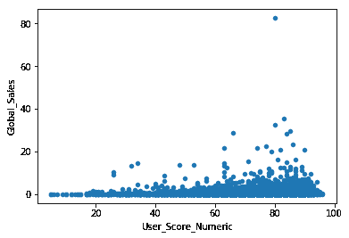
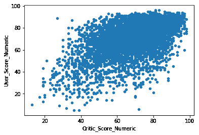
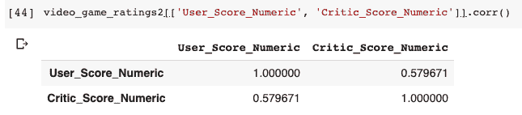

# 用线性回归模型预测全球视频游戏销量

> 原文：<https://dev.to/danieljaouen/predicting-global-video-game-sales-with-a-linear-regression-model-1m42>

欢迎回来！现在是我 Lambda 学校之旅第三周的最后一周，我想我应该更新一下我们两周前使用的数据集。本周，我们将看一些额外的数据可视化和一个简单的线性回归模型(使用一些课程前的工作)。

首先，让我们稍微整理一下数据。

```
video_game_ratings = video_game_ratings.dropna(subset=['User_Score', 'Critic_Score', 'Year_of_Release'])
video_game_ratings = video_game_ratings[video_game_ratings['User_Score'] != 'tbd']
video_game_ratings['User_Score_Numeric'] = pd.to_numeric(video_game_ratings['User_Score'])
video_game_ratings['Critic_Score_Numeric'] = pd.to_numeric(video_game_ratings['Critic_Score']) 
```

接下来，让我们看看一些散点图，看看我们是否可以确定我们感兴趣的变量之间的关系。

[](https://res.cloudinary.com/practicaldev/image/fetch/s--WUuEN4eS--/c_limit%2Cf_auto%2Cfl_progressive%2Cq_auto%2Cw_880/https://dcj24-storage.s3.amazonaws.com/lambimg/user_score.png)

[](https://res.cloudinary.com/practicaldev/image/fetch/s--nB7UpMAZ--/c_limit%2Cf_auto%2Cfl_progressive%2Cq_auto%2Cw_880/https://dcj24-storage.s3.amazonaws.com/lambimg/critic_score.png)

我们看到，用户和评论家的评分与全球销售额之间存在轻微的正相关关系。这是我们所期望的。

在我们实际进行线性回归之前，让我们确保检查两个变量之间的相关性。

[](https://res.cloudinary.com/practicaldev/image/fetch/s--shT-1al_--/c_limit%2Cf_auto%2Cfl_progressive%2Cq_auto%2Cw_880/https://dcj24-storage.s3.amazonaws.com/lambimg/critic_score_user_score.png)

看起来用户评分和评论家评分之间有明显的正相关关系(这正是我们所期望的)。我们可以通过调用所需特性集上的`.corr()`来确认这一点:

[](https://res.cloudinary.com/practicaldev/image/fetch/s--1J3XeN6_--/c_limit%2Cf_auto%2Cfl_progressive%2Cq_auto%2Cw_880/https://dcj24-storage.s3.amazonaws.com/lambimg/corr.png)

因为我们不想对相关特性进行多元线性回归，所以我们将对全球销售额的评论家分数和用户分数分别进行回归。

对于用户评分的回归，我们得到的是`-0.11201624`的`beta_0`和`0.01213527`的`beta_1`。对于我们的训练数据，我们得到平均绝对误差`0.762`，而对于我们的测试数据，我们得到平均绝对误差`0.8202`。

对于评论家分数的回归，我们得到了`-1.54676995`的`beta_0`和`0.03283348`的`beta_1`。对于我们的训练数据，我们得到平均绝对误差`0.745`，而对于我们的测试数据，我们得到平均绝对误差`0.8095`。

我们从我们的模型中看到，评论家和用户评分与全球销售额之间存在(如预期的)正相关关系。我们还注意到，评论家分数是这两个特征的更好的预测器。

就是这样！你可以在这里找到完整的 Google Colab 笔记本。希望你喜欢这个简单的线性回归。下次见！