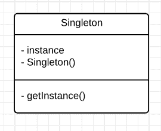
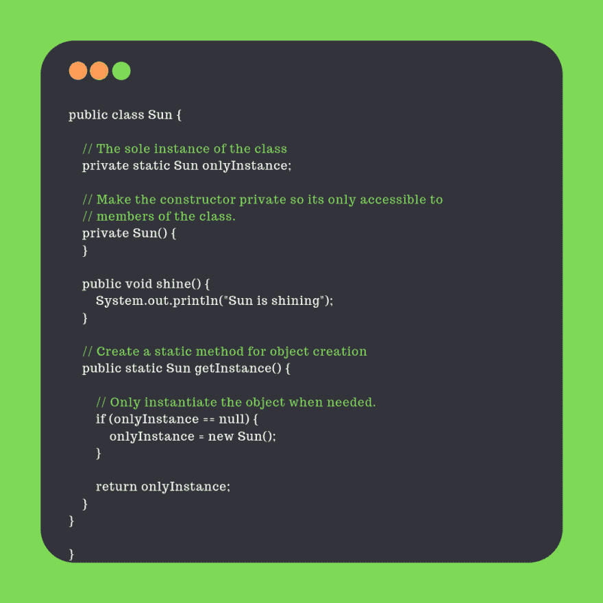
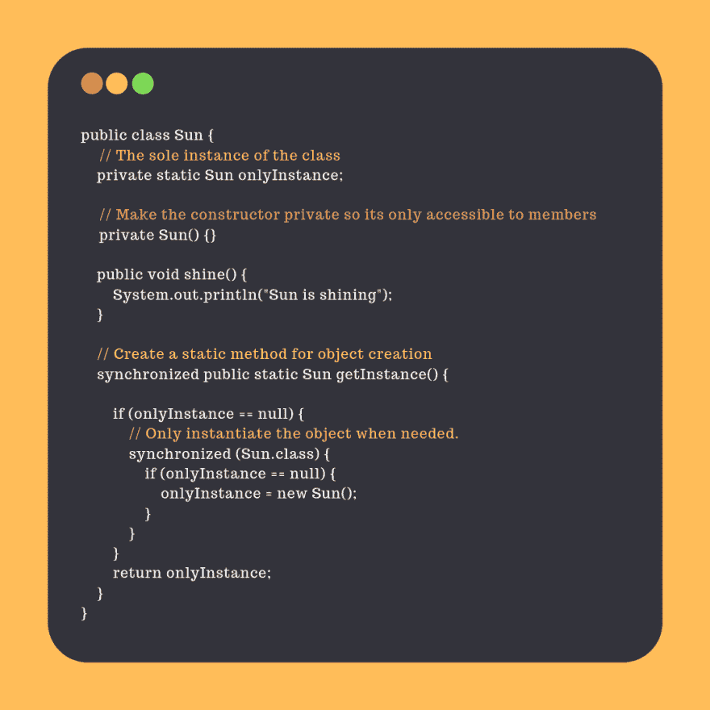

# 单一设计模式

> 原文：<https://dev.to/amrindersinghdev/singleton-design-pattern-1p04>

**现实世界的类比**
*我们太阳系的太阳是独生子女模式的一个极好的例子。我们太阳系中的所有行星都有一个太阳，并且它有一个交点。*

**什么事？**
*Singleton 是一个创造性的设计模式，它让你确保一个类只有
一个实例，并且这个实例有一个全局访问点*

**单例设计模式解决了如下问题:**

*   如何确保一个类只有一个实例？
*   如何轻松访问一个类的唯一实例？
*   一个类如何控制它的实例化？
*   如何限制一个类的实例数量？

**解决方案:**
*所有 Singleton 的实现都有这些共同的步骤:*

*   *使默认构造函数私有于控件类实例化*
*   *创建一个静态创建方法，该方法在引擎罩下使用私有构造函数创建一个实例，然后将其存储在一个静态字段中，所有对此方法的后续调用都返回缓存的对象*

**类图:**

**举例:**

上述代码将适用于单线程应用程序。但是在多线程环境中有可能会创建多个对象。这里有一个示例场景:

*   线程 A 调用方法 getInstance，发现唯一的实例为空，但在它实际创建实例之前，它得到了上下文切换。
*   现在线程 B 出现并调用 getInstance 方法，继续新建实例并返回 Sun 对象。
*   当线程 A 再次被调度时，就是恶作剧开始的时候。该线程已经通过了 if null 条件检查，并将继续新建 Sun 的另一个对象并将其分配给 onlyInstance。现在有两个不同的太阳物体，一个有线程 A，一个有线程 B

**有两种简单的方法可以解决这种竞争情况:**

*   *一种是在 getInstance()方法中加入 synchronized。*
    *   *同步公共静态空军一号 getInstance()*
*   另一个是对实例进行静态初始化，保证线程安全。
    *   *private static airforce one only instance = new airforce one()；*

**普塞多代码:**

**副词:**

*   一个类只有一个实例。
*   您获得了该实例的全局访问点。
*   单例对象只在第一次初始化。

**缺点**

*   *违反单一责任原则。*
*   该模式需要在多线程环境中进行特殊处理，这样多个线程就不会多次创建一个单一对象。
*   *单元测试难度*

**Github 代码库:**
*Singleton 模式的代码可以在下面的 Github 代码库找到:*
[Github 代码库链接:Singleton 模式](https://github.com/Amrindersingh1/Design-Patterns/blob/master/Creational/Singleton/Singleton.java)