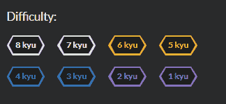
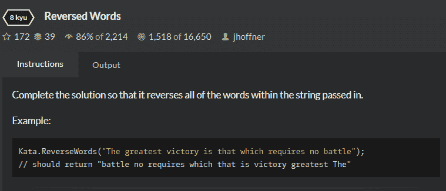

# 为什么 Codewars 是学习新编程语言的最佳途径！

> 原文：<https://dev.to/lukegarrigan/why-codewars-is-the-best-way-to-learn-a-new-programming-language-4216>

作为一名程序员，你可能会发现自己不得不学习一些编程语言，不管是为了工作还是为了娱乐。在这个博客中，我将分享我个人认为学习一种新的 T2 语言的最好方法，前提是你相当精通一种相同的 T4 模式。我将尝试利用 Java、TypeScript 和 C++等语言的面向对象编程知识来学习 C#。

因此，每当我们学习一些东西时，我们大多数人都会去 YouTube，或者找本书，或者使用一些学习网站来沉迷其中。但是对于我们这些已经知道编程基本原理的程序员来说，看教程告诉我们如何做一个 if 语句可能会相当费力。然而，我知道有一些书籍甚至教程迎合了那些已经理解了编程基本原理的人，但是我想分享一个对我很有效的替代方法。

# 为什么要 Codewars？

因为他们赞助我。开玩笑🤣我和 Codewars 没有任何关系，尽管我很想加入。

[https://codewars.com/](https://codewars.com/)是一个出色的网站，它有社区制作的叫做*卡塔斯*的编程挑战，这些挑战按照难度来划分。

[](https://res.cloudinary.com/practicaldev/image/fetch/s--qWJg5rvN--/c_limit%2Cf_auto%2Cfl_progressive%2Cq_auto%2Cw_880/https://i.imgur.com/rrPCLMH.png)

他们还有一个非常棒的调平系统！

[](https://res.cloudinary.com/practicaldev/image/fetch/s--lk0Dydki--/c_limit%2Cf_auto%2Cfl_progressive%2Cq_auto%2Cw_880/https://i.imgur.com/iwXCr7M.png)

如果你没有听说过它，我鼓励你去看看，因为我的描述很简短！

# 入门 8kyu

在 Codewars 中，最简单的问题是 8Kyu，这是我学习一门新语言的起点。

[反转词](https://www.codewars.com/kata/51c8991dee245d7ddf00000e)
[](https://res.cloudinary.com/practicaldev/image/fetch/s--LUfa49pN--/c_limit%2Cf_auto%2Cfl_progressive%2Cq_auto%2Cw_880/https://i.imgur.com/Sg1EMyw.png)

我敢肯定，你们中的大多数人在看形的时候认为它太简单了，可能会浪费时间，但这种方法的美妙之处在于它迫使你提出问题，而这些问题对于塑造你对这种语言的心理模型至关重要。

## 设置环境

Codewars 有自己的内置编辑器，但对我们来说，我们会希望使用自己的编辑器，这样我们就可以使用调试器等工具深入了解该语言，并设置我们自己的测试！

### ********** ***用斜体写的内心独白*** *********

那么，我对 C#了解多少？我知道它运行在一个叫做。NET 框架，所以我想我必须下载它？

经过一番谷歌搜索我发现。NET Core 是在 Windows、Linux 和 macOS 上运行的框架，所以我想我会从它开始。我下载了[。网芯 SDK](//) 。

我假设只要我有这个框架，我就能使用任何编辑器？我知道大多数 C#开发者使用 Visual Studio，但是我会看看我是否能在 VSCode 中使用它

项目结构:

```
8Kyu
├── src
│    └── ReverseWords
└── test 
     └── ReverseWords.Test 
```

<svg width="20px" height="20px" viewBox="0 0 24 24" class="highlight-action crayons-icon highlight-action--fullscreen-on"><title>Enter fullscreen mode</title></svg> <svg width="20px" height="20px" viewBox="0 0 24 24" class="highlight-action crayons-icon highlight-action--fullscreen-off"><title>Exit fullscreen mode</title></svg>

与。您可以使用命令行创建项目，所以我将 cd 到 ReverseWords 和`dotnet new console`(一个控制台应用程序将在这里完成这项工作)。现在我的 ReverseWords 文件夹包含:

```
Mode                LastWriteTime         Length Name
----                -------------         ------ ----
d-----       27/07/2019     13:53                obj
-a----       27/07/2019     13:53            194 Program.cs
-a----       27/07/2019     13:53            178 ReverseWords.csproj 
```

<svg width="20px" height="20px" viewBox="0 0 24 24" class="highlight-action crayons-icon highlight-action--fullscreen-on"><title>Enter fullscreen mode</title></svg> <svg width="20px" height="20px" viewBox="0 0 24 24" class="highlight-action crayons-icon highlight-action--fullscreen-off"><title>Exit fullscreen mode</title></svg>

这些都是什么鬼东西？我想是的。cs 是 CSharp 文件，这是有意义的，csproj 可能包含一些创建项目的元数据？Obj？只有神知道..

所以我离得不远。cs 确实包含了简单的 hello world 程序:

```
using System;

namespace ReverseWords
{
    class Program
    {
        static void Main(string[] args)
        {
            Console.WriteLine("Hello World!");
        }
    }
} 
```

<svg width="20px" height="20px" viewBox="0 0 24 24" class="highlight-action crayons-icon highlight-action--fullscreen-on"><title>Enter fullscreen mode</title></svg> <svg width="20px" height="20px" viewBox="0 0 24 24" class="highlight-action crayons-icon highlight-action--fullscreen-off"><title>Exit fullscreen mode</title></svg>

的。csproj 文件包含项目中使用的项目集合中包含的[文件的信息、项目 GUID 和项目版本等。](https://social.msdn.microsoft.com/Forums/vstudio/en-US/e8e9a55e-6e43-4c4d-93f6-5a89157b12f1/what-is-csproj-file?forum=csharpgeneral)

我想这是你在项目中指定你想要的包的地方？

是的，我的假设是正确的，你在这里弹出你的 [nuget](https://www.nuget.org/) 包，要么通过。NET cli:

`dotnet add package NETCore.Encrypt --version 2.0.7`

或者直接在包中引用。

“obj/文件夹用于存储临时目标文件和其他文件，以便在编译过程中创建最终的二进制文件。”- [劈啪声](https://stackoverflow.com/questions/233081/whats-the-obj-directory-for-in-net)

## 奔东西去了

只是玩玩`dotnet`命令，有一个`dotnet run`命令。让我们试一试:

`PS \8kyu\src\ReverseWords> dotnet run
Hello World!`

太棒了，让我们试着解决这个形吧。让我们抓住他们给我们解的函数。

```
 public static string ReverseWords(string str)
  {
    return "";
  } 
```

<svg width="20px" height="20px" viewBox="0 0 24 24" class="highlight-action crayons-icon highlight-action--fullscreen-on"><title>Enter fullscreen mode</title></svg> <svg width="20px" height="20px" viewBox="0 0 24 24" class="highlight-action crayons-icon highlight-action--fullscreen-off"><title>Exit fullscreen mode</title></svg>

*现在添加示例测试，我当前的测试文件夹是空的，我如何创建一个测试项目？*

经过一些研究，似乎很多人使用 xunit:
`dotnet new xunit`

Xunit 不属于。NET 核心并在我的。这进一步巩固了我之前关于引用 nuget 包的发现！

`<ItemGroup>
<PackageReference Include="Microsoft.NET.Test.Sdk" Version="16.0.1" />
<PackageReference Include="xunit" Version="2.4.0" />
<PackageReference Include="xunit.runner.visualstudio" Version="2.4.0" />
</ItemGroup>`

现在让我们将测试示例添加到我们的新测试项目中。

```
namespace ReverseWords.Test
{
    public class UnitTest1
    {
        [Fact]
        public void Test1()
        {
            Assert.Equal("world! hello", ReverseWords.Program.ReverseWords("hello world!"));
            Assert.Equal("this like speak doesn't yoda", ReverseWords.Program.ReverseWords("yoda doesn't speak like this"));
            Assert.Equal("foobar", ReverseWords.Program.ReverseWords("foobar"));
            Assert.Equal("kata editor", ReverseWords.Program.ReverseWords("editor kata"));
            Assert.Equal("boat your row row row", ReverseWords.Program.ReverseWords("row row row your boat"));
        }
    }
} 
```

<svg width="20px" height="20px" viewBox="0 0 24 24" class="highlight-action crayons-icon highlight-action--fullscreen-on"><title>Enter fullscreen mode</title></svg> <svg width="20px" height="20px" viewBox="0 0 24 24" class="highlight-action crayons-icon highlight-action--fullscreen-off"><title>Exit fullscreen mode</title></svg>

我似乎不能引用我们的实际程序，我该怎么做？

`dotnet add reference ..\..\src\ReverseWords\ReverseWords.csproj`

*现在我得到一个编译时错误，说这个类是错误的保护级别，好吧，我从其他 OO 语言中知道这一点，我怀疑它没有被设置为公共的*

我是对的，我公开了类，现在当我运行所有的测试时，它们都失败了，是时候编码了！

```
 public static string ReverseWords(string str)
        {
            StringBuilder sb = new StringBuilder();
            string[] words = str.Split(' ');

            foreach(var word in words)
            {
                sb.Insert(0, word + " ");
            }
            return sb.ToString().Trim();
        } 
```

<svg width="20px" height="20px" viewBox="0 0 24 24" class="highlight-action crayons-icon highlight-action--fullscreen-on"><title>Enter fullscreen mode</title></svg> <svg width="20px" height="20px" viewBox="0 0 24 24" class="highlight-action crayons-icon highlight-action--fullscreen-off"><title>Exit fullscreen mode</title></svg>

好了，我已经学习了 StringBuilder，它与 Java 非常相似，foreach 语句非常不同，我喜欢隐式类型！

这是一个非常幼稚的解决方案，但它通过了所有的示例测试。

现在，当我提交我的代码时，我可以查看其他人的解决方案，看看我的如何比较，幸运的是，更好的解决方案通常在顶部，因为 Codewars 有特殊的标签来表示一个解决方案是聪明的还是最佳实践！

下面是最佳解决方案的样子:

```
 public static string ReverseWords(string str)
  {
    string[] words = str.Split(' ');
    Array.Reverse(words);
    return string.Join(" ", words);
  } 
```

<svg width="20px" height="20px" viewBox="0 0 24 24" class="highlight-action crayons-icon highlight-action--fullscreen-on"><title>Enter fullscreen mode</title></svg> <svg width="20px" height="20px" viewBox="0 0 24 24" class="highlight-action crayons-icon highlight-action--fullscreen-off"><title>Exit fullscreen mode</title></svg>

# 回顾一下，我从做这个**一**题中学到了什么？

*   什么？网络核心是
*   在`dotnet`命令中有力量！
*   什么？cs 是
*   什么是对象/文件夹
*   什么是 csproj
*   什么是 Nuget 包以及如何引用它们
*   如何建立简单的项目
*   如何建立一个测试项目
*   如何从另一个项目引用一个项目
*   什么是 xunit 以及如何使用它
*   如何添加测试
*   类型系统、值类型和引用类型
*   字符串生成器
*   用有用的静态方法填充的数组类
*   字符串类也有静态方法

比我看视频学到的要多得多，而且用的时间要短得多！

# 然后呢？

嗯，我们程序员喜欢一个好的循环，这正是我们在这里做的，如果你在 8ku 上挣扎，然后坚持做其他的 8kyu，直到你有信心，然后向下移动到 7kyu，6kyu 等。我可以做另一个挑战，但是你应该知道😃

我真的希望一些人在学习新语言时采用这种策略，我很想听听人们对这种策略或其他替代标准的看法！

谢谢你，如果你喜欢我的漫谈，看看我在 https://codeheir.com/的个人博客网站