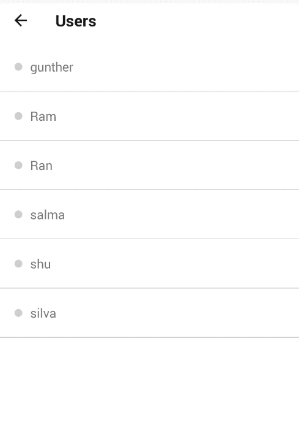
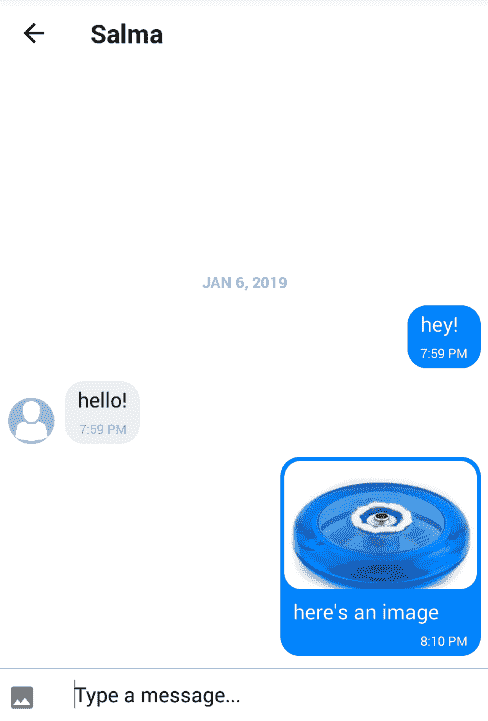

# 创建离线友好的 React 本地应用程序——第 2 部分:真实世界的例子

> 原文：<https://dev.to/wernancheta/creating-offline-friendly-react-native-apps-part-2-real-world-example-5903>

从本系列的第一部分开始，我们现在将把我们学到的东西应用到实际场景中。在本教程中，我们将更新现有的聊天应用程序，使其变得离线友好。

## 先决条件

需要 React Native 的基础知识。我们也将使用 Redux 和 Redux Saga，所以对它们稍微熟悉一点也是有帮助的。

我们将使用本系列第一部分中使用的一些包和技术。但是既然我们无论如何都要更新现有的应用程序，我建议你初始化一个新的 React 本地项目，并从 [starter-chat](https://github.com/anchetaWern/RNOffline/tree/starter-chat) 分支复制文件。然后你可以用`yarn install`安装软件包，并单独设置它们。使用`react-native link`命令可以链接所有的聊天包。

聊天应用程序使用聊天工具，所以你还需要[聊天工具账户](https://pusher.com/chatkit)。如果你不熟悉聊天工具，请务必阅读[快速入门](https://docs.pusher.com/chatkit/quick_start/javascript)。

## App 概述

我们要更新的应用是一个聊天应用。它通过 Node.js 服务器验证用户。一旦通过身份验证，用户将会看到一个列表，其中列出了已经登录该应用程序的所有其他用户。在这个屏幕上，用户可以选择他们想与之聊天的人:

[](https://res.cloudinary.com/practicaldev/image/fetch/s--c-xFOSB5--/c_limit%2Cf_auto%2Cfl_progressive%2Cq_auto%2Cw_880/https://d2mxuefqeaa7sj.cloudfront.net/s_80F8FFF6AEC2167FADE405E07885D351F80F98FA9AC8618250737C9D8C57F9C6_1546823334851_users-screen.png)

然后他们可以开始聊天。该应用程序还接受每封邮件的图片附件:

[](https://res.cloudinary.com/practicaldev/image/fetch/s--bfTKz_6I--/c_limit%2Cf_auto%2Cfl_progressive%2Cq_auto%2Cw_880/https://d2mxuefqeaa7sj.cloudfront.net/s_80F8FFF6AEC2167FADE405E07885D351F80F98FA9AC8618250737C9D8C57F9C6_1546823500769_chat-screen.png)

以下是我们将实施的一些措施的概述，这些措施旨在让这款应用更加离线友好:

*   **离线认证** -每次用户打开应用程序时，应用程序都会与服务器进行通信，以对用户进行认证。我们将更新它，以便当用户离线时，它将通过密码验证用户。
*   **离线消息撰写** -该应用不允许用户在离线时输入消息。我们将对其进行更新，以便他们可以撰写消息并提交，即使他们处于离线状态。一旦他们上线，信息就会自动发送。
*   **最近消息的本地存储** -当用户离线时，应用程序不会显示任何消息。我们将对其进行更新，以便在本地存储最近与他们聊天的人的消息。

你可以在它的 [GitHub repo](https://github.com/anchetawern/RNOffline) 上找到本教程使用的源代码。我们将更新的聊天应用程序在`starter-chat`分支上，而本教程的最终输出在`offline-friendly-chat`分支上。

## 设置事物

在我们继续之前，我们需要先安装几个软件包:

```
yarn add react-native-offline redux-persist redux-saga 
```

[React Native Offline](https://github.com/rgommezz/react-native-offline) 允许我们在应用中轻松实现离线功能。而 [Redux Persist](https://github.com/rt2zz/redux-persist) 允许我们持久化 Redux 存储，这样当用户离线时可以访问它的数据。

Redux Saga 允许我们创建一个互联网连接变化的观察者。这使得我们可以实现横幅等功能，在用户离线时通知用户。

请注意，如果您在未来的某个时候遵循本教程，那么在某些包中可能会有突破性的变化。为了确保应用程序正常工作，建议您安装与文件中的`package.json` [所示相同的软件包版本。](https://github.com/anchetaWern/RNOffline/blob/offline-friendly-chat/package.json)

安装软件包后，链接它们:

```
react-native link 
```

然后向`android/app/src/main/AndroidManifest.xml`文件添加必要的权限。前两个用于 React 本机映像拾取器，最后一个用于 React 本机脱机:

```
<uses-permission android:name="android.permission.CAMERA" />
<uses-permission android:name="android.permission.WRITE_EXTERNAL_STORAGE"/>

<uses-permission android:name="android.permission.ACCESS_NETWORK_STATE" /> 
```

接下来，安装服务器所需的软件包:

```
cd server
yarn install 
```

仍然在`server`目录中，用您的 Chatkit 实例定位器 ID 和 Chatkit 秘密更新`server.js`文件。省略实例定位器 ID 中的`v1:us1:`:

```
const instance_locator_id = "YOUR INSTANCE LOCATOR ID";
const chatkit_secret = "YOUR CHATKIT SECRET"; 
```

完成后，您就可以运行服务器了:

```
node server.js 
```

使用 ngrok 将其公开到互联网上。您可以在[您的仪表板](https://dashboard.ngrok.com/get-started)上找到您的 ngrok 身份验证令牌:

```
./ngrok authtoken YOUR_NGROK_AUTH_TOKEN
./ngrok http 3000 
```

导航回 React 本地项目的根目录，用您的 Chatkit 实例定位器 ID 更新`src/helpers/loginUser.js`文件:

```
const instanceLocatorId = "YOUR INSTANCE LOCATOR ID"; 
```

最后，用您的 Ngrok URL 更新`src/screens/LoginScreen.js`文件:

```
const CHAT_SERVER = "https://YOUR_NGROK_URL/users"; 
```

现在，您可以运行应用程序了:

```
react-native run-android 
```

## 更新 app

打开`Root.js`文件并导入以下内容。这将允许您持久化 Redux 存储并监听互联网连接的变化:

```
// Root.js
import { persistStore, persistReducer } from "redux-persist";
import storage from "redux-persist/lib/storage";
import { PersistGate } from "redux-persist/integration/react";

import createSagaMiddleware from "redux-saga";

import {
  withNetworkConnectivity,
  reducer as network,
  createNetworkMiddleware
} from "react-native-offline";

import ChatReducer from "./src/reducers/ChatReducer";

import { watcherSaga } from "./src/sagas";

const sagaMiddleware = createSagaMiddleware();
const networkMiddleware = createNetworkMiddleware(); 
```

接下来，添加 Redux Persist 配置。这里我们将`network`键(来自 React Native Offline)以及来自聊天缩减器的`chat`键列入黑名单。黑名单允许我们将特定数据排除在本地持久存储之外。这意味着它仍将使用缩减器返回的初始状态。这对`network`键有意义，因为我们希望它在用户离线或在线时改变值。但是对于`chat`，我们只需要排除`isNetworkBannerVisible`。这就是为什么我们使用[嵌套持久化](https://github.com/rt2zz/redux-persist#nested-persists)来指定黑名单键下的哪些属性实际上被排除:

```
const persistConfig = {
  key: "root",
  storage,
  blacklist: ["network", "chat"]
};

const chatPersistConfig = {
  key: "chat",
  storage: storage,
  blacklist: ["isNetworkBannerVisible"] // exclude chat.isNetworkBannerVisible
};

const rootReducer = combineReducers({
  chat: persistReducer(chatPersistConfig, ChatReducer),
  network
});

const persistedReducer = persistReducer(persistConfig, rootReducer); 
```

接下来，创建存储的持久版本并运行 watcher saga:

```
const store = createStore(
  persistedReducer,
  applyMiddleware(networkMiddleware, sagaMiddleware)
);
let persistor = persistStore(store);

sagaMiddleware.run(watcherSaga); 
```

接下来，用`withNetworkConnectivity`包裹`RootStack`组件。这使得商店里可以买到`network`钥匙。之后，我们可以像往常一样用 React Navigation 的`createAppContainer`包装结果组件:

```
const App = withNetworkConnectivity({
  withRedux: true
})(RootStack);

const AppContainer = createAppContainer(App); 
```

最后，用`PersistGate`组件包裹`AppContainer`。这允许我们使用持久存储，并延迟应用程序 UI 的呈现，直到检索到持久状态。`loading` prop 在检索数据时接受您想要显示的组件。但是在这种情况下，我们已经通过了`null`,因为检索几乎是立即发生的:

```
class Router extends Component {
  render() {
    return (
      <Provider store={store}>
        <PersistGate loading={null} persistor={persistor}>
          <AppContainer />
        </PersistGate>
      </Provider>
    );
  }
} 
```

下面是用于监听网络状态变化的观察器传奇的代码:

```
// sagas/index.js
import { networkEventsListenerSaga } from "react-native-offline";
import { fork, all } from "redux-saga/effects";

export function* watcherSaga() {
  yield all([
    fork(networkEventsListenerSaga, {
      timeout: 5000, // 5-second timeout for retrieving the network status
      checkConnectionInterval: 1000 // check network status every 1 second
    })
  ]);
} 
```

### 登录屏幕

现在我们准备更新登录屏幕。这是我们添加密码的地方，这样我们就可以在用户离线时使用密码对其进行身份验证。这意味着我们基本上假设最后登录的用户就是正在登录的用户。我们还将添加当用户离线时显示横幅的代码。

我们需要的第一件事是安装 [React Native Sensitive Info](https://github.com/mCodex/react-native-sensitive-info) 包。这将允许我们在本地安全地存储密码:

```
yarn add react-native-sensitive-info
react-native link react-native-sensitive-info 
```

接下来，打开登录屏幕的代码，导入必要的包和组件:

```
// src/screens/LoginScreen.js
import { connect } from "react-redux";

import SInfo from "react-native-sensitive-info";
import NetworkStatusBanner from "../components/NetworkStatusBanner";

state = {
  passcode: "" // add this to existing state
}; 
```

接下来，更新`render`方法以显示网络状态标志。`isNetworkBannerVisible`决定横幅是否可见。它的值只有在满足特定条件时才是`true`，我们稍后将在聊天缩减器文件中查看:

```
// src/screens/LoginScreen.js
render() {
  const { isConnected, isNetworkBannerVisible } = this.props;
  return (
    <View style={styles.wrapper}>
      <NetworkStatusBanner
        isConnected={isConnected}
        isVisible={isNetworkBannerVisible}
      />
      <View style={styles.container}>
        <View style={styles.main}>
          <View style={styles.fieldContainer}>
            {
              isConnected &&
              <View>
                /* current username field code */
              </View>
            }

            <Text style={styles.label}>Enter your passcode</Text>
            <TextInput
              style={styles.textInput}
              onChangeText={passcode => this.setState({ passcode })}
              maxLength={6}
              secureTextEntry={true}
              value={this.state.passcode}
            /> 
            {!this.state.enteredChat && (
              /* current login button code */
            )}

            {this.state.enteredChat && (
              /* current loading text */
            )}
          </View>
        </View>
      </View>
    </View>
  );
} 
```

接下来，添加用户离线时登录的代码。正如您从起始代码中看到的，我们大量利用了`try..catch`语句。这使得应用程序能够优雅地处理用户离线时带来的错误。所以我们可以简单地在`enterChat`方法的最底层添加处理离线用户的代码。在这里，我们检查输入的`passcode`是否与之前存储的密码相同。如果相同，我们将用户导航到用户屏幕:

```
// src/screens/LoginScreen.js
enterChat = async () => {
  const { user, isConnected } = this.props;
  const { username, passcode } = this.state;

  // add these at the bottom
  if (!isConnected) {
    const stored_passcode = await SInfo.getItem('passcode', {});
    if (stored_passcode == passcode) {
      this.props.navigation.navigate("Users", {
        currentUser: user // very important (contains: id and username)
      });
    } else {
      Alert.alert("Incorrect Passcode", "Please try again.");
    }

    this.setState({
      passcode: "",
      enteredChat: false
    });  
  }
} 
```

注意，上面代码中的关键部分是`currentUser` nav param。如果用户在线，这是一个实时聊天工具用户实例。这允许您调用加入或离开房间以及发送或接收消息的方法。但是如果用户离线，并且你试图调用这些方法，应用程序将返回一个错误，使用`try..catch`无法优雅地处理这个错误。这就是我们使用当前用户对象的原因，这样就可以用`try..catch`来处理错误。

接下来，更新`mapStateToProps`返回我们需要的道具:

```
// src/screens/LoginScreen.js
const mapStateToProps = ({ network, chat }) => {
  const { isConnected } = network;
  const { user, isNetworkBannerVisible } = chat;
  return {
    isConnected,
    user,
    isNetworkBannerVisible
  };
};

export default connect(
  mapStateToProps,
  null
)(LoginScreen); 
```

### 网络状态横幅

以下是网络状态横幅的代码。这将显示离线和在线状态，但正如您之前看到的，我们仅在用户离线时使用它来显示横幅:

```
// src/components/NetworkStatusBanner.js
import React from "react";
import { View, Text } from "react-native";

const NetworkStatusBanner = ({ isConnected, isVisible }) => {
  if (!isVisible) return null;

  const boxClass = isConnected ? "success" : "danger";
  const boxText = isConnected ? "online" : "offline";
  return (
    <View style={[styles.alertBox, styles[boxClass]]}>
      <Text style={styles.statusText}>you're {boxText}</Text>
    </View>
  );
};

const styles = {
  alertBox: {
    padding: 5
  },
  success: {
    backgroundColor: "#88c717"
  },
  danger: {
    backgroundColor: "#f96161"
  },
  statusText: {
    fontSize: 14,
    color: "#fff",
    alignSelf: "center"
  }
};

export default NetworkStatusBanner; 
```

### 聊天减速器

聊天缩减器是我们指定如何根据收到的动作和有效负载更新商店的地方。由于我们已经在这里实现了应用程序中的所有操作，我们还可以监听网络状态何时发生变化。这是 React Native Offline 派上用场的另一个部分。它提供了我们可以监听的动作类型，因此我们可以准确地知道网络状态何时改变。`network.isConnected`是当前的网络状态，而`action.payload`是新的网络状态。两者都是布尔值，表示用户是在线(`true`)还是离线(`false`):

```
// src/reducers/ChatReducer.js
import { offlineActionTypes, reducer as network } from "react-native-offline";

const INITIAL_STATE = {
  isNetworkBannerVisible: false // add this
  /* previous state initialization */
}

export default (state = INITIAL_STATE, action) => {
  switch (action.type) {
    // add these
    case offlineActionTypes.CONNECTION_CHANGE:

    // only make the network banner visible when the network status changes to offline
      if (network.isConnected != action.payload && !action.payload) {
        return { ...state, isNetworkBannerVisible: true };
      } else {
        return { ...state, isNetworkBannerVisible: false };
      }  

    /* previous code */
  }
} 
```

### 用户屏幕

“用户”屏幕显示了已登录该应用程序的所有用户的列表。我们将更新它，使它也显示网络状态横幅。我们还将添加代码，以便在用户每次重新联机时重新初始化 Chatkit 用户实例。

首先导入以下内容:

```
// src/screens/UsersScreen.js
import NetworkStatusBanner from "../components/NetworkStatusBanner";
import loginUser from '../helpers/loginUser'; 
```

接下来，添加网络状态横幅:

```
render() {
  const { isConnected, isNetworkBannerVisible } = this.props;
  return (
    <View style={styles.container}>
      <NetworkStatusBanner
        isConnected={isConnected}
        isVisible={isNetworkBannerVisible}
      />
      { this.renderUsers() }
    </View>
  );
} 
```

当组件更新时，我们检查`isConnected`道具是否从“离线”更新为“在线”。如果是的话，我们重新初始化 Chatkit 用户实例，并为用户重新订阅在线聊天室:

```
async componentDidUpdate (prevProps, prevState) {
  const { isConnected, navigation } = this.props;
  const currentUser = navigation.getParam('currentUser');

  if (isConnected && prevProps.isConnected != isConnected) {
    this.currentUser = await loginUser(currentUser.id);
    this.subscribeToPresenceRoom();
  }
} 
```

别忘了传递道具:

```
const mapStateToProps = ({ chat, network }) => {
  const { users, isNetworkBannerVisible } = chat;
  const { isConnected } = network;

  return {
    isConnected,
    isNetworkBannerVisible,
    users
  };
};

/* mapDispatchToProps code */

export default connect(
  mapStateToProps,
  mapDispatchToProps
)(UsersScreen); 
```

### 聊天画面

现在我们准备更新聊天屏幕。正如教程开始时提到的，我们将更新它，使用户可以在离线时输入并发送消息。当用户在线时，发送的消息将被自动发送。除此之外，我们还将本地保存用户最近聊天的人的消息。

从进口我们需要的东西开始:

```
// src/screens/ChatScreen.js
import NetworkStatusBanner from "../components/NetworkStatusBanner";
import loginUser from '../helpers/loginUser'; 
```

接下来，更新初始化聊天室的代码。目前，我们仅使用它来断开用户与 Chatkit 的连接，获取他们可以加入的房间，并订阅与当前房间同名的房间(否则，我们会创建它)。如果用户在线，这也是我们清空消息的地方，因为订阅房间将自动加载房间中最近发送的 11 条消息。

当用户离线时，我们允许他们发送消息。而当他们上线时，我们需要自动发送。唯一的问题是，如果用户在线，我们必须重置`messages`数组。这也将删除所有尚未实际发送的邮件。因此，为了解决这个问题，我们提取了用户离线时发送的消息，以便以后发送:

```
initializeChatRoom = async (came_back_online) => { // add came_back_online param

  const { isConnected, room, messages, setMessages, navigation } = this.props;

  // add this
  if (!came_back_online) {
    this.currentUser = navigation.getParam("currentUser");
  }

  this.roomName = navigation.getParam("roomName");

  // add these
  if (isConnected) {
    // extract the messages sent by the current user while they're offline
    this.unsent_messages = messages.filter((msg) => {
      return msg.not_sent;
    });
    setMessages([]);
  }

  /* existing code */
  try {
    // ...
  } catch (err) {
    // ...
  }
} 
```

接下来，不要忘记初始化`unsent_messages`的值:

```
constructor(props) {
  super(props);
  this.unsent_messages = [];
} 
```

接下来，更新`render`方法，使其显示网络状态标语:

```
render() {
  const { isConnected, isNetworkBannerVisible, room, navigation, messages } = this.props;
  const roomName = navigation.getParam("roomName");

  return (
    <View style={styles.container}>
      <NetworkStatusBanner
        isConnected={isConnected}
        isVisible={isNetworkBannerVisible}
      /> 
      {(this.state.is_loading || !this.state.is_initialized) && (
        /* ActivityIndicator code */
      )}

      {this.state.is_initialized && roomName == room.name && (
        /* GiftedChat code */
      )}
    </View>
  );
} 
```

接下来，更新当前用户加入聊天室的代码。一旦用户预订了房间，这就是我们想要发送未发送消息的时间:

```
subscribeToRoom = async roomId => {
  const { setCurrentRoom, navigation } = this.props;
  const roomName = navigation.getParam("roomName");

  /* code for setting current room */

  /* code for subscribing to room */
  try {
    // ...
  } catch (e) {
   // ...
  }

  // add these
  try {
    this.unsent_messages.reverse(); // because messages are ordered from most to least recent
    for(msg of this.unsent_messages){
      await this.sendMessage(msg);
    }
    this.unsent_messages = [];
  } catch (e) {
    console.log("error sending unsent messages", e);
  }
}; 
```

接下来，更新`sendMessage`方法，使其包含用户离线时发送的消息的`attachment`。如果用户离线，我们需要将`attachment`属性添加到消息中，因为它不会立即被发送。这将使附件在实际发送时对邮件可用:

```
sendMessage = async (message) => {

  const { room, isConnected, putMessage } = this.props;

  /* start of code for sending message when user is online */

  if (this.attachment) {
    msg.attachment = this.getAttachment();
  }

  // add this right below the line above
  if (message.attachment) {
    msg.attachment = message.attachment;
  }

  /* end of code for sending message when user is online */

  // add these
  if (!isConnected) {
    message.not_sent = true;
    if (this.attachment) {
      message.attachment = this.getAttachment();
      message.image = this.attachment.uri;
    }

    putMessage(message);
    this.attachment = null;

    this.setState({
      is_sending: false
    });
  }
} 
```

当组件更新后，我们重新初始化 Chatkit 用户实例和聊天室。注意，我们将`true`作为参数提供给`initializeChatRoom`，以指定作为导航参数传递的`currentUser`不应该用作`this.currentUser`的值(参见`initializeChatRoom`方法):

```
async componentDidUpdate (prevProps, prevState) {
  const { isConnected, user, navigation } = this.props;
  const currentUser = navigation.getParam('currentUser');

  if (isConnected && prevProps.isConnected != isConnected) {
    this.currentUser = await loginUser(currentUser.id);
    this.initializeChatRoom(true);
  } else if (!isConnected  && prevProps.isConnected != isConnected) {
    this.currentUser = user; // plain user object with id and username
  }
} 
```

最后，不要忘记更新`mapStateToProps`,这样它会返回我们需要的所有道具:

```
const mapStateToProps = ({ chat, network }) => {
  const { isNetworkBannerVisible, user, room, messages } = chat;
  const { isConnected } = network;
  return {
    isConnected,
    isNetworkBannerVisible,
    user,
    room,
    messages
  };
}; 
```

此时，即使用户离线，应用程序也应该工作。

## 结论

就是这样！在本教程中，您学习了如何在实际场景中应用第一部分中讨论的概念和技巧。具体来说，您学习了如何使用 React Native Offline 和 Redux Persist 提供的工具来使现有的聊天应用程序离线友好。

你可以在它的 [GitHub repo](https://github.com/anchetawern/RNOffline) 上找到本教程使用的源代码。

*原载于[推杆教程枢纽](https://pusher.com/tutorials/offline-react-native-part-2)* 。