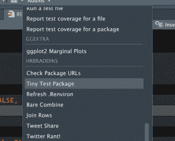

# 两个新的测试主题插件+一个新的和一个更新的 CRAN 包

> 原文：<https://dev.to/hrbrmstr/two-new-testing-themed-addins-one-new-and-one-updated-cran-package-499h>

又是一个奇怪的忙碌的夏天，但我终于在博客上看到了一些最近的进展。

首先是对[{ wand } package](https://cinc.rud.is/web/packages/wand/)的完全重写，它仍然使用[魔法](https://en.wikipedia.org/wiki/Magic_number_(programming)#Magic_numbers_in_files)，但是是 100%的 R 代码(而不是编译的 C 和 R 代码的混合),现在可以在 Windows 上工作。一个更新的版本将在 CRAN 上发布，它有额外的 MIME 映射，并允许指定自定义的扩展映射数据帧。你以前在博客上见过这种野兽，不过，[的另一个名字是](https://rud.is/b/2018/03/23/on-mimes-software-versions-and-web-site-promiscuity-a-k-a-three-new-packages-to-round-out-the-week/)。

```
wand::get_content_type("/etc/syslog.conf")
## [1] "text/plain" 
```

Enter fullscreen mode Exit fullscreen mode

接下来是 [{ulid}包](https://cinc.rud.is/web/packages/ulid/)(我之前也曾[讨论过，这里是](https://rud.is/b/2019/01/10/waffle-geoms-other-miscellaneous-in-development-package-updates/))，它现在也在 CRAN 上，以满足你所有普遍唯一的按字典排序的标识符生成需求。

```
ulid::ulid_generate()
## [1] "0001EKRGTCRSVA4ACSCQJA61A0"

ulid::unmarshal("0001EKRGTCRSVA4ACSCQJA61A0")
## ts rnd
## 1 2019-07-27 08:27:56 RSVA4ACSCQJA61A0 
```

Enter fullscreen mode Exit fullscreen mode

[{testthat}]重力井已经抓住了超过 4000 个起重机包裹，但它不是镇上唯一的测试游戏。 [{tinytest}包](https://github.com/markvanderloo/tinytest)采用了稍微简单一点的方法，并有额外的好处，即测试随包一起提供，这使得从对您的代码有问题的包用户那里请求所述测试结果变得更加容易。

我仍然在我的大多数包中使用{testthat},但是在我最近的几个包中加入了{tinytest},它非常漂亮。切换到它时我错过的最大的特性是 RStudio 中缺少对它的 Cmd-Shift-T 支持。因为我仍然希望所有使用{testthat}的包都使用 Cmd-Shift-T，所以我创建了一个 RStudio addin，它添加了一个 addin 上下文菜单项(如下)，并将其放在 [{hrbraddins}](https://cinc.rud.is/web/packages/hrbraddins/) 中。

[](https://i1.wp.com/rud.is/b/wp-content/uploads/2019/07/tinytest-addin.png?ssl=1)

如果您加载了这个包，那么您可以将类似 Cmd-Option-Shift-T 的东西绑定到这个函数，并在开发过程中同样快速地击键访问包测试。

```
> hrbraddins:::run_tiny_test() # from within the {wand} pkg
Running test_wand.R................... 52 tests OK
All ok (52 results) 
```

Enter fullscreen mode Exit fullscreen mode

最后，我在最近的 CRAN 提交中被咬了一口，因为我关闭了远程 CRAN 检查(soooo sloooowww ),但在包中的一个方法的文档中有一个 404'ing URL。由于我在接下来的 6-8 周内还有一些提交，我决定为一个动态包 URL 检查器编写一个 RStudio addin，它包装了 CRAN 为这些提交所做的完全相同的检查。(我将这个键绑定到 Cmd-Option-Shift-U，你可以在上面截图的 addins 菜单中看到它)。

一次运行的输出如下。我特意修改了两个工作 URL，以显示当一切都不完美时，您会得到什么样的输出结果:

```
> hrbraddins:::check_package_urls()
Gathering URLs for {wand} (this may take a bit)
- Looking in HTML files...
- Looking in metadata files...
- Looking in news files...
- Looking in Rd files...
- Looking in README files...
- Looking in source files...
- Looking in PDF files...

Checking found URLs (this may also take a bit)
# A tibble: 13 x 4
   url parent status is_https
   <chr> <chr> <dbl> <lgl>   
 1 https://gitlab.com/hrbrmstr/wand/issuessss DESCRIPTION 599 TRUE    
 2 http://gitlab.com/hrbrmstr/wand DESCRIPTION 200 FALSE   
 3 https://github.com/jshttp/mime-db man/wand.Rd 200 TRUE    
 4 https://github.com/threatstack/libmagic/tree/master/magic/ man/wand.Rd 200 TRUE    
 5 https://ci.appveyor.com/project/hrbrmstr/wand README.md 200 TRUE    
 6 https://codecov.io/gh/hrbrmstr/wand README.md 200 TRUE    
 7 https://cranchecks.info/pkgs/wand README.md 200 TRUE    
 8 https://github.com/r-lib/remotes README.md 200 TRUE    
 9 https://github.com/threatstack/libmagic/tree/master/magic/ README.md 200 TRUE    
10 https://keybase.io/hrbrmstr README.md 200 TRUE    
11 https://travis-ci.org/hrbrmstr/wand README.md 200 TRUE    
12 https://www.r-pkg.org/pkg/wand README.md 200 TRUE    
13 https://www.repostatus.org/#active README.md 200 TRUE 
```

Enter fullscreen mode Exit fullscreen mode

{hrbraddins}包本身只是一个游乐场，永远看不到起重机，所以请不要犹豫从包中取出任何东西，并将其放在一个更安全和/或更容易接近的位置，以便您自己工作。

### 鳍

对于软件包、文件问题和 PRs，一如既往。艾丁一家也一样。