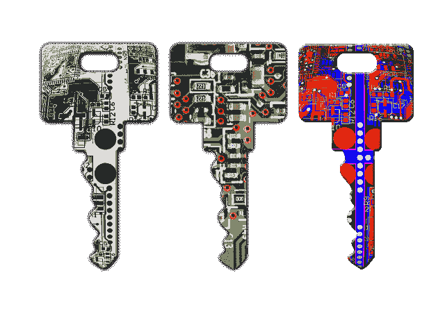

# 将 javascript 锁定到一个域:第一部分

> 原文：<https://dev.to/bangkokian/locking-javascript-to-a-domain-part-i-179f>

作为最近一个包括付费软件下载的商业项目的一部分，我被要求“保护软件免受未经授权的分发”。

这是那些说起来容易做起来难的要求之一。

在这种特殊情况下，问题变得更加复杂，因为“软件”在很大程度上是基于浏览器的 javascript，并且大部分不涉及客户端-服务器交互。在客户机-服务器环境中，集中认证过程是可能的。但是在一个只有客户机的环境中，不可能有服务器握手，事情就变得更有挑战性了。

众所周知，Javascript 源代码是不可能真正得到保护的。只要有足够的决心，即使是最复杂的代码混淆也是可逆的。这就是为什么那些混淆视听的人的目标是*阻止*抄袭，而不是彻底*阻止*抄袭。

但是，即使在代码混淆成功阻止逆向工程(或所谓的“美化”)的情况下，混淆的代码通常也不能提供太多保护来防止*代码盗窃*。由于大多数模糊代码在任何域上都运行良好，“借用”的代码仍然可以在未经授权的网站上运行，而不管其可读性如何。

从发布者的角度来看，混淆代码和非混淆代码一样容易成为攻击目标，这一点经常被忽视。

对混淆方法的调查超出了本文的范围，已经有很多关于如何使代码不可读的方法的文章。这些方法包括标识符篡改、死代码注入、XOR 加密、全局和字符串文字的完全重命名、代码扁平化、unicode 转义、自我保护代码等等。我甚至见过隐藏在图像中的代码，以像素信息的形式存储。可以说，对于每一个卷积，都有一种方法可以撤销它——并且将代码恢复到某种程度的可读性。

在这种情况下，我至少使用了上述技术的一半，并且已经将代码扭曲成一团复杂的乱麻。在这段代码中，我嵌入了一个简单的当前域和授权域的比较，它的字符串表示反过来被打乱，变得不可识别。

但是然后呢？

我立即想到的两个问题是如何不可见地失败和如何创建一个通用的保护代码，它可以被放入任何已存在的代码中。js 文件将脚本“域锁定”到一个授权的域。

看不见的故障很重要，因为故障点会泄露域名锁定发生的重要线索。

当不知道需要保护的特定脚本时，通用代码通常很重要。

有两种方法可以满足这两个要求。我将在这里讨论第一个问题，第二个问题将在以后的文章中讨论。

如上所述，大多数脚本终止方法的一般问题(包括停止代码执行、故意抛出错误、进入无限循环或重定向页面)都留下了明显的控制台痕迹，这将允许任何有决心的程序员快速锁定违规的代码并使其无效。

我需要更隐蔽的东西。

我的第一个解决方案——仍然非常有效——并且具有真正通用解决方案的优势——是破坏页面上的其他功能。这种方法背后的原因(你可以在我在 [DomainLockJS](https://domainlockjs.com) 制作的一个简单的生成器上玩)是脚本必须无错误地执行，但是会在*其他不相关的函数*中导致一连串的错误。这种方法导致未经授权的用户在看似格式良好的代码中陷入错误的陷阱。

最简单的方法是使窗口对象变形——交换值并从内存中删除不可见的项。随着足够多的随机更改、删除和交换，现有页面代码的某些部分总是会中断(假设页面上一开始就使用了大量的 javascript 代码)。

由此产生的控制台错误线索是一片令人沮丧的红色海洋，指向一大堆令人困惑的无关功能，这些功能本应正常运行。

对于大多数想要域锁定 javascript 代码的站点来说，这个解决方案可能仍然是最好的途径。这是一个很好的威慑。但我需要更具体的东西。我需要某种无形死亡的东西...不要留下控制台错误。更好的是:*每次都有完全不同的故障点*。

这是一个狡猾的小解决方案，让我觉得如果我有这样的倾向，我可能会成为一个邪恶的脚本小子。保护 javascript 仍然是不可能的，但是混淆 javascript 失败的地方是另一回事。

那个解决方案必须等到下周我有更多时间的时候...