# 如何加载测试:开发人员性能测试指南

> 原文：<https://dev.to/rhamedy/how-to-load-test-a-developer-s-guide-to-performance-testing-4e8m>

#### 如何使用 Apache JMeter & Taurus 设计和运行负载测试

[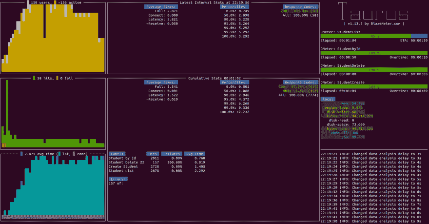](https://res.cloudinary.com/practicaldev/image/fetch/s--N03AZoti--/c_limit%2Cf_auto%2Cfl_progressive%2Cq_auto%2Cw_880/https://thepracticaldev.s3.amazonaws.com/i/r7j2mwtygisfdct8vjww.png)

> 所有代码都是有罪的，直到被证明是无辜的。—匿名

# 目标

本文的目的是帮助您设计和运行负载测试👍

# 为什么学？

作为开发人员，我们已经有了基础知识，只需一点点努力，我们就可以扩展我们的技能组合。

*   你的公司雇不起性能工程师
*   与开发人员相比，测试人员不足
*   技能和知识可以帮助你写出更好的和可伸缩的代码
*   较少依赖他人的专业知识

[](https://res.cloudinary.com/practicaldev/image/fetch/s--dGmr5Y1h--/c_limit%2Cf_auto%2Cfl_progressive%2Cq_auto%2Cw_880/https://thepracticaldev.s3.amazonaws.com/i/sfy6cad2itj5ldotrkhk.png)

# 为什么要负载测试？

单元和集成测试确保代码在功能上是正确的，而负载测试衡量其性能，这同样重要。
[](https://res.cloudinary.com/practicaldev/image/fetch/s--Lbm_nHRN--/c_limit%2Cf_auto%2Cfl_progressive%2Cq_auto%2Cw_880/https://thepracticaldev.s3.amazonaws.com/i/loxowfb1rb1dpntuepih.png) 
只有负载测试才能揭示并发问题，数据库查询是否很好地利用了索引而不是全表扫描，瓶颈在哪里，应用程序是否高效地扩展，应用程序的响应时间和吞吐量如何等等。

* * *

# Apache JMeter 入门

在本节中，我们将设计并运行 [Apache JMeter](https://jmeter.apache.org) 负载测试。

## 环境设置

对于环境，要么找一个合适的在线资源(不推荐)，想出自己的简单服务(node，python，随便什么)或者干脆使用本文提供的 [web 服务](https://github.com/rhamedy/tinyservice4loadtest)。

我们将使用一个简单的基于 java 的 spring boot [web 服务](https://github.com/rhamedy/tinyservice4loadtest)，它公开了四(4)个端点。要求是 Java 1.8 和 Apache Maven。

```
git clone https://github.com/rhamedy/tinyservice4loadtest.git
cd tinyservice4loadtest
mvn spring-boot:run 
```

## 阿帕奇 JMeter

请从[下载站点](https://jmeter.apache.org/download_jmeter.cgi)安装 Apache JMeter，解压并执行下面的命令

```
apache-jmeter/bin/jmeter.sh       // Linux & MacOS
apache-jmeter/bin/jmeter.bat      // Windows 
```

[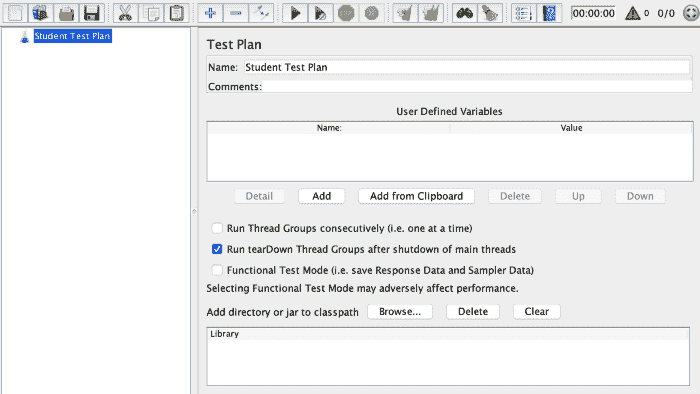](https://res.cloudinary.com/practicaldev/image/fetch/s--F-XlpNvN--/c_limit%2Cf_auto%2Cfl_progressive%2Cq_auto%2Cw_880/https://thepracticaldev.s3.amazonaws.com/i/lpksh9y0jgubzd5gmgbq.png)

### 为 Apache JMeter 设计测试计划

让我们对以下 API 进行负载测试

```
http://localhost:8080/students/list  - [GET] List students
http://localhost:8080/students/id    - [GET] Get student by id
http://localhost:8080/students       - [POST] Create student
http://localhost:8080/students/id    - [DELETE] Delete student by id 
```

上述端点的所有示例测试都可以在 GitHub [资源库](https://github.com/rhamedy/tinyservice4loadtest)中获得。

#### 第一步

右击测试计划并选择`Add > Threads (Users) > Thread Group`。测试计划必须至少有一个线程组。

1.  `Number of Threads (users)`
2.  `Ramp-Up period (in seconds)`。达到最大用户数需要多长时间？
3.  运行测试多少次或多长时间

[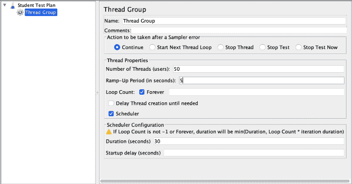](https://res.cloudinary.com/practicaldev/image/fetch/s--JY4yLfRS--/c_limit%2Cf_auto%2Cfl_progressive%2Cq_auto%2Cw_880/https://thepracticaldev.s3.amazonaws.com/i/75f9zotj2v2xxrgp4z0m.png)

#### 第二步

让我们指定要测试的内容。右击`ThreadGroup`并选择`Add > Config Elements > HTTP Request Defaults`选项。

如果您希望在一个或多个请求之间共享配置，例如服务器地址、端口号、令牌等，配置元素非常有用。

让我们填写 HTTP 请求默认值配置元素

[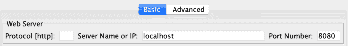](https://res.cloudinary.com/practicaldev/image/fetch/s--OHyQAf1x--/c_limit%2Cf_auto%2Cfl_progressive%2Cq_auto%2Cw_880/https://thepracticaldev.s3.amazonaws.com/i/1vg8ivbvcox3eeogqxas.png)

同样，让我们通过`Add > Config Elements > HTTP Header Manager`为`Content-Type`标题添加一个`HTTP Header Manager`

[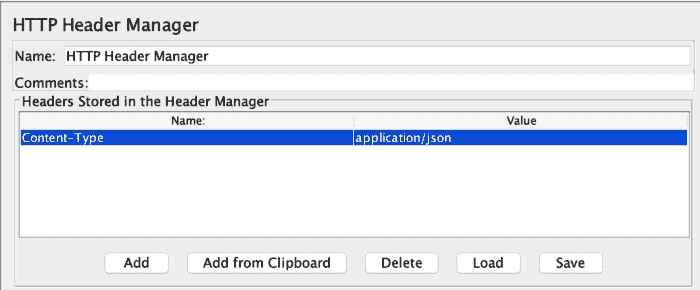](https://res.cloudinary.com/practicaldev/image/fetch/s--jUjw52DM--/c_limit%2Cf_auto%2Cfl_progressive%2Cq_auto%2Cw_880/https://thepracticaldev.s3.amazonaws.com/i/8x2fm2aaielupgw41iyu.png)

#### 第三步

让我们配置 http 请求，右键单击`ThreadGroup`并选择`Add > Sampler > HTTP Request`

1.  方法类型是什么，即`GET`或`POST`等
2.  api 路径是什么，即`/students/list`或`/students`等

[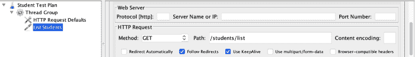](https://res.cloudinary.com/practicaldev/image/fetch/s--5LbAEywf--/c_limit%2Cf_auto%2Cfl_progressive%2Cq_auto%2Cw_880/https://thepracticaldev.s3.amazonaws.com/i/ombgj7g2k5aiv0i8ercy.png)

右键单击`duplicate`一个请求并更新它。

[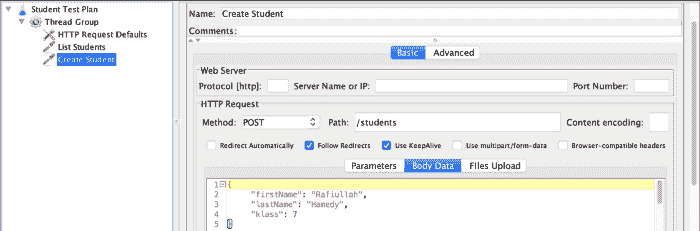](https://res.cloudinary.com/practicaldev/image/fetch/s--34xUyDqT--/c_limit%2Cf_auto%2Cfl_progressive%2Cq_auto%2Cw_880/https://thepracticaldev.s3.amazonaws.com/i/7ilver9nusue8bbq4dqn.png)

#### 第四步

`Listeners`用于收集结果。右击`ThreadGroup`并选择`Add > Listener > Summary Report`选项。

测试计划换句话说，我们创建了一个从`Apache JMeter Test Plan`到`Load Test`的两个带有`50 Users`的 API，持续时间为`30 seconds`。

如果您已经运行了`tinyservice4loadtest`(或您自己的),那么让我们点击播放按钮，在`Summary Report`中查看结果

[](https://res.cloudinary.com/practicaldev/image/fetch/s--30No8JKp--/c_limit%2Cf_auto%2Cfl_progressive%2Cq_auto%2Cw_880/https://thepracticaldev.s3.amazonaws.com/i/u8w358nyafmr4000w1ps.png)

### 使用 CLI 运行 Apache JMeter 测试

不推荐使用 GUI 来运行复杂的测试。让我们从[这里](https://github.com/rhamedy/tinyservice4loadtest/blob/master/jmeter_scripts/student_service_load_test.jmx)打开一个复杂的样本测试。

[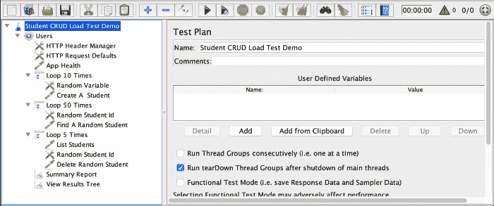](https://res.cloudinary.com/practicaldev/image/fetch/s--dlXDUSBa--/c_limit%2Cf_auto%2Cfl_progressive%2Cq_auto%2Cw_880/https://thepracticaldev.s3.amazonaws.com/i/ibtryy460e097rnpmdgo.png)

上面的测试计划有更多的元素

*   `Random Variable`生成一个介于 x 和 y 之间的值
*   `Loop Controller`执行循环内容 x 次

为了生成一个有意义的报告，我们需要在`.jmx`测试所在的目录中有`user.properties` ( [源](https://jmeter.apache.org/usermanual/generating-dashboard.html))。

```
jmeter.reportgenerator.report_title=Apache JMeter Dashboard
jmeter.reportgenerator.overall_granularity=60000
jmeter.reportgenerator.graph.responseTimeDistribution.property.set_granularity=100
jmeter.reportgenerator.apdex_satisfied_threshold=1500
jmeter.reportgenerator.apdex_tolerated_threshold=3000
jmeter.reportgenerator.exporter.html.property.output_dir=/tmp/test-jmeter.reportgenerator.exporter.html.filters_only_sample_series=true 
```

使用命令运行测试脚本(输出目录应该为空)

`jmeter.sh -n -t loadtest.jmx -l log.jtl -e -o output-directory`

在上面的命令中，`-n`代表`no gui`,`-t`表示脚本`loadtest.jmx`,`-l`代表`log.jtl`，其中`-e`和`-o`代表报告。

`output-directory`将包含一堆文件，包括一个`index.html`，它打开测试的图形结果，如下所示。

[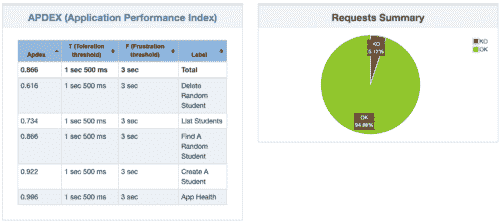](https://res.cloudinary.com/practicaldev/image/fetch/s--wWfazJBQ--/c_limit%2Cf_auto%2Cfl_progressive%2Cq_auto%2Cw_880/https://thepracticaldev.s3.amazonaws.com/i/6f79hgjj1to6kw7w3gsq.png)

在该图中，左侧是 APDEX，右侧是请求摘要。红色表示我们所有的 404 个错误，绿色表示 200 个成功的请求。

与`Number of samples, Response time, Throughput`相关的一些数字

[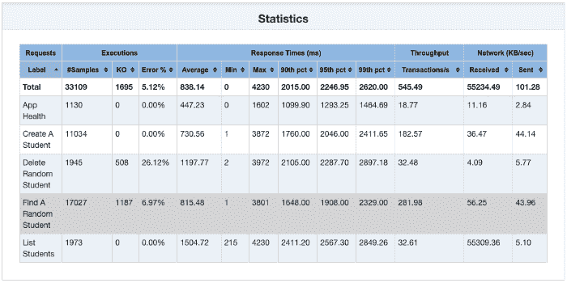](https://res.cloudinary.com/practicaldev/image/fetch/s--EtNGdd1H--/c_limit%2Cf_auto%2Cfl_progressive%2Cq_auto%2Cw_880/https://thepracticaldev.s3.amazonaws.com/i/kobdu070tb06mr09r6td.png)

最重要的是`Response Time`和`Throughput`

[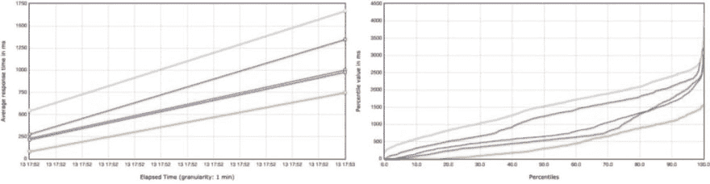](https://res.cloudinary.com/practicaldev/image/fetch/s--S8n3XNjQ--/c_limit%2Cf_auto%2Cfl_progressive%2Cq_auto%2Cw_880/https://thepracticaldev.s3.amazonaws.com/i/jepjubby16laomzx3qt3.jpeg)

最后，值得一提的是`Apache JMeter`可以被配置成监听浏览器的活动并捕获网络请求。详情见[此处](https://jmeter.apache.org/usermanual/jmeter_proxy_step_by_step.html)。

* * *

# 金牛座入门

既然我们知道了如何使用`Apache JMeter`来运行一个基本的负载测试，让我们来探索一下[开源](https://github.com/Blazemeter/taurus)框架 [Taurus](https://gettaurus.org) 。简而言之，金牛座诞生的原因之一是因为`Apache JMeter`有一个陡峭的学习曲线，而`Taurus`让事情变得简单得多。

Taurus 是 Apache JMeter 之上的抽象层(或包装器),这意味着您可以使用 Taurus 运行 Apache JMeter 脚本。因此，继续使用简单的[安装说明](https://gettaurus.org/install/Installation)安装 Taurus

可以使用以下代码块在`YAML`或`JSON`中编写`Taurus`脚本

[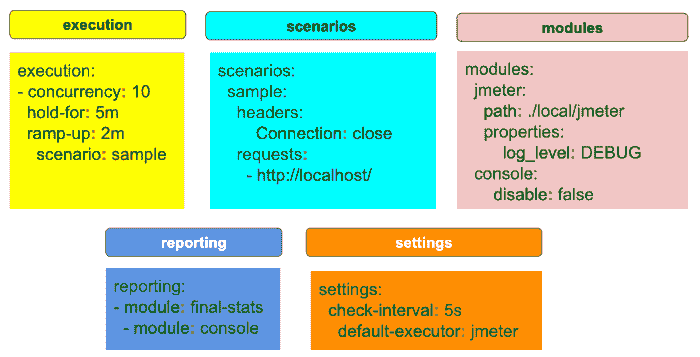](https://res.cloudinary.com/practicaldev/image/fetch/s--jO7qv3CI--/c_limit%2Cf_auto%2Cfl_progressive%2Cq_auto%2Cw_880/https://thepracticaldev.s3.amazonaws.com/i/wu4ahlrs1npok86lnpzc.png)

`Scenarios`基本上是定义一个或多个请求的地方。对于每一个`scenario`，一个`execution`用`no of users`、`duration`、`ramp-up period`等道具定义。`modules`允许我们配置`executor`，可以是`Apache JMeter`、`Selenium`等等。同样，`reporting`允许配置如何生成报告，即 csv、控制台中的实时报告，或将结果推送到 blazemeter 网站。

```
scenarios: 
 StudentList: 
  requests: 
   - url: http://localhost:8080/students/list
     label: Student List
execution: 
 - scenario: StudentList 
   concurrency: 15
   ramp-up: 2s
   hold-for: 10s
reporting:
 - module: console 
 - module: final-stats 
   summary: true 
   percentiles: true
   test-duration: true 
   dump-csv: single_scenario_single_req.csv 
```

负载测试`/students/list` api 到达`2s` (ramp-up)内的`15`用户，持续`10s`时间，在控制台和`csv`文件中显示`live result`。

要运行 Taurus 测试(此处提供了示例[，只需运行命令 bzt `test.yaml`](https://github.com/rhamedy/tinyservice4loadtest/tree/master/taurus_scripts)

[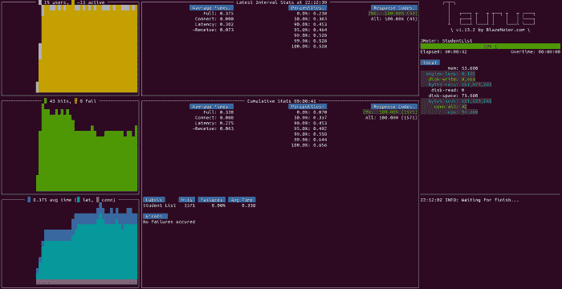](https://res.cloudinary.com/practicaldev/image/fetch/s--6lvr2tmM--/c_limit%2Cf_auto%2Cfl_progressive%2Cq_auto%2Cw_880/https://thepracticaldev.s3.amazonaws.com/i/51mq2lhg57sapc72fyy4.png)

在一个`Taurus`测试中，你也可以配置一个场景指向一个`Apache JMeter`脚本并覆盖执行和其他参数。

```
scenarios: 
 JMeterExample: 
  script: student_crud_jmeter.jmx 
```

似乎是一个非常有趣的框架，值得一试。这里的是非常有据的。

* * *

# 结论

如果你想学习更多的技术和技巧，我强烈推荐你查阅一下 [Apache JMeter](https://jmeter.apache.org) 和 [Taurus](https://gettaurus.org/?source=post_page---------------------------) 的文档。

阅读我在[媒体](https://medium.com/@rhamedy)上的其他文章

注意:由于他们的付费墙，我正在考虑离开 Medium。在引入付费墙之前和之后，我看到了我的故事统计数据的巨大差异。我更喜欢我的文章可以免费获取。

请随时在您最喜爱的社交媒体上联系并关注我，以获取未来的文章。