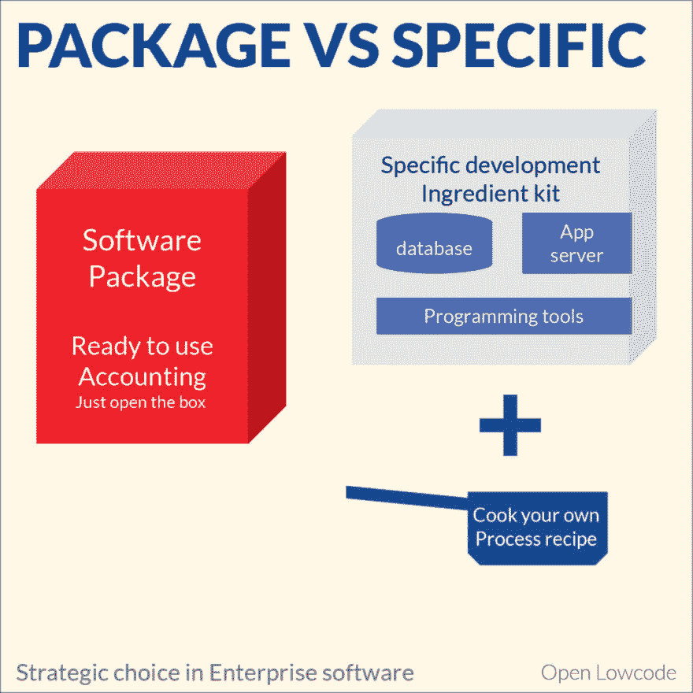

# 软件包与特定开发

> 原文：<https://dev.to/openlowcode/cots-solution-versus-specific-development-58of>

一家公司需要许多 IT 系统来运行其业务，并且通常花费其收入的百分之几来构建和运行这些 IT 系统。一个典型的 IT 系统在被替换之前会存在十年甚至更长时间。部署 IT 系统有两种策略:软件包或特定开发。这一选择将在系统的生命周期内深刻地塑造公司。

## 软件包

软件包直接为业务流程提供解决方案。例如，一个会计软件将直接为你提供一个解决方案来登记你的交易，创建发票和报税。此外，在某种程度上，软件包允许你根据自己的需要对它们进行调整，但是总会有一个限制。很少有打包软件供应商开发出允许扩展的高质量插件框架，这是其他行业做得更好的:wordpress 或许多视频游戏在这里就能想到。

## 具体发展

另一方面，在特定的开发中，您为自己开发所需的业务逻辑。这是在对您的业务流程一无所知的通用 IT 基础设施之上完成的。一个这样的基础设施是安全存储数据的数据库。幸运的是，对于您需要的大多数基础技术，都有很好的、稳定的、开源的基础设施。在具体的开发中，您根据自己的规则直接实现业务逻辑，如果您有特殊的需求或约束，这非常好。

然而，您还必须实现一些所有业务系统通用的基础设施，例如安全性和访问控制、工作流和应用程序页面布局。这就是低代码平台，如 [Open Lowcode](https://openlowcode.com/) 可以在这里提供帮助的地方，通过提供那些准备好组装的普通砖块，以及在顶层开发您需要的东西(砂浆)的所有灵活性。

所以，你必须创建一个新的业务系统，或者替换一个旧的，你应该选择走哪条路，打包软件还是特定的。这篇文章提出了一种做出决定的方法。

## 题目的大小和成本

首先要考虑的标准是开发系统的成本。这应该在您公司 IT 预算的背景下看到，通常占您公司收入的几个百分比(例如，对于收入为几亿欧元的公司，可能是 1 亿欧元)，通常是每个行业的标准比率。系统包括:

*   如果它们代表几年的 IT 预算，那将是巨大的。
*   **大**如果他们的开发和部署成本约占 1 年的 IT 预算
*   如果他们的开发和部署成本远低于一年的 IT 预算，则规模较小

对新系统的投资有一个自然的限制。你通常能每 3 到 5 年承担一个大项目，每年承担几个小项目。

## 业务影响

根据其业务影响和要求的标准程度，IT 系统分为几个类别:

*   战略系统对你公司的竞争地位至关重要，这是你期望能够创新的领域。如果你的公司专注于物流，你假装是世界上最好的，你可能想拥有自己的供应链软件，并快速实施你所有的专利创新。
*   一个**规范化的**系统正在实施一个强制执行的标准流程。最典型的标准流程是会计，其中有公司绝对必须遵守的法律和规范。法律标准不是唯一的标准，也有真正应用的行业或科学标准:钢合金在整个行业都是真正标准化的，它们的机械性能也是如此。这里，应该注意的是，有些 ISO 规范更多的是一种营销技巧或爱好，而不是真正应用的行业标准，在做出判断之前，最好先询问一些不相关的专家。
*   许多系统不属于这一类，并且**既不是战略性的也不是标准化的**。然而，拥有好的系统对于公司的生产力来说是至关重要的。这种系统包括文字处理器和办公套件、许多工业系统、人力资源系统...

## 见解

因此，基于这两个标准，可以提出一个策略，考虑以下事实:

*   一些商业软件**非常昂贵，但提供的价值却很少**。尽管在一个完美市场中，你会期望相对简单的软件价格下降，旧技术商品化，但企业软件供应商正在一个主要包括临时私人交易的市场中努力保持高价格。因此，您应该系统地质疑或思考解决方案将提供的价值及其成本。仅仅有好的标题是不够的。
*   使用商业软件，**你受到编辑器路线图**的支配，这包括，每隔几年，必须执行一次潜在的痛苦和昂贵的升级。特定的软件也受到所用基本技术过时的影响，但这通常只是成套商业软件升级成本的一小部分。引用一句话，改变数据库版本没什么大不了的。
*   将商业软件扩展到**适合你的需求几乎总是极其痛苦的**，因为大多数商业软件没有稳定、强大和适当记录的 API 和定制点。第一次开发是痛苦的，但通常在升级过程中会感觉到这种痛苦。相同功能的具体开发相对容易一些。
*   你可能**低估了开发新软件**或修改现有软件的成本。特别是，一旦一个软件被编写出来，就有大量的工作要稳定它，通常是最初估计的 30%到 100%的额外工作。因此，保持一个工作系统，或者使用一个广泛传播的软件包，因为它是打算使用，稳定工作已经完成
*   有些**主题太大，你的公司无法独自完成**，而且公司越小，这种主题就越多。这意味着，在这种情况下，您只需做出明智的购买决定，使用现有的任何软件。这可能会影响你公司的战略，阻碍你在某些领域的创新。所有利益相关者都认识到这一点，并调整他们的策略，这非常重要，也非常罕见。

## 最后，决策矩阵

因此，考虑到所有这些因素，决策变得非常明显。

*   你应该清楚地为任何大的或巨大的标准化主题购买软件包。大型主题的例子包括完整的会计和税务套件，可能还包括工资单。
*   你也应该为任何既不是战略性的也不是标准化的大主题购买软件包，因为你负担不起自己开发的费用。一个例子是文字处理器或电子表格。因为这些都是你无法承担的巨大投资，你应该只使用现有的产品，并接受它的局限性。
*   如果你需要一个巨大的话题，而且是真正战略性的，那你就有问题了。您的公司认为在这个精确的主题上投入远远超过正常 it 预算的巨额投资是值得的。或者，您可以与软件供应商建立真正的合作伙伴关系来整合您的需求。由于您将高度依赖供应商，您可能希望将合作关系限制在所需的最小范围内
*   如果你有一个或大或小的战略主题的需求，那么，你一定要走特定的路。这会给你你想要的，你会得到更多的灵活性。Open Lowcode 是一种非常有效的方式
*   对于简单的规范化主题，以及其他简单或大的主题，打包策略或特定开发都可能有意义。这包括著名的 ERP 系统的很大一部分。公司通常定制他们的 ERP 来考虑他们的具体情况。然而，许多公司并不认为供应链是一个与众不同的因素，只是一些不能失败的东西。我可以推荐的一种方法是让您的本地开发团队构建一个特定的原型。你可以投入原始开发预算的 10%,看看他们能走多远。因此，你会很好地理解问题的复杂性，以及你的当地团队有多熟练，这是决定走特定方向是否是一个好决定的一个重要因素。有了 [Open Lowcode](https://openlowcode.com) ，你需要更少的技术技能，因为框架已经提供了一个非常好的基础，并将指导你的开发者。

## 这不完全是一场公平的游戏

当您的团队开发特定的解决方案时，外部供应商销售软件包。你不会在公平的条件下比较这两种方法。特别是，具体的开发解决方案将缺乏来自供应商公司的强大、专业和自私的倡导者。无论发生什么，他们都会很高兴得到你的钱。可能没有人知道走另一条路线会便宜 3 倍。这甚至是在提到著名的“*之前，没有人会因为选择一个在你的团队中很常见的著名大供应商*而被解雇。所以，为了补偿这种偏见，你可能想稍微推动这个决定进入特定的开发方向，并且当打包软件的案例将被制作出来的时候成为魔鬼的代言人。至少，你应该跑几场[黑客马拉松](https://openlowcode.com)，看看会有什么结果。