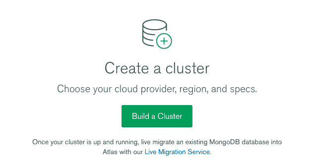
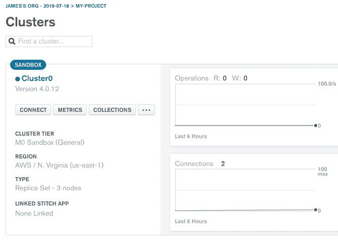
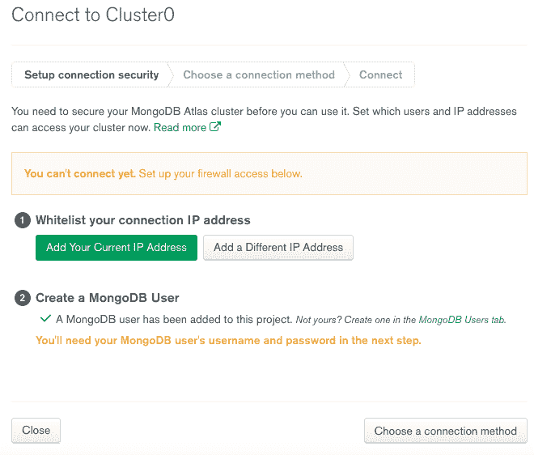
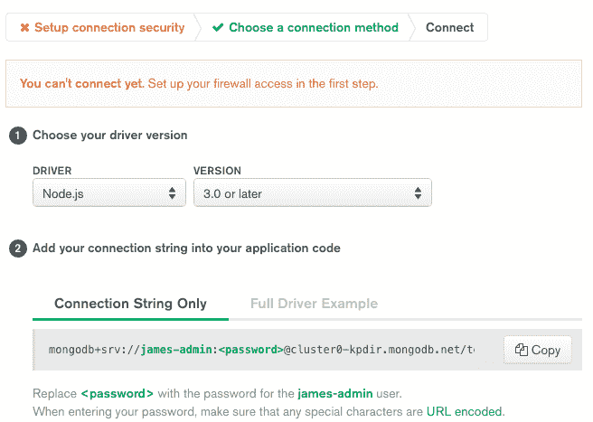

# 如何将 express-mongoDB API + React 前端部署到 Heroku

> 原文：<https://dev.to/jamesroyston/how-to-deploy-your-express-mongodb-api-react-frontend-to-heroku-4p8m>

## 👋

如果你像我一样，你可能是一个喜欢写 JavaScript 的前端开发人员，但是你从来没有做过后端工作。也就是说，从鸟瞰图来看，你可能知道它一般是如何工作的。在本文中，我将介绍如何使用 express 和 mongoDB 编写一个 RESTful api，用于我的 React 前端。我还将介绍如何在 Mongo Atlas 上设置集群并将 express 连接到集群。

**假设**

*   您已经创建了一个 react 应用程序。
*   您已经创建了一个快速应用程序。

**我使用的资源**

有几篇博文更详细地介绍了 react/express 应用程序的部署，坦率地说，它们对我的工作非常有帮助。这些帖子唯一缺少的是 mongoDB 和 mongoAtlas 部分。这些是文章

*   [戴夫·塞迪亚的文章](https://daveceddia.com/deploy-react-express-app-heroku/)
*   [Chloe Chong 的文章](https://medium.com/@chloechong.us/how-to-deploy-a-create-react-app-with-an-express-backend-to-heroku-32decfee6d18)

-

## 好了，我们开始吧

## 1)结合你的客户端和服务器端代码

首先，将 react 应用程序(包含项目文件的文件夹)复制到 express 项目的根目录中，这样文件树看起来就像这样:

```
|- package.json
|- server.js
|- models/
    |- Posts.js
|- client/             (the react folder)
    |- package.json
    |- src/
       |- components/
       |- index.js
       |- app.js 
```

Enter fullscreen mode Exit fullscreen mode

## 2)创建一个 mongo atlas 账户

导航到[mongo atlas 网站](https://www.mongodb.com/cloud/atlas)并注册一个免费账户。

## 3)设置集群

注册之后，我们需要配置一个 mongo atlas 项目和集群，然后在集群上创建我们的第一个数据库。

[](https://res.cloudinary.com/practicaldev/image/fetch/s--DVfUFtjb--/c_limit%2Cf_auto%2Cfl_progressive%2Cq_auto%2Cw_880/https://thepracticaldev.s3.amazonaws.com/i/qar6rwbww9dwayab7dri.png)

*   在下一个屏幕上，您只需点击“创建项目”,无需填写任何内容。之后，您将看到主仪表板。点击“构建集群”。

[](https://res.cloudinary.com/practicaldev/image/fetch/s--SeycFl2l--/c_limit%2Cf_auto%2Cfl_progressive%2Cq_auto%2Cw_880/https://thepracticaldev.s3.amazonaws.com/i/cr952e7cqbufr8nssplb.png)

*   从这里开始，你不需要去改变任何选项。只需点击横幅右下角的“创建集群”。之后，您将看到您的集群控制面板:

[](https://res.cloudinary.com/practicaldev/image/fetch/s--esM4NhvQ--/c_limit%2Cf_auto%2Cfl_progressive%2Cq_auto%2Cw_880/https://thepracticaldev.s3.amazonaws.com/i/55xlakjjk35u95olbgyx.png)

*   单击集群仪表板上的 connect 按钮，按照步骤为集群创建一个 mongo 用户，并将 IP 地址加入白名单。要将所有 IP 地址列入白名单(这对我们推送 heroku 很有帮助)，请将`0.0.0.0`添加到白名单中。

[](https://res.cloudinary.com/practicaldev/image/fetch/s--YpGe8fGe--/c_limit%2Cf_auto%2Cfl_progressive%2Cq_auto%2Cw_880/https://thepracticaldev.s3.amazonaws.com/i/249yo4xo7rub0x5yp99f.png)

[](https://res.cloudinary.com/practicaldev/image/fetch/s--Of5lWFgA--/c_limit%2Cf_auto%2Cfl_progressive%2Cq_auto%2Cw_880/https://thepracticaldev.s3.amazonaws.com/i/irvbfk32qwwdxbz5vjx8.png)

*   此时，您可以继续选择连接方法，选择“连接您的应用程序”,并按照网站上的说明复制字符串。

注意:您将使用为您的集群用户创建的密码替换该字符串的<`password` >部分(您在 2 分钟前创建了该密码，lol)。

*   快速最后一件事:从集群仪表板，点击收集，并选择添加您自己的数据的选项。从这里你可以创建你的第一个数据库和收藏。我为数据库和收藏做了“我的数据库”和“文章”。

## 4)从 express 连接到您的集群

打开`server.js`并添加以下代码:

```
mongoose.connect(
  process.env.DB_CONNECTION,
  { useNewUrlParser: true },
  () => { console.log('connected to db') }
)

// swap process.env.DB_CONNECTION with your string 
```

Enter fullscreen mode Exit fullscreen mode

如果您熟悉 dotenv npm 包，那么您会有一个带有`DB_CONNECTION=mongostring`值的`.env`文件。为了简单起见，我们可以用字符串来代替。

## 5)设置代理(clientside)

我们需要设置代理，这样您就可以从 React 调用 express api，而不需要使用`http://localhost:3001`(端口号对于这个例子并不重要)。导航到您的客户端`package.json`文件并添加:

```
"proxy":  "http://localhost:3001" 
```

Enter fullscreen mode Exit fullscreen mode

我们还需要在 React 应用程序中的任何 AJAX 调用中用`/api/yourDefaultRoute`替换`http://localhost:3001`。如果你使用 Redux，这可能会在你的`actions.js`文件中。如果您使用本地组件状态，那么它很可能存在于任何使用`componentDidMount()`生命周期钩子来获取数据的组件中。例:

```
componentDidMount() {
  fetch('/api/posts')
    .then(res => res.json())
    .then(res => console.log(res))
    .catch(err => console.log(err)) 
```

Enter fullscreen mode Exit fullscreen mode

## 6)设置代理(服务器端)

回到 express 应用程序的根目录，打开`server.js`。我们需要确保 node 为我们的客户端应用程序的构建版本提供服务。我们还想确保我们已经更新了我们的快速路线，以便代理工作。

```
const cors = require('cors')
const path = require('path')
const Post = require('./models/Post')

// prevents cors headaches when your react app calls your api
app.use(cors())

// serves the built version of your react app
app.use(express.static(path.join(__dirname, 'client/build')))
app.get('*', (req, res) => {
  res.sendFile(path.join(__dirname + '/client/build/index.html'))
})

// for your REST calls, append api to the beginning of the path
// ex: 
app.get('/api/posts', async (req, res) => {
  try {
    res.json(await Post.find())
    // Post is a mongoose schema we've defined in /models
    // .find() is a method on the model for fetching all documents
  } catch (err) {
    res.json({message: err})
  }
})

// ensures the proxy we set earlier is pointing to your express api
const port = process.env.PORT || 3001
app.listen(port, () => {
  console.log(`listening on port ${port}`)
}); 
```

Enter fullscreen mode Exit fullscreen mode

*如果您想知道最后一个片段中的`Post`是什么，这里是我们正在导入的“Post”mongose 模式。*T3】

```
const mongoose = require('mongoose')

const PostSchema = mongoose.Schema(
  {
    topic: {type: String, required: true},
    body: {type: String, required: true},
    date: {type: Date, default: Date.now}
  }
)

module.exports = mongoose.model('Post', PostSchema); 
```

Enter fullscreen mode Exit fullscreen mode

## 7)将 heroku 后期构建脚本添加到 serverside package.json

唷，快到了！现在导航到您的根(express') package.json 并添加这个脚本:

```
"heroku-postbuild": "cd client && npm install && npm run build" 
```

Enter fullscreen mode Exit fullscreen mode

到`"scripts"`对象。

好了，项目文件夹中的设置到此结束。通过在单独的终端中运行 react 应用程序和 express api 并测试 AJAX 调用，您可以随意测试一切是否仍然正常。一切正常吗？伊芙是的，让我们继续！

## 8)安装和配置 Heroku

我们需要确保我们的机器上安装了 heroku，通过终端创建 heroku 应用程序，并运行 deploy 命令。下面是安装 heroku 的命令。

```
$ brew tap heroku/brew && brew install heroku 
```

Enter fullscreen mode Exit fullscreen mode

(如果你使用的是 windows 或 linux，以下是这些操作系统的说明:[https://devcenter.heroku.com/articles/heroku-cli](https://devcenter.heroku.com/articles/heroku-cli))

-

有用吗？太好了！现在一个接一个地运行这些:

```
$ git init
$ heroku create my-project
$ heroku login 
# this will redirect you to sign in via your default browser
$ git push heroku master 
```

Enter fullscreen mode Exit fullscreen mode

如果一切顺利，您应该看到构建日志淹没了您的终端，最终结果应该是这样的:

```
-----> Build succeeded!
-----> Discovering process types
       Procfile declares types     -> (none)
       Default types for buildpack -> web
-----> Compressing...
       Done: 49.3M
-----> Launching...
       Released v13
       https://my-project.herokuapp.com/ deployed to Heroku 
```

Enter fullscreen mode Exit fullscreen mode

😄 🎆 🔥 🔥 🔥

## 9)最后也是最关键的一步 *IMO* :再次检查您是否为集群 PLS 启用了全局`0.0.0.0`白名单

进入 mongo atlas，确保您已经为 mongoDB 集群启用了一个全局 IP 地址白名单(按照本教程中的步骤 3)。如果你不这样做，你的应用程序将运行，但你的数据永远不会被提取。你会有一个充满 503 网络错误的网络标签😅这让我愣了好一会儿。当我凌晨 2 点在这个项目上埋头苦干的时候，我可能已经睡着了....)

## 生病了，我们都完了。

进入你的项目的网址(由终端提供，或者通过 heroku 网站上的仪表盘),你会对你的成就感到惊讶！提示:在 macOS 上，点击 cmd+将会在你的默认浏览器中打开来自终端的链接

如果你想看我的工作示例，可以在这里查看[。](http://mern-app-msg.herokuapp.com/) ❤️

附:这是我的第一篇博文。欢迎反馈！我希望你们都喜欢这篇文章和/或觉得它有用。

-
詹姆斯