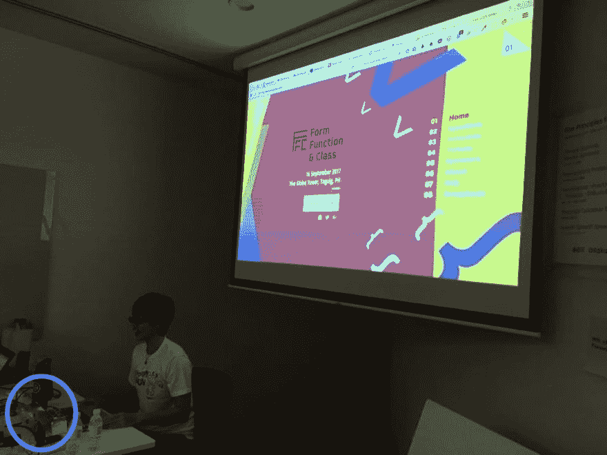
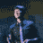
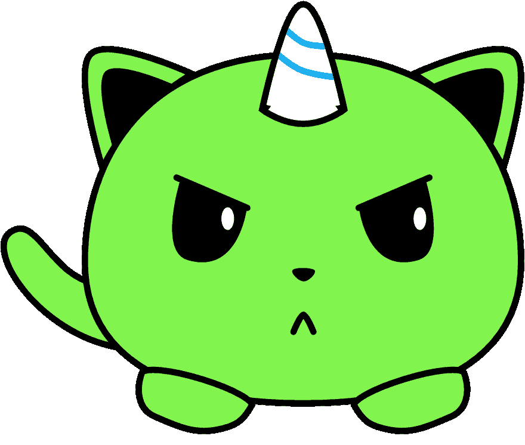
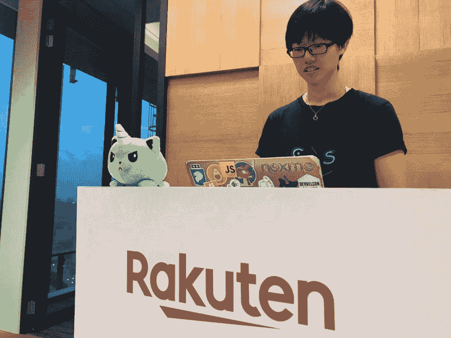
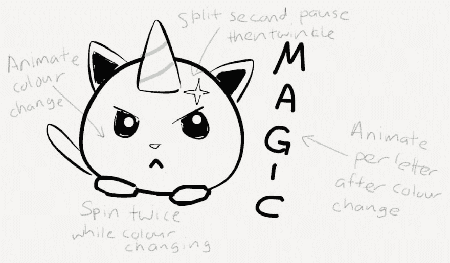
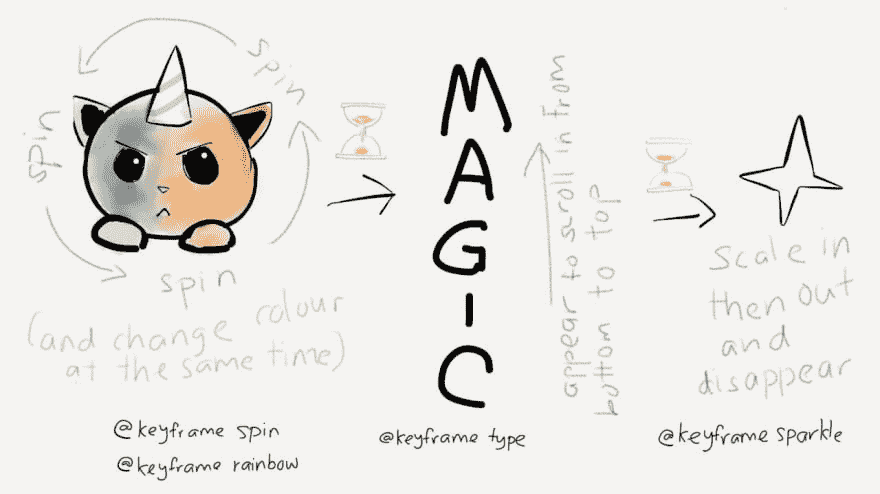
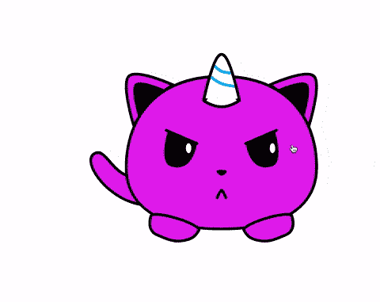
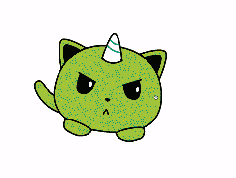
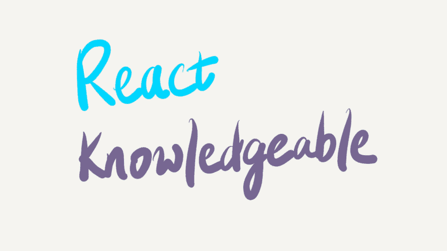

# 用神奇的 kittencorn 弄清楚 CSS 动画属性

> 原文：<https://dev.to/huijing/figuring-out-css-animation-properties-with-a-magic-kittencorn-1b0h>

一个鲜为人知的事实是，我们实际上有一个非官方的吉祥物。我还没有给它命名，因为给东西命名是世界上最难的问题。但它的生日是 2017 年 6 月 8 日(所以现在刚过 2 岁)，它第一次出现在 Talk 上。CSS 在 2017 年 7 月 26 日我们[第一次 Codepen edition](https://singaporecss.github.io/19) 期间。

> 【HJ】陈@ HJ _ Chen[@ wgao 19](https://twitter.com/wgao19)[@ chee aun](https://twitter.com/cheeaun)[@ reknowledged able](https://twitter.com/reknowledgeable)至少你们有些人在 hor 之前见过我的非官方吉祥物....刚才那个没人的人民币妮娅...他们的生日是 2017 年 6 月 8 日...并成为 Talk 的非官方吉祥物。无论如何，现在是一对兄弟姐妹了，你会看到的...
> 2019 年 7 月 26 日上午 07:49[](https://twitter.com/intent/tweet?in_reply_to=1154659935810199552)[](https://twitter.com/intent/retweet?tweet_id=1154659935810199552)[](https://twitter.com/intent/like?tweet_id=1154659935810199552)

那次聚会后不久，我觉得把我们非官方的吉祥物加到新加坡 CSS 的网站上会很不错，所以我用素描画了一张它的肖像。仅此而已。我停在那里。从来没有对插图做过任何事。我也总是忘记带它去参加聚会，所以我想在接下来的两年里，它又出现了 3 次。

[](https://res.cloudinary.com/practicaldev/image/fetch/s--q7jvFMXr--/c_limit%2Cf_auto%2Cfl_progressive%2Cq_auto%2Cw_880/https://www.chenhuijing.com/asseimg/posts/magical-kittencorn/css-kittencorn.svg)

但是时代变了。CSS kittencorn(直到有人想到一个更好的名字)现在在魏的办公桌前站岗，自从他们两人今年认识以来，已经出现在多次聚会上。现在它有了一个弟弟妹妹。以后会有更多的介绍。

长话短说，CSS kittencorn 可能不再是两年前的那种秘密吉祥物，应该在所有未来的谈话中占据显著地位。CSSes 向前发展。我希望如此。

[](https://res.cloudinary.com/practicaldev/image/fetch/s--0k06UASc--/c_limit%2Cf_auto%2Cfl_progressive%2Cq_auto%2Cw_880/https://www.chenhuijing.com/asseimg/posts/magical-kittencorn/talkcss-1280.jpg)

为了纪念这个重要的时刻，也为了在另一次长途飞机旅行中自娱自乐，我又有了一个轻率的想法。如果你关注我的文章有一段时间了，你会发现我有很多这样的文章。还有，谢谢？我很感激你们三个读了我的废话。真的。

## 我可以有 GIF 吗？

我本来想做一个动画 GIF 送给魏，只是因为。我以前在 Photoshop 中制作过动画 gif(只要触发我的 404 页面，继续，我会等)，但那是相当多的努力，我不准备承诺。

因此，我的下一个最佳选择是创建一个可以在浏览器中运行的动画，然后对其进行截屏并保存为 GIF 格式。GIF 制作最终失败了，因为它没有按计划制作动画，但 WhatsApp 支持视频，所以最终发送的就是视频。最好的计划。

首先要做的是将 kittencorn 插图放入浏览器。完全用 HTML 元素和 CSS 创建 kittencorn 可能吗？你当然可以。但是我很懒。(**在此插入即将被支持的树懒表情符号* *)

所以是 SVG。

```
<svg class="kittencorn" xmlns="http://www.w3.org/2000/svg" viewBox="0 0 415 352" fill="none">
  <path class="rainbow" stroke="#000" stroke-width="5" d="M123.877 230.922c3.406 2.175 6.516 6.728 8.244 12.418 1.715 5.643 1.948 12.021.031 17.572-1.888 5.468-5.891 10.25-12.963 12.885-7.165 2.669-17.684 3.205-32.61-.401-29.756-7.188-54.915-26.626-69.709-46.127-7.404-9.76-12.078-19.362-13.534-27.273-1.455-7.906.345-13.544 5.04-16.585 2.651-1.719 4.958-2.45 7.019-2.553 2.056-.102 4.063.411 6.135 1.492 4.28 2.234 8.493 6.679 13.401 12.284.685.781 1.38 1.583 2.088 2.399 9.146 10.54 20.398 23.508 37.356 27.282 17.484 3.891 28.625 4.625 36.201 4.894 1.074.038 2.056.066 2.962.093 2.338.068 4.167.121 5.751.285 2.118.219 3.459.614 4.588 1.335z"/>
  <path class="rainbow" fill-rule="evenodd" stroke="#000" stroke-linecap="square" stroke-width="5" d="M151.901 58.517S86.599 28.76 71.819 42.603c-14.78 13.845 9.153 90.422 9.153 90.422s11.039-23.8 29.824-42.843c18.785-19.043 41.105-31.665 41.105-31.665z" clip-rule="evenodd"/>
  <path fill="#000" fill-rule="evenodd" d="M138 67.311S93.39 46.981 83.292 56.44c-10.097 9.458 6.253 61.771 6.253 61.771s7.54-16.259 20.374-29.268C122.752 75.933 138 67.31 138 67.31z" clip-rule="evenodd"/>
  <path class="rainbow" fill-rule="evenodd" stroke="#000" stroke-linecap="square" stroke-width="5" d="M327 58.517s65.302-29.758 80.082-15.914c14.78 13.845-9.152 90.422-9.152 90.422s-11.039-23.8-29.824-42.843C349.32 71.139 327 58.517 327 58.517z" clip-rule="evenodd"/>
  <path fill="#000" fill-rule="evenodd" d="M340.451 67.311s44.611-20.33 54.707-10.871c10.097 9.458-6.252 61.771-6.252 61.771s-7.541-16.259-20.374-29.268c-12.833-13.01-28.081-21.632-28.081-21.632z" clip-rule="evenodd"/>
  <path class="rainbow" fill-rule="evenodd" stroke="#000" stroke-width="5" d="M239.5 319c95.269 0 172.5-30.225 172.5-112.067C412 125.091 364.154 43 239.5 43S67 125.091 67 206.933 144.231 319 239.5 319z" clip-rule="evenodd"/>
  <path fill="#fff" fill-rule="evenodd" d="M269.421 85.475s-17.077-79.652-29.71-79.652C227.077 5.823 210 85.474 210 85.474s13.603 10.033 29.711 10.033c16.107 0 29.71-10.032 29.71-10.032z" clip-rule="evenodd"/>
  <path stroke="#1CAFEF" stroke-linecap="round" stroke-width="5" d="M220.57 43.788s10.301 9.215 18.976 12.264c8.675 3.05 23.971 4.846 23.971 4.846M227.126 24.256s7.002 7.088 13.172 9.746c6.17 2.658 16.23 2.453 16.23 2.453"/>
  <path stroke="#000" stroke-linecap="square" stroke-width="5" d="M269.421 85.475l1.484 2.012 1.299-.959-.338-1.578-2.445.525zm0 0l1.483 2.012-.002.002-.004.003-.012.008-.039.029-.136.097c-.116.083-.284.2-.5.347a49.67 49.67 0 0 1-1.856 1.198 64.981 64.981 0 0 1-6.698 3.588c-5.598 2.593-13.398 5.248-21.946 5.248-8.549 0-16.349-2.655-21.947-5.248a64.981 64.981 0 0 1-6.698-3.588 49.67 49.67 0 0 1-1.856-1.198 32.2 32.2 0 0 1-.5-.347l-.136-.097-.039-.029-.012-.008-.004-.003-.002-.002L210 85.475m59.421 0c2.445-.525 2.445-.525 2.444-.526v-.003l-.003-.011-.009-.045-.038-.174-.147-.672a648.068 648.068 0 0 0-2.682-11.6c-1.804-7.49-4.344-17.49-7.284-27.5-2.933-9.987-6.291-20.077-9.742-27.706-1.719-3.8-3.515-7.114-5.364-9.517-1.725-2.242-4.031-4.398-6.885-4.398-2.855 0-5.16 2.156-6.886 4.398-1.849 2.403-3.645 5.717-5.364 9.517-3.451 7.629-6.809 17.719-9.742 27.706-2.94 10.01-5.48 20.01-7.284 27.5a662.824 662.824 0 0 0-2.682 11.6l-.147.672-.037.174-.01.044-.003.012v.003l2.444.526m0 0l-2.444-.525-.339 1.578 1.299.959L210 85.475z"/>
  <path class="rainbow" stroke="#000" stroke-width="5" d="M112.172 294.814c.162-.44.936-1.327 3.831-1.852 2.712-.491 6.499-.505 11.099-.061 9.159.885 20.929 3.525 32.386 7.041 11.461 3.517 22.442 7.861 30.052 12.086 3.835 2.128 6.632 4.129 8.23 5.859 1.691 1.831 1.355 2.513 1.273 2.66-3.557 6.449-6.703 10.517-10.829 13.38-4.148 2.877-9.531 4.708-17.896 6.183-16.152 2.848-28.509-1.923-48.52-10.911-6.312-2.835-9.911-7.947-11.371-14.096-1.477-6.22-.747-13.496 1.745-20.289zM366.828 294.814c-.162-.44-.936-1.327-3.831-1.852-2.712-.491-6.499-.505-11.099-.061-9.159.885-20.929 3.525-32.386 7.041-11.461 3.517-22.442 7.861-30.052 12.086-3.835 2.128-6.632 4.129-8.23 5.859-1.691 1.831-1.355 2.513-1.273 2.66 3.557 6.449 6.703 10.517 10.829 13.38 4.148 2.877 9.531 4.708 17.896 6.183 16.152 2.848 28.509-1.923 48.52-10.911 6.312-2.835 9.911-7.947 11.371-14.096 1.477-6.22.747-13.496-1.745-20.289z"/>
  <path fill="#000" fill-rule="evenodd" d="M142.729 141.367l52.56 22.575s-6.123 54.384-47.317 41.688c-23.433-7.223-5.243-64.263-5.243-64.263z" clip-rule="evenodd"/>
  <path stroke="#000" stroke-linecap="round" stroke-width="5" d="M139.5 140.45l56 24"/>
  <path fill="#fff" fill-rule="evenodd" d="M180 181.95c2.761 0 5-4.03 5-9 0-4.971-2.239-9-5-9s-5 4.029-5 9c0 4.97 2.239 9 5 9z" clip-rule="evenodd"/>
  <path fill="#000" fill-rule="evenodd" d="M336.271 141.367l-52.56 22.575s6.123 54.384 47.317 41.688c23.433-7.223 5.243-64.263 5.243-64.263z" clip-rule="evenodd"/>
  <path stroke="#000" stroke-linecap="round" stroke-width="5" d="M339.5 140.45l-56 24"/>
  <path fill="#fff" fill-rule="evenodd" d="M332 181.95c-2.761 0-5-4.03-5-9 0-4.971 2.239-9 5-9s5 4.029 5 9c0 4.97-2.239 9-5 9z" clip-rule="evenodd"/>
  <path fill="#000" fill-rule="evenodd" d="M231.498 213.403c2.378-2.079 13.645-1.791 16.729 0 3.084 1.791-3.754 9.199-8.09 9.199-4.335 0-11.017-7.119-8.639-9.199z" clip-rule="evenodd"/>
  <path stroke="#000" stroke-linecap="round" stroke-width="5" d="M247.756 262.45s-5.481-13.5-7.878-13.5c-2.398 0-7.878 13.5-7.878 13.5"/>
</svg> 
```

<svg width="20px" height="20px" viewBox="0 0 24 24" class="highlight-action crayons-icon highlight-action--fullscreen-on"><title>Enter fullscreen mode</title></svg> <svg width="20px" height="20px" viewBox="0 0 24 24" class="highlight-action crayons-icon highlight-action--fullscreen-off"><title>Exit fullscreen mode</title></svg>

它需要是一个内嵌的 SVG，因为我想对它应用 CSS 动画，并用 CSS 类来定位 SVG 的特定部分。所以你可以在一些`<path>`上看到`rainbow`类，整个 SVG 都有`kittencorn`类。

在我的脑海中，我希望 kittencorn 在彩虹的颜色中旋转，然后需要出现“Magic”这个词，随后随机闪烁以结束事情。原来所有这些事情都可以用 CSS 动画来实现。好玩！

然后再添加 2 个标记:

```
<p class="magic">Magic</p>
<svg class="sparkle" viewBox="0.0 0.0 50.0 50.0" fill="none" stroke="none" stroke-linecap="square" stroke-miterlimit="10">
  <clipPath id="p.0">
    <path d="m0 0l50.0 0l0 50.0l-50.0 0l0 -50.0z" clip-rule="nonzero"></path>
  </clipPath>
  <g clip-path="url(#p.0)">
    <path fill-opacity="0.0" d="m0 0l50.0 0l0 50.0l-50.0 0z" fill-rule="nonzero"></path>
    <path fill="#fff" d="m0.62204725 25.0l20.068499 -4.323374l4.309454 -20.13332l4.309454 20.13332l20.068499 4.323374l-20.068499 4.323374l-4.309454 20.133318l-4.309454 -20.133318z" fill-rule="nonzero"></path>
    <path stroke-width="1.0" stroke-linejoin="round" stroke-linecap="butt" d="m0.62204725 25.0l20.068499 -4.323374l4.309454 -20.13332l4.309454 20.13332l20.068499 4.323374l-20.068499 4.323374l-4.309454 20.133318l-4.309454 -20.133318z" fill-rule="nonzero"></path>
  </g>
</svg> 
```

<svg width="20px" height="20px" viewBox="0 0 24 24" class="highlight-action crayons-icon highlight-action--fullscreen-on"><title>Enter fullscreen mode</title></svg> <svg width="20px" height="20px" viewBox="0 0 24 24" class="highlight-action crayons-icon highlight-action--fullscreen-off"><title>Exit fullscreen mode</title></svg>

## CSS 动画基础知识

定义 CSS 动画如何工作的规范是 [CSS 动画级别 1](https://www.w3.org/TR/css-animations-1/) ，目前处于工作草案状态。该规范允许开发人员:

> 将 CSS 属性随时间的变化指定为一组关键帧

它们与 [CSS 转换](https://www.w3.org/TR/css-transitions-1/)非常相似，主要区别在于:

> 属性值更改时会隐式触发过渡，而应用动画属性时会显式执行动画

让我们也看看规范中概述的关于 CSS 动画的一些有趣的事实。

1.  动画将覆盖所有正常规则，但会被`!important`规则覆盖
2.  如果有多个动画指定同一属性的行为，则最后出现的动画获胜
3.  在应用动画之前或移除动画之后，动画不会影响计算值
4.  动画会在动画运行期间计算属性值，但其他值可能会优先于动画值
5.  当应用动画的样式和相应的`@keyframes`规则都被解析时，动画开始，但是动态更新关键帧样式规则不会开始或重新开始动画
6.  当动画运行时，对动画属性值的更改将被应用，就像动画从开始时就具有这些值一样
7.  同一个`@keyframes`规则名称可以在一个动画名称中重复
8.  将`display`属性设置为`none`将终止应用于该元素及其后代的任何正在运行的动画

关键帧用于定义动画过程中特定点的动画属性值。它们的写法如下:

```
@keyframes animation-name { ... } 
```

<svg width="20px" height="20px" viewBox="0 0 24 24" class="highlight-action crayons-icon highlight-action--fullscreen-on"><title>Enter fullscreen mode</title></svg> <svg width="20px" height="20px" viewBox="0 0 24 24" class="highlight-action crayons-icon highlight-action--fullscreen-off"><title>Exit fullscreen mode</title></svg>

不过，关于命名你的`@keyframes`块，你需要知道一些东西。它可以是自定义标识符(无引号)或字符串(使用引号)。该名称完全区分大小写，这意味着如果名称的每个代码点都匹配，则它们被视为相同。

```
/* both have the same name, so the first block is ignored */
@keyframes magical { ... }
@keyframes "magical" { ... }

/* because of case-sensitivity, this is considered different */
@keyframes MAGICAL { ... } 
```

<svg width="20px" height="20px" viewBox="0 0 24 24" class="highlight-action crayons-icon highlight-action--fullscreen-on"><title>Enter fullscreen mode</title></svg> <svg width="20px" height="20px" viewBox="0 0 24 24" class="highlight-action crayons-icon highlight-action--fullscreen-off"><title>Exit fullscreen mode</title></svg>

像`none`或`initial`这样的保留关键字不能作为自定义标识符使用，但是你可以将它们作为字符串使用。所以引用的事情，你的关键帧神奇地变得有效。看到我做了什么吗？没有吗？没关系……

```
/* these will not work */
@keyframes None { ... }
@keyframes initial { ... }

/* but these will */
@keyframes "None" { ... }
@keyframes "initial" { ... } 
```

<svg width="20px" height="20px" viewBox="0 0 24 24" class="highlight-action crayons-icon highlight-action--fullscreen-on"><title>Enter fullscreen mode</title></svg> <svg width="20px" height="20px" viewBox="0 0 24 24" class="highlight-action crayons-icon highlight-action--fullscreen-off"><title>Exit fullscreen mode</title></svg>

## CSS 动画的语法

`animation`是一个简写属性，包括以下内容(值为初始默认值):

*   `animation-name: none`
*   `animation-duration: 0s`
*   `animation-timing-function: ease`
*   `animation-delay: 0s`
*   `animation-iteration-count: 1`
*   `animation-direction: normal`
*   `animation-fill-mode: none`
*   `animation-play-state: running`

如果希望一个元素上有多个动画，请用逗号分隔每个动画。我只是非常简要地介绍了这些单独属性的作用，但是要获得完整的解释，请阅读非常容易理解的 [CSS 动画级别 1](https://www.w3.org/TR/css-animations-1/) 。

### `animation-name`

我们之前讨论过这个问题，它用于选择为动画提供属性值的`@keyframe`规则。如果该名称与任何关键帧都不匹配，则没有动画。`none`是一个关键字值，所以如果你用它作为自定义标识符，对你来说也没有动画。

### `animation-duration`

该属性定义单个动画循环的持续时间。实质上是动画从开始到结束需要多长时间。

因为 CSS 遵守物理定律，所以负的时间值是无效的。尽管如果将此定义为`0s`，即使关键帧没有效果，动画仍然会出现，但只是瞬间发生。

### `animation-timing-function`

该属性描述动画功能将如何在每对关键帧之间进行。甚至有一个单独的 CSS 规范用于计时函数，称为 [CSS 缓动函数级别 1](https://www.w3.org/TR/css-easing-1/) 。

因为动画比我们大多数人想的要复杂得多。此外，在`animation-delay`期间，不应用`animation-timing-function`。

### `animation-delay`

此属性定义属性开始的时间，因此您可以使动画晚一点开始，或者使它看起来在应用之前就开始了。这一点需要一些解释。所以与`animation-duration`属性不同，在这种情况下，负的时间值实际上是有效的。

只是浏览器会让动画前进到过去某个时间动画开始时的位置。所以看起来它是在活跃期的中途开始的。

### `animation-iteration-count`

该属性指定动画播放的次数。默认情况下，动画将从头到尾运行一次，但是您可以让它运行多次，或者用值`infinite`保持循环。因为谁不爱无限跑的动画呢？(实际上是很多人)

通常人们使用这个选项，并把`animation-direction`设为`alternate`，这样动画就可以交替循环播放。

### `animation-direction`

如前所述，该属性定义了动画是否应该在某些或所有循环中反向播放。当您反向播放动画时，计时功能也会反向。所以一个`ease-in`最终变成了一个`ease-out`。

你可以选择`normal`、`reverse`、`alternate`和`alternate-reverse`。因为选择。

### `animation-fill-mode`

该属性定义动画在实际运行时间之外应用的值。默认情况下，动画运行后不会影响属性值，但是`animation-fill-mode`可以覆盖这种行为。

例如，如果你从屏幕的左边到右边制作了动画，在动画结束后，如果你不做任何事情，你的东西会变形回到原来的位置。所以如果你想让你的东西留在最后，你可以为这个属性应用一个值`forwards`。

### `animation-play-state`

此属性定义动画是正在运行还是暂停。非常简单(与其他一些属性相比，imho)。`running`表示动画正常进行，而`paused`表示动画暂停。\_(ツ)_/

如果动画在动画延迟阶段设置为暂停，则延迟时钟也会暂停。

## 有些布局的东西

魏制作了一套精美的手绘幻灯片，用于她正在筹备的一个新聚会的电梯间推介(最后会有更多介绍)，看起来棒极了。我非常支持在铅笔和纸上画草图，但是从来没有真正接触过数字方面的东西。

我想我太习惯用铅笔(或画笔)的感觉了，但在平板电脑上画草图并不是世界上最糟糕的体验。做得更好的唯一方法就是去做，对吗？不管怎样，这是我脑海中勾勒出的计划。

[](https://res.cloudinary.com/practicaldev/image/fetch/s--2-VEYvSK--/c_limit%2Cf_auto%2Cfl_progressive%2Cq_auto%2Cw_880/https://www.chenhuijing.com/asseimg/posts/magical-kittencorn/sketch-1280.jpg)

在制作任何动画之前，我们必须对所有的东西进行布局。还记得这应该是一个屏幕截图吗？所以除了你在上面的草图中看到的，页面上没有其他东西。这使得它更容易定位在页面的正中央。

```
html {
  box-sizing: border-box;
  height: 100%;
}

*,
*::before,
*::after {
  box-sizing: inherit;
  margin: 0;
  padding: 0;
}

body {
  display: flex;
  height: 100%;
  font-family: 'Lemon', cursive;
} 
```

<svg width="20px" height="20px" viewBox="0 0 24 24" class="highlight-action crayons-icon highlight-action--fullscreen-on"><title>Enter fullscreen mode</title></svg> <svg width="20px" height="20px" viewBox="0 0 24 24" class="highlight-action crayons-icon highlight-action--fullscreen-off"><title>Exit fullscreen mode</title></svg>

这些几乎是我现在的标准重置风格。可能对你没用，但对我很有用。如果你不想在多个元素上做`height: 100%`的事情，在`<body>`元素上抛出一个`height: 100vh`也是很好的。

```
div {
  display: grid;
  grid-template-columns: max-content max-content;
  gap: 1em;
  align-items: center;
  margin: auto;
  position: relative;
  cursor: pointer;
} 
```

<svg width="20px" height="20px" viewBox="0 0 24 24" class="highlight-action crayons-icon highlight-action--fullscreen-on"><title>Enter fullscreen mode</title></svg> <svg width="20px" height="20px" viewBox="0 0 24 24" class="highlight-action crayons-icon highlight-action--fullscreen-off"><title>Exit fullscreen mode</title></svg>

要制作动画的所有 3 个位都被包装在一个单独的`<div>`中，它将有一个`magic`的`id`，用于在最后洒上一点 Javascript。当你有一个单独的项目需要放在它的父节点的中心时，你会怎么做？自动边距，就是这样。

因为我们已经为 3 个动画位设置了父子关系，而不是摆弄`inline-block`和垂直对齐，或者`flex`和浏览器自己调整大小，我用`grid`来代替放置它们。基于内容的规模很酷。

```
.kittencorn {
  height: 50vmin;
}

.rainbow {
  fill: #a3e048;
} 
```

<svg width="20px" height="20px" viewBox="0 0 24 24" class="highlight-action crayons-icon highlight-action--fullscreen-on"><title>Enter fullscreen mode</title></svg> <svg width="20px" height="20px" viewBox="0 0 24 24" class="highlight-action crayons-icon highlight-action--fullscreen-off"><title>Exit fullscreen mode</title></svg>

如果你使用的 SVG 使用了`viewBox`而不是显式设置的`width`和`height`值，确保你用 CSS 设置了 SVG 的高度。此外，我在 CSS 中设置了 kittencorn 的默认填充颜色，而不是在 SVG 本身，但是您总是可以将填充放在 SVG 本身中。

```
p {
  font-size: calc(1.5em + 7vmin);
  writing-mode: vertical-rl;
  text-orientation: upright;
  text-transform: uppercase;
  overflow: hidden;
  height: 0;
} 
```

<svg width="20px" height="20px" viewBox="0 0 24 24" class="highlight-action crayons-icon highlight-action--fullscreen-on"><title>Enter fullscreen mode</title></svg> <svg width="20px" height="20px" viewBox="0 0 24 24" class="highlight-action crayons-icon highlight-action--fullscreen-off"><title>Exit fullscreen mode</title></svg>

文本上的`overflow`和`height: 0`是为字母在后面的动画中出现而设置的。我最初的计划是用`opacity`属性让每个字母一个接一个地具体化，但是这需要单独制作每个字母的动画。

这肯定是可行的，但是我必须将单词“Magic”的每个字母都用它自己的`span`包裹起来。最后，我构建了两个版本，因此您可以看到其中一个实现是如何工作的。单独制作每个字母的动画也意味着需要考虑更多的时间。

惰性版本包括将`p`元素的高度从 0 到 100%制作成动画，这样看起来就像文本从某处流入。

```
.sparkle {
  position: absolute;
  opacity: 0;
  top: 25%;
  right: 35%;
  height: 2em;
} 
```

<svg width="20px" height="20px" viewBox="0 0 24 24" class="highlight-action crayons-icon highlight-action--fullscreen-on"><title>Enter fullscreen mode</title></svg> <svg width="20px" height="20px" viewBox="0 0 24 24" class="highlight-action crayons-icon highlight-action--fullscreen-off"><title>Exit fullscreen mode</title></svg>

最后，闪光点。我想在 kittencorn 上安装它，所以在这种情况下`position: absolute`是合适的。只需记住在直接父页面上设置`position: relative`，否则它将相对于整个页面定位。

## 让我们让它变得不可思议

这将是 3 个动画连续发生。但是关于链接动画的事情是，动画之间的瞬间微小停顿或瞬间重叠使它感觉非常不同。我不是动画专家，所以我不知道对此的科学解释。别引用我的话。

[](https://res.cloudinary.com/practicaldev/image/fetch/s--2rSpQL_G--/c_limit%2Cf_auto%2Cfl_progressive%2Cq_auto%2Cw_880/https://www.chenhuijing.com/asseimg/posts/magical-kittencorn/sketch2-1280.jpg)

和我所有不专业的努力一样，我只是调整了时间，直到感觉合适为止。尤其是对于包含动画单词“Magic”的每个字母的替换实现。反正关键时刻！

颜色变化包括通过一系列彩虹颜色来激活 SVG 的`fill`属性。

```
@keyframes rainbow { 
  0% { fill: #a3e048 }
  14.3% { fill: #f7d038 }
  28.6% { fill: #eb7532 }
  42.9% { fill: #e6261f } 
  57.2% { fill: #49da9a }
  71.5% { fill: #34bbe6 }
  85.8% { fill: #4355db }
  100% { fill: #d23be7 }
} 
```

<svg width="20px" height="20px" viewBox="0 0 24 24" class="highlight-action crayons-icon highlight-action--fullscreen-on"><title>Enter fullscreen mode</title></svg> <svg width="20px" height="20px" viewBox="0 0 24 24" class="highlight-action crayons-icon highlight-action--fullscreen-off"><title>Exit fullscreen mode</title></svg>

旋转是一种旋转变换。我试着用 2 次迭代计数做一次旋转，但并不顺利。双旋 720 度跑一次要好得多。

```
@keyframes spin { 
  100% { 
    transform: rotate(720deg);
  } 
} 
```

<svg width="20px" height="20px" viewBox="0 0 24 24" class="highlight-action crayons-icon highlight-action--fullscreen-on"><title>Enter fullscreen mode</title></svg> <svg width="20px" height="20px" viewBox="0 0 24 24" class="highlight-action crayons-icon highlight-action--fullscreen-off"><title>Exit fullscreen mode</title></svg>

这一段是正文。关键帧是简单明了的，只是时间需要更多的努力。

```
@keyframes type { 
  0% { height: 0 }
  100% { height: 100% }
}

/* This is the alternate version for individual letters */
@keyframes type { 
  0% { opacity: 0 }
  100% { opacity: 1 }
} 
```

<svg width="20px" height="20px" viewBox="0 0 24 24" class="highlight-action crayons-icon highlight-action--fullscreen-on"><title>Enter fullscreen mode</title></svg> <svg width="20px" height="20px" viewBox="0 0 24 24" class="highlight-action crayons-icon highlight-action--fullscreen-off"><title>Exit fullscreen mode</title></svg>

再次，双旋转的火花，但也有一点缩放效果，为良好的措施。在单个元素(或关键帧)上使用多个变换时，请记住将它们都放在同一个变换属性中。

```
@keyframes sparkle {
  0% {
    opacity: 0;
    transform: rotate(0deg) scale(0);
  }
  50% {
    opacity: 1;
    transform: rotate(360deg) scale(1.3);
  }
  100% {
    opacity: 0;
    transform: rotate(720deg) scale(0);
  }
} 
```

<svg width="20px" height="20px" viewBox="0 0 24 24" class="highlight-action crayons-icon highlight-action--fullscreen-on"><title>Enter fullscreen mode</title></svg> <svg width="20px" height="20px" viewBox="0 0 24 24" class="highlight-action crayons-icon highlight-action--fullscreen-off"><title>Exit fullscreen mode</title></svg>

我不确定你是否真的浏览了每一个动画属性，但是它们中的一些是我的想法按照我的想象工作所必需的。

```
.animate {
  .kittencorn { animation: spin 2s }

  .rainbow {
    animation: rainbow 2s;
    animation-fill-mode: forwards;
  }

  p {
    animation: type 1s linear;
    animation-delay: 1.9s;
    animation-fill-mode: forwards;
  }

  .sparkle {
    animation: sparkle 2s;
    animation-delay: 3.3s;
    animation-fill-mode: forwards;
  }
} 
```

<svg width="20px" height="20px" viewBox="0 0 24 24" class="highlight-action crayons-icon highlight-action--fullscreen-on"><title>Enter fullscreen mode</title></svg> <svg width="20px" height="20px" viewBox="0 0 24 24" class="highlight-action crayons-icon highlight-action--fullscreen-off"><title>Exit fullscreen mode</title></svg>

因为我希望结束的关键帧持续存在，所以所有动画的`animation-fill-mode`都被设置为`forwards`。对于`spin`没有必要，因为开始和结束位置完全相同。剩下的就是手动调整`animation-delay`，直到我找到我想要的感觉。

下面是文本动画的替代版本:

```
span:first-child {
  animation: type 1s linear;
  animation-delay: 1.9s;
  animation-fill-mode: forwards;
}

span:nth-child(2) {
  animation: type 1s linear;
  animation-delay: 2.5s;
  animation-fill-mode: forwards;
}

span:nth-child(3) {
  animation: type 1s linear;
  animation-delay: 3.1s;
  animation-fill-mode: forwards;
}

span:nth-child(4) {
  animation: type 1s linear;
  animation-delay: 3.7s;
  animation-fill-mode: forwards;
}

span:nth-child(5) {
  animation: type 1s linear;
  animation-delay: 4.3s;
  animation-fill-mode: forwards;
} 
```

<svg width="20px" height="20px" viewBox="0 0 24 24" class="highlight-action crayons-icon highlight-action--fullscreen-on"><title>Enter fullscreen mode</title></svg> <svg width="20px" height="20px" viewBox="0 0 24 24" class="highlight-action crayons-icon highlight-action--fullscreen-off"><title>Exit fullscreen mode</title></svg>

如果您想亲自查看代码或修改代码以做其他事情，这里有两种代码笔。第一个是文本高度动画版本，第二个是每个字母淡入版本。

[https://codepen.io/huijing/embed/YmXBwb?height=600&default-tab=result&embed-version=2](https://codepen.io/huijing/embed/YmXBwb?height=600&default-tab=result&embed-version=2)

[https://codepen.io/huijing/embed/gVLvrG?height=600&default-tab=result&embed-version=2](https://codepen.io/huijing/embed/gVLvrG?height=600&default-tab=result&embed-version=2)

还有一整页[无代码笔演示版](https://www.chenhuijing.com/demos/magical-kittencorn/)，以及 [GitHub](https://github.com/huijing/demos/tree/master/magical-kittencorn) 上的源代码。

## 所以你要重启你的动画

当我构建整个系统时，因为我的设置是浏览器同步的，所以每次我点击“保存”，动画就会自动触发。但我很快意识到，允许人们以某种方式重启动画可能是个好主意。

Chris Coyier 用他 8 年前的文章[重启 CSS 动画](https://css-tricks.com/restart-css-animation)覆盖了我。代码并不复杂，只是添加和删除一个 CSS 类，但是有一个神奇的地方。

```
const magic = document.getElementById('magic')

// Technique from CSS Tricks article, Restart CSS Animation (https://css-tricks.com/restart-css-animation)
magic.addEventListener('click', function(e) {
  e.preventDefault
  magic.classList.remove('animate')

  // This is the magic line
  void magic.offsetWidth

  magic.classList.add('animate')
}, false) 
```

<svg width="20px" height="20px" viewBox="0 0 24 24" class="highlight-action crayons-icon highlight-action--fullscreen-on"><title>Enter fullscreen mode</title></svg> <svg width="20px" height="20px" viewBox="0 0 24 24" class="highlight-action crayons-icon highlight-action--fullscreen-off"><title>Exit fullscreen mode</title></svg>

无论如何，人们现在可以点击 kittencorn 来重新启动动画。因为你不能只让它跑一次，对吗？

万一代码笔不能加载或什么的，这是两者的最终结果。

[](https://res.cloudinary.com/practicaldev/image/fetch/s--FqFVZhkg--/c_limit%2Cf_auto%2Cfl_progressive%2Cq_66%2Cw_880/https://thepracticaldev.s3.amazonaws.com/i/o1d6fsoaqac9ep3v3x3i.gif)

[](https://res.cloudinary.com/practicaldev/image/fetch/s--HEyhUU8d--/c_limit%2Cf_auto%2Cfl_progressive%2Cq_66%2Cw_880/https://thepracticaldev.s3.amazonaws.com/i/pl2ompbt7wkgky3x69b9.gif)

## 包装完毕

感谢您耐心观看另一版的《惠晶做无用的事情》。尽管做这件没用的事情很有趣。也许你也学到了一点 CSS 动画是如何工作的。

我想借此机会强调一下由魏在镇上开办的一个新聚会，名为[React knowledge](https://reactknowledgeable.org/)又名`<RK⚡️ />`。

[](https://res.cloudinary.com/practicaldev/image/fetch/s--kbJ9vyYr--/c_limit%2Cf_auto%2Cfl_progressive%2Cq_auto%2Cw_880/https://www.chenhuijing.com/asseimg/posts/magical-kittencorn/rk-1280.png)

这将是一个闪电谈话系列，每场会议有 4-5 个闪电谈话，中间有一个网络休息。阅读[起源故事](https://reactknowledgeable.org/story/stories/baby-react-knowledgeable-is-born/)了解更多信息。如果你喜欢的话，请[提交一篇演讲](https://github.com/react-knowledgeable/talks/issues/new?assignees=&labels=talk&template=talk.md&title=%E2%9A%A1%EF%B8%8F+how+not+to+get+caught+and+be+eaten)。

我想，CSS kittencorn 的孩子兄弟姐妹算是`<RK⚡️ />`的非官方吉祥物吧？去问魏吧。\_(ツ)_/

所以，如果你在任何一个月的第一周碰巧在新加坡，顺便来聊聊。CSS 或[反应有见识](https://www.meetup.com/React-Knowledgeable/)过来看孩子。聚会至少还不错。这是惠晶的官方担保。

## 资源

*   [CSS 动画级别 1](https://www.w3.org/TR/css-animations-1/)
*   [使用 CSS 动画](https://developer.mozilla.org/en-US/docs/Web/CSS/CSS_Animations/Using_CSS_animations)
*   [MDN web docs: CSS 动画](https://developer.mozilla.org/en-US/docs/Web/CSS/animation)