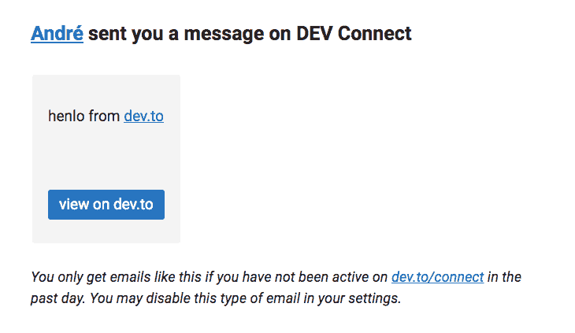
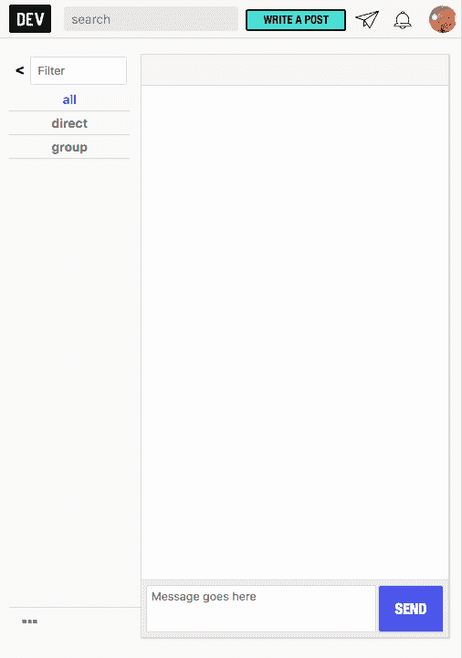
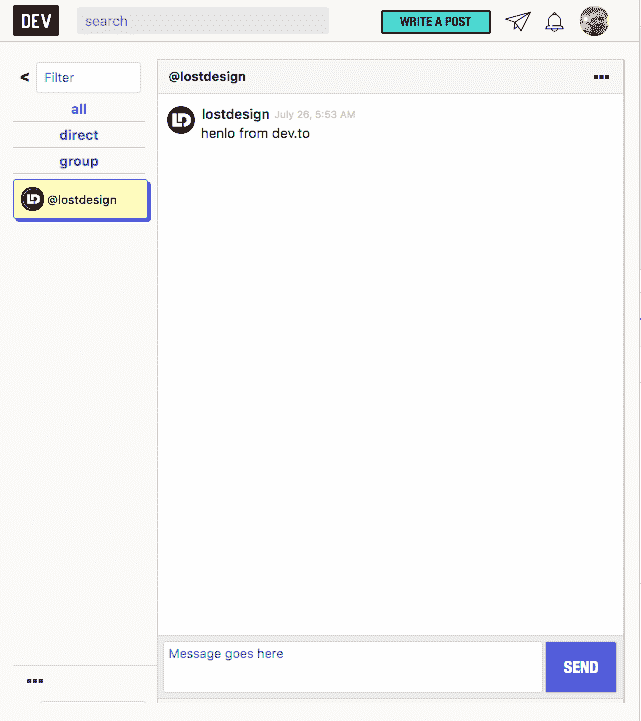
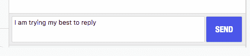
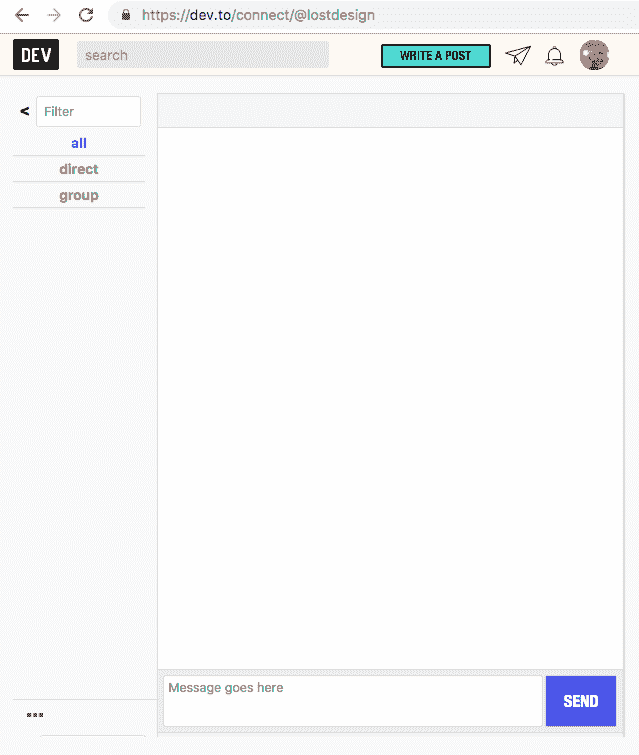
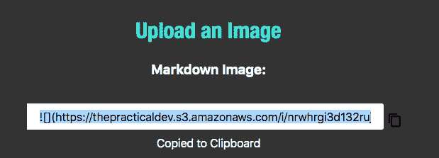

# 开发到消息不正确(暂时)

> 原文：<https://dev.to/jacobmparis/dev-to-messages-are-bad-27he>

这可能是一次暂时的停电造成了暂时的愤怒。它现在工作，所以请忽略原来的职位

# 原帖

今天我收到了一个开发者给我的第一条消息。我甚至不知道这是一个功能！

酷，我们去看看。我从不点击电子邮件中的链接，所以我在浏览器中导航到`dev.to`。我有 3 个通知，但纸飞机上没有小图标，我认为这意味着信息，因为纸飞机是一种常见的交流形式。其他人都用来代表邮件的信封只是用来娱乐孩子们的手工玩具。

我点击纸飞机，收到一个空收件箱

这里没有留言吗？所以图标是正确的！但后来我的邮件是骗子。

我刷新页面。还是一无所获。他删除信息了吗？一旦发出，它们能被编辑吗？谁知道呢！

我点击已经高亮显示的`all`，终于可以看到我的新消息了。我的一天不再被毁了。

完美，该回复了。我输入一个响应，点击发送，annnndddd——没有任何反应！

我点击发送了十几次。我切换到输入，然后切换到按钮，并在任一键上按 Enter。还是一无所获。但也许这只是一个用户界面更新的问题，它只是在幕后发送。我刷新页面进行检查。

去他的，我要走了

# PS:

标签为 [@lostdesign](https://dev.to/lostdesign) ，因为是他的信息激发了这篇文章，他的错别字将永垂不朽

## [安德烈](/lostdesign) <button name="button" type="button" data-info="{&quot;id&quot;:38606,&quot;className&quot;:&quot;User&quot;,&quot;style&quot;:&quot;full&quot;}" class="crayons-btn follow-action-button whitespace-nowrap  follow-user">跟随</button>

[coding my website since 2014](/lostdesign)

在写这篇文章的时候，我需要嵌入一些图片，所以我使用了 Dev.to 的图片上传功能。我上传了一张图片，收到了两个漂亮的链接，这样我就可以把它嵌入到帖子里了。

我点击一个，它告诉我它复制到剪贴板。你知道，像个骗子。

在我尝试粘贴链接后，我不得不返回并上传同一张图片的第二个副本来获得一个新的链接。从此以后，在它高亮显示链接并告诉我是复制的之后，我就自己复制了。

就像他们说的:如果你想把事情做好，就自己去做。