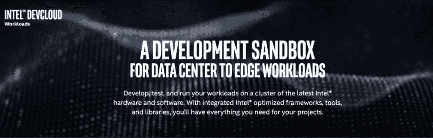
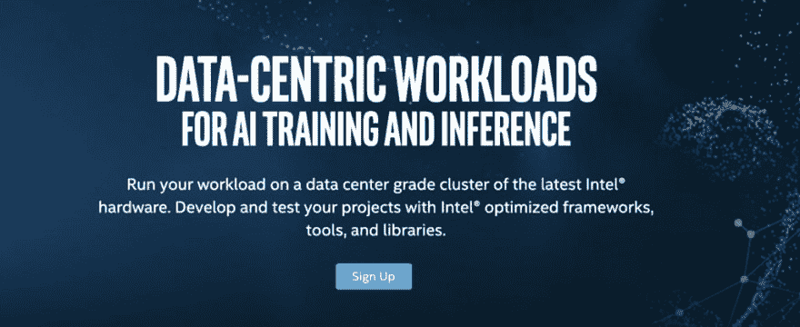
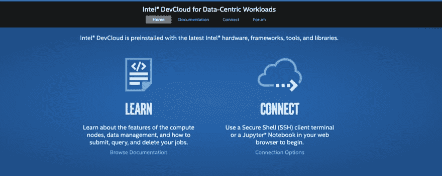

# 英特尔开发云入门

> 原文：<https://dev.to/4notfour/getting-started-with-intel-devcloud-2481>

#### **什么是英特尔 DevCloud？**

顾名思义，intel DevCloud 是英特尔提供的云服务！但是你们大多数人可能已经知道了。但在这里，我将简要介绍一下 DevCloud 的优势，以及如何设置您的 DevCloud 帐户和如何充分利用它。

系统环境设置是一个项目最没意思的部分之一！不管你设置了多少，你肯定会有一些错误。但是，如果你能得到已经设置好的东西，而你又不需要做那些没有用的东西，你为什么还要担心呢？

当你开始做某件事情时，你真的很沮丧，每一个致力于 AI/ML 项目的极客都至少会遇到一次，他/她可能会因为包丢失问题或硬件支持不足的问题而停滞不前！

有了 DevCloud，您可以忘记这一切，挑战自己的极限。

你得到了什么？

*   最新的英特尔硬件
*   英特尔优化框架
*   工具和库
*   200 GB 的文件存储
*   192 GB 内存
*   内置人工智能加速的最新英特尔至强可扩展处理器
*   英特尔 FPGAs
*   英特尔 Optane DC 永久存储器
*   TensorFlow*
*   面向咖啡的英特尔优化*
*   面向 PyTorch*的英特尔优化
*   MXNet*
*   PaddlePaddle*
*   英特尔 Parallel Studio XE 集群版
*   英特尔发布 OpenVINO 工具包
*   英特尔深度学习部署工具
*   30 天免费访问(可延期)

#### **我最喜欢什么？**

让我来指出一些我在工作中发现非常有用的 Devcloud 用法！

1.  Linux 作为操作系统

是的，我确实喜欢使用 Linux，和你们大多数人一样，Ubuntu 是我的最爱。所以是的，我真的可以在 DevCloud 里面玩，因为我已经熟悉了 ubuntu，无论我在我的系统里做什么，我都可以用 DevCloud 来提升它！

1.  预加载的数据集

英特尔 DevCloud 预装了各种免费的公共数据集，如下所示

*   城市大学
*   智能电表
*   BoxCar 数据集
*   Udacity 自动驾驶汽车
*   物体检测识别
*   英国智能电表

1.  从我的终端工作

你没听错！我可以用自己的终端工作。在网络连接良好的情况下，我几乎忘记我正在使用 DevCloud。

这是我更喜欢 DevlCloud 的主要原因之一。在 ssh 的帮助下，您可以通过本机终端轻松连接到 DevCloud，只需启动您的系统。

如果你想复制数据，这是再简单不过的事情了..所以没什么好担心的！

这是从你的终端完全控制。我唯一感到恼火的是，如果长时间保持终端空闲，终端会断开连接！但是我可以取回我的作品，因为我在云上的系统不睡觉！

1.  易于访问和扩展！

一切越简单越好！没有让你生气的多余步骤。如果你有一个好的项目，那就毫不紧张地开始使用 DevCloud。

1.  工作的可携带性

我确实在多个系统上工作，有了 DevCloud，我可以轻松地在我的任何系统上继续工作！无论我是使用大学实验室的桌面系统，还是带着我最喜欢的笔记本电脑呆在家里，我都可以轻松连接到我的 Devcloud 帐户，从我离开的地方继续我的工作！

1.  展示我的作品

一直扛着膝盖展示作品真麻烦！你永远不知道什么时候你必须实现或向别人展示你的工作！即使我在我的 [*Github Repo*](https://github.com/murshid440) 中有我的代码，得到一个满足我所有环境需求的系统也是不现实的，而且设置运行起来也是一团糟。有了 DevCloud，我可以轻松地开始工作。

**现在，让我给出一个简单的循序渐进的过程，让您开始使用 DevCloud。**

> **如何获得 DevCloud 权限？**

第一步:去这个 _*[_ link*]([https://software . Intel . com/en-us/dev cloud/data center)_。_](https://software.intel.com/en-us/devcloud/datacenter)_._)

<figure> 

<figcaption>报名</figcaption>

</figure>

第二步:点击注册

第三步:填写你的详细资料。

现在休息一下，等待有好消息的邮件！通常最长需要 24 小时才能进入！是的，这基本上是一个 3 步的过程！

提示:-创建一个 [*Devmesh 配置文件*](https://devmesh.intel.com/) ，并在 Devmesh 中上传您的项目详细信息，以更快更轻松地获得您的 Devcloud！

> 如何连接到 DevCloud？

第一步:-现在你已经得到了带有你的访问密钥的邮件和到你的云的链接。点击您的邮件 id 中的个人登录 Url，您将看到如下所示的屏幕

<figure> 

<figcaption>您的 DevCloud 门户将类似于此</figcaption>

</figure>

第 2 步:-想要深入了解文档，只需浏览文档(推荐)或者只需点击*连接选项*进行探索！

第 3 步:-一旦你点击连接选项，你会得到下面的屏幕:-

<figure> 

<figcaption>连接选项</figcaption>

</figure>

现在你有你的选择了！正如我前面提到的，连接终端或者 Jupyter 笔记本！

*要连接终端:-根据您的操作系统点击链接，然后按照屏幕上的指示操作即可！*

*连接 Jupyter 笔记本:-不要理会网址，只需点击一键登录即可运行您的笔记本！*

万岁！是的，再走 3 步，你就可以连接到你的 DevCloud 了。

> 我该如何使用 DevCloud？

现在舞台已经搭好，下一步是什么？探索并做你能做的，找出 DevCloud 的极限！

出错了还是卡住了？那么很有可能你在错误本身中找到了解决方案。只要看两遍，照着它说的做；故障排除技巧真的很棒！或者直接跳到这个 [*论坛*](https://forums.intel.com/s/topic/0TO0P00000018NNWAY/intel-ai-developer-forum?language=en_US) 来得到你的答案！

* * *