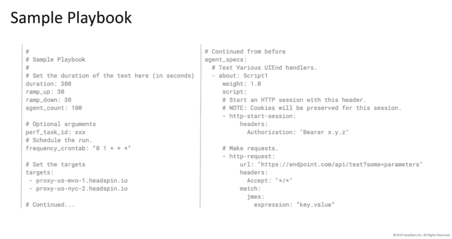

# 启动应用程序前进行负载测试

> 原文：<https://dev.to/headspin_io/load-testing-before-launching-apps-3eb9>

我们都经历过参差不齐的互联网和滞后的网页。很沮丧，对吧？毫无疑问，这样的问题大大恶化了用户体验。负载测试有助于改善客户的应用程序开发和用户的应用程序体验。HeadSpin 的软件开发人员 Aaron Gibson 讨论了负载测试的好处，描述了 HeadSpin 如何支持这种功能，并对我们的平台进行了演示。这是摘要，在这篇文章的底部是一个详细的网上研讨会！

那么，**为什么要进行负载测试呢？**通常，开发人员会进行单元、集成和冒烟测试，这些测试对于验证应用程序的功能和行为都很重要。然而，当实际部署应用程序时，很少有开发人员考虑多个用户同时访问系统的影响。

当这种情况发生时，服务器可能因为停滞不前而无法满足每秒如此多的请求，或者由于连接中断而无法快速响应，这在移动应用程序环境中很常见。

在 HeadSpin，我们关心服务器负载如何影响用户体验。我们的平台支持从许多目标运行测试，使开发人员能够精确地、大规模地测试负载测试指标。简而言之，我们可以在任何有 p 盒的地方繁殖目标。此外，我们还支持安排多个测试同时运行(在下面的网上研讨会演示中有更多相关信息)。

要使用 HeadSpin 进行负载测试，首先要创建一个剧本(在 HeadSpin 中，剧本是一个具有不同参数的 YAML 文件，允许您指定目标、代理数量、持续时间、Crontab 格式和时间表、性能任务 ID 以及其他因素)。很简单:上传剧本，然后执行测试。我们的平台也可以协助这个过程中的 UI 设置。下面是一个行动手册示例:

[点击此链接](https://www.headspin.io/blog/load-testing-before-launching-apps?utm_source=dev.to&utm_medium=referral&utm_campaign=rss)查看关于预发布负载测试的完整网络研讨会(后附文字稿),其中充满了负载测试的优势，以及关于创建行动手册和运行实际测试的演示。