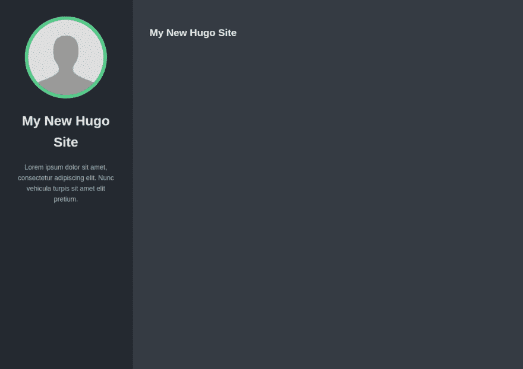

# 与 Hugo 一起建立个人投资组合网站

> 原文：<https://dev.to/l04db4l4nc3r/building-a-personal-portfolio-website-with-hugo-5c8l>

**简介**

个人投资组合总是很有趣。无论是在你的同事中炫耀还是在招聘中脱颖而出。每个人都想有一个，但没有人想为它写无聊的 HTML。你猜怎么着，现在你可以像在 GitHub 上写你的`README` s 一样，在 [markdown](https://www.markdownguide.org/) 制作你自己的作品集。

Hugo 是世界上最快的网站建设框架，它提供了以下功能，让你以极快的速度和流畅的操作建立自己的网站。Hugo 提供以下功能:

*   快速重新加载，在网上实时更改
*   大量的主题和模板
*   多语言支持
*   静态站点生成器
*   毫秒构建时间

**安装**

要开始，请确保您安装了 [Go](https://golang.org/dl/) 。要安装 Hugo，请参考[这个](https://gohugo.io/getting-started/installing)..Hugo 提供了一个非常易于使用的多操作系统命令行界面来与其底层功能进行交互。

**入门**

要使用 Hugo 创建一个新网站，只需在命令行上运行以下命令。

```
 $ hugo new site mysite  
$ cd mysite  
$ git clone https://github.com/vaga/hugo-theme-m10c.git themes/m10c

# Directory structure of the project
$ tree mysite

mysite  
├── archetypes  
│   └── default.md  
├── config.toml  
├── content  
├── data  
├── layouts  
├── static  
└── themes  
    └── m10c

7 directories, 2 files 
```

<svg width="20px" height="20px" viewBox="0 0 24 24" class="highlight-action crayons-icon highlight-action--fullscreen-on"><title>Enter fullscreen mode</title></svg> <svg width="20px" height="20px" viewBox="0 0 24 24" class="highlight-action crayons-icon highlight-action--fullscreen-off"><title>Exit fullscreen mode</title></svg>

你可以在[这里](https://themes.gohugo.io/)看看雨果的一些伟大主题。在本教程中，我们将使用 [m10c](https://github.com/vaga/hugo-theme-m10c) 主题。

在 **config.toml** 的末尾添加`theme = "m10c"`。您可以通过键入:
来启动 hugo 服务器

```
 $ hugo server -D 
```

<svg width="20px" height="20px" viewBox="0 0 24 24" class="highlight-action crayons-icon highlight-action--fullscreen-on"><title>Enter fullscreen mode</title></svg> <svg width="20px" height="20px" viewBox="0 0 24 24" class="highlight-action crayons-icon highlight-action--fullscreen-off"><title>Exit fullscreen mode</title></svg>

转到`localhost:1313`，您将能够看到以下内容:

[](https://res.cloudinary.com/practicaldev/image/fetch/s--02ffuljP--/c_limit%2Cf_auto%2Cfl_progressive%2Cq_auto%2Cw_880/https://thepracticaldev.s3.amazonaws.com/i/naoqabqt0aio91acx9v8.png)

现在，要将社交链接添加到您的投资组合中，您可以看看**my site/themes/m10c/example site/config . toml .**这是一个向您自己的 *config.toml.* 添加不同组件的示例，您可以将社交登录链接添加到您自己的配置中。将参数复制到我们自己的 *config.toml* ，现在看起来是这样的: