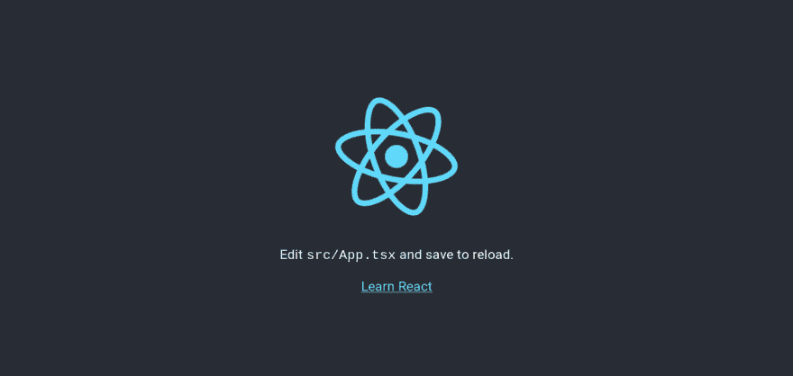

# 将您的 Django + React.js 应用程序部署到 Heroku

> 原文：<https://dev.to/shakib609/deploy-your-django-react-js-app-to-heroku-2bck>

如今，在大多数情况下，我们看到有一个后端提供一个 API 和各种前端技术，如[反应](https://reactjs.org)、 [Vue](https://vuejs.org) ，移动应用程序使用这个 API 端点向用户提供用户界面。随着像 [React](https://reactjs.org) 、 [Vue](https://vuejs.org) 、 [Angular](https://angular.io/) 等伟大的 JavaScript 框架的流行，这种开发方法变得越来越流行。

主要有两种方法可以部署这种 web 应用程序:

*   **分离后端和前端:**在这种方法中，你分别为你的后端和前端应用提供服务，它们通过各自的 URIs 相互连接。这种方法的一个主要缺点是你必须自己配置`CORS`。如果你不知道`CORS`，你可以在这里了解更多[。](https://en.wikipedia.org/wiki/Cross-origin_resource_sharing)
*   **从同一个主机提供服务:**在这种方法中，你将从同一个 URI 提供应用程序，因此它消除了`CORS`开销。此外，它使得维护中小型应用程序变得更加容易。你不希望为一些简单的网站，如博客、待办事项等创建两个独立的存储库。

# 概述

我将向你展示我如何将我的 Django 应用程序与我的 React.js 前端集成在一起。我们将遵循以下步骤:

*   用`create-react-app`生成一个 React app
*   创建 virtualenv 并安装必要的依赖项
*   在我们的 React 应用中生成一个 django 项目
*   更新两个应用程序设置
*   部署到 Heroku

本教程中显示的代码示例可从[这里](https://github.com/shakib609/django-react-boilerplate)获得。

# 设置

我在下面列出了我正在使用的技术堆栈，以防万一:

*   节点 11.15.0
*   Python 3.7.3
*   yarn 1.17.3(节点包管理器)
*   诗歌 0.12.16 (Python 包管理器)

附言 [**诗歌**](https://poetry.eustace.io) 对于 Python 社区来说是相当新的。这使得 python 项目的依赖管理更加方便。此外，与`pipenv`类似，它为您处理 virtualenv。你可以使用这个或者只使用`pip`、`pipenv`或者任何你喜欢的其他解决方案。

# 生成 React App

首先，我们必须生成 react 应用程序，它将作为我们的前端。对于本教程，我将这个项目命名为`django-react-boilerplate`。换成你喜欢的。让我们创建我们的 react 应用程序。在这里，我正在生成一个使用**类型脚本**的 react 应用程序。您可以忽略它，只需从上面的命令中省略掉`--typescript`部分。运行下面的命令来生成你的 React 应用:

```
$ yarn create react-app django-react-boilerplate --typescript 
```

Enter fullscreen mode Exit fullscreen mode

上面的命令将创建一个名为`django-react-boilerplate`的目录，它应该具有下面的结构。

```
django-react-boilerplate
├── node_modules
├── public
│   ├── index.html
│   ├── favicon.ico
│   └── manifest.json
├── src
│   ├── App.css
│   ├── App.test.tsx
│   ├── App.tsx
│   ├── index.css
│   ├── index.tsx
│   ├── logo.svg
│   ├── react-app-env.d.ts
│   └── serviceWorker.ts
├── package.json
├── tsconfig.json
└── yarn.lock 
```

Enter fullscreen mode Exit fullscreen mode

# 创建 Python 虚拟人

我会用**诗**来做到这一点。所以，如果你完全按部就班，你必须安装诗歌。你可以在这里得到[的指示。在您的情况下，您可以自由选择您喜欢的任何其他虚拟环境解决方案。首先，让我们将目录更改为生成的 react 应用程序。然后初始化诗歌。它会问你一些与项目相关的问题。您可以选择回答它们，否则将使用诗歌中的默认值。你也可以在安装你的应用程序的时候安装你的依赖项，但是我不会这样做。按照上面的说明，您的 shell 可能看起来像这样。](https://poetry.eustace.io/docs/#installation) 

```
$ cd django-react-boilerplate
$ poetry init

This command will guide you through creating your pyproject.toml config.

Package name [django-react-boilerplate]:
Version [0.1.0]:
Description []:
Author [Shakib Hossain <shakib609@gmail.com>, n to skip]:
License []:
Compatible Python versions [^3.7]:

Would you like to define your dependencies (require) interactively? (yes/no) [yes] no

Would you like to define your dev dependencies (require-dev) interactively (yes/no) [yes] no

Generated file

[tool.poetry]
...
...

Do you confirm generation? (yes/no) [yes] yes 
```

Enter fullscreen mode Exit fullscreen mode

在完成生成您的`pyproject.toml`文件之后。现在，您可以继续安装我们的项目所需的依赖项了。让我们安装它们:

```
$ poetry add django djangorestframework whitenoise gunicorn django-heroku 
```

Enter fullscreen mode Exit fullscreen mode

上面的命令将为您生成一个 virtualenv，并在其中安装所有的依赖项。

另外，如果你没有安装`postgresql`，你可能会在安装`django-heroku`时遇到问题。

# 生成 Django App

现在是时候生成我们的`django`应用了。我们必须首先启用我们的 virtualenv。如果你使用的是`poetry`，那就跟着做，否则就用你的解决方案激活 virtualenv。**诗歌**用户可以使用下面的命令激活他们的虚拟诗歌:

```
$ poetry shell 
```

Enter fullscreen mode Exit fullscreen mode

激活 shell 后，我们现在可以访问我们的`django` python 包和该包附带的脚本，如`django-admin`。让我们在`django-react-boilerplate`目录中生成我们的项目。我将我的后端项目命名为`backend`。你可以自由选择。运行下面的命令在当前目录下生成项目:

```
# Make sure you're inside the django-react-boilerplate directory
$ django-admin startproject backend . 
```

Enter fullscreen mode Exit fullscreen mode

在生成 django 项目之后，我们的项目结构将类似于下面这样。

```
├── backend
│   ├── __init__.py
│   ├── settings.py
│   ├── urls.py
│   └── wsgi.py
├── manage.py
├── package.json
├── Procfile
├── public
│   ├── index.html
│   ├── favicon.ico
│   └── manifest.json
├── pyproject.toml
├── README.md
├── src
│   ├── App.css
│   ├── App.test.tsx
│   ├── App.tsx
│   ├── index.css
│   ├── index.tsx
│   ├── logo.svg
│   ├── react-app-env.d.ts
│   └── serviceWorker.ts
├── tsconfig.json
└── yarn.lock 
```

Enter fullscreen mode Exit fullscreen mode

# 更新设置

我们要做的第一个改变是给我们的`package.json`添加一个`proxy`键。这将代理我们开发中的所有 API 请求。你可以在这里了解更多。将下面一行添加到您的`package.json`文件中。

```
{  ...  "proxy":  "http://localhost:8000"  } 
```

Enter fullscreen mode Exit fullscreen mode

之后，我们必须在`public`目录中创建一个名为`static`的目录。我们将把`public`目录的内容移动到这个新的`static`目录中，除了`index.html`文件。移动后的`public`目录应该是这样的。

```
public
├── index.html
└── static
    ├── favicon.ico
    └── manifest.json 
```

Enter fullscreen mode Exit fullscreen mode

我们必须移动这些文件，这样当我们通过执行`yarn build`构建我们的 React 应用程序时，我们将在一个`build/static`目录中获得这些文件，我们将使用这个目录作为我们的 Django 项目`STATIC_ROOT`。

现在，根据我们的目录结构，我们必须重构`public/index.html`文件。打开`public/index.html`文件，将`favicon.ico`和`manifest.json`网址更新为`/static/favicon.ico`和`/static/manifest.json`。

React 应用程序的所有配置都已完成。现在，我们必须配置 Django 项目。

我们主要有一个 HTML 文件要服务(React app 生成的 HTML 文件)。让我们在 django 应用程序中创建一个视图来服务这个 HTML 文件。我将使用通用模板视图来创建视图。在`backend`目录下创建一个`views.py`文件，并将下面的 python 代码添加到该文件中:

```
from django.views.generic import TemplateView
from django.views.decorators.cache import never_cache

# Serve Single Page Application index = never_cache(TemplateView.as_view(template_name='index.html')) 
```

Enter fullscreen mode Exit fullscreen mode

这里需要注意的一点是，我在初始化`index`视图时使用了`never_cache`装饰器。这位装潢师相当直率。这会将标头添加到响应中，这样它就永远不会被缓存。我们将从我们的 React 应用程序中生成我们的`index.html`文件，该文件可能会随时更改。这就是为什么我们不希望任何浏览器缓存过时的`index.html`文件。

我们已经写了`index`视图。现在让我们将它添加到`urls.py`中。我们将从我们的根 url 为`index.html`服务。现在打开你的`urls.py`，按照下面的代码更新:

```
from django.contrib import admin
from django.urls import path

from .views import index

urlpatterns = [
    path('', index, name='index'),
    path('admin/', admin.site.urls),
] 
```

Enter fullscreen mode Exit fullscreen mode

我们的大部分工作已经完成。现在我们要做的就是更新我们的`backend/settings.py`文件。在这里，我们将首先按照`django-heroku` [文档](https://devcenter.heroku.com/articles/django-app-configuration#settings-py-changes)中的指示做所有事情。应用这些更改后，我们的应用程序不会立即工作。我们必须进一步更新我们的`settings.py`文件以使其工作。首先，将`whitenoise`和`rest_framework`添加到你的`INSTALLED_APPS`中，如下图所示。你必须在`django.contrib.staticfiles`之前列出`whitenoise`。我们还必须在 Djangos `SecurityMiddleware`之后添加中间件`whitenoise`。

```
INSTALLED_APPS= [
    ...
    'whitenoise.runserver_nostatic',  # < As per whitenoise documentation
    'django.contrib.staticfiles',

    # 3rd party apps
    'rest_framework',
]

MIDDLEWARE = [
    'django.middleware.security.SecurityMiddleware',
    'whitenoise.middleware.WhiteNoiseMiddleware',  # Whitenoise Middleware
    ...
] 
```

Enter fullscreen mode Exit fullscreen mode

现在，我们必须更新我们的`TEMPLATES`设置，这样我们的 django 应用程序就可以找到我们在`backend/views.py`文件中引用的`index.html`。您也可以在这里添加您想要包含的其他目录。

```
TEMPLATES = [
    {
        'BACKEND':
        'django.template.backends.django.DjangoTemplates',
        'DIRS':
        [os.path.join(BASE_DIR, 'build')]
        ...
    }
] 
```

Enter fullscreen mode Exit fullscreen mode

差不多准备好了！我们必须更新我们的`STATIC`文件相关设置，并将它们移动到`backend/settings.py`文件的底部。更新你的`settings.py`文件如下:

```
# Import django_heroku module at the top of your settings.py file import django_heroku

...
...

# Configure app for Heroku deployment django_heroku.settings(locals())

# Static files (CSS, JavaScript, Images)
# https://docs.djangoproject.com/en/2.1/howto/static-files/ STATIC_URL = '/static/'
# Place static in the same location as webpack build files STATIC_ROOT = os.path.join(BASE_DIR, 'build', 'static')
STATICFILES_DIRS = []

# If you want to serve user uploaded files add these settings MEDIA_URL = '/media/'
MEDIA_ROOT = os.path.join(BASE_DIR, 'build', 'media')

STATICFILES_STORAGE = 'whitenoise.storage.CompressedManifestStaticFilesStorage' 
```

Enter fullscreen mode Exit fullscreen mode

# 测试我们的设置

我们现在准备测试我们的应用程序。在这种设置中，我们必须记住几件事:

*   更新前端后，请始终运行`yarn build`
*   在开发时，您必须分别运行`react`服务器和`django`服务器，以利用这些服务器内置的热重装功能。

现在，运行下面的命令来测试我们的应用程序是否正确地提供文件。

```
$ yarn build
$ poetry shell
$ python manage.py runserver 
```

Enter fullscreen mode Exit fullscreen mode

打开您首选的浏览器并导航至`localhost:8000`。您应该会看到默认的 React 应用程序。

[](https://res.cloudinary.com/practicaldev/image/fetch/s--wtbMr-9n--/c_limit%2Cf_auto%2Cfl_progressive%2Cq_auto%2Cw_880/https://thepracticaldev.s3.amazonaws.com/i/v1rv8b4h9kpfg39lty5h.png) 。

# 为 Heroku 部署做准备

首先，让我们用下面的命令创建我们的`heroku`应用程序(确保你已经安装了`heroku-cli`:

```
$ heroku create drt-boilerplate 
```

Enter fullscreen mode Exit fullscreen mode

将`nodejs`和`python`构建包和`postgresql`插件添加到我们的应用程序中。

```
$ heroku buildpacks:add --index 1 heroku/nodejs
$ heroku buildpacks:add --index 2 heroku/python
$ heroku addons:create heroku-postgresql:hobby-dev 
```

Enter fullscreen mode Exit fullscreen mode

创建`Procfile` :

```
release: python manage.py migrate
web: gunicorn backend.wsgi --log-file - 
```

Enter fullscreen mode Exit fullscreen mode

这里，`release`选项确保在每次部署后运行 django 迁移。而`web`选项使用`gunicorn` HTTP 服务器为您的 django 应用程序提供服务。

您必须为`heroku`部署生成一个`requirements.txt`文件。所以，别忘了这么做。

```
$ poetry export -f requirements.txt --output requirements.txt 
```

Enter fullscreen mode Exit fullscreen mode

我们准备推出我们应用的第一个版本。创建一个 git 存储库并提交。之后，通过运行下面的命令将文件推送到 heroku:

```
$ git push heroku master 
```

Enter fullscreen mode Exit fullscreen mode

这将触发一个部署并向您显示您的部署进度。成功部署后，它会显示你的应用程序的网址。在我的例子中，网址是[https://drt-boilerplate.herokuapp.com/](https://drt-boilerplate.herokuapp.com/)。现在，为自己完成了这件事而沾沾自喜。😀

本文首发[此处](https://www.shakib609.gq/deploy-your-django-react-app-to-heroku)。