# 反应中的 CLI

> 原文：<https://dev.to/aziziyazit/cli-in-react-4aik>

## React 和 CLI

React 有自己的 CLI，但目前他们只支持创建一个应用程序(create-react-app)。create-react-app 用于通过命令行生成 react 应用程序的样板版本。

```
npx create-react-app my-app 
```

Enter fullscreen mode Exit fullscreen mode

> create-react-app 负责设置应用程序的主要结构以及一些开发人员设置。您所看到的大部分内容对您的 web 应用程序的访问者来说是不可见的。React 使用一个名为 webpack 的工具，将这里的目录和文件转换成静态资产。你的站点的访问者被提供这些静态资产。
> ~ codecademy.com

您或您的团队创建的每个 React 应用程序都具有相同的结构，这对于跨应用程序的一致性非常重要。

然而，UI 开发不仅仅是应用程序，还包括组件、模块和页面的开发。开发人员应该知道什么需要通过看设计师提供的线框开发。

[](https://res.cloudinary.com/practicaldev/image/fetch/s--izA25qG0--/c_limit%2Cf_auto%2Cfl_progressive%2Cq_auto%2Cw_880/https://thepracticaldev.s3.amazonaws.com/i/8jnjmmqc8c7xlhnnduog.png)

如果没有已定义的结构，您的应用程序中就会有各种结构的混合体

### 开发 1

*   仪表板页面
*   标题组件
*   卡片组件
*   图形组件

### 开发 2

*   仪表板页面
*   标题模块(搜索组件、图标组件和下拉组件的容器)
*   统计模块(1 种卡组件的容器)
*   多变体卡复合组件

### 开发 3

*   管理页面

如果 3 个开发人员在同一个项目上工作，你可能会在项目中使用 3 种不同的结构，呸！

用于生成样板文件(组件、模块和页面)的 CLI 将增加提供一致结构的好处。

让我们从设置 CLI 工具(plopJS)开始

## 1。设置 CLI

我们通过命令行使用 [plopJS](https://plopjs.com/) ，微生成器框架。plopJS 模板使用强大的模板引擎，名为[手柄](https://handlebarsjs.com/)。[手柄](https://handlebarsjs.com/)提供了让你有效构建语义模板所必需的能力。

### 步骤

*   将 plopJS 添加到 package.json 中

```
"devDependencies":  {  "plop":  "^2.3.0"  } 
```

Enter fullscreen mode Exit fullscreen mode

并运行:

```
npm install 
```

Enter fullscreen mode Exit fullscreen mode

## 2。定义结构

### 页面

模块的容器。[页面](https://dev.to/aziziyazit/create-page-in-react-1mj6)管理内部模块之间的通信。

```
<Page>
 <ModuleA />
 <ModuleB />
</Page> 
```

Enter fullscreen mode Exit fullscreen mode

### 模块

组件的容器。[模块](https://dev.to/aziziyazit/create-module-in-react-5gg)管理内部组件之间的通信。

```
<Module>
 <ComponentA />
 <ComponentB />
</Module> 
```

Enter fullscreen mode Exit fullscreen mode

### 组件

模块的功能。

```
<ComponentA>
 <section>
  <article>
   Article
  </article>
 </section>
</ComponentA> 
```

Enter fullscreen mode Exit fullscreen mode

## 3。创建 plopfile 配置

*   创建“plopfile.js”在与 package.json 相同的路径中创建 plopfile.js。

```
module.exports = function (plop) {

    plop.setGenerator('component', {...})

    plop.setGenerator('module', {...})

    plop.setGenerator('page', {...})

}; 
```

Enter fullscreen mode Exit fullscreen mode

在这篇教程/文章中，我们将为组件创建生成器。完整的发电机可以在[这里](https://github.com/abumuawiyah/react-boilerplate)找到

#### 模板

*   脚本文件
    [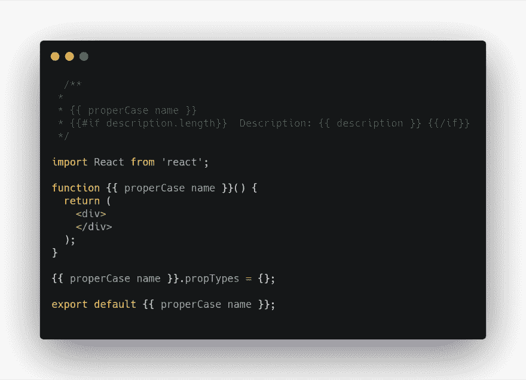T3】](https://res.cloudinary.com/practicaldev/image/fetch/s--2pCJ8RMF--/c_limit%2Cf_auto%2Cfl_progressive%2Cq_auto%2Cw_880/https://thepracticaldev.s3.amazonaws.com/i/r27fotam79n9hsb5gra4.png)

*   测试文件
    [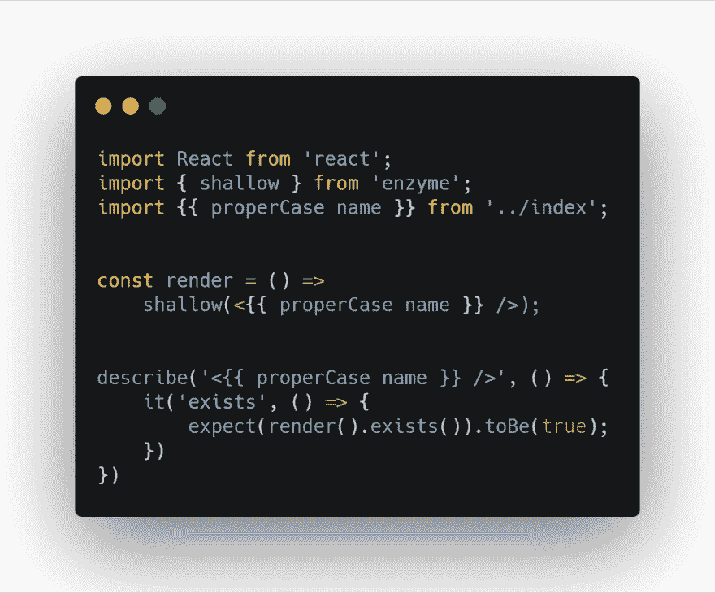](https://res.cloudinary.com/practicaldev/image/fetch/s--7PmSDfv9--/c_limit%2Cf_auto%2Cfl_progressive%2Cq_auto%2Cw_880/https://thepracticaldev.s3.amazonaws.com/i/x2uujs7p0ixzyds82as9.png)

*   样式文件
    [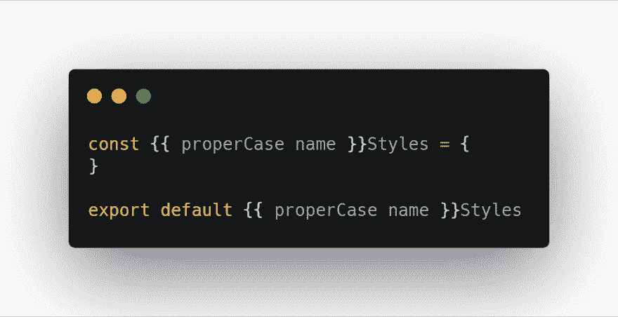](https://res.cloudinary.com/practicaldev/image/fetch/s--MZd0fjul--/c_limit%2Cf_auto%2Cfl_progressive%2Cq_auto%2Cw_880/https://thepracticaldev.s3.amazonaws.com/i/kepuy300a41w40mn75sh.png)

*   和索引文件
    [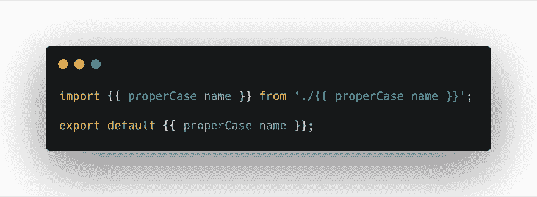](https://res.cloudinary.com/practicaldev/image/fetch/s---FiV5Om5--/c_limit%2Cf_auto%2Cfl_progressive%2Cq_auto%2Cw_880/https://thepracticaldev.s3.amazonaws.com/i/4hv6xoqk5hygfei1usns.png)

> 将所有模板保存在文件夹中

## 4。创建一个生成器

根据通知，我们将只显示组件的生成器。

[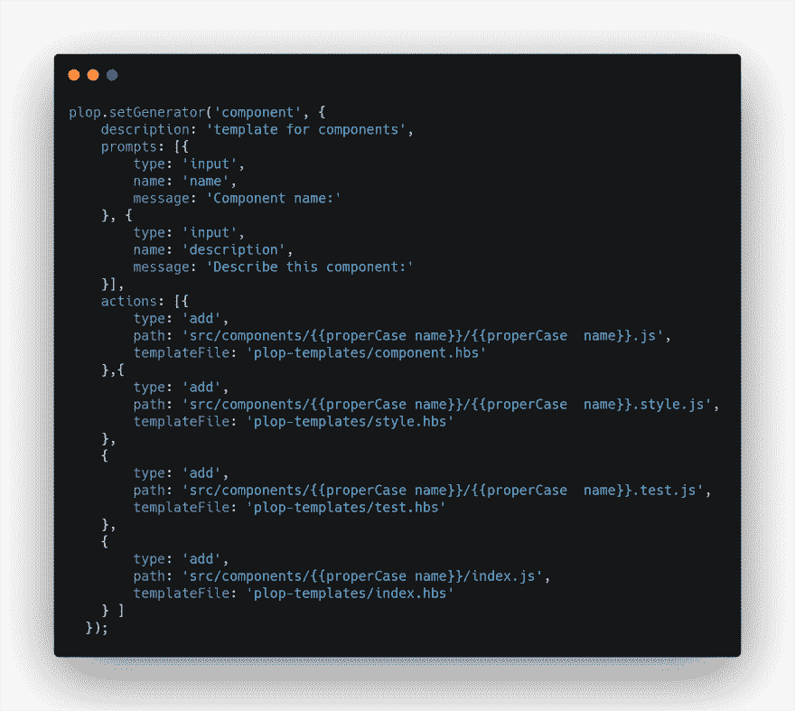](https://res.cloudinary.com/practicaldev/image/fetch/s--yLhF79xV--/c_limit%2Cf_auto%2Cfl_progressive%2Cq_auto%2Cw_880/https://thepracticaldev.s3.amazonaws.com/i/ccfwzpvste3l6j5hwi4a.png)

一切似乎都准备好了，让我们测试发电机。

> 我添加了新的 npm 任务“cmd ”,它将运行“npx 扑通”。如果以上设置正确，您将看到可供选择的生成器列表

[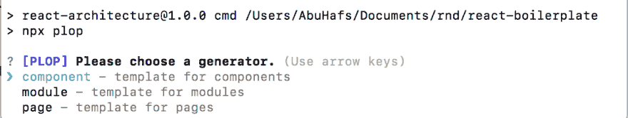](https://res.cloudinary.com/practicaldev/image/fetch/s--Q7gwutP1--/c_limit%2Cf_auto%2Cfl_progressive%2Cq_auto%2Cw_880/https://thepracticaldev.s3.amazonaws.com/i/mgjhbmr7cbdp0k3gvif2.png)

开始回答问题，一旦完成，您会看到组件已经生成

[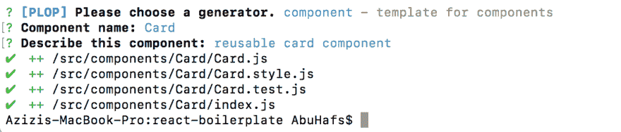](https://res.cloudinary.com/practicaldev/image/fetch/s--tJGXAVmP--/c_limit%2Cf_auto%2Cfl_progressive%2Cq_auto%2Cw_880/https://thepracticaldev.s3.amazonaws.com/i/9pnd4lc7hrrslvwvw8mp.png)

让我们来看看生成了什么:

*   Card.js
    [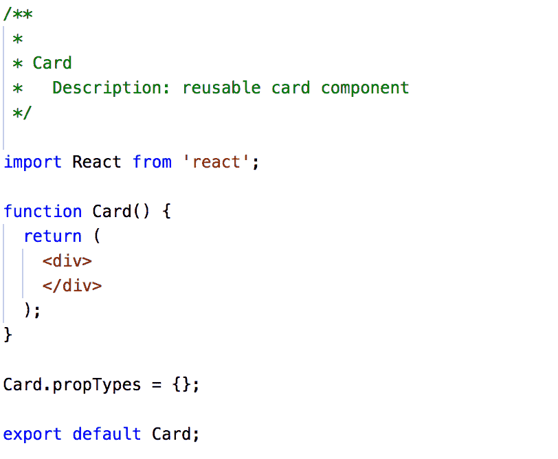](https://res.cloudinary.com/practicaldev/image/fetch/s--yeAdhZ64--/c_limit%2Cf_auto%2Cfl_progressive%2Cq_auto%2Cw_880/https://thepracticaldev.s3.amazonaws.com/i/duximoeepd4gx7dbbsts.png)

*   [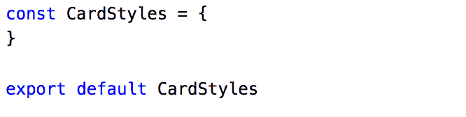](https://res.cloudinary.com/practicaldev/image/fetch/s--5FMbl4dV--/c_limit%2Cf_auto%2Cfl_progressive%2Cq_auto%2Cw_880/https://thepracticaldev.s3.amazonaws.com/i/i388mt9a9f0ov98gxuig.png)

*   card . test . js
    [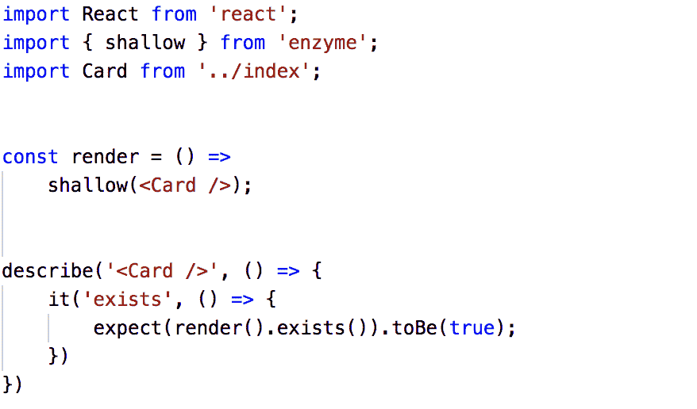T3】](https://res.cloudinary.com/practicaldev/image/fetch/s--feMVO3N---/c_limit%2Cf_auto%2Cfl_progressive%2Cq_auto%2Cw_880/https://thepracticaldev.s3.amazonaws.com/i/avulb267gnivlxw0e1c9.png)

*   index . js
    T1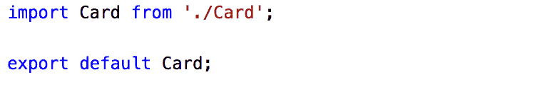T3】

## 总结

CLI 使创建遵循您和您的团队定义的最佳实践和结构的应用程序、页面、模块和组件变得容易。开发人员有其他事情要担心，通过自动化组件生成不仅节省了他们的时间，而且提高了效率。

你可以在这里下载完整的源代码。
[https://github.com/abumuawiyah/react-boilerplate](https://github.com/abumuawiyah/react-boilerplate)