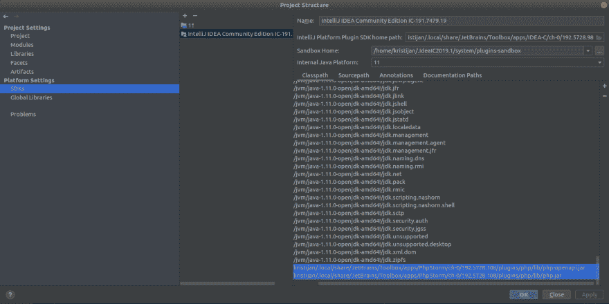
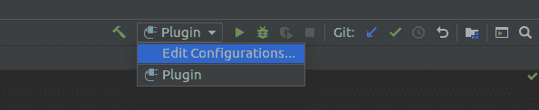
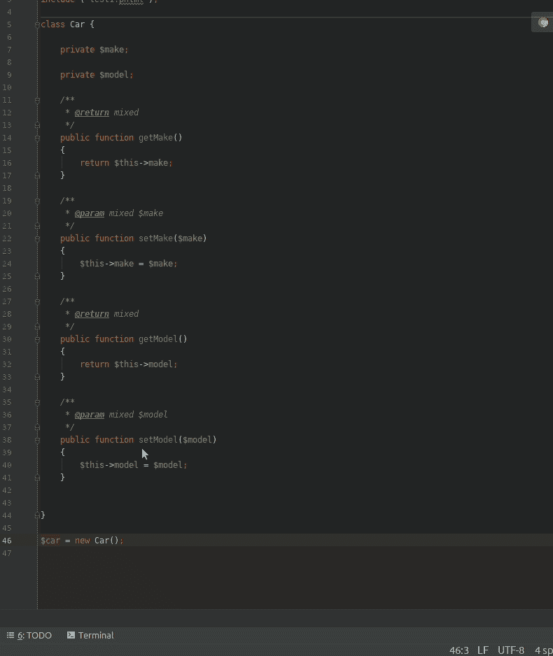

# 我写了一个 PHPStorm 插件

> 原文：<https://dev.to/kristijankanalas/i-wrote-a-phpstorm-plugin-1job>

很有可能你曾经因为 IDE 没有你需要的特性而感到沮丧，以至于你想为它写一个插件。如果没有这个插件，我们中的大多数人将永远不会完成这项工作。同样的事情也发生在我身上。几个月来，我一直有一个 PHPStorm 插件的想法，但是从来没有*找到*时间来写它。直到我不得不重复同样无聊的例行公事。
所以我写了一个 PHPStorm 插件。

## 问题

当你的类在某些情况下有 getters 和 setters 时，你需要像这样写:

```
$car = new Car();
$car->setMake('Audi');
$car->setModel('A6'); 
```

<svg width="20px" height="20px" viewBox="0 0 24 24" class="highlight-action crayons-icon highlight-action--fullscreen-on"><title>Enter fullscreen mode</title></svg> <svg width="20px" height="20px" viewBox="0 0 24 24" class="highlight-action crayons-icon highlight-action--fullscreen-off"><title>Exit fullscreen mode</title></svg>

借助 InteliJ 平台提供的一些自动完成功能，我可以很快完成这项工作。但是如果一个类有十几个你需要调用的 getters 或 setters 呢？
[T3】](https://i.giphy.com/media/LrGHJGtTbT7PO/giphy.gif)

## 想法

想法很简单，开发人员将插入符号放在`$car`变量上，通过按快捷键，为给定的对象生成所有的 getters 或 setters(取决于快捷键)。

## 编写插件

我真的很紧张，因为从学生时代起我就没碰过 java，但我决定就这么做。
T3T5】

### 先决条件

*   PHPStorm -包含`php-openapi.jar`和`php.jar`
*   InteliJ IDEA 社区版

### 设置

我遵循了 Jetbrains 的人写的设置，[为 PhpStorm 插件开发](https://confluence.jetbrains.com/display/PhpStorm/Setting-up+environment+for+PhpStorm+plugin+development)设置环境。如果你打算按照这个设置，确保当你配置 SDK 时，你添加了`php-openapi.jar`和`php.jar`，就像这样 [](https://res.cloudinary.com/practicaldev/image/fetch/s--mjMZ_Jr0--/c_limit%2Cf_auto%2Cfl_progressive%2Cq_auto%2Cw_880/https://i.imgur.com/EXwjbcg.png) 
不要和我犯同样的错误，没有看到警告不要在`Libraries`中设置它们。

### 调试器设置

默认情况下，当您单击调试按钮时，InteliJ 将安装并运行另一个 InteliJ 实例。它工作得非常好，但是我是为 PHPStorm 开发插件，而不是为 InteliJ。如果你正在开发一个 PHPStorm 插件，我已经到处寻找调试器设置，但是我什么也找不到。所以我不得不自己探索如何去做。
你可以在 JRE 字段中像这样进入编辑调试配置 [](https://res.cloudinary.com/practicaldev/image/fetch/s--mNmWngfe--/c_limit%2Cf_auto%2Cfl_progressive%2Cq_auto%2Cw_880/https://i.imgur.com/qAmhihc.png) 导航到你的 PHPStorm 的路径，瞧，现在它工作了。比我想象的要容易。

### 编码

我必须承认，我发现做任何事情都很难，文档非常少，我忘记了很多 java 规则和语法。不幸的是，我找不到一种方法来利用 PHPStorm 的力量并询问它；它对某个变量的了解。我剩下的唯一选择是使用 [PSI](https://www.jetbrains.org/intellij/sdk/docs/basics/architectural_overview/psi_files.html) 并尝试找出变量的声明在哪里以及它是什么类型。经过几个小时的反复试验，我终于成功了。

```
 static void generateMethods(AnActionEvent event, String typeOfMethod) {
        final Project project = event.getData(PlatformDataKeys.PROJECT);
        final Editor editor = event.getData(PlatformDataKeys.EDITOR);
        if (editor != null) {
            final CaretModel caret = editor.getCaretModel();
            PsiFile file = event.getData(LangDataKeys.PSI_FILE);
            if (file != null) {
                PsiElement selectedElement = file.findElementAt(caret.getOffset());
                if (selectedElement != null && selectedElement.getParent().getReference() != null) {
                    PsiElement variableDeclaration = selectedElement.getParent().getReference().resolve();                        
                    if (variableDeclaration != null) {
                        PsiElement assignmentExpression = variableDeclaration.getContext();
                        if (assignmentExpression != null) {
                            final Collection<PsiElement> selectedElementClass = new SmartList<>();
                            assignmentExpression.accept(new PsiRecursiveElementVisitor() {
                                @Override
                                public void visitElement(PsiElement element) {
                                    if (element instanceof ClassReferenceImpl) {
                                        if (element.getReference() != null) {
                                            selectedElementClass.add(element.getReference().resolve());
                                        }
                                    }
                                    super.visitElement(element);
                                }
                            });
                        }
                    }
                }
            }
        }
    } 
```

<svg width="20px" height="20px" viewBox="0 0 24 24" class="highlight-action crayons-icon highlight-action--fullscreen-on"><title>Enter fullscreen mode</title></svg> <svg width="20px" height="20px" viewBox="0 0 24 24" class="highlight-action crayons-icon highlight-action--fullscreen-off"><title>Exit fullscreen mode</title></svg>

相信我，我并不为这段代码感到自豪，我期待着尽快重写它。

现在唯一剩下的事情就是获取实例化类的 getters 和 setters，并将调用添加到编辑器中。我设法毫无问题地获得了一个类的方法。我原以为给编辑写信是所有任务中最容易的，结果我错了。我又一次不得不花几个小时来弄清楚如何去做，这是我能想到的最好的方法

```
Document document = editor.getDocument();
boolean firstMethodGeneration = true;
for(PsiElement initClass:selectedElementClass) {
    PhpClassImpl phpClass=(PhpClassImpl)initClass;
    for(Method method:phpClass.getMethods()) {
        String methodName=method.getName();

        // If method name has "set" on position 0 add it to editor
        if(methodName.indexOf(typeOfMethod)==0) {
            boolean FirstSetter=firstMethodGeneration;
            WriteCommandAction.runWriteCommandAction(project,()->{
                if(FirstSetter){
                    caret.moveToOffset(caret.getVisualLineEnd());
                    document.insertString(caret.getOffset(),"\n");
                }
                caret.moveToOffset(caret.getVisualLineEnd());
                document.insertString(caret.getOffset(),selectedElement.getText()
                +"->"+methodName+"();\n");
            });
        }
        firstMethodGeneration=false;
    }
} 
```

<svg width="20px" height="20px" viewBox="0 0 24 24" class="highlight-action crayons-icon highlight-action--fullscreen-on"><title>Enter fullscreen mode</title></svg> <svg width="20px" height="20px" viewBox="0 0 24 24" class="highlight-action crayons-icon highlight-action--fullscreen-off"><title>Exit fullscreen mode</title></svg>

## 最终结果

最后，我得到了一个非常有限的插件，它只能为同一个文件中实例化的变量生成 setters 或 getters。它不能从函数返回或类似的更高级的东西中确定变量类型。尽管如此，我仍然很高兴它的结果，我计划在未来使它更强大，并为插件添加更多的功能。
[](https://res.cloudinary.com/practicaldev/image/fetch/s--x59w0MGr--/c_limit%2Cf_auto%2Cfl_progressive%2Cq_66%2Cw_880/https://i.imgur.com/67fRtng.gif) 
如果你想看到更多的插件，请随时访问 GitHub 库。

##  [克里斯蒂安娜拉斯](https://github.com/KristijanKanalas)/[phpcodegenertorplus](https://github.com/KristijanKanalas/PHPCodeGeneratorPlus)

### PhpStorm 插件可以让你生成更多的 PHP 代码

<article class="markdown-body entry-content container-lg" itemprop="text">

# PHP 代码生成器+ [ ](https://camo.githubusercontent.com/3df9ff50455e2d3f6a1a1a3c436370a29f9f1c8d21ebfedf3582854bad672089/68747470733a2f2f696d672e736869656c64732e696f2f6a6574627261696e732f706c7567696e2f642f31323539302d7068702d636f64652d67656e657261746f722d2e737667) [ ](https://opensource.org/licenses/MIT)

PhpStorm 插件，可以让你生成更多的 PHP 代码。

插件提供以下功能:

*   为声明的变量的设置器生成调用(Shift +Ctrl + NUMPAD1)
*   为声明变量的 getters 生成调用(Shift +Ctrl + NUMPAD2)

| 钥匙 | 价值 |
| --- | --- |
| 插件 Url | [https://plugins . jetbrains . com/plugin/12590-PHP-code-generator-](https://plugins.jetbrains.com/plugin/12590-php-code-generator-) |
| 身份证明 | PHPCodeGenerator+ |

## 安装

*   转到`Settings -> Plugins -> Marketplace`安装插件，然后搜索`PHP code generator`

## 使用

把你的插入符号放在一个初始化的变量上，按下`ALT + Insert`，一个 PhpStorm 代码生成器菜单将会弹出，然后你可以选择`Get getters`或`Get setters`选项。动作也有快捷键`Shift + Ctrl + NUMPAD1`和`Shift + Ctrl + NUMPAD2`。

## 作者

*   Kristijan Kanalaš ( [kanalaskristijan@gmail.com](https://github.com/KristijanKanalas/PHPCodeGeneratorPlusmailto:kanalaskristijan@gmail.com) )

</article>

[View on GitHub](https://github.com/KristijanKanalas/PHPCodeGeneratorPlus)