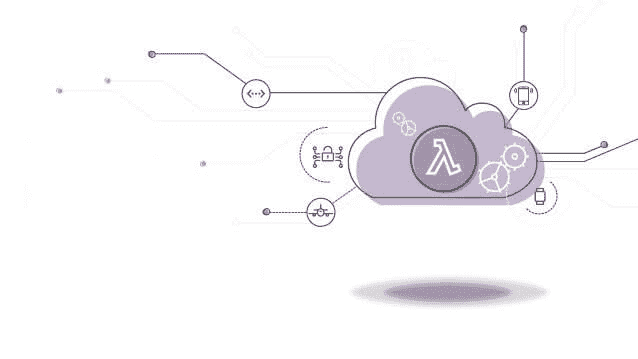

# 银河系无服务器指南- #2 -我们怎么到这里？

> 原文：<https://dev.to/collabcode/o-guia-dos-serverless-das-galaxias-como-chegamos-ate-aqui-15fg>

此时此刻，我想你无法抑制对编码无服务器应用程序的焦虑，我知道很容易激动(我们不会在这篇文章中编码)。了解我们是如何走到这一步的仍然很重要，这样我们就可以试着想象接下来会发生什么。

在 1960 年代，我们的愿景是让每个人都互相连接，并访问地球上任何地方的网站和数据。但我相信是在 90 年代互联网变得更受欢迎，网络技术开始成熟。

这就产生了托管这些网站的需求。[互联网服务提供商](https://pt.wikipedia.org/wiki/Fornecedor_de_acesso_%C3%A0_internet)通过提供基础设施和租赁共享资源以满足客户需求而迅速增长。

我们很快就进入了一个后来被全球称为‘t0’互联网泡沫’的现象，为了满足当时的需求，分布式托管策略应运而生，催生了全球数据中心。

这些数据中心通过提供有限的灵活性和多种资源来抽象托管环境。那时规模还是通过增加硬件来实现的。消费者的角色是管理他们的应用程序、签约操作系统、应用程序数据、存储、网络和硬件。

随着时间的推移，这种情况不断发展，这些数据中心已转变为名为 iaas(基础架构即服务】的基础架构平台，这是一些提供商的例子:[【Amazon web services(AWS)](https://aws.amazon.com/)、 [Microsoft Azure](https://azure.microsoft.com/pt-br/)

然后，这些供应商和其他供应商负责抽象基础架构组件、管理虚拟化(VM)、服务器、硬盘、存储和网络。不久，您的客户将负责管理应用程序、虚拟机堆栈和操作系统。

可通过分配更多虚拟机和基础架构资源来实现此模型的扩展。

没过多久，[platform-as-a-service]PAAs 就出现了，该模型在 IaaS 模型之上绽放出了一层新的抽象层，目的是为应用程序提供一个带有自助门户的云计算平台。提供者的例子有:[【Amazon web services(AWS)](https://aws.amazon.com/)、[【Microsoft azure】](https://azure.microsoft.com/pt-br/)、[【Google compute engine(GCE)](https://cloud.google.com/?hl=pt)、[【heroku】*、*](https://www.heroku.com) [Red](https://www.redhat.com/pt-br/technologies/cloud-computing/openshift)

PaaS 大大简化了基础架构管理，提高了可扩展性、高可用性和多位置性(其应用程序在世界各地运行)，并使供应商能够管理操作系统、虚拟机、服务器、存储和网络结构。消费者开始管理他们的应用程序。

一段时间后，容器(docker)到达，它抽象了虚拟机，减少了资源消耗，加快了应用程序启动速度。我们的应用程序现在可以跨所有操作系统移动，而且我们还推出了一种打包和分发环境设置的机制。

PaaS 供应商很快就开始使用容器来管理和协调客户的应用程序。

容器还负责利用微服务体系结构，方便封装和隔离可重复使用的功能组件。

so alguns examplos de provedores:[亚马逊网络服务(AWS)](https://aws.amazon.com/) ，[微软 Azure](https://azure.microsoft.com/pt-br/) ，[谷歌计算引擎(GCE)](https://cloud.google.com/?hl=pt) ， [Docker 数据中心](https://hub.docker.com)。

然后，提供程序管理容器、操作系统、服务器、存储和网络结构。同时消费者继续管理他们的应用程序。

2014 年，AWS 推出了一项名为[【AWS lambda】](https://aws.amazon.com/pt/lambda/)的服务，很多人认为这是[【FAAS】模式的诞生，但在 2006 年，一家名为 Zimki 的公司已经向我们展示了□当□](https://vertigo.com.br/o-que-e-faas-function-as-a-service-2/)

回到 2014 年[【AWS lambda】](https://aws.amazon.com/pt/lambda/)的诞生，再往前推进 2 年(2016 年)[【IBM 云功能】](https://www.ibm.com/br-pt/cloud/functions)、[【谷歌云功能】](https://cloud.google.com/functions/?hl=pt-br)、[【微软蓝云功能】](https://azure.microsoft.com/pt-br/services/functions/)和[【stack path】随着这么多新的供应商进入市场，只有上帝知道接下来会发生什么。](https://www.stackpath.com)

Serverless 模型通过使提供程序负责管理其客户端的整个代码执行环境，从而抽象了代码执行的方式。对消费者来说，管理应用程式码的责任依然存在。

* * *

## 完成…

如果你喜欢这个帖子，不要忘了给喜欢和分享

如果你想知道我在做什么，或者想问什么，请随时到社交网站来找我，比如@[【malakasdev】](https://twitter.com/malaquiasdev)。

为了多读我的帖子访问[【马拉喀什 DEV |生命，代码等】](http://malaquias.dev)。