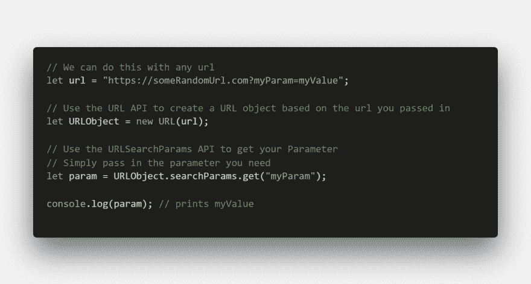
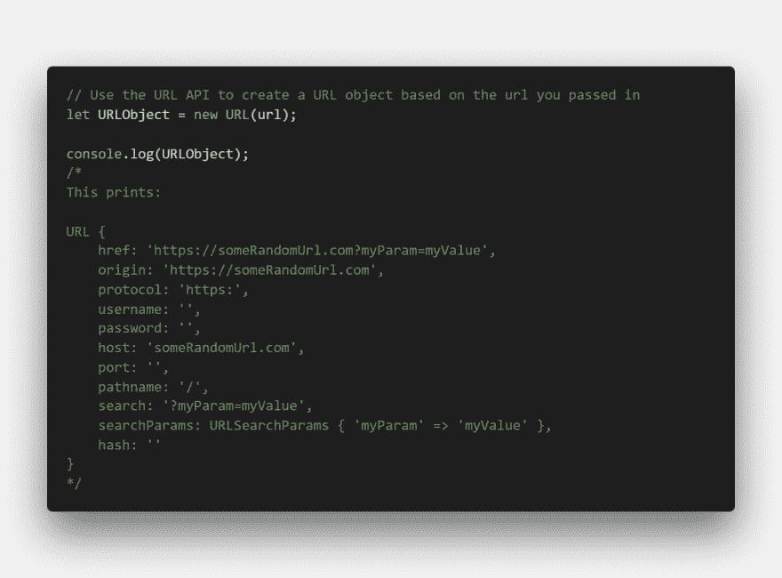
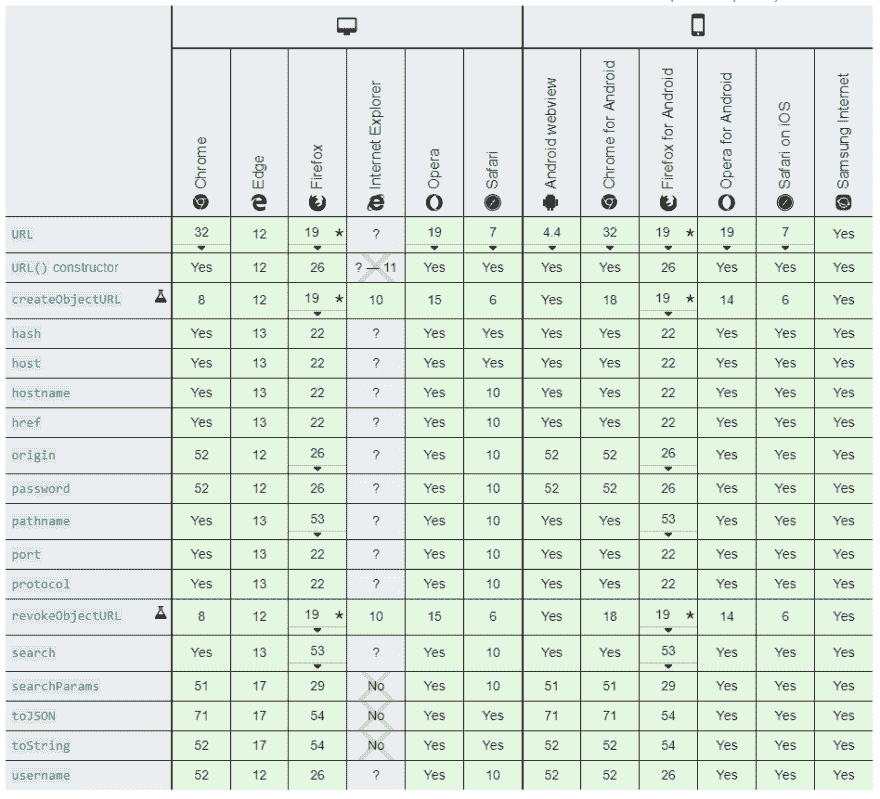

# 从 URL 获取参数的简单方法

> 原文：<https://dev.to/ma7eer/easy-way-to-get-parameters-from-a-url-ae5>

获取 Url 参数可能很棘手。我确信我不是唯一一个使用 google 搜索完美正则表达式来帮助从 Url 中提取参数的人。

而在这种情况下学习和掌握正则表达式可能是最好的。你可能没有时间去学习它们，只需要一个简洁易懂的补丁。

下面的代码展示了如何使用 URL API 轻松实现这一点

您可以通过查看下面的链接来了解更多关于这个 API 的细节:

[URL-Web API | MDN](https://developer.mozilla.org/en-US/docs/Web/API/URL_API)

通读 MDN 文档，您会注意到这个 API 有两个接口`URL interface`和`URLSearchParams interface`。

本例中的`URL interface`允许我们解析我们的 Url 并返回一个表示它的对象。

注意，对象中的一个键(searchParams)引用了`URLSearchParams interface`。这个接口为我们提供了允许我们处理 Url 中的查询字符串的方法。

你可以在这里阅读更多关于查询字符串的内容:[查询字符串-维基百科](https://en.wikipedia.org/wiki/Query_string)

还可以在这里查看`URLSearchParams interface`提供的所有方法:[URLSearchParams-Web API | MDN](https://developer.mozilla.org/en-US/docs/Web/API/URLSearchParams)

在这种情况下，我们需要做的就是调用`URLSearchParams.get()`并把我们需要的参数名作为字符串传递给它。您可以随意使用这个 API。不需要编辑器，这一切都可以在你的浏览器控制台上完成！

虽然这个 API 很神奇！它确实有一个问题。IE 不支持。

MDN 建议我们使用 window。本例中为 URL。奇怪的是，我在 IE 11 上测试了它，但它不工作。MDN 上的文档没有给出更多关于 IE 的替代方法的细节，所以如果你必须支持 IE，请尝试使用多选填充。我喜欢 [JQUERY BY EXAMPLE](http://www.jquerybyexample.net/2012/06/get-url-parameters-using-jquery.html) 上显示的解决方案

当使用这些很酷的 Web APIs 时，检查浏览器兼容性是很重要的。在我的例子中，我为客户构建的仪表板项目需要这个方法，而客户只使用 chrome(幸运的是)。这允许我利用这个 API。

希望这篇短文能对你的下一个项目有所帮助！

有问题吗？欢迎通过评论或[我的推特](https://twitter.com/maheralkendi)联系我们

好吧！现在回到学习👨🏿‍💻