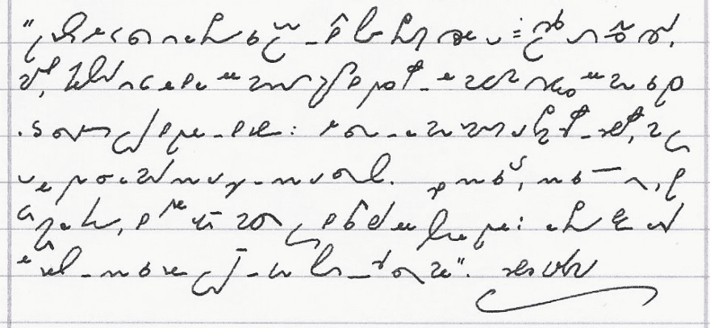
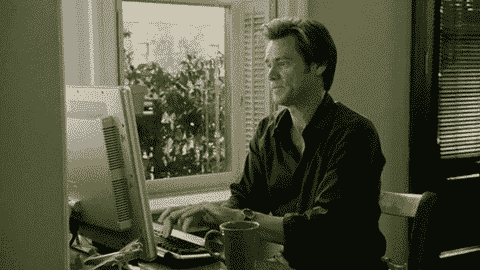
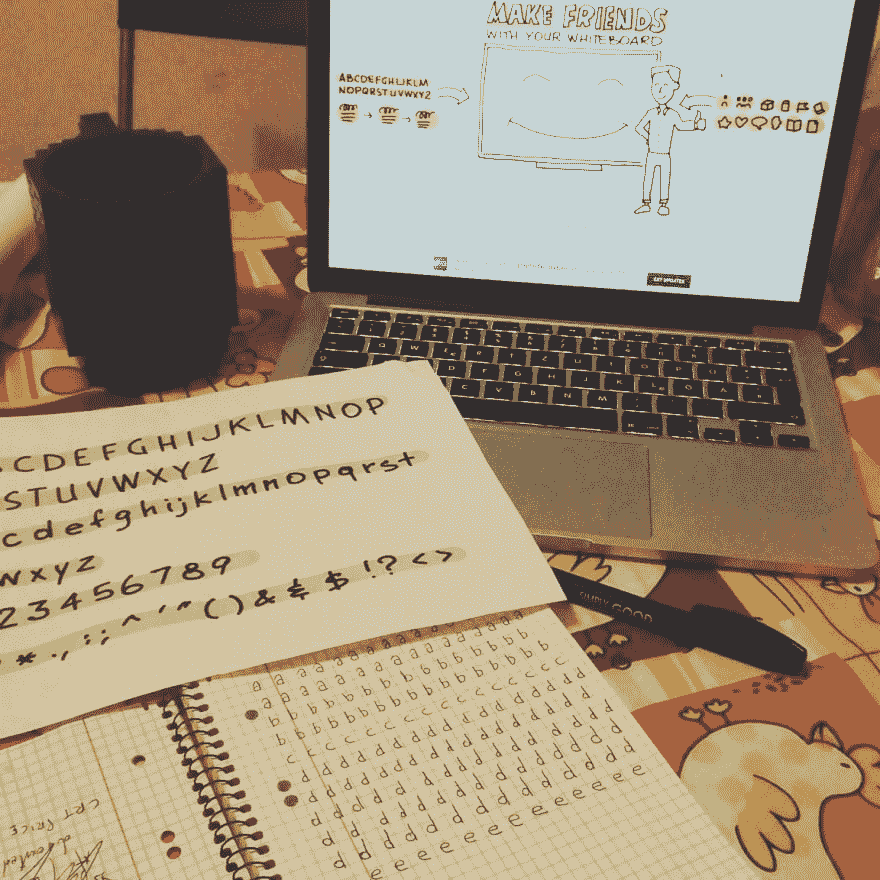
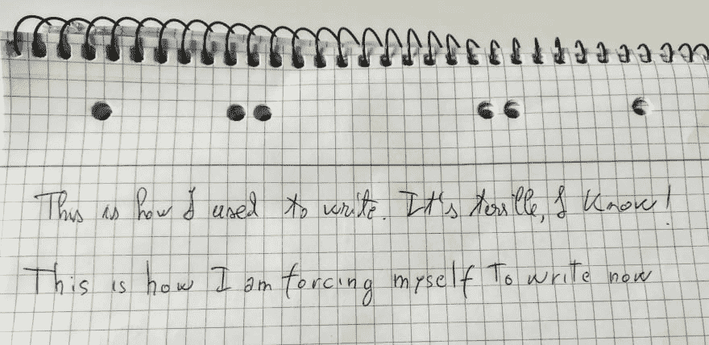

# 今年我决定学习...手写

> 原文：<https://dev.to/dvddpl/this-year-i-decided-to-learn-hand-writing-pronto-da-pubblicare-2334>

我的书法糟透了。

在高中，我学习了速记(简称 T1)，准确地说是盖博伯格笔记法，这是一种非常酷的用神秘的秘密“字母表”超快速书写的方法(T2)。哦，上帝，*我现在觉得自己好老。*

我喜欢它，之后我继续用它来快速记笔记。也许我没有 100%那样写，但仍然使用了许多最常用词的缩写。不管怎样，我的书法从来都不怎么样，但是我尝试快速书写和减少使用正常书写的次数，使得我的书法越来越差。

我一开始工作，就开始写得越来越少。我的写作看起来一团糟的事实不再困扰我，毕竟我整天都在打字。并做笔记...我要么用录音机，要么在笔记本电脑上打字(我也学会了打字——甚至还参加了当时的比赛)。

最近我还尝试了[现场转录](https://play.google.com/store/apps/details?id=com.google.audio.hearing.visualization.accessibility.scribe&hl=en)这是惊人的。

我的架构设计和 UML 在白板或记事本上看起来像垃圾的事实并没有真正困扰我:不管怎样，它们都是在会议期间即兴创作的草图。

然后我去参加了几次面试，在那里我在白板上添加解决一个编码任务，它看起来很可怕。因此，我决定和一位同事在白板上练习[编码挑战。
尽管代码对双方来说都很好，**他的解决方案——从字面上看——更易读、更优雅。**](https://dev.to/dvddpl/whiteboard-interviews-suck-but-you-should-practice-anyway-2479)

然后我意外地读到了这篇启发性的文章，我意识到我必须对我的书写技巧做些什么。

> 有几个星期，我醒得比较早，练习书法

首先是在记事本上(我感觉又回到了小学时代，一页又一页的...)然后在白板上。

它还不完美，当我很匆忙的时候，我倾向于回到我通常的糟糕的写作，但总的来说，我对我的进步感到非常高兴。

你怎么想呢?

* * *

由 Unsplash 上的 Deleece Cook 拍摄的照片