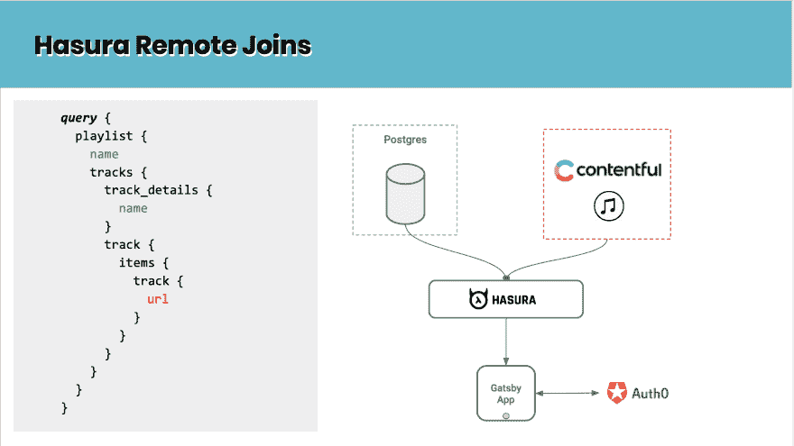
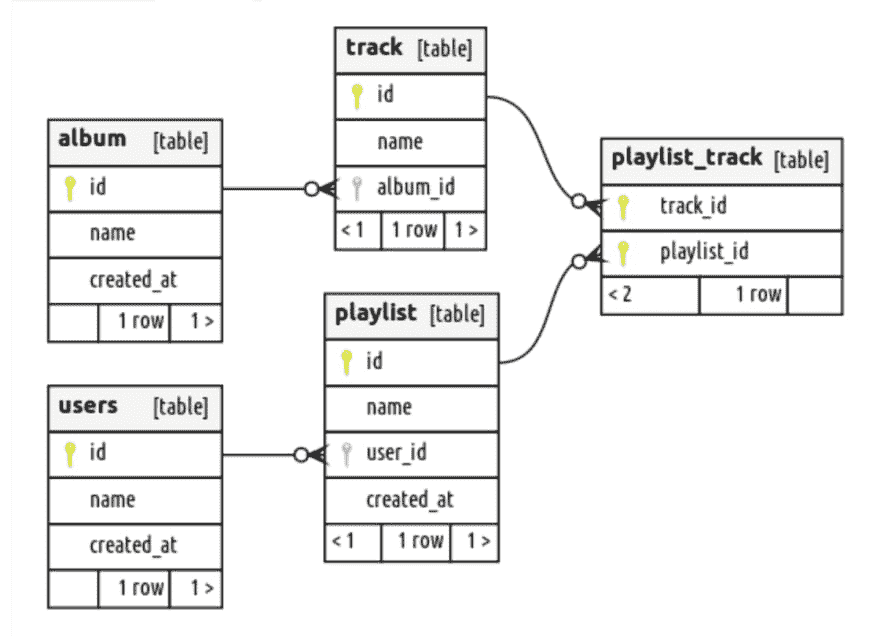
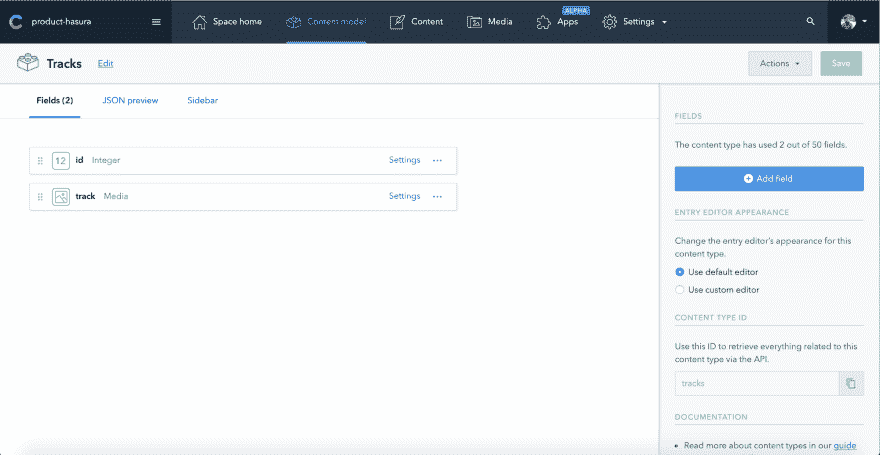
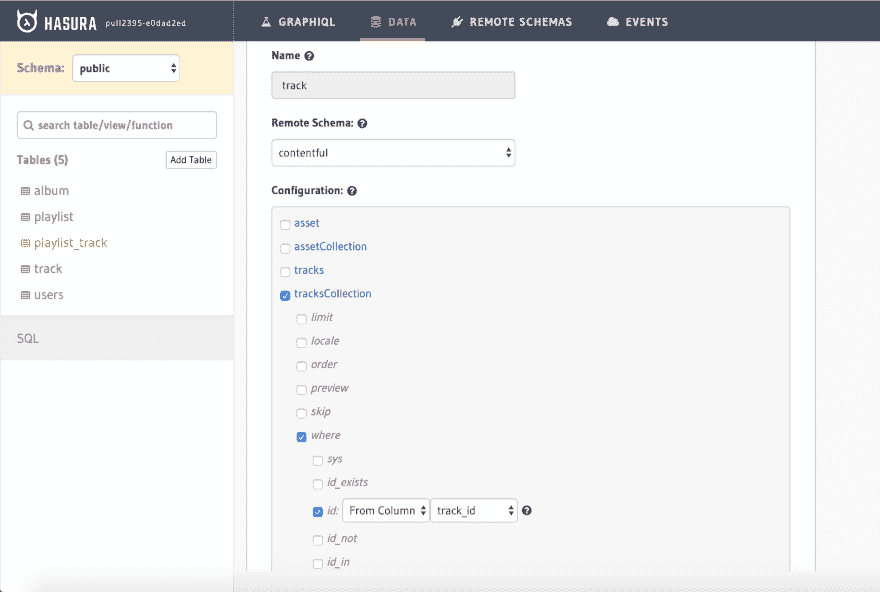
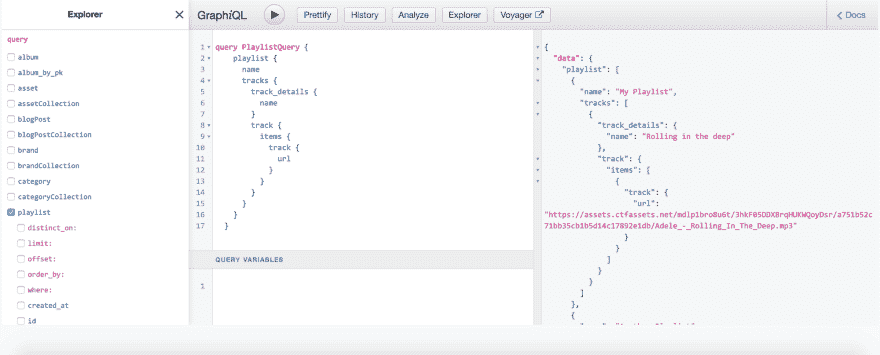

# 用 Gatsby、Contentful 和 Hasura Remote Joins 构建音乐播放列表应用程序

> 原文：<https://dev.to/hasurahq/building-a-music-playlist-app-with-gatsby-contentful-and-hasura-remote-joins-1g8d>

## TL；速度三角形定位法(dead reckoning)

使用 GraphQL 和 Hasura 远程连接将数据库中的音乐数据与内容丰富的音频源文件连接起来。使用 Auth0 处理身份验证。

即时设置。应用程序源代码👉[盖茨比-contentful-auth0](https://github.com/hasura/graphql-engine/tree/master/community/sample-apps/gatsby-contentful-auth0)

[](https://res.cloudinary.com/practicaldev/image/fetch/s--Ji0pN_e4--/c_limit%2Cf_auto%2Cfl_progressive%2Cq_auto%2Cw_880/https://blog.hasura.io/conteimg/2019/07/gatsby-contentful-remote-join-4.png)

在这个例子中，我们将看看如何使用 Gatsby 和 CMS 构建一个音乐播放列表应用程序。 [Contentful](https://contentful.com) 是 API 首个打造数字产品的 CMS。它提供了一个 [GraphQL API](https://www.contentful.com/developers/docs/references/graphql/#/introduction/basic-api-information) ，可以使用远程模式与 Hasura 连接。我们将了解如何将这些多个数据源与 Hasura 中的现有数据合并。在音乐播放列表应用中，我们将关于音乐曲目、专辑、播放列表和用户的元数据存储在 Postgres 数据库中，并使用 Hasura GraphQL 进行查询。我们将使用 Contentful 来存储和检索在应用程序上播放音乐所需的音轨。对于用户认证，我们将使用 Auth0。

下面是我们将要构建的音乐播放列表应用程序的简单模式表示。有一个`album`表可以有多个轨道。类似地，还有一个可以有多个轨道的`playlist`表。播放列表通过`user`表链接到用户。

[](https://res.cloudinary.com/practicaldev/image/fetch/s---KRJ78gf--/c_limit%2Cf_auto%2Cfl_progressive%2Cq_auto%2Cw_880/https://blog.hasura.io/conteimg/2019/07/playlist-app-schema.png)

音轨信息存储在 Postgres 中，但是我们使用 Contentful 来存储和管理实际的音轨。

### 入门

这篇文章是我们的[远程连接](https://blog.hasura.io/remote-joins-a-graphql-api-to-join-database-and-other-data-sources/)(在预览版中可用)系列的一部分。Hasura 中的远程连接允许您跨表和远程数据源连接数据。如果你想在我们发布时得到通知，你可以在这里注册[。前往](https://hasura.io/remote-joins)[公关](https://github.com/hasura/graphql-engine/pull/2395)查看更多细节，阅读预览文件，并尝试一个你可以旋转的测试 Hasura 图像。跳到我们的[不和谐](https://discord.gg/hasura)或者评论 [github](https://github.com/hasura/graphql-engine) ，让我们知道你的想法！

现在让我们为身份验证部分设置 Auth0。有关配置，请参考 [Auth0 集成指南](https://docs.hasura.io/1.0/graphql/manual/guides/integrations/auth0-jwt.html)。

在上面克隆的示例应用程序中，您需要应用将用户注册同步到 postgres 数据库的规则。因此，每当用户在应用程序上注册时，用户数据就会被插入数据库。

### 在 Contentful 中存储媒体文件

让我们在 Contentful 中创建必要的内容类型。在**内容模型**下，为**曲目**创建一个新的内容类型，并添加以下字段- > `id`和`track`。我们将使用`id`字段将这个数据与 Hasura 跟踪表连接起来。请注意，track field 是媒体类型，我们将利用它来创建音频源文件。

[](https://res.cloudinary.com/practicaldev/image/fetch/s--Muev0o3f--/c_limit%2Cf_auto%2Cfl_progressive%2Cq_auto%2Cw_880/https://blog.hasura.io/conteimg/2019/07/contentful-media.png)

### 添加内容作为远程模式

为了能够通过 Hasura 查询内容丰富的数据，需要使用 Hasura 控制台将其添加为一个**远程模式**。

*   获取以下格式的 GraphQL 内容 API 端点:

```
https://graphql.contentful.com/content/v1/spaces/<space-id> 
```

并替换为适当的空间 id。

*   在内容丰富的仪表板中，点击**设置**。在**空间设置**下点击 **API 键**。复制空间 ID 并粘贴到上述端点中。
*   现在复制内容交付 API -访问令牌，并在授权头中使用它，如下所示:

```
Authorization: Bearer <access_token> 
```

*   在 Hasura 控制台中，转到`Remote Schemas`并输入带有上述内容端点的 GraphQL 服务器 URL。在 Additional Headers 下，输入带有 access_token 的授权头，如上所述。

[](https://res.cloudinary.com/practicaldev/image/fetch/s--9cczN_wr--/c_limit%2Cf_auto%2Cfl_progressive%2Cq_auto%2Cw_880/https://blog.hasura.io/conteimg/2019/07/add-contentful-remote-schema-1.png)

创建从`playlist_track`表到`tracksCollection`内容类型的远程关系。

[](https://res.cloudinary.com/practicaldev/image/fetch/s--t0twfXZX--/c_limit%2Cf_auto%2Cfl_progressive%2Cq_auto%2Cw_880/https://blog.hasura.io/conteimg/2019/07/remote-relationship-track.png)

在 tracksCollection 的配置下，我们声明一个 where 子句，说明:

```
id: From Column -> track_id 
```

这确保了在查询音轨时，我们只获得相关的音频源文件。

现在，在单个 API 调用中获取这些数据的 GraphQL 查询如下所示:

```
query PlaylistQuery {
      playlist {
        name
        tracks {
          track_details {
            name
          }
          track {
            items {
              track {
                url
              }
            }
          }
        }
      }
  } 
```

注意，嵌套查询`track`来自 Contentful，它将应用 track . id = playlist _ track . track _ id 的过滤器，从而仅给出相关的音轨信息。

### 授权

我们合并了两个不同的数据源，并在一个 GraphQL 查询中检索数据。通过基于角色的权限，我们可以处理应用程序所需的权限。例如，用户应该能够只向他们创建的播放列表添加曲目。

插入一些示例数据，看看上面的 GraphQL 查询的响应结构是什么样子。

[](https://res.cloudinary.com/practicaldev/image/fetch/s--ZVp23Ng5--/c_limit%2Cf_auto%2Cfl_progressive%2Cq_auto%2Cw_880/https://blog.hasura.io/conteimg/2019/07/graphiql-response-contentful.png)

曲目 URL 信息来自 Contentful，并且可以获取关于该曲目的更多元数据。使用 URL，我们构建播放列表应用程序，显示属于用户播放列表的曲目。