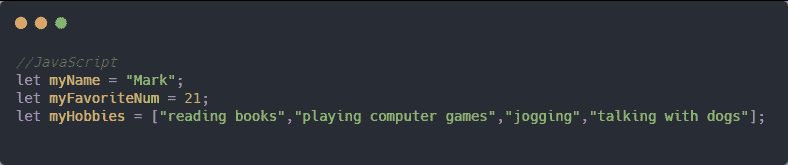
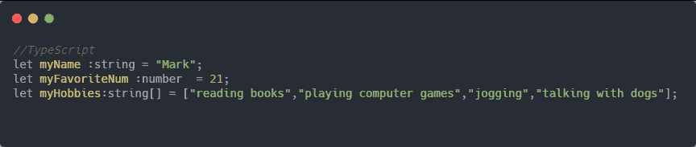
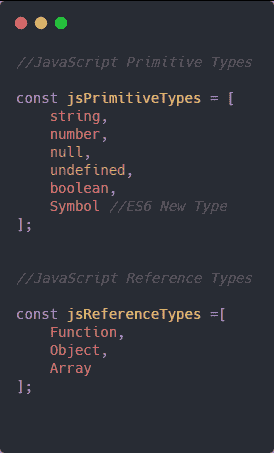
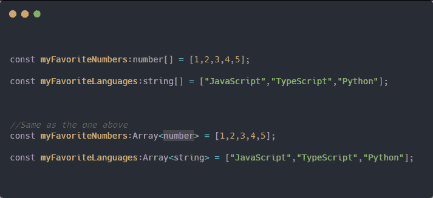
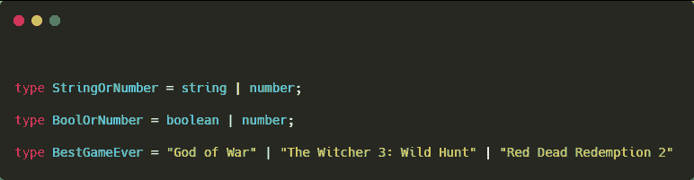
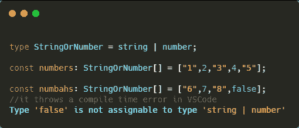
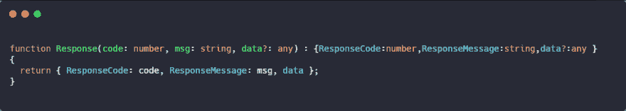
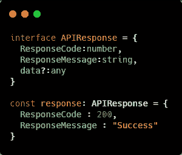
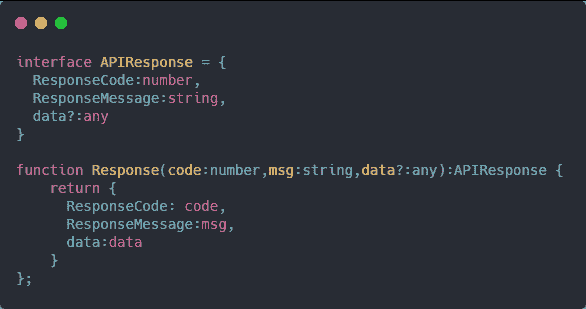

# 为什么我喜欢打字稿

> 原文：<https://dev.to/macmacky/using-typescript-e05>

我使用 **Typescript** 已经一年多了。大多数情况下，我在应用程序的后端使用它。我去年开始使用它，因为它比普通的旧 JavaScript 更具**可读性**。是的，去年它变得越来越受欢迎，现在它已经成为最多编程语言的前十名。【2019 年 7 月十大语言。看看去年 1 月的排名【T10 大语言 2019 年 1 月它打败了 **Objective-C** 和 **Swift** 用于构建 IOS 应用的语言。
我不是说 **TypeScript** 比那些语言好。不同的语言有不同的方法来解决特定的问题。

让我们写一些代码。
[T3】](https://res.cloudinary.com/practicaldev/image/fetch/s--fDawJlaS--/c_limit%2Cf_auto%2Cfl_progressive%2Cq_auto%2Cw_880/https://thepracticaldev.s3.amazonaws.com/i/jmqmyi07pgxtzffkdwbp.png)

现在 **:** 或者**冒号**后面的东西表示变量的类型。

JavaScript 中的不同类型。
[T3】](https://res.cloudinary.com/practicaldev/image/fetch/s--BN7jkAkz--/c_limit%2Cf_auto%2Cfl_progressive%2Cq_auto%2Cw_880/https://thepracticaldev.s3.amazonaws.com/i/v934rtq51cw8yhpj7057.png)

制作一个特定类型的数组

上面的例子完全一样，但是下面的两个例子我们只是使用了通用数组类型 **Array < someType >** 传递基本类型，或者可能是你在小于符号和大于符号中创建的自定义类型。

制作自定义类型或别名类型。

**类型**关键字只有 TS 才有，JS 没有。在 type 关键字之后，我们指定自定义类型的名称，在等号之后，我们指出自定义类型的值，它可能是一个基本类型或值，也可能是另一个自定义类型。 **|** 或管道操作符意味着我们的别名类型可能包含一个或多个类型。在第一个例子中，我们的 **StringOrNumber** 只能有一个值 string 或 Number。在第二个示例中， **BoolOrNumber** 只能有一个布尔值或数字，而第三个示例 **BestGameEver** 只能有 3 个字符串值。

自定义数组中的类型

现在来说说函数。
 
我们也可以在参数中指定类型。在函数参数中指定类型对于变量也是一样的。第三个参数用**？**使参数**可选**。我们还在最后一个括号和冒号后指定函数的返回类型，在本例中是一个对象。

TypeScript 中我最喜欢的特性是**接口**。
 
接口描述了一个对象的形状，它告诉我们这个对象它一定继承了接口所具有的属性。我们还可以通过添加一个**来制作一个可选属性？**在属性名之后。

我们还可以使用该接口来修改前面的**响应**函数中的返回类型。
T3T5】

我对 JavaScript 的问题是它不可读。我不是说我笨或什么的。我可以阅读 100 或 150 LOC 的 JavaScript。但是理解它需要时间。我知道我们是程序员，我们花了很多时间阅读和理解代码，这是我们工作的一部分。**但是在给定的场景下。在生产环境中发生了一些错误，使用的语言是 JavaScript，编写它的程序员不在，你有任务来修复它，幸运的是你不知道 JS，只知道 C#和 Java。也许你可以在一个精通 JavaScript 的队友的帮助下解决这个问题，但是如果这个队友正忙着做他/她的项目，或者你有另一个对 JS 一知半解的队友，他/她向你提供了他/她的帮助，而你们两个花了很多时间去理解代码，他/她告诉你他/她什么也不懂，或者也许你可以这样做，那个写代码的人显然正在和他的家人度假 你认为你不需要去打扰那个人，或者你可以去 [w3schools](https://www.w3schools.com/) 了解一些基本的 JS 代码，或者你可以向牙仙寻求一些帮助，而这显然是不存在的😄。**

#### 感谢你浪费时间阅读这篇文章😂

**祝你愉快**。