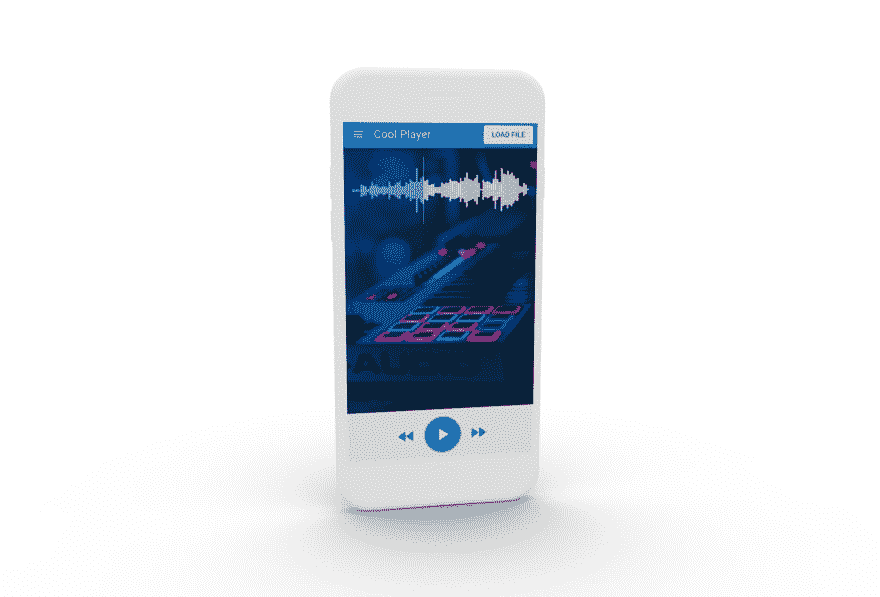
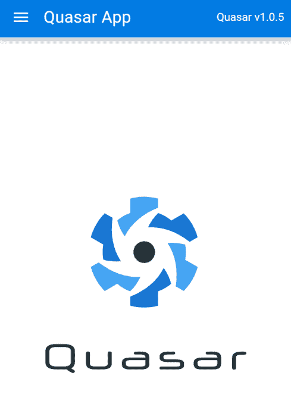
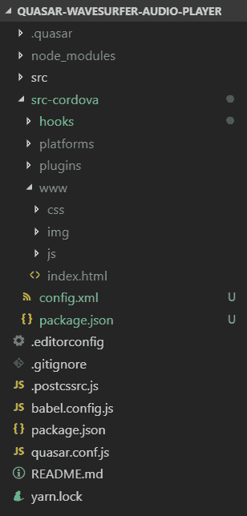
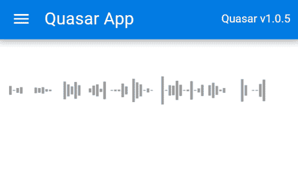
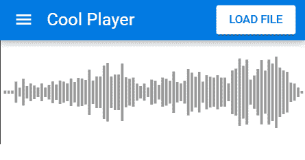
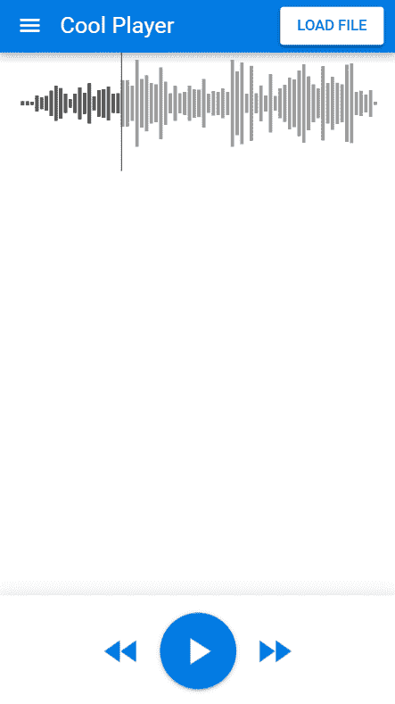

# 如何使用 VueJS、Quasar 和 WaveSurfer 构建类似 SoundCloud 的音频播放器应用程序

> 原文：<https://dev.to/johnnymakestuff/how-to-build-a-soundcloud-like-audio-player-app-with-vuejs-quasar-and-wavesurfer-5bic>

## 我们在建造什么

[](https://res.cloudinary.com/practicaldev/image/fetch/s--Mtq3sxSD--/c_limit%2Cf_auto%2Cfl_progressive%2Cq_auto%2Cw_880/https://www.learningsomethingnew.com/quasar-sc/device_mockup.png)

我们将使用 Quasar 和 WaveSurfer 来构建一个类似 SoundCloud 的跨平台移动音频播放器应用程序。我们将使用 html 文件输入从设备加载本地音频文件，呈现波形并添加控件来播放音频。

## 类星体？

Quasar 是一个基于 Vue.js 构建的 UI 框架。它似乎比 Vuetify 更面向移动，并且也有一个优秀的 CLI，非常适合生成 Cordova 应用程序。您可以通过开箱即用的热重新加载在实际设备上进行调试。这是高效开发过程的关键部分，也是我选择框架/栈的决定性因素之一。

更多让我想尝试一下的地方:

*   充满活力的社区(11K GitHub stars)
*   伟大的 CLI
*   漂亮的 UI 组件和内置的网格系统(我喜欢尽可能少写 CSS)
*   使用你了解并喜爱的 Vue 生态系统

## 脚手架

> 我假设你已经有了一个配置了 android studio / xcode 的 Cordova 设置。跟着[类星体的教程](https://quasar.dev/quasar-cli/developing-cordova-apps/preparation)走就行了

让我们从安装 Quasar CLI 开始。从您的工作区终端运行:

```
npm install -g @quasar/cli 
```

然后创建一个项目:

```
quasar create quasar-wavesurfer-audio-player 
```

插入以下答案:

*   项目名称:默认
*   项目产品名称:更改为“酷玩”
*   项目描述:一个使用 quasar 和 wavesurfer 的类似 soundcloud 的音频播放器
*   作者:你
*   功能:我们不需要任何功能
*   Cordova id:保持原样，除非您想要发布到商店

Quasar CLI 将安装所需的软件包。完成后，进入文件夹，运行`quasar dev`查看基本布局:

```
cd quasar-wavesurfer-audio-player
quasar dev 
```

[](https://res.cloudinary.com/practicaldev/image/fetch/s--6AhQn6Dw--/c_limit%2Cf_auto%2Cfl_progressive%2Cq_auto%2Cw_880/https://www.learningsomethingnew.com/quasar-sc/quasar-dev.png)

> 一个工作版本！这是初始化 git repo 并进行第一次提交的好时机。

### 添加科尔多瓦模式

现在，我们有一个类星体应用程序运行在温泉模式。为了把它变成一个我们可以发布到应用商店的移动应用，我们需要添加 Quasar 的`cordova mode` :

```
quasar mode add cordova 
```

这个 Quasar CLI 命令添加了一个`src-cordova`文件夹，包含我们的 Cordova 项目。在这个文件夹中，我们可以运行任何 Cordova CLI 命令。Quasar 将构建我们的 Vue 代码，并将资产放在`src-cordova/www`文件夹中。

[](https://res.cloudinary.com/practicaldev/image/fetch/s--YjeDfS2T--/c_limit%2Cf_auto%2Cfl_progressive%2Cq_auto%2Cw_880/https://www.learningsomethingnew.com/quasar-sc/cordova-mode.png)

现在我们将检查它是否在我们的设备上运行。这应该尽可能早地完成，作为检查设置是否工作的健全性检查。我将使用 android 来实现这一点，但它在 iOS 上也同样适用。

确保您的设备通过 USB 连接，并运行:

```
quasar dev -m android 
```

> 注意:较新的 chrome 版本默认阻止明文流量，所以 Cordova 的内部 WebView 会抛出一个`ERR_CLEARTEXT_NOT_PERMITTED`错误。要解决这个问题，取消`quasar.conf.js`中`devServer`部分下`https: true,`的注释
> 
> 注 2:如果你正在为 iOS 构建，建议使用这里描述的[方法之一从废弃的 ui webview(Cordova 默认使用的)升级到 WKWebView】](https://quasar.dev/quasar-cli/developing-cordova-apps/preparation)

现在，CLI 会询问您使用哪个 IP。选择可从您的移动设备访问的 IP(它们必须在同一个网络上)。Quasar 将创建一个 Cordova 应用程序，从这个 IP 的内部 WebView 加载，从而使我们能够在我们的设备上开发热重装。这是高效开发过程的一个重要特征。

我们将继续使用`quasar dev`进行开发，同时定期在实际设备上进行测试，看看事情是否正常。

> 如果你正在开发一个可以在 android *和 iOS*上运行的应用，我建议定期在这两个平台上运行。它们永远不会相同。

## 类星体工程结构

现在让我们来看看 CLI 为我们创建的项目结构，以便快速了解 Quasar。Quasar CLI 在`layouts`文件夹内搭建一个默认布局`MyLayout.vue`的文件夹结构。布局是一个 Vue 组件，拥有所有的 Quasar UI 元素，包括导航抽屉、工具栏和主页。你可以看到以`q-`开头的类星体，如`q-layout`、`q-toolbar`等。这些都是 Quasar 团队写的 Vue 组件(类似于 Vuetify 的`v-`组件)。

为了使用 Quasar UI 组件，您需要显式地将它们包含在`quasar.conf.js`中，我们将在后面看到。

主页面包含在`MyLayout.vue`中的`<q-page-container>`元素里面，里面包含了一个`<router-view />`——同一个你认识并喜爱的`vue-router`。路线保存在`pages`文件夹中。

默认加载的主页面是在`pages`文件夹下的`Index.vue`，所以我们将在这里添加我们的代码。

## 添加 wavesurfer.js

WaveSurfer 是一个开源的音频播放器，可以将音频波渲染到 html5 画布上。来补充一下:

```
npm i wavesurfer.js 
```

现在我们将把 WaveSurfer 导入到`Index.vue`中，添加一个`wavesurfer`数据成员，以及一个方法`createWaveSurfer`，当组件被挂载时，该方法将初始化它。`wavesurfer`对象需要一个`container`，这是它将在其中呈现的 html 元素的 ID。因此，我们还将向组件的模板添加一个容器 div。我们将加载一个演示 mp3 文件，只是为了在这个阶段进行测试。这是`Index.vue`现在的样子:

```
<template>
  <div id="waveform"></div>
</template>

<script>
import WaveSurfer from "wavesurfer.js";

export default {
  name: 'PageIndex',
  data: () => ({
    wavesurfer: null,
  }),
  async mounted() {
    if (!this.wavesurfer) this.createWaveSurfer();
  },
  methods: {
    createWaveSurfer() {
      this.wavesurfer = WaveSurfer.create({
        container: "#waveform",
        barWidth: 3
      });
      this.wavesurfer.load(
        "https://ia902606.us.archive.org/35/items/shortpoetry_047_librivox/song_cjrg_teasdale_64kb.mp3"
      );
    }
  }
}
</script> 
```

使用`quasar dev`运行时，您应该会看到呈现的波形:

[](https://res.cloudinary.com/practicaldev/image/fetch/s--SvoVlJnJ--/c_limit%2Cf_auto%2Cfl_progressive%2Cq_auto%2Cw_880/https://www.learningsomethingnew.com/quasar-sc/adding-waveform.png)

## 加载本地音频文件

我们将使用 html 的`<input type="file">`从本地设备加载文件。让我们在工具栏上添加一个文件加载按钮。在`MyLayout.vue`中，将`<div>Quasar v{{ $q.version }}</div>`替换为`q-btn`组件:

```
<q-btn color="white" text-color="primary">
Load File
<input
    type="file"
    class="q-uploader__input overflow-hidden absolute-full"
    v-on:change="fileChosen"
    ref="fileInput"
    accept="audio/mpeg"
/>
</q-btn> 
```

我们这里有一个`<q-btn>` (Quasar 按钮)，包含一个常规的 html `<input>`元素，带有`type="file"`(使其成为一个文件选择器)，只接受音频文件(`accept="audio/mpeg"`)。

请注意，浏览器试图强制文件输入具有互联网上最丑陋的设计之一，就像这样:

[](https://res.cloudinary.com/practicaldev/image/fetch/s--fSHxci_u--/c_limit%2Cf_auto%2Cfl_progressive%2Cq_auto%2Cw_880/https://www.learningsomethingnew.com/quasar-sc/default-file-input.png)

虽然没有官方方法来改变文件输入的外观，但我们将从 Quasar 的`q-uploader`组件“借用”css 类，以便使它看起来更像一个按钮，而不像 90 年代的遗物。在 Cordova 应用程序中单击它将打开本机设备的文件选择界面。

在方法部分添加一个接收文件的处理程序:

```
fileChosen(file) {
    // Chosen file passed as argument
} 
```

### 将文件发送到主页面

由于我们在`MyLayout`组件中接收了 file 对象，但在`Index`组件中接收了 wavesurfer 对象，我们将使用事件总线在它们之间进行通信，并在文件被选中时发送文件。使用另一个 Vue 对象可以很容易地创建事件总线。用新的`event-bus.js`文件添加一个`services`文件夹，包含:

```
import Vue from 'vue';
export const EventBus = new Vue(); 
```

我们将它导入到`MyLayout.vue`中，并在文件输入值改变时发出一个事件:

```
import { EventBus } from "../services/event-bus.js";

...

methods: {
    fileChosen(file) {
        EventBus.$emit("fileChosen", file);
    }
} 
```

现在我们想在`Index.vue`的`mounted`处理程序:
中捕捉事件

```
import { EventBus } from "../services/event-bus.js";

...
mounted() {
    ...

    EventBus.$on("fileChosen", file => {
        this.loadFile(file);
    });
} 
```

最后，我们将使用 wavesurfer 的`loadBlob`方法:
加载文件

```
loadFile(file) {
    if (file.target.files.length == 0) return;

    this.wavesurfer.loadBlob(file.target.files[0]);
} 
```

尝试从您的设备加载一个文件，您应该会看到它的呈现:

[](https://res.cloudinary.com/practicaldev/image/fetch/s--2RZxTFgu--/c_limit%2Cf_auto%2Cfl_progressive%2Cq_auto%2Cw_880/https://www.learningsomethingnew.com/quasar-sc/load-file.png)

## 添加控件

让我们添加一些播放/暂停/跳过按钮。在`Index.vue`中，将以下代码添加到模板部分:

```
<template>
  <q-page class>
    <div class="audio-container">
      <div class="row q-ma-md">
        <div class="col-12">
          <div id="waveform"></div>
        </div>
      </div>
    </div>
    <div class="controls row flex flex-center fixed-bottom q-pb-md q-pt-md shadow-10">
      <div class>
        <q-btn
          color="primary"
          flat
          round
          icon="fast_rewind"
          size="xl"
          @click="wavesurfer.skipBackward(1)"
        />
        <q-btn
          v-if="isPlaying"
          color="primary"
          round
          icon="pause"
          size="xl"
          @click="wavesurfer.playPause()"
        />
        <q-btn
          v-if="!isPlaying"
          color="primary"
          round
          icon="play_arrow"
          size="xl"
          @click="wavesurfer.playPause()"
        />
        <q-btn
          color="primary"
          flat
          round
          icon="fast_forward"
          size="xl"
          @click="wavesurfer.skipForward(1)"
        />
      </div>
    </div>
  </q-page>
</template> 
```

而在脚本部分:

```
computed: {
    isPlaying() {
      if (!this.wavesurfer) return false;

      return this.wavesurfer.isPlaying();
    }
}, 
```

我们在一个 Quasar `"row"` div 中添加了一些使用 Quasar 的`<q-btn>`组件的控件，它使用定位助手`flex`、`fixed-center`和`fixed-bottom`整齐地排列它们。`q-pb-md/q-pt-md`给了我们一些预定义的边距。`@click`处理程序直接调用 wavesurfer 的方法。

注意我们是如何使用模板部分声明性地设计 UI 的，使用了 Quasar 的修饰符，如`round`、`flat`和`size`。这为我们节省了 99%的手工编写的 css 代码。

我们还添加了一个`isPlaying` computed，它是 wavesurfer 方法的包装器，用于决定是显示播放按钮还是暂停按钮。它应该是这样的:

[](https://res.cloudinary.com/practicaldev/image/fetch/s--JfZasBR8--/c_limit%2Cf_auto%2Cfl_progressive%2Cq_auto%2Cw_880/https://www.learningsomethingnew.com/quasar-sc/controls.png)

## 使用 wavesurfer 钩子添加一个装载微调器

快好了！现在我们将添加一个微调器，以便在文件加载时给用户一些反馈。Wavesurfer 公开了一些钩子，因此我们可以处理各种事件。我们将使用`error`、`loading`和`ready`事件。

在`quasar.conf.js`组件部分，将`'QCircularProgress'`添加到列表中。
然后在`Index.vue`，播放按钮上方，添加一个`q-circular-progress` :

```
<q-circular-progress v-if="isLoading" size="72px" indeterminate color="primary" /> 
```

更改播放按钮，仅在我们没有加载时显示:

```
<q-btn v-if="!isPlaying && !isLoading"
... 
```

将`isLoading`成员添加到`data`部分:

```
isLoading: false 
```

在`createWaveSurfer()`方法中，我们将挂钩到 wavesurfer 事件:

```
this.wavesurfer.on("error", err => {
    console.error(err);
    this.isLoading = false;
    this.$q.notify({ message: err });
});

this.wavesurfer.on("loading", () => {
    this.isLoading = true;
});

this.wavesurfer.on("ready", () => {
    this.isLoading = false;
}); 
```

我们还增加了一个类星体通知(snackbar ),每当有错误。在 Quasar 中，从代码的任何地方使用`this.$q.notify`都非常容易。

## 一点设计

为了最终完成设计，我们将添加一个漂亮的背景图像和一些波形样式。
我使用了詹姆斯·欧文的[图片](https://unsplash.com/photos/c-NBiJrhwdM)作为背景。将图片保存为`assets`文件夹下的`audio.png`，并使用下面的 css 将其设置为主 div 的背景:

```
.controls {
  background-color: white;
}
.audio-container {
  position: absolute;
  top: 0;
  left: 0;
  height: 100%;
  width: 100%;
  background: linear-gradient(rgba(0, 0, 0, 0.3), rgba(0, 0, 0, 0.3)),
    url("../assets/audio.jpg") no-repeat center;
  background-size: cover;
} 
```

和一些使用 WaveSurfer 选项的波形样式:

```
this.wavesurfer = WaveSurfer.create({
    container: "#waveform",
    hideScrollbar: true,
    waveColor: "white",
    progressColor: "hsla(200, 100%, 30%, 0.5)",
    cursorColor: "#fff",
    barWidth: 3
}); 
```

就是这样！

[](https://res.cloudinary.com/practicaldev/image/fetch/s--Mtq3sxSD--/c_limit%2Cf_auto%2Cfl_progressive%2Cq_auto%2Cw_880/https://www.learningsomethingnew.com/quasar-sc/device_mockup.png)

## 总结

我发现 Quasar 是使用 Vue 开发设计良好的移动/桌面/网络应用的一种非常快速的方式，只需要很少的 CSS。CLI 也非常棒，省去了很多令人头疼的 Cordova 配置。

WaveSurfer 可以定制，有很多插件。我们已经为演示加载了本地文件，但它也可以从您的服务器获取远程 URL。

## 链接

*   完整源代码: [GitHub](https://github.com/syonip/quasar-wavesurfer-audio-player)
*   在 twitter 上提问/留言: [@johnnymakestuff](https://twitter.com/johnnymakestuff)
*   [类星体](https://quasar.dev/)
*   [WaveSurfer](https://wavesurfer-js.org/)
*   用 [threed.io](https://threed.io/) 创建的设备模型

> 最初发布在我的[博客](https://www.learningsomethingnew.com/how-to-build-a-sound-cloud-like-audio-player-app-with-vue-js-quasar-and-wave-surfer)