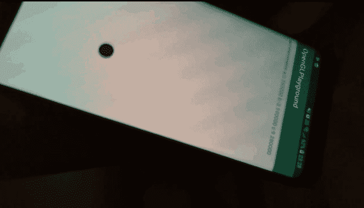

# 原生 openGL Android 应用入门

> 原文：<https://dev.to/elasticrash/getting-started-with-native-opengl-android-app-19e7>

这个帖子又是一个从媒体的转移。不久前，我决定删除我在那里的账户，但在此之前，不从那里转移(和改进)我的一些帖子将是一种浪费。这是其中之一。

在假期(2018 年圣诞节)期间，我想尝试一些不同的东西。我一生中从来没有做过太多的移动开发。但是既然我有一点时间，我想我应该试一试。

但是做一些简单的事情有什么乐趣呢，比如一个表单应用程序。我想学习一些东西，所以我决定做一个简单的 OpenGL 应用程序，而不使用任何第三方库。一切从零开始。

请记住，曾几何时，我对 OpenGL 开发(使用 C++)还算满意。

我四处寻找教程，我在这里和那里找到了一些零碎的东西，最终设法创建了我想要的东西。

这些是我想要实现的目标:

*   画一个圆
*   倾斜手机时让圆圈移动。

这是我的想法

[](https://res.cloudinary.com/practicaldev/image/fetch/s--h2PS5fuM--/c_limit%2Cf_auto%2Cfl_progressive%2Cq_66%2Cw_880/https://thepracticaldev.s3.amazonaws.com/i/fqidtk65fu98kw0wsl8p.gif)

这是一个学习两件事的好机会

*   传感器如何工作
*   OpenGL 如何在 Android 上工作。

# 设置项目

于是我下载了 Android Studio，创建了一个空项目。

在这一点上，我已经阅读了一些文章和教程，所以我有一些模糊的想法，我必须做什么。我必须创建一个**视图**和一个**渲染器**。

我的 **OpenGLView** 需要扩展 [GLSurfaceView](https://developer.android.com/reference/android/opengl/GLSurfaceView) 。

```
public class OpenGLView extends GLSurfaceView {

    public OpenGLView(Context context) {
        super(context);
        init();
    }

    public OpenGLView(Context context, AttributeSet attrs) {
        super(context, attrs);
        init();
    }

    private void init(){
        setEGLContextClientVersion(2);  // OpenGL ES Version
        setPreserveEGLContextOnPause(true);
        setRenderer(new OpenGLRenderer());
    }
} 
```

Enter fullscreen mode Exit fullscreen mode

然后我的 **OpenGLRenderer** 必须实现 [GLSurfaceView。渲染器](https://developer.android.com/reference/android/opengl/GLSurfaceView.Renderer)。

```
public class OpenGLRenderer implements GLSurfaceView.Renderer {
    @Override
    public void onSurfaceCreated(GL10 gl, EGLConfig config) {
        GLES20.glClearColor(0.9f, 0.9f,0.9f,1f);
    }
   @Override
    public void onSurfaceChanged(GL10 gl, int width, int height) {
    }
    @Override
    public void onDrawFrame(GL10 gl) {
        GLES20.glClear(GLES20.GL_COLOR_BUFFER_BIT);
    }
} 
```

Enter fullscreen mode Exit fullscreen mode

此时，渲染器除了设置背景颜色之外什么也不做。

然后，我们需要转到我们的布局，并添加我们刚刚创建的视图。这样视图元素就会充满我们的屏幕。

```
<net.something.OpenGLPlayground.OpenGLView
        android:id="@+id/openGLView"
        android:layout_width="match_parent"
        android:layout_height="match_parent" /> 
```

Enter fullscreen mode Exit fullscreen mode

最后，在我们的 MainActivity(我将其命名为 **MainGameActivity** )中，应该是这样的:

```
public class MainGameActivity extends AppCompatActivity {
private OpenGLView openGLView;
    @Override
    protected void onCreate(Bundle savedInstanceState) {
        super.onCreate(savedInstanceState);
        setContentView(R.layout.activity_main_game);
        openGLView = findViewById(R.id.openGLView);
    }
    @Override
    protected void onResume(){
        super.onResume();
        openGLView.onResume();
    }
    @Override
    protected void onPause(){
        super.onPause();
        openGLView.onPause();
    }
    @Override
    public void onPointerCaptureChanged(boolean hasCapture) {
    }
} 
```

Enter fullscreen mode Exit fullscreen mode

…如果我们执行代码。我们会得到一个我们定义的任何颜色的视图。我定义的颜色接近白色，所以不应该有任何东西。🎉

# 实现 SensorEventListener

在我们画圆之前，让我们设置[**SensorEventListener**](https://developer.android.com/reference/android/hardware/SensorEventListener)来监听加速度计。好吧，加速度计可能不是我们试图实现的最佳传感器(因为它只会在你不动的时候工作),所以我们可以切换到陀螺仪，但就目前而言，我想，这很好。

```
public class MainGameActivity extends AppCompatActivity implements SensorEventListener {
...
    @Override
    public void onSensorChanged(SensorEvent event) {
        if (event.sensor.getType() == Sensor.TYPE_ACCELEROMETER) {
        }
    }
    @Override
    public void onAccuracyChanged(Sensor sensor, int accuracy) {

    }
} 
```

Enter fullscreen mode Exit fullscreen mode

加速度计有 3 个值

*   值[0]影响 x 轴
*   值[1]影响 y 轴
*   值[2]影响 z 轴

我们将只使用 x 和 y。我们还将对第二个小数进行四舍五入，因为我们特别不想要高精度。我们的函数将看起来像:

```
@Override
    public void onSensorChanged(SensorEvent event) {
        if (event.sensor.getType() == Sensor.TYPE_ACCELEROMETER) {
          float x = Math.round(event.values[0] * 100.0) / 100f;
          float y = Math.round(event.values[1] * 100.0) / 100f;
    }
} 
```

Enter fullscreen mode Exit fullscreen mode

# 画圆

所以我们有了这个圆的坐标。现在我们需要使用 OpenGL 的能力来画圆。

1.  我们将使用以下函数创建一个 **Circle 类**。

```
public class Circle {
    // basically a circle is a linestring so we need its centre
    // radius and how many segments it will consist of
    public Circle(float cx, float cy, float radius, int segments) {
    }

    // calculate the segments
    public void calculatePoints(float cx, float cy, float radius, int segments) {
    }
    // actuall openGL drawing
    public void draw() {
    }
} 
```

Enter fullscreen mode Exit fullscreen mode

1.  在我们的 **Circle 类**中，我们将添加一个编译形状着色器的函数。基本上着色器需要由 openGL 编译。

```
public static int loadShader(int type, String shaderCode){
    int shader = GLES20.glCreateShader(type);
    GLES20.glShaderSource(shader, shaderCode);
    GLES20.glCompileShader(shader);
    return shader;
} 
```

Enter fullscreen mode Exit fullscreen mode

1.  在 **Circle 类**中，我们将定义两个着色器(它们没做太多)。
2.  [顶点着色器](https://developer.android.com/training/graphics/opengl/draw):用于渲染形状的顶点。
3.  [片段着色器](https://developer.android.com/training/graphics/opengl/draw):用颜色或纹理渲染形状的表面。

```
private final String vertexShaderCode =
        "attribute vec4 vPosition;" +
                "void main() {" +
                "  gl_Position = vPosition;" +
                "}";

private final String fragmentShaderCode =
        "precision mediump float;" +
                "uniform vec4 vColor;" +
                "void main() {" +
                "  gl_FragColor = vColor;" +
                "}"; 
```

Enter fullscreen mode Exit fullscreen mode

1.  该是计算圆的点数的时候了。我们将把这些点存储在一个浮动缓冲区中。

简单浏览一下下面的代码，就会发现有些奇怪的东西。这就是**显示指标**。这里的问题是，由于 OpenGL 画布是正方形的，屏幕坐标的映射范围从-1 到 1。如果我们只是画圆，它最终会扭曲。我们需要屏幕的宽度和高度来计算长宽比，这样我们就可以压缩一个维度，并产生一个实际的圆。

```
private FloatBuffer vertexBuffer;
private static final int COORDS_PER_VERTEX = 3;
public void CalculatePoints(float cx, float cy, float radius, int segments) {
    DisplayMetrics dm = Resources.getSystem().getDisplayMetrics();

    float[] coordinates = new float[segments * COORDS_PER_VERTEX];

    for (int i = 0; i < segments * 3; i += 3) {
        float percent = (i / (segments - 1f));
        float rad = percent * 2f * (float) Math.PI;

        //Vertex position
        float xi = cx + radius * (float) Math.cos(rad);
        float yi = cy + radius * (float) Math.sin(rad);

        coordinates[i] = xi;
        coordinates[i + 1] = yi / (((float) dm.heightPixels / (float) dm.widthPixels));
        coordinates[i + 2] = 0.0f;
    }

    // initialise vertex byte buffer for shape coordinates
    ByteBuffer bb = ByteBuffer.allocateDirect(coordinates.length * 4);
    // use the device hardware's native byte order
    bb.order(ByteOrder.nativeOrder());

    // create a floating point buffer from the ByteBuffer
    vertexBuffer = bb.asFloatBuffer();
    // add the coordinates to the FloatBuffer
    vertexBuffer.put(coordinates);
    // set the buffer to read the first coordinate
    vertexBuffer.position(0);
} 
```

Enter fullscreen mode Exit fullscreen mode

1.  实现构造函数的时间。在以下情况下:

咱们就想画个形状就完事了。

我们不需要检查应用程序是否已经初始化，但因为我们打算在每次获得传感器事件时更新对象坐标。我们不应该加载着色器/应用程序/链接超过一次。

```
private int app = -1;
public Circle(float cx, float cy, float radius, int segments) {
    CalculatePoints(cx, cy, radius, segments);
    if (app == -1) {
        int vertexShader = OpenGLRenderer.loadShader(GLES20.GL_VERTEX_SHADER,
                vertexShaderCode);
        int fragmentShader = OpenGLRenderer.loadShader(GLES20.GL_FRAGMENT_SHADER,
                fragmentShaderCode);

        // create empty OpenGL ES Program
        app = GLES20.glCreateProgram();

        // add the vertex shader to program
        GLES20.glAttachShader(app, vertexShader);

        // add the fragment shader to program
        GLES20.glAttachShader(app, fragmentShader);

        // creates OpenGL ES program executables
        GLES20.glLinkProgram(app);
    }
} 
```

Enter fullscreen mode Exit fullscreen mode

1.  绘图功能

```
public void draw() {

    int vertexCount = vertexBuffer.remaining() / COORDS_PER_VERTEX;

    // Add program to the environment
    GLES20.glUseProgram(app);

    // get handle to vertex shader's vPosition member
    int mPositionHandle = GLES20.glGetAttribLocation(app, "vPosition");

    // Enable a handle to the triangle vertices
    GLES20.glEnableVertexAttribArray(mPositionHandle);

    // Prepare the triangle coordinate data
    GLES20.glVertexAttribPointer(mPositionHandle, COORDS_PER_VERTEX,
        GLES20.GL_FLOAT, false,
        vertexStride, vertexBuffer);

    // get handle to fragment shader's vColor member
    mColorHandle = GLES20.glGetUniformLocation(app, "vColor");

    // Draw the triangle, using triangle fan is the easiest way
    GLES20.glDrawArrays(GLES20.GL_TRIANGLE_FAN, 0, vertexCount);

    // Disable vertex array
    GLES20.glDisableVertexAttribArray(mPositionHandle);

    // Set color of the shape (circle)
    GLES20.glUniform4fv(mColorHandle, 1, new float[]{0.5f, 0.3f, 0.1f, 1f}, 0);
} 
```

Enter fullscreen mode Exit fullscreen mode

1.  最后，我们回到渲染器，添加一个新的圆形对象。我们最初将在 x = 0，y = 0，半径= 0.1，线段= 55 的位置画圆。* *objectsReady ** 开关将在我们开始从传感器事件更新对象时派上用场。

```
public class OpenGLRenderer implements GLSurfaceView.Renderer {
    private Circle circle;
    public boolean objectsReady = false;
    public Circle getCircle() {
        return circle;
    }
    @Override
    public void onSurfaceCreated(GL10 gl, EGLConfig config) {
        GLES20.glClearColor(0.9f, 0.9f,0.9f,1f);
        circle = new Circle(0,0, 0.1f, 55);
        objectsReady = true;
    }
...
} 
```

Enter fullscreen mode Exit fullscreen mode

在这一点上，如果我们运行我们的应用程序，我们应该得到一个棕色的圆圈在我们的屏幕中间。所以我们的 **onSensorChanged** 会变成。 **SCALE** 用于将我们需要的传感器数据(-4，4)映射到我们的 OpenGL 视图(-1，1)。

```
private final static int SCALE = 4;
@Override
    public void onSensorChanged(SensorEvent event) {
        if (event.sensor.getType() == Sensor.TYPE_ACCELEROMETER) {
          float x = Math.round(event.values[0] * 100.0) / 100f;
          float y = Math.round(event.values[1] * 100.0) / 100f;
if (openGLView.renderer.objectsReady) {
              openGLView.renderer.getCircle().CalculatePoints(x /    SCALE, y / SCALE, 0.1f, 55);
              openGLView.requestRender();
          }
    }
} 
```

Enter fullscreen mode Exit fullscreen mode

最后，我们的圆，还活着，很好，但它的运动是抖动的。

# 归一化传感器数据

SensorEventListener 每秒钟触发数千个事件，精确度非常高，因此为了使运动平稳，我们需要使用一些统计方法来标准化我们的数据。这个问题的明显选择(至少对我来说是明显的)是使用移动平均线。

移动平均值无非是 x 个最后读数的平均值。这很容易做到。我们只需要将以下内容添加到我们的**主活动**中。

```
private final static int OVERFLOW_LIMIT = 20;
private float[][] movingAverage = new float[2][OVERFLOW_LIMIT];
@Override
public void onSensorChanged(SensorEvent event) {
    if (event.sensor.getType() == Sensor.TYPE_ACCELEROMETER) {
        float x = Math.round(event.values[0] * 100.0) / 100f;
        float y = Math.round(event.values[1] * 100.0) / 100f;

        movingAverage[0][overflow] = x;
        movingAverage[1][overflow] = y;

        float s1 = calculateAverage(movingAverage[0]);
        float s2 = calculateAverage(movingAverage[1]);

        if (openGLView.renderer.objectsReady) {
            openGLView.renderer.getCircle().CalculatePoints(s1 / SCALE, s2 / SCALE, 0.1f, 55);
            openGLView.requestRender();
         }
    }
    overflow += 1;
    if (overflow >= OVERFLOW_LIMIT) {
        overflow = 0;
    }
}
private float calculateAverage(float[] input) {
    DoubleStream io = IntStream.range(0, input.length)
            .mapToDouble(i -> input[i]);
    float sum = (float)io.sum();
    return sum/OVERFLOW_LIMIT;
} 
```

Enter fullscreen mode Exit fullscreen mode

再次运行应用程序，我们现在得到了一个更平滑的形状运动。