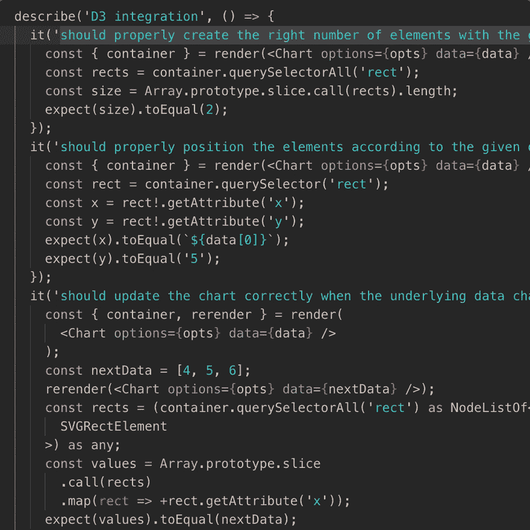

# Vs 代码每周一个技巧:代码折叠

> 原文：<https://dev.to/aurelio/vs-code-one-tip-a-week-code-folding-585l>

代码折叠可以使浏览长文件更容易。当我们试图专注于大局而不被小细节分散注意力时，代码折叠可以是一个无价的帮助。

* * *

这是一个学习如何充分利用 Vs Code 键盘快捷键而不感到不知所措的努力。

学习如何在没有鼠标的情况下使用我们最喜欢的 IDE 会有很大的不同。
由于像 Jetbrains 的惊人的[键推广器这样的扩展似乎](https://plugins.jetbrains.com/plugin/4455-key-promoter)[远不是现在的现实，至少](https://github.com/Microsoft/vscode/issues/26729)是这样，我开始一口一口地收集我最喜欢的键盘技巧。

这个想法很简单:找到一个你喜欢的技巧，练习一整周，直到你真正掌握了它，并使它成为你工作流程的一部分，然后进入下一个。

* * *

[](https://res.cloudinary.com/practicaldev/image/fetch/s--iKxkNgVO--/c_limit%2Cf_auto%2Cfl_progressive%2Cq_66%2Cw_880/https://media.githubusercontent.com/media/nobitagit/blog-files/mastimg/2019-7-26-vscode-tip-code-folding.gif)

折叠积木

```
⌘ + OPTION + [ 
```

展开它:

```
⌘ + OPTION + ] 
```

## 带有 Vim 扩展的 Vs 代码的用户

以上命令适用于 VsCode 的所有用户。那些使用像 VsCodeVim 或 amVim 这样的 vim 仿真扩展的用户将有一对额外的快捷方式可供选择。

要折叠积木，切换到正常模式并:

```
z + c 
```

其中“c”代表“接近”。

展开:

```
z + o 
```

其中“o”代表“开放”。

## 进一步快捷键

请注意，您也可以折叠和展开整个文件，但我发现这没什么用处，也从未真正觉得有必要记住这种快捷方式组合。

## 资源

*   AmVim [备忘单](https://github.com/aioutecism/amVim-for-VSCode/issues/1)
*   封面图片由 [Joshua Hoehne](https://unsplash.com/@mrthetrain) 拍摄

*最初发表于[我的博客](https://nobitagit.github.io/blog/vscode-tip-code-folding/)。*