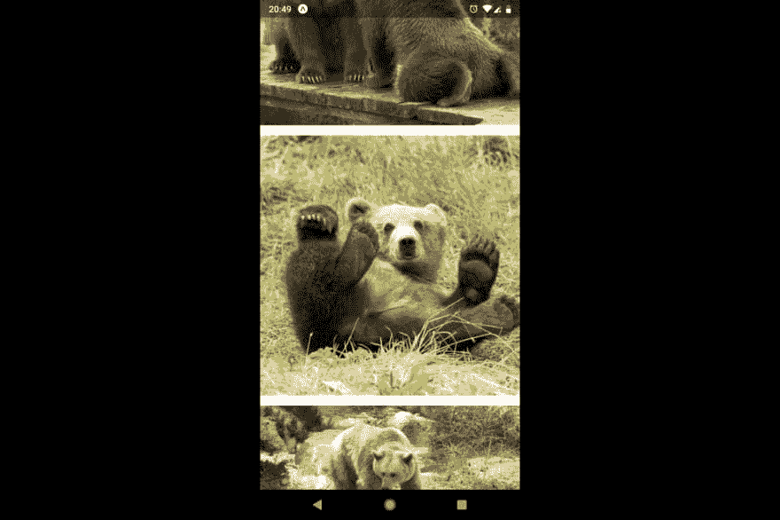
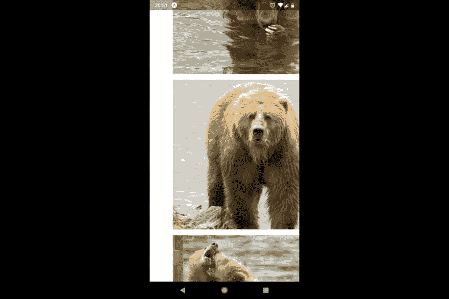
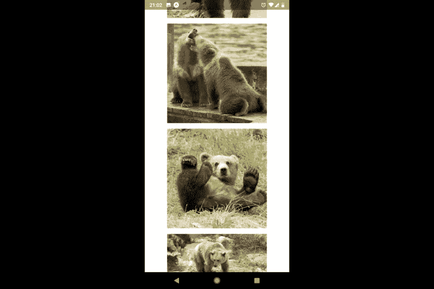

# react Native-aspectation Style 属性

> 原文：<https://dev.to/hrastnik/the-react-native-aspectratio-ge3>

许多 React 本地开发人员都有 web 背景。他们习惯于使用 CSS，因为 React Native styling 基本上是 CSS 的精简版本，这意味着他们很快就会习惯它。然而，在 React Native 中有一个我觉得非常有用的特性是在网上找不到的——所以很多开发者甚至没有意识到它的存在。我说的是抽象风格的道具。

那是什么呢？你为什么要用它？想象一下这个场景。你想创建一个充满图像的可滚动屏幕。所有的图像都是完美的正方形，占据了屏幕的宽度。

那么如何得到图像的高度呢？这很简单——你只需要用窗口的宽度来表示宽度和高度，对吗？像这样:

```
function Card({ item: uri }) {
  const { width } = Dimensions.get("window");
  return (
    <Image
      source={{ uri }}
      style={{
        width: width,
        height: width
      }}
    />
  );
} 
```

您使用一个平面列表来呈现这样的卡片，甚至添加一个别致的分隔符。

```
<FlatList
  style={{ flex: 1 }}
  ItemSeparatorComponent={() => <View style={{ height: 16 }} />}
  data={images}
  renderItem={Card}
  keyExtractor={image => image}
/> 
```

[](https://res.cloudinary.com/practicaldev/image/fetch/s--Mg0enqQH--/c_limit%2Cf_auto%2Cfl_progressive%2Cq_auto%2Cw_880/https://thepracticaldev.s3.amazonaws.com/i/7gy4ok85z6oapvsg2obp.jpg)

因此，这工作得很好，但是让我们说一段时间后，你必须做一些调整，并添加一些水平填充到平面列表-这里是你会得到的。

```
<FlatList
  style={{ flex: 1 }}
  contentContainerStyle={{ padding: 64 }} /* ADDED THIS */ 
  ItemSeparatorComponent={() => <View style={{ height: 16 }} />}
  data={images}
  renderItem={Card}
  keyExtractor={image => image}
/> 
```

[](https://res.cloudinary.com/practicaldev/image/fetch/s--VkBCiZfF--/c_limit%2Cf_auto%2Cfl_progressive%2Cq_auto%2Cw_880/https://thepracticaldev.s3.amazonaws.com/i/7nm87mdgpmsysxxg50um.jpg)

我们的 UI 坏了。这是因为图像与我们的屏幕一样宽，并且通过填充它们延伸到屏幕之外。问题是我们使用尺寸来设置宽度——这显然是我们不希望的，因为这会使我们的组件变得脆弱。

因此，我们需要做的是使图像采取所有可用的宽度，并仍然保持 1:1 的纵横比。这种风格的道具正是如此。

简单地像这样使用它:

```
function Card({ item: uri }) {
  return (
    <Image
      source={{ uri }}
      style={{
        width: "100%",
        aspectRatio: 1
      }}
    />
  );
} 
```

如果 parents 视图将其 alignItems 样式属性设置为`stretch`(这是默认设置)，您甚至不必指定`width: "100%"`，因为所有的子视图都将拉伸以填充所有可用的宽度。

```
function Card({ item: uri }) {
  return (
    <Image
      source={{ uri }}
      style={{ aspectRatio: 1 }}
    />
  );
} 
```

这是结果。

[](https://res.cloudinary.com/practicaldev/image/fetch/s--maAMzpJF--/c_limit%2Cf_auto%2Cfl_progressive%2Cq_auto%2Cw_880/https://thepracticaldev.s3.amazonaws.com/i/tr9chfln2lu0stgeisau.jpg)

尽可能使用`aspectRatio`,避免使用 Dimensions API 抓取窗口宽度。`aspectRatio`可以让你的组件更好的适应变化，反过来让你的 UI 更稳定。

有一个警告——这(还)不适用于 react-native-web，所以如果你正在使用它，最好避免它。