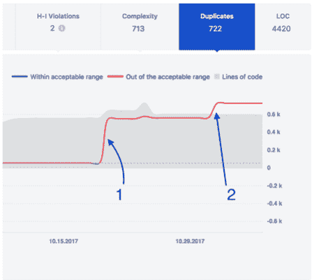
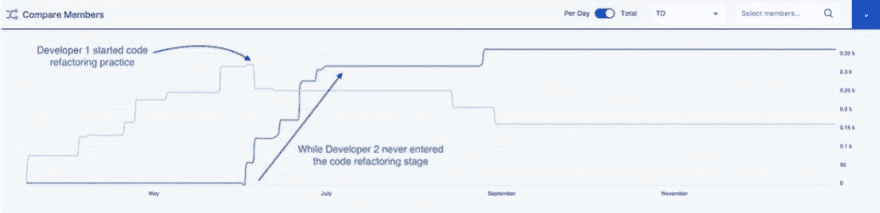

# 引擎盖下是什么？对于非机械或代码质量的管理者

> 原文：<https://dev.to/diligences/what-s-under-the-hood-for-non-mechanics-or-code-quality-for-managers-5ap6>

## 提前思考

所以我们是在软件行业，或者至少软件在这个行业中占了相当大的一部分。

业务人员或经理希望从技术人员那里得到的是及时、在预算范围内且不中断业务的功能。有时候就是这样..基本不会。但是更重要的是你得到的是有序的特性之外的东西，通常你得到的不仅仅是在发布当天工作良好的有序的功能。

您得到的系统应该:

*   工作稳定。它不应该在每周下午 5 点或类似的时间掉下来；
*   具有可维护性。保持软件每天正常运行不应该花费很多钱；
*   具有可扩展性。如果你的业务扩展，软件应该跟随甚至继续增长。

在实践中，我从及时交付且符合预算的软件中了解到以下案例:

*   难以摆脱的小故障和不愉快的用户不断打来电话；
*   随着时间的推移，软件的维护花费越来越多的钱；
*   让人们用这个软件工作越来越难了。

或者最难的一击:一家企业因为软件长期落后而倒闭，利润空间萎缩到无法重写软件，也没有时间重写软件。

## 挑战管理

问题是——作为管理层，我们今天能做些什么来降低这种情况发生的几率？

我们应该做出更好的决定，并且更早地了解是否有任何错误可能很快发生。我们掌握的信息越多，我们为观察决策做的准备就越充分。

但是在管理层面上，我们大多与业务逻辑层面下发生的事情隔绝。

代码质量是重要的信息层，作为管理者或所有者，它可以让你知道引擎盖下是什么。它被认为是高度技术性的，但我们正试图让非技术经理、高管、董事和企业主也能使用它。

通过了解引擎盖下的东西，我们成功地:

*   将重复出现的错误数量从 20%减少到 5%。
*   创建维护和更新工作量减少 3 倍的软件。

这意味着类似的复杂性软件需要 6 个开发人员来支持，现在只需要 2 个。

## 我们是如何开始的

首先，我们决定在一个有 300 名专业人员(大多数是软件开发人员)的公司内致力于代码质量。我们已经建立了实验室，用于分析代码质量，并从公司内部编写的代码中提取有意义的见解。我领导着这个实验室，并自豪地分享它背后发生的事情。

我们在管理层使用代码质量指标来:

*   支持观察决策；
*   在公司的不同部门和办公室之间标准化软件开发的质量；
*   增加开发过程的透明度，这样开发人员就可以随时调整。

事实上，我们已经编写了自己的软件来完成这些工作。

它始于众所周知的 Sonar Qube([https://www.sonarqube.org/](https://www.sonarqube.org/))，它是开源的，受到全球 5 万家公司的信任。肯定有用。虽然过了一段时间，我们发现它没有为非技术人员提供必要的视角。所以我们一直把它作为一个可靠的引擎，我们的界面在它上面。

## 它是如何起作用的

这里有两个故事，我们根据代码质量度量标准做出了决定。

**复制粘贴为信号**

一个新的开发人员加入了团队。他似乎工作得还可以。他花了更多的时间来交付一个功能，但这是可以忍受的。

然后，一个复制指标开始显示有将近 600 行代码被复制，然后又有 100 多行。

软件向我们显示了事情发生的确切日期。开发商被询问，但答案似乎没有解释他为什么做出这些决定。技术领导介入了。他审查了代码，发现编码水平远低于团队标准，并且几乎不可能扩展。

结果，为开发人员创建了个人发展计划(PDP ),他开始接受概述和范围有限的任务，以便能够处理它们。

在三个月的时间里，他的代码被仔细检查，有了明显的改进。

**谁做代码重构，谁不做**

这是一个致力于我们产品的团队。比较了两个具有相同技能水平的开发者的技术债务动态。

看起来动力是不同的。一个开发者在积累了技术债务后放弃了它，通常是在任何大任务开始 2 个月后。第二个开发者的技术债务从未减少。从来没有，从来没有，在几个被检查的项目中。

我们决定，每个从事该项目的开发人员都需要进行代码重构，并且必须至少在每个星期五进行 4 个小时。

结果，在 3 个月内，我们看到项目中产生的功能性错误数量减少了 18%，技术债务减少了 15%。

代码库的大小减小了，通过增加可读性使其更易于维护。

## 要约

我们积累的代码质量专业知识和吉拉的代码质量特别有助于我个人和我们的经理快速观察到幕后发生的事情。

让非技术经理能够:

*   讨论技术问题，提出正确的问题；
*   触发流程改进；
*   更好地了解开发团队；
*   更深入地了解项目中发生的事情。

我们提供:

1.  如果您需要，我们的专业知识；
2.  我们的免费吉拉插件来试试吧:[https://market place . atlassian . com/apps/1218553/code-quality-for-jira？托管=云&选项卡=概述](https://marketplace.atlassian.com/apps/1218553/code-quality-for-jira?hosting=cloud&tab=overview)

## 计划(代替奖状)

目前，我们:

*   分析了 2.5bln 行代码；
*   处理了 172，000 个代码库；
*   我们团队中的两位数据科学博士创建并实施了 6 个分类模型。

目前，我们正在继续深化对现实世界数据的分析，以从手头的代码中获得更多见解，甚至自动化建议服务，为经理提供有意义和可操作的建议。

网络版将于今年晚些时候推出。

谢谢大家！