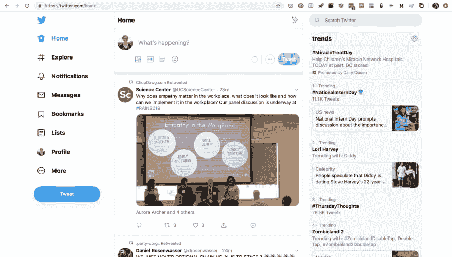
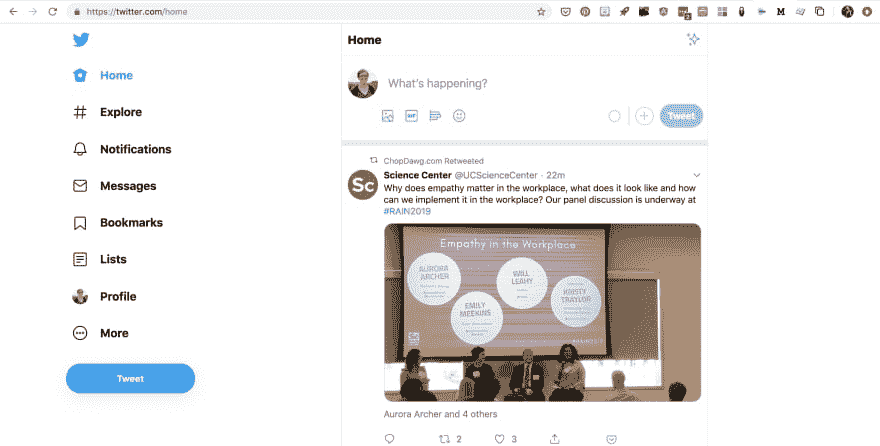

# 隐藏新的 Twitter 侧边栏:一个简单的本地托管的 Chrome 扩展

> 原文：<https://dev.to/amberwilkie/hide-the-new-twitter-sidebar-a-simple-locally-hosted-chrome-extension-f7>

在看到人们抱怨 Twitter 的新设计好几天后，我终于明白了。的确，页面的内容似乎已经丢失了。在意识到我可以通过简单地隐藏右侧栏来快速摆脱它之后，我决定写一个 Chrome 扩展，这样我就不用再去做了。

要安装这个家伙，请访问 github repo 并按照自述文件的说明进行操作。如果你从来没有玩过 Chrome 扩展，这是一个很好的介绍——一个非常简单的扩展，可以在一个页面上调整 CSS。扩展真的很棒，你可以用它们做很多事情。

该扩展将在您的计算机上本地运行。如果任何时候你想再次看到侧边栏，只需关闭扩展(在`chrome://extensions`)或点击扩展的小图标并移除其权限。

微博快乐！