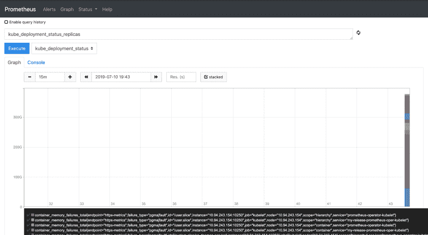
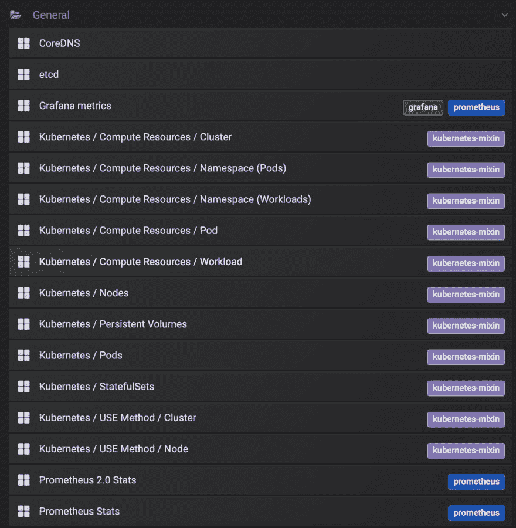
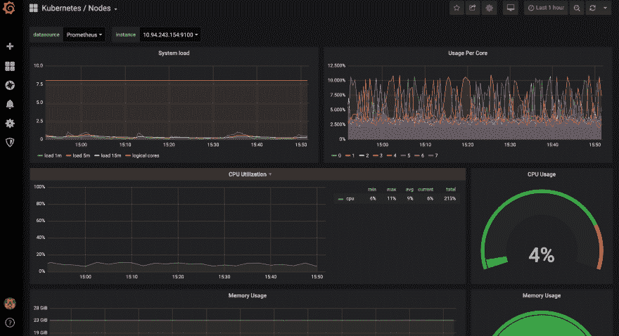
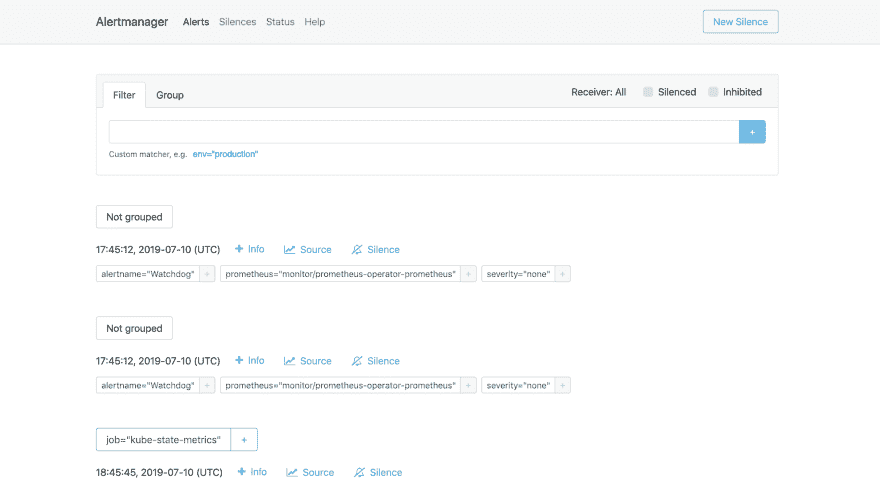

# 用普罗米修斯监控 Kubernetes

> 原文：<https://dev.to/rayandasoriya/kubernetes-monitoring-with-prometheus-2l7k>

微服务架构将成为未来几年软件开发中的重要特征之一。将大型整体应用程序打包到小容器中有很多好处。我能想到的一个关键优势是，如果某些事情失败，那么应用程序的一部分将会关闭，它可以自动修复，而不是使整个应用程序崩溃。这就是当 Instagram、脸书和 Whatsapp 崩溃时，只有某些功能停止工作的原因之一。整个应用程序仍在运行。这有很大的好处。此外，当对特定服务或组件的需求增加时，可以很容易地增加或减少组件的数量。我这里提到的小容器是 Docker 容器，应用程序部署在 Kubernetes 上。Kubernetes 是一个容器编排软件，它管理不同级别的容器，并允许管理这些容器的连接和端点。

Kubernetes 或 K8s 是一个开源的自我修复应用程序，它管理这些容器的部署、伸缩和操作。它最初是由谷歌开发的，但后来捐赠给了 CNCF。由于 Kubernetes 提供了大量的服务，因此需要一种更简单的方法来监控 Kubernetes 集群中的活动。这有可能是由[普罗米修斯](https://prometheus.io/)完成的。它是一个开源解决方案，用于监控指标和管理系统中的警报。它由 SoundCloud 开发，但后来加入 CNCF，成为继 Kubernetes 之后的第二个托管项目。Prometheus 提供了一套丰富的监控指标和警报管理系统，帮助开发人员监控任何异常活动或消耗并获得通知。

## 普罗米修斯符

CoreOs 推出了[普罗米修斯操作员](https://github.com/coreos/prometheus-operator)来简化 K8s 与普罗米修斯的整合过程。在安装和配置集群时，它会保留 K8s 和 Prometheus 的配置。它可以轻松监控 K8s 服务和部署，并管理 Prometheus、Grafana 和 Alertmanager 配置。
当部署应用程序的新版本时，K8s 管理新 pod 的创建并删除旧的 pod。另一方面，Prometheus 会持续监视 K8s API，并根据服务/pods 的变化，在检测到变化时创建新的 Prometheus 配置。它使用 ServiceMonitor，一个 CRD(自定义资源定义)，将配置抽象为目标。

## 安装

### 先决条件

*   库伯内特斯
*   helm(K8s 的软件包安装程序)

### 步骤

在不同的名称空间中安装 Prometheus operator。最好将您的监控容器保存在单独的名称空间中。

```
$ helm install stable/prometheus-operator --name prometheus-operator --namespace monitor 
```

Enter fullscreen mode Exit fullscreen mode

如果一切都安装得很好，您可以看到这些可用的 pod:

```
$ kubectl get pods -n monitor
NAME                                                     READY   STATUS    RESTARTS   AGE
alertmanager-prometheus-operator-alertmanager-0          2/2     Running   0          13d
prometheus-operator-grafana-749b598b6c-t4r48             2/2     Running   0          13d
prometheus-operator-kube-state-metrics-d7b8b7666-zfqg5   1/1     Running   0          13d
prometheus-operator-operator-667dd7cbb7-hjbl6            1/1     Running   0          13d
prometheus-operator-prometheus-node-exporter-mgsqb       1/1     Running   0          13d
prometheus-prometheus-operator-prometheus-0              3/3     Running   1          13d 
```

Enter fullscreen mode Exit fullscreen mode

要运行仪表板，输入以下命令并转到`http://localhost:9000`。

```
$ kubectl port-forward -n monitor prometheus-prometheus-operator-prometheus-0 9090 
```

Enter fullscreen mode Exit fullscreen mode

### 普罗米修斯仪表盘

[](https://res.cloudinary.com/practicaldev/image/fetch/s--do69sJjr--/c_limit%2Cf_auto%2Cfl_progressive%2Cq_auto%2Cw_880/https://thepracticaldev.s3.amazonaws.com/i/ztrejj1mdkknfsto0664.png) 
您可以输入您的查询来获得关于任何特定实例的结果，甚至是它的一个图，如上图所示。
为了看到每一层的视觉表现，我们使用 Grafana。它提供了一些关于使用、健康和其他指标的很好的可视化见解。我们还可以添加更多自定义指标。我们将获得数据的实时分析。

```
$ kubectl port-forward $(kubectl get  pods --selector=app=grafana -n  monitor --output=jsonpath="{.items..metadata.name}") -n monitor  3000 
```

Enter fullscreen mode Exit fullscreen mode

转到`http://localhost:3000`，输入用户名“admin”和密码“prom-operator”。以下是可用的选项:

[](https://res.cloudinary.com/practicaldev/image/fetch/s--C-8Yli2_--/c_limit%2Cf_auto%2Cfl_progressive%2Cq_auto%2Cw_880/https://thepracticaldev.s3.amazonaws.com/i/iih0cf7ss3bhy7ohgl0k.png)

您可以通过选择任何一个选项来获得可视化图形。此处显示了节点级指标:
[](https://res.cloudinary.com/practicaldev/image/fetch/s--boZS7tBt--/c_limit%2Cf_auto%2Cfl_progressive%2Cq_auto%2Cw_880/https://thepracticaldev.s3.amazonaws.com/i/66znm7td8s6tvx2n8jce.png) 
我们可以通过多种方式配置警报。在执行了这个命令:
之后，我们可以通过转到`http://localhost:9093`来访问仪表板以配置 AlertManager

```
$ kubectl port-forward -n monitor alertmanager-prometheus-operator-alertmanager-0 9093 
```

Enter fullscreen mode Exit fullscreen mode

[](https://res.cloudinary.com/practicaldev/image/fetch/s--d7PyjKlc--/c_limit%2Cf_auto%2Cfl_progressive%2Cq_auto%2Cw_880/https://thepracticaldev.s3.amazonaws.com/i/9x1hllzbntj78nrjaruw.png) 
看起来会是这个样子。在这里，您可以添加更多警报，并且可以在 status 选项卡下看到 Slack API URL。我们可以在 Slack、HipChat 甚至电子邮件上设置通知。一些模板可以在[这里](https://prometheus.io/docs/alerting/notification_examples/?source=post_page)找到。

## 结论

微服务的使用将很快增加，监控指标和警报通知将成为其中的重要组成部分。Prometheus 通过简单的安装服务提供最佳的监控服务。