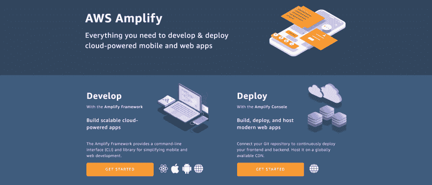
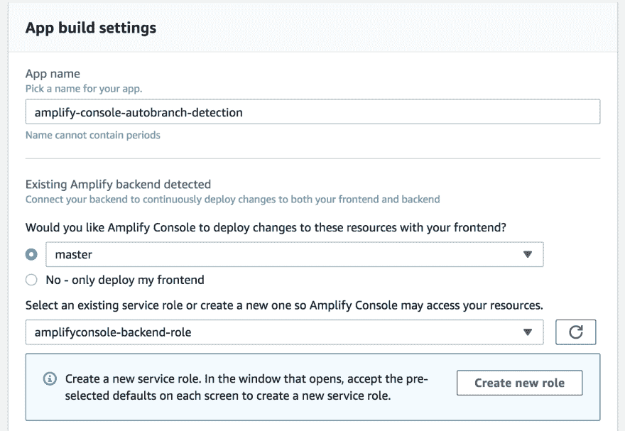
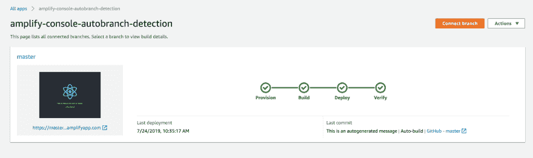
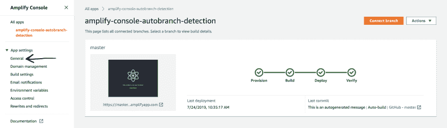
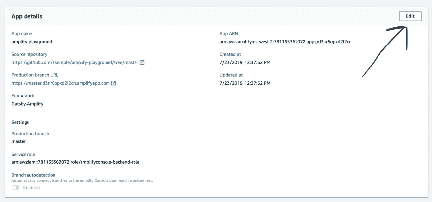
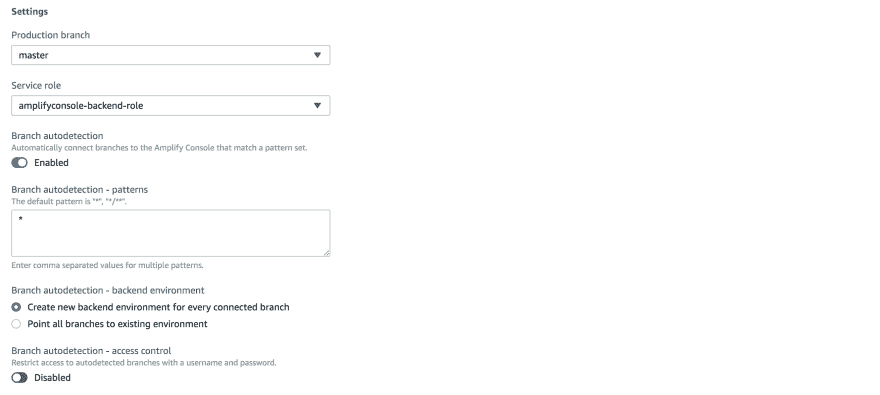
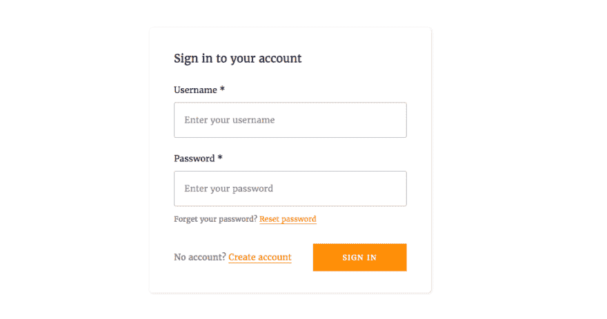

# 基于 AWS Amplify 控制台的分支机构部署策略

> 原文：<https://dev.to/kkemple/branch-based-deployment-strategies-with-aws-amplify-console-1n3c>

**建造所有的东西！**

AWS Amplify 控制台中新的分支自动检测特性允许您为 Git 存储库的所有分支部署整个环境。您还可以指定分支名称匹配模式，从而可以根据您的团队的工作方式(而不是 CI 的工作方式)快速轻松地设置自定义部署策略。

让我们来看看为推送到应用程序存储库的每个分支设置一个全新的环境。

第一步是将你的 Amplify 项目或静态应用/网站连接到 (如果你已经部署了一个应用，你可以跳到[这一部分](#setting-up-auto-branch-detection))。

## 在放大器控制台上设置项目

### 创建应用程序

对于这个例子，我将使用一个 [`create-react-app`](https://facebook.github.io/create-react-app/docs/getting-started) 和 [`Amplify Framework`](https://aws-amplify.github.io/) 来设置一个带认证的小应用程序。要设置您自己的应用程序，您可以跟随，或者使用下面的 1-click deploy 按钮来部署我将在此示例中使用的相同存储库。

[](https://console.aws.amazon.com/amplify/home#/deploy?repo=https://github.com/kkemple/amplify-console-autobranch-detection)

首先创建一个新的 React 项目:

```
npx create-react-app my-app 
```

接下来，您需要从`my-app`的根目录初始化 Amplify。

```
amplify init 
```

当您运行此命令时，会发生以下两种情况之一。如果您的计算机上有一些 AWS 用户配置文件，它会询问您是否要使用配置文件。(如果您有一个具有管理和编程权限的配置文件，请随意选择。)如果您还没有创建任何用户配置文件，或者您不确定当前的配置文件是否有效，那么 CLI 将指导您如何创建一个用户配置文件，甚至会为您打开 AWS 控制台并预先填充任何字段。(你基本上只需要点击几个按钮，很简单。)

> 要更深入地了解如何创建新的用户资料，请查看 Nader Dabit 的视频。

现在，Amplify 已正确配置，您可以开始在应用程序中设置 AWS 服务了。下一步是将应用程序提交到您选择的 git 存储库中。

### 将您的应用连接到 Amplify 控制台

要连接 Amplify 控制台中的应用程序，请导航至 https://console.aws.amazon.com/amplify/home 的[并点击`Deploy`部分下的`Get Started`。](https://console.aws.amazon.com/amplify/home)

[](https://res.cloudinary.com/practicaldev/image/fetch/s--IaC54lv_--/c_limit%2Cf_auto%2Cfl_progressive%2Cq_auto%2Cw_880/https://thepracticaldev.s3.amazonaws.com/i/j2myyrw35j77o0g38a02.png)

> 为了连接应用程序进行自动分支检测，您需要将应用程序存储在 Git 存储库提供程序中，如 GitHub、BitBucket 或 AWS CodeCommit。

接下来，选择要连接的源代码管理提供程序和存储库。一旦选择了存储库和主分支，点击`Next`。

为 Amplify backend 选择`master`进行部署，并选择(或创建一个角色)以便 Amplify Console 可以部署后端以及您的应用程序:

[](https://res.cloudinary.com/practicaldev/image/fetch/s--48Ewt5lN--/c_limit%2Cf_auto%2Cfl_progressive%2Cq_auto%2Cw_880/https://thepracticaldev.s3.amazonaws.com/i/g8g0mb0hhq0cld427j8f.png)

保持其余的构建设置不变，并再次点击`Next`。最后点击`Save and Deploy`。

一旦您的应用程序构建完成，您应该会看到类似这样的内容:

[](https://res.cloudinary.com/practicaldev/image/fetch/s--vxHVE2ij--/c_limit%2Cf_auto%2Cfl_progressive%2Cq_auto%2Cw_880/https://thepracticaldev.s3.amazonaws.com/i/l5tscs3wh6yu19fev18c.png)

现在您已经连接了一个应用程序，是时候为您的所有分支设置构建了，这些分支将被推送到您的存储库！

## 设置自动分支检测

### 配置

要设置基于分支的自动部署，请导航至您想要配置部署的应用，并从`App settings`菜单中选择`General`。

[](https://res.cloudinary.com/practicaldev/image/fetch/s--FqcaV6yF--/c_limit%2Cf_auto%2Cfl_progressive%2Cq_auto%2Cw_880/https://thepracticaldev.s3.amazonaws.com/i/5e7r81vkxdyr179fypic.png)

接下来，点击`App Details`部分的`Edit`:

[](https://res.cloudinary.com/practicaldev/image/fetch/s--YfvDq5q4--/c_limit%2Cf_auto%2Cfl_progressive%2Cq_auto%2Cw_880/https://thepracticaldev.s3.amazonaws.com/i/r2s0hrnzsnxn6dh8b4xw.png)

一旦进入编辑模式，切换`Branch autodetection`开关并指定`*`为`Branch autodetection - patterns`输入的值。

确保`Create new backend environment for every connected branch`被选中，然后点击`Save`。

[](https://res.cloudinary.com/practicaldev/image/fetch/s--GhWwTfex--/c_limit%2Cf_auto%2Cfl_progressive%2Cq_auto%2Cw_880/https://thepracticaldev.s3.amazonaws.com/i/wyxxj2ydstioiwcv4k99.png)

> 我们在模式输入中使用了`*`,因为模式是正则表达式，所以在这种情况下，我们匹配所有的分支命名模式。然而，我们可以只部署遵循特定命名约定的分支，也许你只想部署发布分支，然后你可以做类似于`release-*`的事情来匹配任何以那个前缀开始的分支。

### 试探一下

为了确保分支将被部署，在本地创建一个名为`add-auth`的新分支。

接下来运行下面的 Amplify 命令:

```
amplify add auth 
```

运行该命令后，系统会询问您是否要使用默认配置来设置应用程序的身份验证。这是 AWS 的推荐身份验证设置。

> 如果您不熟悉如何配置自己的用户池和 Cognito 配置，请选择此选项。

接下来，您需要运行`amplify push`，以便可以在 AWS 中创建和配置资源。

在 Amplify 为您的认证服务创建远程资源之后，您需要在您的应用程序中设置 Amplify。为此，你需要安装必要的依赖项，然后在你的应用程序中配置 Amplify。

```
npm i aws-amplify aws-amplify-react

# OR

yarn add aws-amplify aws-amplify-react 
```

接下来，您需要在 src/aws-exports.js 中导入 Amplify 创建的配置，并将其传递给 Amplify 客户端。在`src/index.js`中，在`ReactDOM.render`调用之前添加以下内容:

```
import Amplify from "aws-amplify"
import awsExports from "./src/aws-exports"

Amplify.configure(awsExports); 
```

接下来，您需要在`src/App.js`中的`App`组件周围添加`withAuthenticator`组件。这是一个插件组件，为您的应用程序用户提供完整的身份验证流程。将`src/App.js`的内容替换为以下内容:

```
import React from "react";
import logo from "./logo.svg";
import "./App.css";
import { withAuthenticator } from "aws-amplify-react";

function App() {
  return (
    <div className="App">
      <header className="App-header">
        
        <p>
          Edit <code>src/App.js</code> and save to reload.
        </p>
        <a
          className="App-link"
          href="https://reactjs.org"
          target="_blank"
          rel="noopener noreferrer"
        >
          Learn React
        </a>
      </header>
    </div>
  );
}

export default withAuthenticator(App, true); 
```

如果您还没有启动应用程序，请从命令行运行`yarn start`以登录查看应用程序。如果您正在运行该应用程序，您现在应该会看到以下内容:

[](https://res.cloudinary.com/practicaldev/image/fetch/s--E_tSu5qa--/c_limit%2Cf_auto%2Cfl_progressive%2Cq_auto%2Cw_880/https://thepracticaldev.s3.amazonaws.com/i/dl011386ouzr2c1pwssn.png)

通过创建一两个用户并登录和退出来测试它。一旦您确认一切正常，就将您的更改提交到分支，并将其推送到您的远程存储库。

跳回放大器控制台，你应该会看到你的`add-auth`分支的另一个版本！构建完成后，遵循部署 URL 并尝试使用您在本地创建的用户登录。请注意，该用户并不存在。这是因为该分支机构部署了一个全新的后端！

> 您还可以为您的分支启用`access control`,这样就需要输入用户名和密码来访问部署(见下图)。

[](https://res.cloudinary.com/practicaldev/image/fetch/s--GjLCzMZU--/c_limit%2Cf_auto%2Cfl_progressive%2Cq_auto%2Cw_880/https://thepracticaldev.s3.amazonaws.com/i/lsuzzzkrjzsk1n427u70.png)

### 额外学分

如果你合并了`add-auth`分支，你将在`master`分支上得到另一个构建。构建完成后，尝试使用之前在本地创建用户登录。您应该能够登录，因为您的本地和主分支部署共享相同的后端。

最后，您可以在此找到有关 Amplify 控制台和基于功能的部署的更多信息:

*   [https://aws-amplify.github.io/docs/js/start](https://aws-amplify.github.io/docs/js/start)
*   [https://docs . AWS . Amazon . com/amplify/latest/user guide/multi-environments . html #基于模式的分支功能分支部署](https://docs.aws.amazon.com/amplify/latest/userguide/multi-environments.html#pattern-based-branch-feature-branch-deployments)
*   [https://amplify.aws/community/](https://amplify.aws/community/)

此外，如果你想了解我写的或正在做的最新事情，请在 Twitter 上关注我！