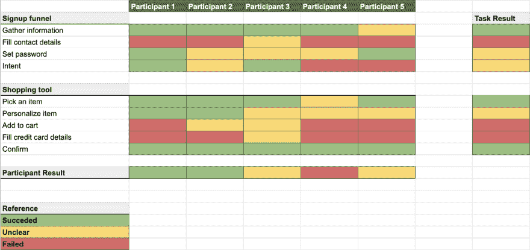

# 交通灯可用性报告——以及如何传达您的测试结果

> 原文：<https://dev.to/mfco/traffic-light-usability-report-and-how-to-communicate-your-test-results-3npn>

有时候，当你运行一些可用性测试时，很难得到量化的结果，更难将这些结果有效地传达给其他利益相关者。当你运行你的第一个可用性测试时，你得到的只是定性的数据，这是很常见的，其中大部分来自于你对参与者行为的分析，这也是很有价值的。但这并不总是向同事传达结果的最有效方式。

这就是为什么在你身边运行一个交通灯报告总是有用的，但是首先，我们需要知道什么是交通灯报告，以及它如何帮助我们将信息传递给公司的其他人。

## 红绿灯报告

红绿灯报告是一种直观的方式，可以指出用户在我们的应用程序中遇到的困难。它给我们的最重要的信息是**一个特定的任务对我们的用户来说有多难**，以及**我们的应用对每个特定用户来说有多难使用**。

这个系统非常简单，你写下一些你希望你的用户执行的任务，例如:*挑选一双鞋*。然后，您将这些任务交给您的用户，并检查他们执行这些任务的难易程度。

如果他们很清楚该做什么，你就给这个任务分配一个绿色的值。如果参与者发现一些困难，但能够在最少/没有指导的情况下完成任务，那么这就是*黄色*。另一方面，如果他需要帮助或者对他们来说真的很难，那么就是*红色*。

例如，您还可以添加另一个指标，如执行任务的时间。此指标可能有助于设置值。例如，如果您在不同的组中多次运行该任务，您可能会有一系列先前的结果，因此您可以假设某个特定的任务需要大约 5 秒钟，根据该信息，如果某个用户花费超过 10 秒钟来执行该任务，即使他不需要帮助，您也可以将他考虑到*黄色*组中。

## 举个例子更好理解

假设我们有一个在线购物应用程序。这个应用程序有一个复杂的注册漏斗，因为它试图从用户那里收集尽可能多的信息，以便在你注册后给出具体的建议，它还有一个购物工具，你可以在里面挑选产品并购买它。

我们将为可用性测试创建三个任务:

*   签约雇用
*   挑选一个项目
*   检验

这就是你需要聪明的地方，就像你只是选择小任务一样，因为选择一种颜色可能对参与者来说太具描述性，并给他一个额外的暗示，我们也不想给他们大量的任务去做，让他们不知所措。

例如，在这种情况下，我们将第一个任务分成四个子任务。我们还将另外两个任务分成三个和两个子任务。了解我们希望从这个测试中获得多大的粒度是很重要的。

在下图中，我们可以看到来自五个不同参与者的可用性测试结果，我们以一种易于阅读的方式进行了组织，我们还得到了每个参与者和每个任务的总体结果。重要的是要知道，一些对某些参与者来说非常困难的任务对另一个参与者来说可能非常容易。这时你的[角色分析](https://dev.to/mfco/why-are-personas-so-important-in-development-37c)需要像太阳一样发光。

从这个测试中，我们可以很容易地得到要改进的关键任务是:填写联系信息、添加到购物车和填写信用卡信息。作为一种常见的模式，我们也可以看到，当用户被要求填写一些东西时，我们正在努力，也许是时候重新思考我们的表单了。

这些结果可以很容易地传递给任何利益相关者，没有任何问题，因为我们可以看到报告非常简单，不言自明，你只需寻找红色部分，看看用户在哪里挣扎。如果我们增加完成每项任务的时间，那可能会更好。

## 结论

有时我们很难转移可用性测试的结果。这通常是因为我们没有以适当的方式获得定量结果，而是依赖于我们观察到的定性结果。但是有很多方法可以获得易读的报告，也可以为我们的利益相关者增加一些定量信息。