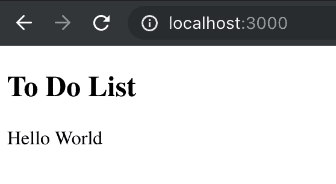
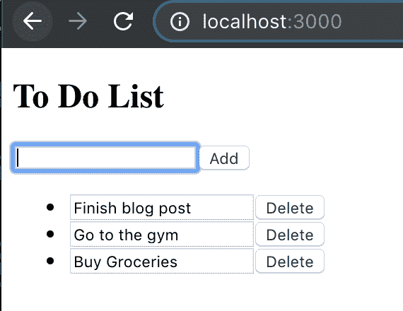
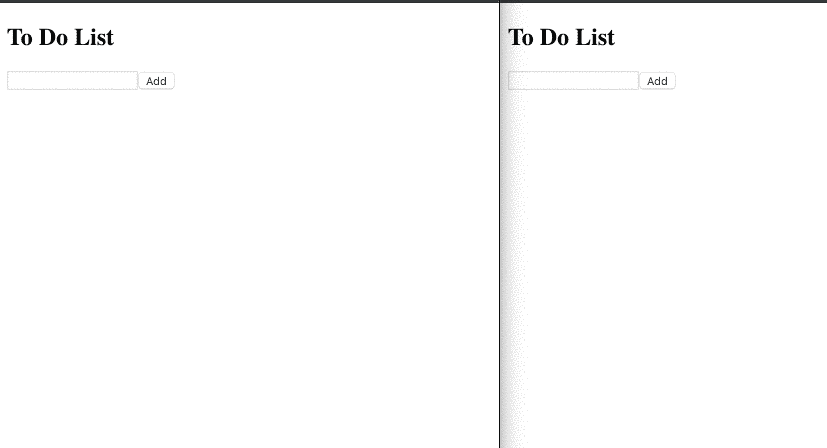

# 使用 Next.js、AWS Amplify & GraphQL 在服务器端渲染实时 Web 应用程序

> 原文：<https://dev.to/rakannimer/server-side-rendered-real-time-web-app-with-next-js-aws-amplify-graphql-2j49>

在这篇博文中，我们将通过 Next.js 和 AWS Amplify 构建一个服务器渲染的实时协作待办事项应用。

你可以在这里查看最终代码[，在这里](https://github.com/rakannimer/todolist-amplify-nextjs)查看演示[。](https://todolist-amplify-nextjs.rnim.now.sh)

*   [简介](#introduction)
*   [创建我们的应用框架](#creating-our-app-skeleton)
*   [添加离线功能](#adding-offline-functionality)
*   [为 Amplify GraphQL 转换准备 Graqhql 模式](#preparing-the-graqhql-schema-for-amplify-graphql-transform)
*   [在电脑上设置 AWS Amplify](#setting-up-aws-amplify-on-your-computer)
*   [创建 API](#creating-the-api)
*   [编辑后台](#editing-the-backend)
*   [在云端保存待办事项](#saving-todos-in-the-cloud)
*   [在服务器端获取初始待办事项](#fetching-initial-todos-on-the-server-side)
*   [收听他人添加的待办事项](#listening-to-todos-being-added-by-others)
*   [听别人修改删除的 todos】](#listening-to-todos-modified-and-deleted-by-others)
*   [立即部署我们的应用](#deploying-our-app-with-now)

## 简介

该应用程序将具有动态和静态路由，以演示如何根据传入的请求 url 从服务器加载和呈现数据。它订阅了对数据的修改，以展示如何使用 AWS Amplify 无缝地监听来自客户端的远程数据。

[](https://res.cloudinary.com/practicaldev/image/fetch/s--1f_x_DYZ--/c_limit%2Cf_auto%2Cfl_progressive%2Cq_auto%2Cw_880/https://thepracticaldev.s3.amazonaws.com/i/026cx817wn9ahvpnw4pb.png)

无论数据来自何处，Next.js 都使服务器端呈现变得容易。

AWS Amplify 是一个库和工具链，使从 AWS 设置、管理和使用无限可扩展的云基础设施变得轻而易举。

要使用它，你不需要熟悉 AWS 服务的其他部分，但是，如果你熟悉，你会注意到 Amplify 提供了一个抽象层，覆盖了流行的和经过实战测试的 AWS 云服务，如 AppSync、DynamoDB、Cognito、Lambda、S3 和许多其他服务。Amplify 将这些云服务打包在分析、授权、API、存储、发布订阅等类别下...如果你想了解更多，一定要去看看他们的网站。

请注意，您可以部署生产就绪型应用程序，而无需了解或手动管理任何这些服务。AWS Amplify 可能是您与云的唯一接触点。

说完了，我们开始吧！

## 创建我们的应用框架

首先，让我们建立一个目录并用 git
初始化它

```
mkdir todo-list
cd todo-list
npm init -y
git init 
```

到目前为止，我们已经有了一个目录，其中只包含我们的 package.json 和指定的默认值。

我们现在可以安装我们的依赖项了

```
 npm i react react-dom next immer nanoid
# If you're using typescript
npm i -D typescript -@types/react @types/react-dom @types/node 
```

> 请注意， [immer](https://github.com/immerjs/immer/) 和 [nanoid](https://github.com/ai/nanoid) 依赖关系不是必需的
> 
> 但 immer 将使我们更容易操纵反应状态和
> 
> nanoid 是一个很小的工具，可以为每个待办事项生成一个唯一的 id。

并将 3 个脚本添加到我们的`package.json`

```
{  "scripts":  {  "dev":  "next",  "build":  "next build",  "start":  "next start"  }  } 
```

接下来，我们需要为 web 应用程序创建一个主页，
当使用 Next.js 时，我们只需要创建一个名为 pages 的目录，并将我们的主文件 index.js(或 index.tsx)
放入其中

```
mkdir pages
touch pages/index.js # or pages/index.tsx 
```

我们的主页将返回应用程序外壳，以确认我们的设置是正确的。

```
import * as React from "react";

const App = () => {
  return (
    <>
      <header>
        <h2>To Do List</h2>
      </header>
      <main>Hello World</main>
    </>
  );
};
export default App; 
```

让我们现在运行它:

```
npm run dev 
```

Next.js 将为我们设置一个 tsconfig(如果我们使用 Typescript ),并在 localhost:3000 上启动一个服务器

访问它应该会给我们这样的东西:

[](https://res.cloudinary.com/practicaldev/image/fetch/s--uyTDjjla--/c_limit%2Cf_auto%2Cfl_progressive%2Cq_auto%2Cw_880/https://thepracticaldev.s3.amazonaws.com/i/6tpcjz46o5y47r4v0m8k.png)

## 添加离线功能

我们现在准备为我们的应用程序添加功能。

它应该有一个文本字段，旁边有一个按钮，以及一个可编辑和可删除的待办事项列表。

为了管理状态，我们将使用初始状态等于
的`React.useReducer`

```
{
  currentTodo:"",
  todos: []
} 
```

减速器将支持 4 个动作`add`、`update`、`set-current`和`delete`

看一些代码，我们的 reducer :

```
import produce from "immer";

/*<IfTypescript>*/
type Todo = {
  id: string;
  name: string;
  createdAt: string;
  completed: boolean;
};
type State = { todos: Todo[]; currentTodo: string };
type Action =
  | { type: "add" | "update" | "delete"; payload: Todo }
  | { type: "set-current"; payload: string };
/*</IfTypescript>*/

const reducer /*: React.Reducer<State, Action>*/ = (state, action) => {
  switch (action.type) {
    case "set-current": {
      return produce(state, draft => {
        draft.currentTodo = action.payload;
      });
    }
    case "add": {
      return produce(state, draft => {
        draft.todos.push(action.payload);
      });
    }
    case "update": {
      const todoIndex = state.todos.findIndex(
        todo => todo.id === action.payload.id
      );
      if (todoIndex === -1) return state;
      return produce(state, draft => {
        draft.todos[todoIndex] = { ...action.payload };
      });
    }
    case "delete": {
      const todoIndex = state.todos.findIndex(
        todo => todo.id === action.payload.id
      );
      if (todoIndex === -1) return state;
      return produce(state, draft => {
        draft.todos.splice(todoIndex, 1);
      });
    }

    default: {
      throw new Error(`Unsupported action ${JSON.stringify(action)}`);
    }
  }
}; 
```

UI 组件:

```
const App = () => {
  // The reducer defined before
  const [state, dispatch] = React.useReducer(reducer, {
    currentTodo: "",
    todos: []
  });
  const add = () => {
    dispatch({
      type: "add",
      payload: {
        id: nanoid(),
        name: state.currentTodo,
        completed: false,
        createdAt: `${Date.now()}`
      }
    });
    dispatch({ type: "set-current", payload: "" });
  };
  const edit = (todo /*:Todo*/) => {
    dispatch({ type: "update", payload: todo });
  };
  const del = (todo /*:Todo*/) => {
    dispatch({ type: "delete", payload: todo });
  };
  return (
    <>
      <header>
        <h2>To Do List</h2>
      </header>
      <main>
        <form
          onSubmit={event => {
            event.preventDefault();
            add(state.currentTodo);
          }}
        >
          <input
            type="text"
            value={state.currentTodo}
            onChange={event => {
              dispatch({ type: "set-current", payload: event.target.value });
            }}
          />
          <button type="submit">Add</button>
        </form>
        <ul>
          {state.todos.map(todo => {
            return (
              <li key={todo.id}>
                <input
                  type={"text"}
                  value={todo.name}
                  onChange={event => {
                    edit({ ...todo, name: event.target.value });
                  }}
                />
                <button
                  onClick={() => {
                    del(todo);
                  }}
                >
                  Delete
                </button>
              </li>
            );
          })}
        </ul>
      </main>
    </>
  );
}; 
```

在这一点上，我们有一个离线工作的待办事项应用程序。如果你正在跟随代码，现在可能是一个好时机，在开始将我们的应用程序与 AWS Amplify 集成之前创建一个提交。

> 在提交之前，确保添加一个. gitignore 文件
> 
> `printf "node_modules\n.next" > .gitignore`

[](https://res.cloudinary.com/practicaldev/image/fetch/s--LJvD4Zik--/c_limit%2Cf_auto%2Cfl_progressive%2Cq_auto%2Cw_880/https://thepracticaldev.s3.amazonaws.com/i/x6cw0kj5jnaxmsq7oyrf.png)

现在，让我们将我们的待办事项与云同步，以便能够与其他人共享和协作。

## 为 Amplify GraphQL 转换准备 Graqhql 模式

让我们快速了解一下什么是 GraphQL 放大变换。

> GraphQL 转换提供了一个简单易用的抽象
> ,帮助您在 AWS 上快速创建 web 和移动应用程序的后端。

通过它，我们使用 GraphQL SDL 定义了我们的数据模型，amplify cli 负责:

1.  为 CRUDL 操作提供/更新所需的基础设施。
2.  为客户端 crudling 生成代码

输入:GraphQL 数据形状。
输出:弹性基础设施和与之无缝交互的代码。

> CRUDL =创建读取更新删除列表

在我们的例子中，GraphQL 模式很简单，它由一个 Todo 类型和一个 TodoList 类型组成，后者包含一个 Todo 的排序列表:

```
type  Todo  @model  {  # ! means non-null GraphQL fields are allowed to be null by default  id:  ID!  name:  String!  createdAt:  String!  completed:  Boolean!  todoList:  TodoList!  @connection(name:  "SortedList")  userId:  String!  }  type  TodoList  @model  {  id:  ID!  createdAt:  String!  # Array of Todos sorted by Todo.createdAt  todos:  [Todo]  @connection(name:  "SortedList",  sortField:  "createdAt")  } 
```

> 我们将模式存储为`schema.graphql`,供以后重用。

GraphQL 转换模式中的`@model`指令告诉 Amplify 将待办事项视为模型，并将该类型的对象存储在 DynamoDB 中，并使用 AppSync 自动配置 CRUDL 查询和变异。

指令允许我们指定数据类型之间的 n 对 n 关系，并在服务器端进行排序。

点击阅读更多关于 GraphQL 转换和支持的指令[。](https://aws-amplify.github.io/docs/cli-toolchain/graphql)

如果你已经使用了 Amplify，你可以直接跳到[创建 API](#creating-the-api)

## 在电脑上设置 AWS Amplify

1.  [注册一个 AWS 账户](https://portal.aws.amazon.com/billing/signup#/start)
2.  安装 AWS Amplify cli:

```
npm install -g @aws-amplify/cli 
```

1.  配置放大命令行界面

```
amplify configure 
```

[阅读更多](https://aws-amplify.github.io/docs/cli-toolchain/quickstart?sdk=js)

## 创建 API

在我们的项目中，我们首先初始化 amplify。

```
npm i aws-amplify
amplify init
#<Interactive>
? Enter a name for the project (todolist) todolist
? Enter a name for the environment dev # or prod
? Choose your default editor: <MY_FAVORITE_EDITOR>
? Choose the type of app that you\'re building javascript # even if you're using typescript
? What javascript framework are you using react
? Source Directory Path: src
? Distribution Directory Path: out # Next.js exports to the out directory
? Build Command:  npm run-script build
? Start Command: npm run-script start
? Do you want to use an AWS profile? (Y/n) Y # Or use default
? Please choose the profile you want to use default
Your project has been successfully initialized and connected to the cloud!
# 🚀 Ready
#</Interactive> 
```

此时，应该已经创建了两个新文件夹:`src`和`amplify`
现在可以安全地忽略它们。

现在放大器已经初始化，我们可以添加它任何服务(Auth，API，Analytics...对于我们的用例，我们只需要使用 API 模块。所以我们使用
将其添加到项目中

```
amplify add api
? Please select from one of the below mentioned services GraphQL
? Provide API name: todolist
? Choose an authorization type for the API (Use arrow keys)
❯ API key
  Amazon Cognito User Pool
? Do you have an annotated GraphQL schema? (y/N) y # The one we saved earlier to schema.graphql
? Provide your schema file path: ./schema.graphql 
```

API 配置已准备就绪，我们需要将我们的云资源与当前配置同步:

```
amplify push
? Are you sure you want to continue? (Y/n) Y
? Do you want to generate code for your newly created GraphQL API (Y/n) Y # This code incredibly speeds up development
? Choose the code generation language target
❯ javascript
  typescript
  flow
? Enter the file name pattern of graphql queries, mutations and subscriptions src/graphql/**/*.js
? Do you want to generate/update all possible GraphQL operations - queries, mutations and subscriptions (Y/n) Y
? Enter maximum statement depth [increase from default if your schema is deeply nested] 2
⠼ Updating resources in the cloud. This may take a few minutes...
# Logs explaining what's happening
✔ Generated GraphQL operations successfully and saved at src/graphql
✔ All resources are updated in the cloud

GraphQL endpoint: https://tjefk2x675ex7gocplim46iriq.appsync-api.us-east-1.amazonaws.com/graphql
GraphQL API KEY: da2-d7hytqrbj5cwfgbbnxavvm7xry 
```

就这样🎉！我们的整个后端都准备好了，我们有客户端代码来查询它。

# 编辑后台

1.  编辑`amplify/backend/api/apiname/schema.graphql`。
2.  运行`amplify push`
3.  好了👍

# 在云端保存待办事项

在页面/索引中，我们从从`aws-amplify`
导入`API`和`graphqlOperation`开始，并用`src/aws-exports.js`
配置我们的 amplify 应用程序

```
import { API, graphqlOperation } from "aws-amplify";
import config from "../src/aws-exports";
API.configure(config);
// Should be a device id or a cognito user id but this will do
const MY_ID = nanoid(); 
```

接下来，如果你打开`src/graphql/mutations`,你会看到有一个 createTodo 字符串，它包含了 GraphQL 的变异来创建一个新的 Todo。

我们导入它，并在调度`add`动作后使用它。

```
const add = async () => {
  const todo = {
    id: nanoid(),
    name: state.currentTodo,
    completed: false,
    createdAt: `${Date.now()}`
  };
  dispatch({
    type: "add",
    payload: todo
  });
  // Optimistic update
  dispatch({ type: "set-current", payload: "" });
  try {
    await API.graphql(
      graphqlOperation(createTodo, {
        input: { ...todo, todoTodoListId: "global", userId: MY_ID }
      })
    );
  } catch (err) {
    // With revert on error
    dispatch({ type: "set-current", payload: todo.name });
  }
}; 
```

就这样，我们的 todos 现在被保存到一个高度可用的 DynamoDB 实例中，该实例是按请求计费的。

## 在服务器端获取初始 todos

我们希望我们正在构建的列表和其中的数据能够由服务器呈现并发送给客户端。
所以我们不能使用 React.useEffect 钩子来加载数据并将其存储在 state 中。

使用 Next.js 的`getInitialProps`异步方法，我们可以从任何地方获取数据，并将其作为道具传递给页面组件。

添加一个到我们的主页看起来会像这样

```
import { getTodoList, createTodoList } from "../src/graphql/queries";

// <TypescriptOnly>
import { GetTodoListQuery } from "../src/API";
// </TypescriptOnly>

App.getInitialProps = async () => {
  let result; /*: { data: GetTodoListQuery; errors: {}[] };*/
  try {
    // Fetch our list from the server
    result = await API.graphql(graphqlOperation(getTodoList, { id: "global" }));
  } catch (err) {
    console.warn(err);
    return { todos: [] };
  }
  if (result.errors) {
    console.warn("Failed to fetch todolist. ", result.errors);
    return { todos: [] };
  }
  if (result.data.getTodoList !== null) {
    return { todos: result.data.getTodoList.todos.items };
  }

  try {
    // And if it doesn't exist, create it
    await API.graphql(
      graphqlOperation(createTodoList, {
        input: {
          id: "global",
          createdAt: `${Date.now()}`
        }
      })
    );
  } catch (err) {
    console.warn(err);
  }
  return { todos: [] };
}; 
```

在我们的应用程序组件中，我们用用`getInitialProps`
发送的属性初始化我们的状态

```
//<TypescriptOnly>
import { GetTodoListQuery } from '../src/API'
type Props = {
  todos: GetTodoListQuery["getTodoList"]["todos"]["items"];
}
//</TypescriptOnly>

const App = ({ todos }/*:Props */) => {
const [state, dispatch] = React.useReducer(reducer, {
  currentTodo: "",
  todos
}); 
```

如果您现在尝试刷新页面，您应该会看到您的待办事项在两次刷新之间保持不变，并且它们按照添加时的顺序排序

## 听别人添加的 todos

在客户端上呈现应用程序后，我们希望听到来自其他用户的数据更改，这样我们就可以相应地更新我们的 UI。

我们将使用 GraphQL 订阅来监听添加、更新或删除 todo 的时间。

幸运的是，这不会花费超过几行来设置。

```
import { onCreateTodo } from "../src/graphql/subscriptions";
/*
With TS we create an Observable type to describe the return type of a GraphQL subscription.
Hopefully in future releases of aws-amplify we will have generic types for API.graphql that will make this un-necessary.
*/
type Observable<Value = unknown, Error = {}> = {
  subscribe: (
    cb?: (v: Value) => void,
    errorCb?: (e: Error) => void,
    completeCallback?: () => void
  ) => void;
  unsubscribe: Function;
};

// In our function component
const App = props => {
  // bla
  React.useEffect(() => {
    const listener /*: Observable<{
      value: { data: OnCreateTodoSubscription };
    }> */ = API.graphql(graphqlOperation(onCreateTodo));
    const subscription = listener.subscribe(v => {
      if (v.value.data.onCreateTodo.userId === MY_ID) return;
      dispatch({ type: "add", payload: v.value.data.onCreateTodo });
    });
    return () => {
      subscription.unsubscribe();
    };
  }, []);
  // blabla
}; 
```

## 听别人修改删除的 todos

我们将从订阅两份新的订阅开始`onUpdateTodo`和`onDeleteTodo`

```
import {
  onCreateTodo,
  onUpdateTodo,
  onDeleteTodo
} from "../src/graphql/subscriptions";
// <ts>
import { OnUpdateTodoSubscription, OnDeleteTodoSubscription } from "../src/API";

type Listener<T> = Observable<{ value: { data: T } }>;
// </ts>
// In our function component
const App = props => {
  // bla
  React.useEffect(() => {
    const onCreateListener: Listener<OnCreateTodoSubscription> = API.graphql(
      graphqlOperation(onCreateTodo)
    );
    const onUpdateListener: Listener<OnUpdateTodoSubscription> = API.graphql(
      graphqlOperation(onUpdateTodo)
    );
    const onDeleteListener: Listener<OnDeleteTodoSubscription> = API.graphql(
      graphqlOperation(onDeleteTodo)
    );

    const onCreateSubscription = onCreateListener.subscribe(v => {
      if (v.value.data.onCreateTodo.userId === MY_ID) return;
      dispatch({ type: "add", payload: v.value.data.onCreateTodo });
    });
    const onUpdateSubscription = onUpdateListener.subscribe(v => {
      dispatch({ type: "update", payload: v.value.data.onUpdateTodo });
    });
    const onDeleteSubscription = onDeleteListener.subscribe(v => {
      dispatch({ type: "delete", payload: v.value.data.onDeleteTodo });
    });

    return () => {
      onCreateSubscription.unsubscribe();
      onUpdateSubscription.unsubscribe();
      onDeleteSubscription.unsubscribe();
    };
  }, []);
  // blabla
}; 
```

这就是我们的最终结果，一个协作的实时待办事项列表

[](https://res.cloudinary.com/practicaldev/image/fetch/s--U44ug7er--/c_limit%2Cf_auto%2Cfl_progressive%2Cq_66%2Cw_880/https://thepracticaldev.s3.amazonaws.com/i/lq0h5jxart3e3hcmdt5n.gif)

我们的第一页已经完成，但我们仍然需要有我们自己的待办事项页面，并从我们的列表链接到它。

我们需要我们的个人待办事项被搜索引擎索引，所以我们需要从 url 中的 id 服务器呈现待办事项中的数据。

为此，我们在`pages/todo/[id].(t|j)sx`中创建新的 Next.js 动态路由，并使用`getInitialProps`异步方法用来自 AWS Amplify 数据源的数据填充它。

```
import * as React from "react";
import { API, graphqlOperation } from "aws-amplify";

import { getTodo } from "../../src/graphql/queries";
import config from "../../src/aws-exports";
// <ts>
import { GetTodoQuery } from "../../src/API";
type Props = { todo: GetTodoQuery["getTodo"] };
// </ts>
API.configure(config);

const TodoPage = (props /*: Props*/) => {
  return (
    <div>
      <h2>Individual Todo {props.todo.id}</h2>
      <pre>{JSON.stringify(props.todo, null, 2)}</pre>
    </div>
  );
};

TodoPage.getInitialProps = async context => {
  const { id } = context.query;
  try {
    const todo = (await API.graphql({
      ...graphqlOperation(getTodo),
      variables: { id }
    })) as { data: GetTodoQuery; errors?: {}[] };
    if (todo.errors) {
      console.log("Failed to fetch todo. ", todo.errors);
      return { todo: {} };
    }
    return { todo: todo.data.getTodo };
  } catch (err) {
    console.warn(err);
    return { todo: {} };
  }
};

export default TodoPage; 
```

最后，我们为每个待办事项添加一个链接

```
<a href={`/todo/${todo.id}`}>Visit</a> 
```

## 立即部署我们的应用程序

部署 Next.js 应用程序有两种方式:

1.  将其导出为 html 和静态资产，并从任何地方提供服务
2.  运行一个节点服务器，该服务器在每次请求时获取数据，并提供预先呈现的页面

我们不能将我们的项目导出到静态 html 应用程序，因为我们有一个动态路由`todo/[id]`,它在基于 url 渲染之前动态获取数据，并且我们的主路由需要最新的 todos 来预渲染。

如果没有这些约束，导出就像运行:`next build && next export`一样简单。

另一种方法是像部署任何节点服务器一样部署它，我们将使用这种方法。

部署 Node.js 服务器的最快方法是现在使用[现在使用](https://zeit.co/now)。

我们添加一个`now.json`文件，内容如下:

```
{  "version":  2,  "builds":  [{  "src":  "package.json",  "use":  "@now/next"  }]  } 
```

> 阅读更多关于 [`now.json`](https://zeit.co/docs/v2/advanced/configuration) 。

然后我们可以使用
进行部署

```
now 
```

就是这样！

我们已经使用 Next.js 和 AWS Amplify 构建并部署了一个 SEO 友好的服务器端渲染协作待办事项列表。

👋如果您有任何问题，欢迎在此发表评论或在 twitter 上联系我。