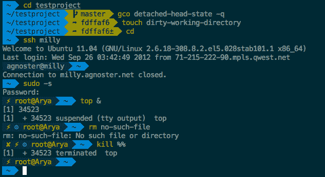

# 在 Bash 中创建一个动态提示字符串

> 原文：<https://dev.to/awwsmm/create-a-dynamic-prompt-string-in-bash-3617>

你可能见过一些很酷的`zsh`提示，在提示中显示当前 Git 分支的名称，像这个来自 [`oh-my-zsh`](https://github.com/robbyrussell/oh-my-zsh) :

[](https://github.com/robbyrussell/oh-my-zsh)

我想在`bash`中重新创建类似的东西，并发现生成动态的`bash`提示实际上非常容易。先来个无聊的老静态提示:

```
$ export PS1="\n$ "

$ ls Applications      Documents         Dropbox           Library
Desktop           Downloads         Git               Movies

$ 
```

Enter fullscreen mode Exit fullscreen mode

这将我的提示符设置为一个`$`符号，前面有一个换行符，这样前一个命令的输出就不会直接与下一个提示符相邻。要向 bash 提示符添加一个函数，我们需要做的就是将它作为 subshell 包含在`PS1`的定义中，确保转义 subshell 语法开头的`$`，比如:

```
$ export PS1="\n\$(date)\n$ "

Thu 25 Jul 2019 14:27:23 IST
$ ls Applications      Documents         Dropbox           Library
Desktop           Downloads         Git               Movies

Thu 25 Jul 2019 14:27:25 IST
$ 
```

Enter fullscreen mode Exit fullscreen mode

现在，为了检查我们在`git`项目中的哪个分支，我们可以做

```
Thu 25 Jul 2019 14:32:12 IST
$ git status
On branch my-test-branch
Your branch is up to date with 'origin/my-test-branch'.

nothing to commit, working tree clean 
```

Enter fullscreen mode Exit fullscreen mode

这在第一行给出了当前的分支名称。我们可以用`grep`选择该行并用`sed` :
解析它

```
Thu 25 Jul 2019 14:34:45 IST
$ git status | grep 'On branch' | sed 's/On branch / => /'
 => my-test-branch 
```

Enter fullscreen mode Exit fullscreen mode

但如果我们不在回购范围内，会发生什么？

```
Thu 25 Jul 2019 14:35:06 IST
$ cd Thu 25 Jul 2019 14:35:12 IST
$ git status | grep 'On branch' | sed 's/On branch / => /'
fatal: not a git repository (or any of the parent directories): .git 
```

Enter fullscreen mode Exit fullscreen mode

Oof，错误文本。让我们将所有错误输出重定向到`/dev/null` :

```
Thu 25 Jul 2019 14:35:26 IST
$ git status 2>/dev/null | grep 'On branch' | sed 's/On branch / => /' 
```

Enter fullscreen mode Exit fullscreen mode

当当前目录不是一个`git` repo 时，现在没有任何输出，所以`grep`不返回任何内容，`sed`也是如此。最后，我们把这个加到提示里:

```
Thu 25 Jul 2019 14:35:36 IST
$ export PS1="\n\$(date)\$(git status 2>/dev/null | grep 'On branch' | sed 's/On branch / => /')\n$ "

Thu 25 Jul 2019 14:35:41 IST
$ cd Git/my_git_project/

Thu 25 Jul 2019 14:35:49 IST => my-test-branch
$ git checkout master
Switched to branch 'master'
Your branch is up to date with 'origin/master'.

Thu 25 Jul 2019 14:35:53 IST => master
$ 
```

Enter fullscreen mode Exit fullscreen mode

就是这样！现在，您拥有了与那些显示当前`git`分支的花哨样式的 shells 相同的功能。只要给它加点颜色，你就可以走了。