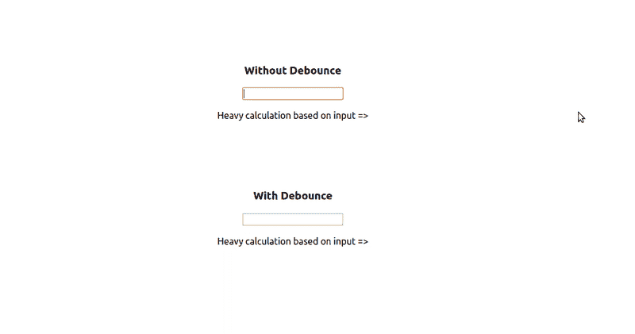

# 如何去抖渲染一个 React 组件？(举例)

> 原文：<https://dev.to/botreetechnologies/how-can-we-debounce-render-a-react-component-with-example-33gj>

## 什么是去抖？

据[https://www.geeksforgeeks.org/debouncing-in-javascript/](https://www.geeksforgeeks.org/debouncing-in-javascript/)

JavaScript 中的去抖动是一种用来提高浏览器性能的做法。网页中可能有一些功能需要**耗时的计算**。如果频繁调用这种方法，可能会极大地影响浏览器的性能，因为 JavaScript 是单线程语言。去抖动是一种编程实践，用于确保耗时的任务不会过于频繁地触发，以免影响网页的性能。换句话说，它**限制了函数被调用的速度**！

[](https://res.cloudinary.com/practicaldev/image/fetch/s--PQ8QWC39--/c_limit%2Cf_auto%2Cfl_progressive%2Cq_auto%2Cw_880/https://www.botreetechnologies.com/blog/wp-content/uploads/2019/07/interesting.png)

是的，听起来很有趣！！！下一个问题是我们如何在 [React JS](https://www.botreetechnologies.com/blog/the-rising-popularity-of-reactjs-in-the-it-industry) 中使用它？

答案是[反应-去抖-渲染](https://github.com/podefr/react-debounce-render)！

`react-debounce-render`是一个**高阶组件**，它包装你的 react 组件并对它们的渲染去抖。

当 react 组件快速接收到新的道具时，可以使用该方法来防止额外的渲染，方法是延迟渲染的触发，直到更新变得不那么频繁。这样做将改善应用程序的整体呈现时间，从而改善用户体验。它在引擎盖下使用 lodash 去抖。深入了解更多关于纽约网络开发专家的信息，了解提高或构建项目质量和整个公司的各种方法。

### 阅读还:[顶级库配合高级 React JS 应用使用！](https://www.botreetechnologies.com/blog/top-libraries-to-use-with-advanced-react-js-applications)

你可以在 https://github.com/AnkurVyas-BTC/react-debounce-example 找到我的全部源代码

让我们看看如何在我们的大型 [React 应用程序](https://www.botreetechnologies.com/react-native-development)中使用 react-debounce-render！

[](https://res.cloudinary.com/practicaldev/image/fetch/s--bbKLq097--/c_limit%2Cf_auto%2Cfl_progressive%2Cq_66%2Cw_880/https://raw.githubusercontent.com/AnkurVyas-BTC/react-debounce-example/master/Final%2520debouce.gif)

这里只有两样东西-

**1。简单的文本框**
**2。基于输入文本显示数据**

在我的示例应用程序中，我所做的是在 2 秒钟后打印输入的文本。你可以认为这是一个非常耗时的计算。

```
import React, { Component } from 'react';

class Calculator extends Component {

  sleep = (milliseconds) => {
    var start = new Date().getTime();
    for (var i = 0; i < 1e7; i++) {
      if ((new Date().getTime() - start) > milliseconds) {
        break;
      }
    }
  }

  timedOutDisplay = (inputVal) => {
    this.sleep(2000);
    return `Heavy calculation based on input => ${inputVal}`;
  }

  render() {

    return (
      <React.Fragment>
        {this.timedOutDisplay(this.props.inputVal)}
      </React.Fragment>
    );
  }
}

export default Calculator; 
```

代码`this.sleep(2000)`允许增加 2 秒延迟。

例子如下-

**1。无去抖渲染**

如果您键入任何文本(GIF 中的`12345`),输入将变得不可用并阻塞 UI。

从 1 到 2，从 2 到 3，从 3 到 4，从 4 到 5，每一个变化都会发生。所以你会看到-

基于输入的繁重计算=> 12345

**大约 10 秒后(每次输入后延迟 2 秒)**

**2。带去抖渲染**

我们可以通过添加两行来使任何组件去抖。

导入去抖渲染并在去抖渲染中包装组件

```
import debounceRender from 'react-debounce-render';

export default debounceRender(WithDebounceCalculator, 500); 
```

看下面的例子

```
import React, { Component } from 'react';
import debounceRender from 'react-debounce-render';

class WithDebounceCalculator extends Component {

  sleep = (milliseconds) => {
    var start = new Date().getTime();
    for (var i = 0; i < 1e7; i++) {
      if ((new Date().getTime() - start) > milliseconds) {
        break;
      }
    }
  }

  timedOutDisplay = (inputVal) => {
    this.sleep(2000);
    return `Heavy calculation based on input => ${inputVal}`;
  }

  render() {

    return (
      <React.Fragment>
        {this.timedOutDisplay(this.props.inputVal)}
      </React.Fragment>
    );
  }
}

export default debounceRender(WithDebounceCalculator, 500); 
```

现在，如果你输入任何文本(GIF 中的`12345`),输入非常流畅，不会阻塞用户界面。
If 会拿零钱 12345 作为收藏。所以你会看到-

基于输入的繁重计算=> 12345

**大约 2 秒后**

当你使用需要大量计算的过滤器时，去抖渲染是一个合适的选择！