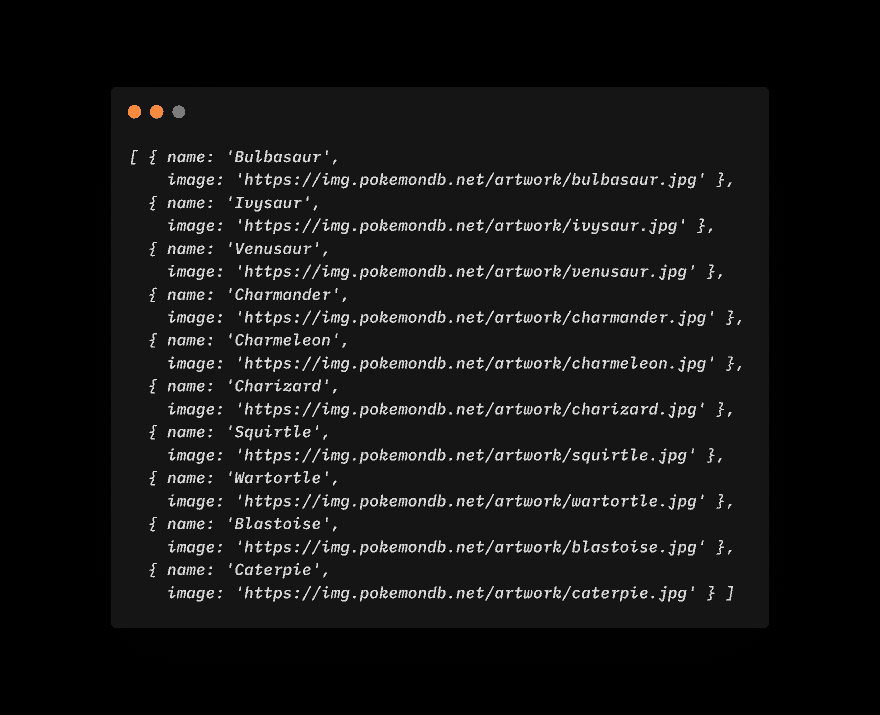

# 用 Javascript 和 Pokemon 模式与 GraphQL 服务器通信的初学者指南

> 原文：<https://dev.to/graphqleditor/beginners-guide-to-communication-with-graphql-server-in-javascript-with-pokemon-schema-5e1l>

首先，我想告诉你我创建的工具`graphql-zeus`是在 fetch 函数之上的 GraphQL 客户端。这意味着什么？基本上，您将 Zeus 指向 GraphQL 模式，它就会为您生成库。

听起来很有趣？这甚至更有趣，因为您不必了解 GraphQL 的查询语言，因为 Zeus 为您提供了自己的 GraphQL 查询，就像自动完成语法一样。

创建项目文件夹:

```
mkdir zeus-tutorial
cd zeus-tutorial 
```

<svg width="20px" height="20px" viewBox="0 0 24 24" class="highlight-action crayons-icon highlight-action--fullscreen-on"><title>Enter fullscreen mode</title></svg> <svg width="20px" height="20px" viewBox="0 0 24 24" class="highlight-action crayons-icon highlight-action--fullscreen-off"><title>Exit fullscreen mode</title></svg>

那我们开始吧。首先，您必须初始化一个新的 npm 包:

```
npm init 
```

<svg width="20px" height="20px" viewBox="0 0 24 24" class="highlight-action crayons-icon highlight-action--fullscreen-on"><title>Enter fullscreen mode</title></svg> <svg width="20px" height="20px" viewBox="0 0 24 24" class="highlight-action crayons-icon highlight-action--fullscreen-off"><title>Exit fullscreen mode</title></svg>

按回车键回车键等等。

安装开发依赖项。

```
npm i -D @babel/core @babel/node @babel/preset-env 
```

<svg width="20px" height="20px" viewBox="0 0 24 24" class="highlight-action crayons-icon highlight-action--fullscreen-on"><title>Enter fullscreen mode</title></svg> <svg width="20px" height="20px" viewBox="0 0 24 24" class="highlight-action crayons-icon highlight-action--fullscreen-off"><title>Exit fullscreen mode</title></svg>

安装依赖项。

```
npm i node-fetch 
```

<svg width="20px" height="20px" viewBox="0 0 24 24" class="highlight-action crayons-icon highlight-action--fullscreen-on"><title>Enter fullscreen mode</title></svg> <svg width="20px" height="20px" viewBox="0 0 24 24" class="highlight-action crayons-icon highlight-action--fullscreen-off"><title>Exit fullscreen mode</title></svg>

然后创造。babelrc 文件

```
echo '{ "presets": ["@babel/preset-env"] }' >> .babelrc 
```

<svg width="20px" height="20px" viewBox="0 0 24 24" class="highlight-action crayons-icon highlight-action--fullscreen-on"><title>Enter fullscreen mode</title></svg> <svg width="20px" height="20px" viewBox="0 0 24 24" class="highlight-action crayons-icon highlight-action--fullscreen-off"><title>Exit fullscreen mode</title></svg>

然后创建 src 目录

```
mkdir src 
```

<svg width="20px" height="20px" viewBox="0 0 24 24" class="highlight-action crayons-icon highlight-action--fullscreen-on"><title>Enter fullscreen mode</title></svg> <svg width="20px" height="20px" viewBox="0 0 24 24" class="highlight-action crayons-icon highlight-action--fullscreen-off"><title>Exit fullscreen mode</title></svg>

并创建一个`index.js`文件

```
touch src/index.js 
```

<svg width="20px" height="20px" viewBox="0 0 24 24" class="highlight-action crayons-icon highlight-action--fullscreen-on"><title>Enter fullscreen mode</title></svg> <svg width="20px" height="20px" viewBox="0 0 24 24" class="highlight-action crayons-icon highlight-action--fullscreen-off"><title>Exit fullscreen mode</title></svg>

将脚本添加到您的包中

```
{  "scripts":  {  "start":  "babel-node src/index.js"  },  } 
```

<svg width="20px" height="20px" viewBox="0 0 24 24" class="highlight-action crayons-icon highlight-action--fullscreen-on"><title>Enter fullscreen mode</title></svg> <svg width="20px" height="20px" viewBox="0 0 24 24" class="highlight-action crayons-icon highlight-action--fullscreen-off"><title>Exit fullscreen mode</title></svg>

你的整个 package.json 应该是这样的:

```
{  "name":  "zeustutorial",  "version":  "1.0.0",  "description":  "",  "main":  "main/index.js",  "scripts":  {  "start":  "babel-node src/index.js"  },  "author":  "Aexol <aexol@aexol.com> (http://aexol.com)",  "license":  "ISC",  "devDependencies":  {  "@babel/core":  "^7.5.5",  "@babel/node":  "^7.5.5",  "@babel/preset-env":  "^7.5.5"  },  "dependencies":  {  "node-fetch":  "^2.6.0"  }  } 
```

<svg width="20px" height="20px" viewBox="0 0 24 24" class="highlight-action crayons-icon highlight-action--fullscreen-on"><title>Enter fullscreen mode</title></svg> <svg width="20px" height="20px" viewBox="0 0 24 24" class="highlight-action crayons-icon highlight-action--fullscreen-off"><title>Exit fullscreen mode</title></svg>

现在是时候从 GraphQL 生成一些代码了。继续安装`graphql-zeus`。

安装`graphql-zeus`

```
npm i -g graphql-zeus 
```

<svg width="20px" height="20px" viewBox="0 0 24 24" class="highlight-action crayons-icon highlight-action--fullscreen-on"><title>Enter fullscreen mode</title></svg> <svg width="20px" height="20px" viewBox="0 0 24 24" class="highlight-action crayons-icon highlight-action--fullscreen-off"><title>Exit fullscreen mode</title></svg>

从口袋妖怪模式生成文件

```
zeus https://graphql-pokemon.now.sh/ ./src 
```

<svg width="20px" height="20px" viewBox="0 0 24 24" class="highlight-action crayons-icon highlight-action--fullscreen-on"><title>Enter fullscreen mode</title></svg> <svg width="20px" height="20px" viewBox="0 0 24 24" class="highlight-action crayons-icon highlight-action--fullscreen-off"><title>Exit fullscreen mode</title></svg>

万岁！您应该有在中生成的定义文件。/src 文件夹。现在去打开一些编辑器——我更喜欢 VSCode，但这取决于你。不过，我可以保证它能与 VSCode 一起工作。

用编辑器打开包目录。打开`src/index.js`
在系列的第一部分，我们将编写简单的查询加载前十个口袋妖怪的名字和图像，并显示在终端中。

```
import { Chain } from "./graphql-zeus";

const chain = Chain("https://graphql-pokemon.now.sh");

const run = async () => {
  const { pokemons } = await chain.Query({
    pokemons: [
      {
        first: 10
      },
      {
        name: true,
        image: true
      }
    ]
  });
  console.log(pokemons);
  return pokemons;
};
run(); 
```

<svg width="20px" height="20px" viewBox="0 0 24 24" class="highlight-action crayons-icon highlight-action--fullscreen-on"><title>Enter fullscreen mode</title></svg> <svg width="20px" height="20px" viewBox="0 0 24 24" class="highlight-action crayons-icon highlight-action--fullscreen-off"><title>Exit fullscreen mode</title></svg>

在 zeus 中，一切都是键入的，所以当你写`chain.`时，你应该看到 Query，当你打开`{}`括号时，你应该看到所有可能的查询。

在 zeus 中，一切都是自动完成的，所以你不必学习`gql`语法。

并在项目文件夹
中运行它

```
npm run start 
```

<svg width="20px" height="20px" viewBox="0 0 24 24" class="highlight-action crayons-icon highlight-action--fullscreen-on"><title>Enter fullscreen mode</title></svg> <svg width="20px" height="20px" viewBox="0 0 24 24" class="highlight-action crayons-icon highlight-action--fullscreen-off"><title>Exit fullscreen mode</title></svg>

你应该在输出里看到前十个口袋妖怪！恭喜您，您已经完成了第一个 GraphQL 查询。

[](https://res.cloudinary.com/practicaldev/image/fetch/s--tVrWkWdK--/c_limit%2Cf_auto%2Cfl_progressive%2Cq_auto%2Cw_880/https://thepracticaldev.s3.amazonaws.com/i/7ky7lagu3ddoybhdeidz.png)

## 支持

如果你想支持我创作`graphql-zeus`请访问

## [graph QL-编辑](https://github.com/graphql-editor)/[graph QL-宙斯](https://github.com/graphql-editor/graphql-zeus)

### GraphQL 客户端和带有 GraphQL 自动完成库生成⚡⚡⚡的 GraphQL 代码生成器，用于浏览器、nodejs 和 react native

<article class="markdown-body entry-content container-lg" itemprop="text">

[](https://raw.githubusercontent.com/graphql-editor/graphql-zeus/mastimg/zeus.gif)

[](https://www.npmjs.com/package/graphql-zeus)[](http://commitizen.github.io/cz-cli/)[](https://www.npmjs.com/package/graphql-zeus)

GraphQL Zeus 为`JavaScript`或`TypeScript`创建自动完成客户端库，为强类型查询提供自动完成功能。

从宙斯 2.0 版本开始<g-emoji class="g-emoji" alias="zap" fallback-src="https://github.githubassets.cimg/icons/emoji/unicode/26a1.png">⚡</g-emoji>T2】⚡T4】⚡支持映射类型！！！

支持的语言:

*   java 描述语言
    *   浏览器
    *   NodeJS
    *   反应自然
*   以打字打的文件
    *   浏览器
    *   NodeJS
    *   反应自然

## 它是如何工作的

给定以下模式[奥林巴斯卡](https://app.graphqleditor.com/a-team/olympus)

[](https://raw.githubusercontent.com/graphql-editor/graphql-zeus/mastimg/zeusexample.gif)

## 目录

*   [工作原理](https://raw.githubusercontent.com/graphql-editor/graphql-zeus/master/#how-it-works)
*   [目录](https://raw.githubusercontent.com/graphql-editor/graphql-zeus/master/#table-of-contents)
*   [执照](https://raw.githubusercontent.com/graphql-editor/graphql-zeus/master/#license)
*   [如何使用](https://raw.githubusercontent.com/graphql-editor/graphql-zeus/master/#how-to-use)
    *   [作为 CLI](https://raw.githubusercontent.com/graphql-editor/graphql-zeus/master/#as-a-cli)
        *   [安装](https://raw.githubusercontent.com/graphql-editor/graphql-zeus/master/#installation)
        *   [与 JavaScript 一起使用](https://raw.githubusercontent.com/graphql-editor/graphql-zeus/master/#usage-with-javascript)
        *   [与打字稿一起使用](https://raw.githubusercontent.com/graphql-editor/graphql-zeus/master/#usage-with-typescript)
        *   [与 NodeJS 一起使用](https://raw.githubusercontent.com/graphql-editor/graphql-zeus/master/#usage-with-nodejs)
        *   [与 React Native 一起使用](https://raw.githubusercontent.com/graphql-editor/graphql-zeus/master/#usage-with-react-native)
        *   [从 URL 加载](https://raw.githubusercontent.com/graphql-editor/graphql-zeus/master/#load-from-url)
    *   [使用生成的客户端示例](https://raw.githubusercontent.com/graphql-editor/graphql-zeus/master/#use-generated-client-example)
        *   [用链执行查询](https://raw.githubusercontent.com/graphql-editor/graphql-zeus/master/#perform-query-with-chain)
        *   [使用 Thunder 抽象的 Fetch 函数执行查询](https://raw.githubusercontent.com/graphql-editor/graphql-zeus/master/#perform-query-with-thunder---abstracted-fetch-function)
        *   [工会](https://raw.githubusercontent.com/graphql-editor/graphql-zeus/master/#unions)
        *   [接口](https://raw.githubusercontent.com/graphql-editor/graphql-zeus/master/#interfaces)
        *   [用别名执行查询](https://raw.githubusercontent.com/graphql-editor/graphql-zeus/master/#perform-query-with-aliases)
        *   [变量](https://raw.githubusercontent.com/graphql-editor/graphql-zeus/master/#variables)
        *   [Gql 字符串](https://raw.githubusercontent.com/graphql-editor/graphql-zeus/master/#gql-string)
        *   [JavaScript 类型转换](https://raw.githubusercontent.com/graphql-editor/graphql-zeus/master/#javascript-type-casting)
        *   [打字稿选择开始](https://raw.githubusercontent.com/graphql-editor/graphql-zeus/master/#typescript-selectionset)
    *   [规格](https://raw.githubusercontent.com/graphql-editor/graphql-zeus/master/#spec)
        *   [使用别名规范](https://raw.githubusercontent.com/graphql-editor/graphql-zeus/master/#use-alias-spec)
    *   [在你的项目中使用生成代码](https://raw.githubusercontent.com/graphql-editor/graphql-zeus/master/#use-in-your-project-to-generate-code)
    *   [在项目中使用以动态获取模式](https://raw.githubusercontent.com/graphql-editor/graphql-zeus/master/#use-in-your-project-to-dynamically-fetch-schema)
*   [支持](https://raw.githubusercontent.com/graphql-editor/graphql-zeus/master/#support)
*   [投稿](https://raw.githubusercontent.com/graphql-editor/graphql-zeus/master/#contribute)
*   [解析](https://raw.githubusercontent.com/graphql-editor/graphql-zeus/master/#parsing)

## 许可证

用它

## 如何使用

graphql zeus 的主要用途应该是作为 CLI。

### 如同

…</article>

[View on GitHub](https://github.com/graphql-editor/graphql-zeus)

留下一颗星星。就是这样。