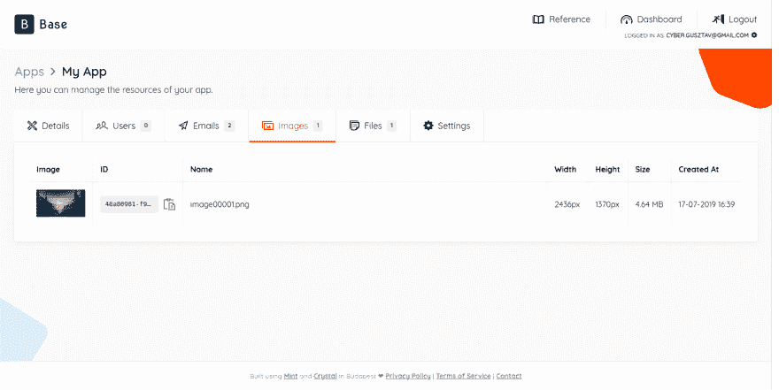

# 用于身份验证、电子邮件发送、图像上传等的基础 API！

> 原文：<https://dev.to/gdotdesign/base-api-for-authentication-email-sending-image-upload-and-more-4f1>

我在一家为客户创造产品(大的和小的)的公司工作。我们从设计和验证阶段一直到 MVP 开发，我是前端和后端开发人员的一部分。

我意识到这些项目有很多共同点，所以我创建了 **[基地](https://www.base-api.io)** 🎉(API 即服务)来帮助我:

*   👥处理用户注册/认证
*   📧发送电子邮件
*   📁将文件上传到云提供商以便以后下载
*   🖼上传图像到云提供商，具有裁剪和调整大小的能力

在我大约 7 年的职业经验中**,我使用一个库/服务或手工编码为许多产品一次又一次地构建这些东西**。

在我从事的上一个项目中，我为每一个项目使用了不同的服务，最终的结果是用不同的键调用不同的 API，以及一些有趣的技巧来保持它们正确工作🤮，更不用说从客户端获取生产密钥和管理所有这些管理界面了。

此时我想🤔:**肯定有更容易、更简洁的东西可以使用**但是没有，尤其是如果你想保持语言的竞争性。

于是 **[Base](https://www.base-api.io)** 诞生了，有了它你可以用一个**单一 API 键**做上面提到的所有事情，而且它有一个**漂亮、干净的 UI** 在那里你可以看到你每个项目的所有资源:

请记住，这只是一个 MVP，我计划在接下来的几周内添加一些功能:

*   一些语言的客户端库(首先是 Ruby、NodeJS、Go 和 Crystal)
*   单一简讯注册和查询收件人
*   批量发送电子邮件
*   调度对服务器的调用(想想 cron 作业)
*   使用您自己的凭据进行存储和发送电子邮件

希望对你下一个项目有用:)

让我知道你的想法！

* * *

因为这是开发人员社区，所以这里有一些关于代码的事实:

*   后端是用[晶体](https://crystal-lang.org)构建的，它目前是一个 **2.4 MB 单二进制文件**，使用 13 个依赖项(碎片)在 Heroku 上运行
*   前端是用 [Mint](https://www.mint-lang.com) 构建的，它托管在 [Netlify](https://www.netlify.com) 上，它对桌面和移动都友好，除了标准库之外没有其他依赖
*   前端是 PWA，因此 API 引用离线工作
*   后端~2200 LOC，前端~8600 LOC
*   数据库是 PostgreSQL
*   我花了大约一个月的时间在工作之余建造它

如果你有任何问题，我很乐意回答。

* * *

*Credit:来自[full vector](https://www.freepik.com/fullvector)T3】的标题插图*