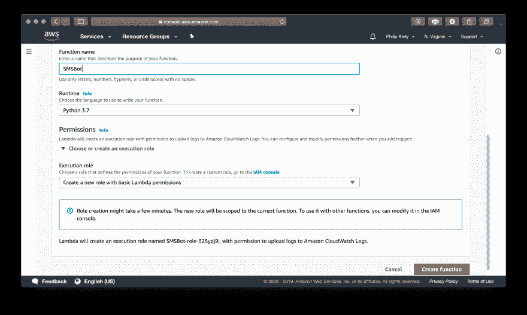
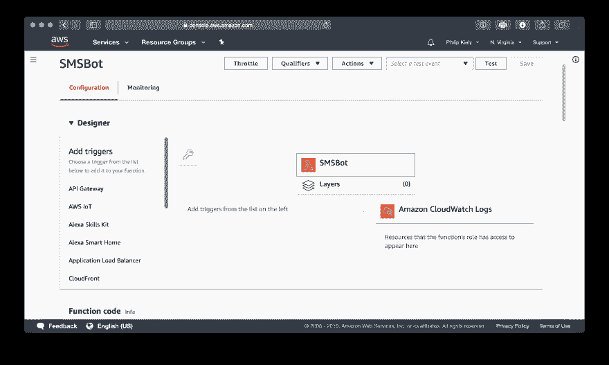
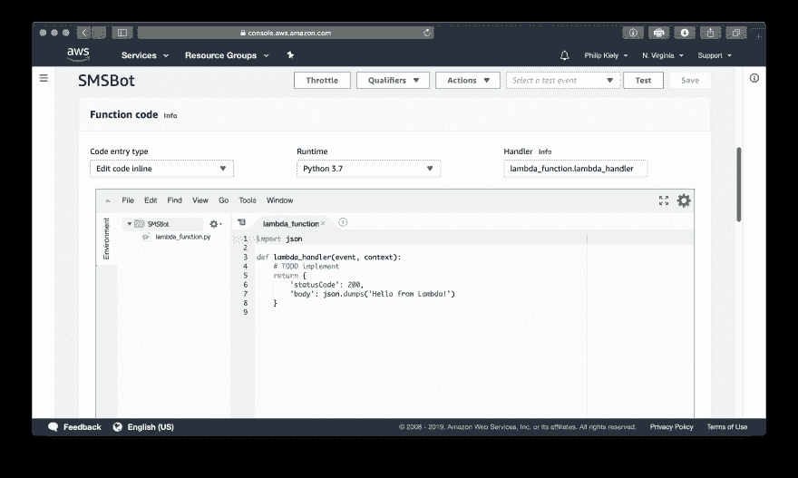
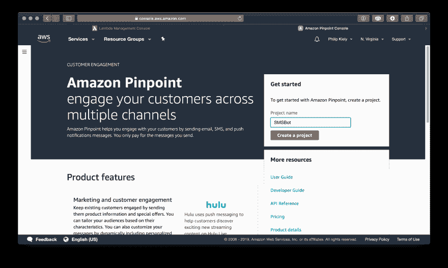
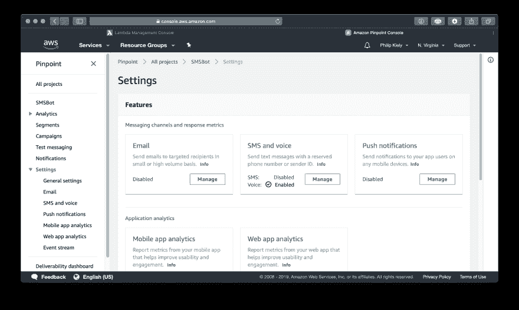
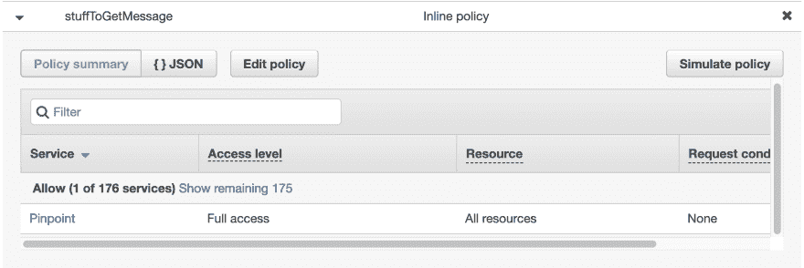
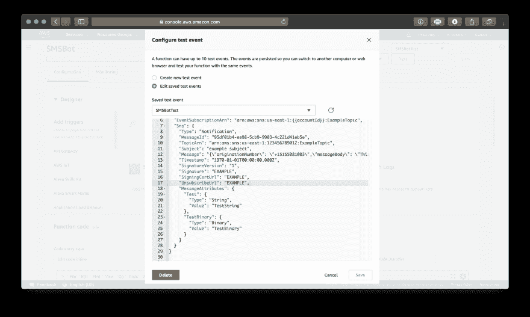
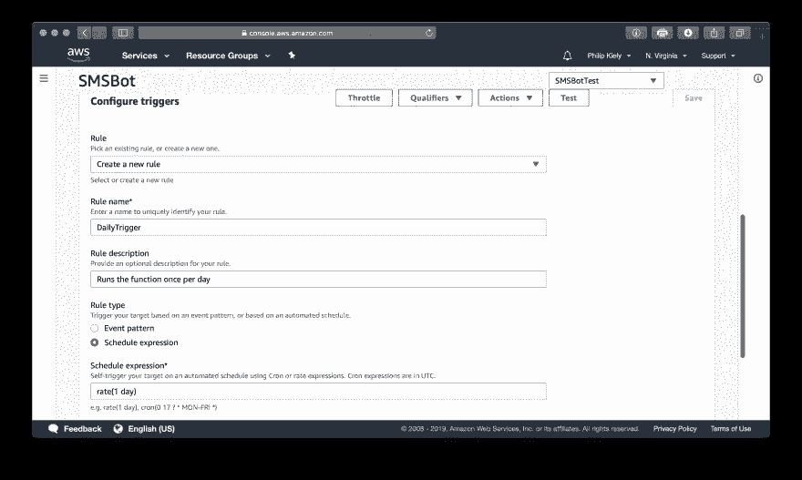

# 如何用 AWS Lambda，SNS 和 Python 3 发送短信

> 原文：<https://dev.to/mkdev/how-to-send-sms-messages-with-aws-lambda-sns-and-python-3-43fa>

## 简介

本文讨论如何使用 AWS 发送和接收 SMS。我们将从构建一个消息记录器开始，它将接收消息并记录它们的发送者和内容。然后，我们将创建一个消息回显应用程序，它将用相同的文本回复任何消息。最后，我们将安排一条每日消息发送到指定的电话号码。我们将在各种 AWS 服务中使用 SMS。请注意，在本文中，我们只做“点击操作”，我们通过这些服务的 web 界面与它们进行交互。实际的生产应用程序将使用版本控制、持续集成/持续交付以及像 Terraform 或 AWS CloudFormation 这样的代码基础设施来管理代码和服务。但是，交互式 AWS 控制台足以练习使用这些服务。

亚马逊网络服务(AWS)提供 Lambda，这是一个无服务器的计算环境，允许程序员在不提供服务器的情况下运行离散的功能。编写和部署 AWS Lambda 函数是一个快速的过程，它们不需要像在 EC2 这样的虚拟服务器上运行的应用程序那样的维护。λ函数很便宜；亚马逊通常对每百万次请求收取 20 美分的费用(每次功能执行都算作一次请求)，每月第一个百万次请求对所有客户无限期免费。AWS 提供了多种方法来启动这些便宜、简单的功能，本文解释了如何使用 AWS Lambda 发送和接收 SMS 消息。

SMS(短消息服务)是一个有几十年历史的协议，被全球数十亿移动设备使用。与互联网协议相比，它有一些奇怪的属性。最大的问题是每个电话号码都有一个区号。本文使用美国的 AWS 服务，并使用带+1 区号的美国电话号码。这种遗留基础设施也意味着，与 AWS Lambda 不同，使用 SMS 相当昂贵。在一些免费信息之后，接收一条短信需要 0.0075 美元，发送一条短信需要 0.00645 美元。虽然免费层将提供足够的消息来测试本文中的功能，但考虑到成本，考虑 SMS 是否适合您的生产应用程序是很重要的。例如，一个每天只向 1000 个用户发送一条短信的应用程序，每月仅短信费用就需要支付近 200 美元。

### 接收短信

首先，你需要一个 AWS 账户。这个帐户将让您访问所有 AWS 服务以及免费层，让您测试大多数产品，甚至运行廉价或免费的小应用程序。进入 AWS 帐户后，导航到 Lambda 并创建一个新函数。

[](https://res.cloudinary.com/practicaldev/image/fetch/s--UUAyCdZs--/c_limit%2Cf_auto%2Cfl_progressive%2Cq_auto%2Cw_880/https://s3.eu-central-1.amazonaws.com/assets-mkdev/posts/misc/awssms-LambdaCreate.png)

函数名可以是对您有意义的任何名称。对于运行时，选择 Python 3.7，这是 Python 3 的最新稳定版本。AWS 使用基于角色的权限来操作它的所有服务，这个系统超出了本文的范围(尽管我们稍后将简要地重新讨论它)。对于这个函数，选择“创建一个具有基本 Lambda 权限的新角色”, AWS 会为您完成它。设置完成后，点击“创建功能”。这将把您带到函数编辑页面。

[](https://res.cloudinary.com/practicaldev/image/fetch/s--6bwQyWxP--/c_limit%2Cf_auto%2Cfl_progressive%2Cq_auto%2Cw_880/https://s3.eu-central-1.amazonaws.com/assets-mkdev/posts/misc/awssms-LambdaDesign.png)

这个窗口的顶部有几个重要的按钮。最重要的是，“保存”让您保存对 Lambda 函数的任何更改，而“测试”让您编写并执行对您的函数的测试。在使用“保存”按钮保存之前，对您功能的更改不会生效。

AWS Lambda 函数设计器面板允许您选择哪些服务可以触发函数，以及函数在运行时可以访问哪些服务。我们将在执行过程中使用 SNS(简单通知服务)和 CloudWatch 事件作为 Amazon Pinpoint 和 Amazon CloudWatch 日志的触发器。要向功能添加服务，只需在设计器左侧的列表中单击它。从添加 SNS 作为触发器开始。您必须允许 Lambda 执行角色上的 SNS(AWS 会提示您)，然后保存您的函数。重新加载页面，然后向下滚动查看功能代码。

[](https://res.cloudinary.com/practicaldev/image/fetch/s--5Z7k7wuH--/c_limit%2Cf_auto%2Cfl_progressive%2Cq_auto%2Cw_880/https://s3.eu-central-1.amazonaws.com/assets-mkdev/posts/misc/awssms-LambdaCode.png)

AWS 为编程 Lambda 函数提供了一个在线开发环境。您可以导入库并编写自己的方法。然而，`lambda_handler()`函数是 Lambda 函数被触发时实际运行的函数。这个主方法将`event`和`context`作为参数。`event`是一个函数可以访问的大字典，而`context`存储执行的上下文。我们只需要参考`event`。我们的第一个功能非常简单:它只是获取电话号码和给定消息的文本，并将其写入您的 CloudWatch 日志。

```
import json

def lambda_handler(event, context):
    message = json.loads(event['Records'][0]['Sns']['Message'])
    words = message['messageBody']
    number = message['originationNumber']
    return {
        'statusCode': 200,
        'body': json.dumps("Phone number: {}\nMessage Text: {}".format(number, words))
    } 
```

Enter fullscreen mode Exit fullscreen mode

`message`是我们从`event`加载的字典。我们提取消息正文，即消息的实际文本，以及始发号码，即发送 SMS 的号码。目前，我们只是将这些信息转储到 CloudWatch。为了测试这一点，我们可以向与该功能相关的号码发送短信。为此，我们需要激活 AWS 精确定位。如果你想跳过这一部分，我将解释如何使用 Lambda 的内置测试机制来测试这个函数，但是稍后 pinpoint 对于发送消息是必要的。

[](https://res.cloudinary.com/practicaldev/image/fetch/s--MysOPFq1--/c_limit%2Cf_auto%2Cfl_progressive%2Cq_auto%2Cw_880/https://s3.eu-central-1.amazonaws.com/assets-mkdev/posts/misc/awssms-PinpointCreate.png)

激活您的第一个 pinpoint 项目后，单击设置屏幕上“短信和语音”下的“管理”。

[](https://res.cloudinary.com/practicaldev/image/fetch/s--mTiQNZfM--/c_limit%2Cf_auto%2Cfl_progressive%2Cq_auto%2Cw_880/https://s3.eu-central-1.amazonaws.com/assets-mkdev/posts/misc/awssms-PinpointSettings.png)

[](https://res.cloudinary.com/practicaldev/image/fetch/s--qu4YmpxA--/c_limit%2Cf_auto%2Cfl_progressive%2Cq_auto%2Cw_880/https://s3.eu-central-1.amazonaws.com/assets-mkdev/posts/misc/awssms-PinpointLongCode.png)

然后，请求长码。这是您项目的专用电话号码。这些每月花费一美元，所以一旦你完成测试，一定要摆脱这个项目。将目标国家设置为您的首选位置，并将默认通话类型设置为“促销”一旦有了电话号码，就需要通过在 IAM 控制台中向角色添加以下权限，向与 lambda 函数相关联的 IAM 角色添加 Pinpoint。

[](https://res.cloudinary.com/practicaldev/image/fetch/s--tD2jC8tV--/c_limit%2Cf_auto%2Cfl_progressive%2Cq_auto%2Cw_880/https://s3.eu-central-1.amazonaws.com/assets-mkdev/posts/misc/awssms-IAMPinpoint.png)

现在，您应该能够向 lambda 函数发送文本消息了。然而，您可以使用 Lambda 的测试特性来模拟这种情况。选择“Amazon SNS 主题通知”作为模板，并根据您的喜好为事件命名。粘贴以下字符串作为与`Message`键相关的值，如图所示。

[](https://res.cloudinary.com/practicaldev/image/fetch/s--a5xtNYog--/c_limit%2Cf_auto%2Cfl_progressive%2Cq_auto%2Cw_880/https://s3.eu-central-1.amazonaws.com/assets-mkdev/posts/misc/awssms-TestConfig.png)T3】

```
"{\"originationNumber\": \"+19997771111\",\"messageBody\": \"This is the test message\",\"inboundMessageId\": \"EXAMPLE\",\"previousPublishedMessageId\": \"EXAMPLE\",\"messageKeyword\": \"keyword_example\",\"destinationNumber\": \"+10120120123\"}" 
```

Enter fullscreen mode Exit fullscreen mode

记住`event`只是一个字典，这就是为什么我们可以通过创建自己的事件来测试 Lambda 函数。保存测试后，按屏幕右上角的“测试”按钮执行 Lambda 功能。一旦执行成功，控制台将显示函数返回的内容。

### 发送短信

现在我们可以接收短信，我们把注意力转向发送短信。与接收不同，这个步骤确实需要 AWS Pinpoint 的早期设置来进行测试。为了演示 SMS 的发送和接收，我们将建立一个简单的 echo 服务:您发送一条消息，它会以相同的文本进行响应。

```
import json
import boto3

pinpoint = boto3.client('pinpoint')

def lambda_handler(event, context):
    message = json.loads(event['Records'][0]['Sns']['Message'])
    pinpoint.send_messages(
        ApplicationId='YOUR_PINPOINT_APPLICATION_ID',
        MessageRequest={
            'Addresses': {
                message['originationNumber']: {'ChannelType': 'SMS'}
            },
            'MessageConfiguration': {
                'SMSMessage': {
                    'Body': message['messageBody'],
                    'MessageType': 'PROMOTIONAL'
                }
            }
        }
    ) 
```

Enter fullscreen mode Exit fullscreen mode

导入`boto3`让我们初始化一个 pinpoint 对象来发送消息。消息将从您之前设置的长码号码发送。这需要的唯一配置是粘贴您的 pinpoint 应用程序的 ID。

我们可以使用这个系统通过 SMS 建立一个聊天机器人，例如，一个虚拟的客户支持热线(尽管基于网络的聊天在规模上便宜几个数量级)。该系统的另一个应用是发送预定的文本消息。通过将触发器从 SMS 更改为 CloudWatch 事件，我们可以创建一个应用程序，每天早上给你的老板发消息，告诉他迟到的理由。点击左侧菜单中的“CloudWatch Events”选项，并按照图示配置设置。

[](https://res.cloudinary.com/practicaldev/image/fetch/s--OBl0sFgd--/c_limit%2Cf_auto%2Cfl_progressive%2Cq_auto%2Cw_880/https://s3.eu-central-1.amazonaws.com/assets-mkdev/posts/misc/awssms-CloudWatchConfig.png)T3】

```
import json
import boto3
import random

pinpoint = boto3.client('pinpoint')

def lambda_handler(event, context):
    messages = ['Sorry! I\'m stuck in traffic.',
                'Be there in a bit, I had car trouble this morning',
                'My son was sick this morning',
                'I stayed up too late working on the contract last night']
    pinpoint.send_messages(
        ApplicationId='YOUR_PINPOINT_APPLICATION_ID',
        MessageRequest={
            'Addresses': {
                'BOSS_PHONE_NUMBER': {'ChannelType': 'SMS'}
            },
            'MessageConfiguration': {
                'SMSMessage': {
                    'Body': random.choice(messages),
                    'MessageType': 'PROMOTIONAL'
                }
            }
        }
    ) 
```

Enter fullscreen mode Exit fullscreen mode

想出更好的借口，把 AWS 的精确定位号码设置为你老板手机里的联系号码，这些都留给读者去练习。我当然不能赞同实际使用这个应用程序。

现在您已经知道如何使用 AWS Lambda 发送和接收 SMS。AWS Lambda 函数功能强大，用途广泛；除了发短信，你还可以做很多事情。对于需要它的应用程序来说，SMS 很容易设置和使用，但是成本和消息延迟可能会使许多应用程序望而却步。但是，对于一些类似电话号码验证的系统来说，它是最佳选择，短信已经集成了类似 Siri 和 Alexa 的语音助手。如果你想给你的用户一个优质的体验，那么 AWS Lambda 是一个很好的方式把它添加到你的项目中。

为了回顾，我们使用了:

*   [λ](https://aws.amazon.com/lambda/)对于无服务器功能，
*   [SNS](https://aws.amazon.com/sns/) 用于接收通知和短信，
*   [精确定位](https://aws.amazon.com/pinpoint/)用于发送短信和提供固定电话号码，
*   [IAM](https://aws.amazon.com/iam/) 用于管理访问和权限，以及
*   [CloudWatch](https://aws.amazon.com/cloudwatch/) 用于监控、记录和触发流程。

* * *

这是 Philip Kiely 写的一篇 mkdev 文章。你可以[聘请我们的 Python 导师](https://mkdev.me/en/specialization/programming-python)，自己学习 Python。