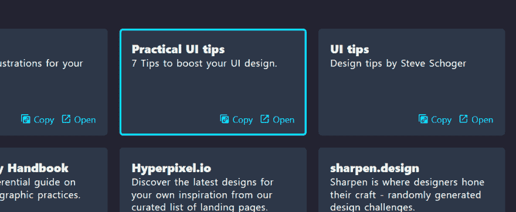
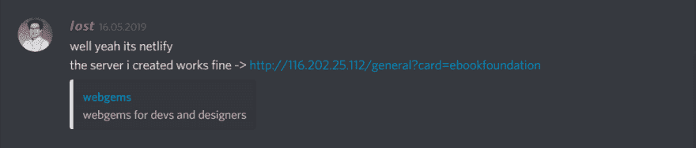

# webgems.io💎devs 起始页

> 原文：<https://dev.to/lostdesign/webgems-io-a-developers-startpage-3n7l>

### 👋介绍

因为我是一个社区的人，我经常帮助几个开发者社区中的人，同时运行我自己的名为 [devcord](https://devcord.com) 的服务器。没有一天我不发现自己在链接一些资源，例如，许多初学者都在问如何在 flexbox 中做到这一点。

在我们的服务器上，我们甚至有一个 bot 命令来发送一个嵌入的消息，说“嘿，想学 flexbox 吗？结账[https://flexboxfroggy.com](https://flexboxfroggy.com)。但有时我觉得某个成员可能不想使用[flexboxfrogy](https://webgems.io/css/?card=flexboxfroggy)，而是在寻找一种有文档记录的方法，所以我给他们发了一个链接，链接到 [css-tricks flexbox 指南](https://webgems.io/css/?card=acompleteguidetoflexbox)。

### 💡这个想法

这让我想到为初学者创建一个网站，这些初学者正在寻找可以帮助他们在庞大而混乱的 web 开发领域起步的资源。

像往常一样，我开始先寻找一个域，然后才考虑如何实现这个站点本身。5 月 10 日，我开始骚扰我的朋友，询问他们对这个特殊域名的看法。这只是我的一个小缺点，首先考虑好的领域，然后才是项目(但这实际上最近刚刚改变-很快会有更多的改变)。

这是我正在运行的域名列表，直到我找到了完美的匹配(在我朋友的帮助下，看着你雅各布): *webgems* 💎“对开发者来说是最好的宝石”。如果你幸运的话，你仍然可以注册这些。在我看来，这些都是很好的域名:)

web bin . io-web bin . dev-source bin . io-web collect . io-dev bucket . io-web repo . io-dev collect . io-dev bin。？- resourcebin.io

### 💻开始开发

无论如何，一旦我决定了这个域名，我很快就注册了，因为你不应该等太久-这个域名随时可能消失。现在是决定什么栈适合这个网站的时候了——因为 [Vue](https://vuejs.org) 通常是我的 goto 框架，而且最近我开始用 [Nuxt](https://nuxtjs.org/) 重写我自己的网站，所以我决定也为 webgems 使用 Nuxt。

我不确定我应该深入到开发过程的多深，我只想强调一件特别的事情让我有些紧张:

> 能够点击复制按钮，这将突出显示卡，并把一个参考到您的剪贴板。

现在看起来就是这样:
[](https://res.cloudinary.com/practicaldev/image/fetch/s--zvW0NW-V--/c_limit%2Cf_auto%2Cfl_progressive%2Cq_auto%2Cw_880/https://thepracticaldev.s3.amazonaws.com/i/75zrybgzct564r5afwuy.png)

它在 localhost 上工作得非常好，但是当我使用 [Netlify](https://www.netlify.com/) 将它推送到 prod 时，引用和路由就中断了。我是如此宣传这个项目，但这个问题让我很沮丧。在花了几个小时研究这个问题后，我找到了一些关于 Nuxt+Netlify 和 Netlify 添加尾随斜线的参考资料。我很快决定启动我自己的服务器，以验证是我还是 Netlify 的问题。

[](https://res.cloudinary.com/practicaldev/image/fetch/s--vN6dTyqo--/c_limit%2Cf_auto%2Cfl_progressive%2Cq_auto%2Cw_880/https://thepracticaldev.s3.amazonaws.com/i/omyh91ons61pid4qbkxg.png)

当时我有点难过，因为我认为我不能使用 Netlify，即使我非常喜欢他们的整个工作流程。

[](https://res.cloudinary.com/practicaldev/image/fetch/s--cJQW7fhi--/c_limit%2Cf_auto%2Cfl_progressive%2Cq_auto%2Cw_880/https://thepracticaldev.s3.amazonaws.com/i/vqi1nobol01x2ylze01a.png)

我想那条信息已经说得很清楚了？

在我情绪低落了一点后，我对目前的状况不太满意，想知道是否有其他解决问题的方法。这花了我几天时间，但我找到了解决方案——这是最终截取的代码。实际上我忘记了我是如何修复它的，但是我会确保挖掘提交的内容，稍后回来给你答案！

```
 methods: {
     async createCopyUrl() {
      try {
        let currentPath = this.$router.history.current.path
        let reference =  this.createReferenceTag(this.$props.title)
        await this.$copyText(`https://webgems.io${currentPath}?card=${reference}`)
        this.$router.push(`${currentPath}?card=${reference}`)
      } catch (e) {
        console.error(e);
      }
    },
} 
```

Enter fullscreen mode Exit fullscreen mode

### ✅ IT'S LIVE

由于这种情况已经不存在了，我现在又可以和 Netlify 一起工作了，我继续添加更多的资源，并在这里和那里修复一些小东西。在我的[抽动](https://twitch.tv/l0stdesign)上做了几个流，一个月后，终于完成了。我推了最后一次提交，并决定把它发在推特上，即使我不是一个那么喜欢推特的人。

没有想到会发生什么，这条推特真的爆炸了。对我来说，这是第一次我在推特上发布的任何东西能够被这么多人看到。

液体错误:内部

大约 120，000 人看到了这条推文，网站本身在发布的第一周内就获得了大约 10，000 次访问。我完全惊讶于我居然会得到这样的支持。

发布后不久，S3BAS 一个来自 devcord 服务器的朋友加入了这个项目，帮我做了一点工作，重构了代码等等。我们有一些夜班，但这是非常值得的。

这个项目也发表在 producthunt 上，但是我在那里的发布有点失败，假设没有在正确的时间发布。

### 📖技能++

在做这个项目的时候，我得到了很多乐趣，并且学会/掌握了我的 git 和 git 流技能。感谢那些给我发信息的人，感谢他们对我和这个项目的贡献者所做的一切的赞赏。甚至在今天，在发布几个星期后，人们仍然感谢我的这个项目。这对我意义重大，这正是我想要的——帮助他人(*和 ofc，这样我就不用再发送个人链接了:D* )。

这是一条情感之路，最近我最喜欢的播客之一“Syntax.fm”提到了 webgems。我强烈推荐听他们的播客，还有这个特别的，提到 webgems 的-> [点击这里](https://syntax.fm/show/163/hasty-treat-web-dev-resource-sick-picks)。

一开始我甚至没有注意到它被提到了，但是另一个朋友告诉了我。听到我在那里成功了，我几乎要哭了。我至少在发抖，不得不告诉我的朋友们这件事，即使他们对 web 开发一无所知，也不明白发生了什么。但是他们至少为我高兴，所以我很感激。

### 💾结论

即使你的项目不是全新的，人们可能不相信你的想法，你面临的问题或任何其他原因都不应该阻止你做你热爱的事情。

web 领域有时很有害，对初学者来说更有害——这就是为什么我写了这个关于这个小项目的故事，它仍然有影响。

如果你正在寻找一个有着相同想法的开发者的友好社区，并且需要帮助或者想要帮助人们，来加入我们的 [devcord](https://devcord.com) 吧——我们很希望你在那里。

如果你想检查这个项目的源代码，请随意，它在 github 上。如果有人需要一些资源并为项目做出贡献时，你能分享它，我会很高兴——如果你认为缺少了什么，就拍一个 PR 或打开一个问题。

。

##  [网络宝石](https://github.com/webgems) / [网络宝石](https://github.com/webgems/webgems)

### 为开发者和设计者管理的资源列表。如果你想和我聊聊天，请加入 devcord.com:)

<article class="markdown-body entry-content container-lg" itemprop="text">

[ ](https://app.netlify.com/sites/epic-sammet-7ed06e/deploys) [ ](https://raw.githubusercontent.com/webgems/webgems/dev/#contributors)

# webgems.io

这个项目应该帮助任何人找到新的资源，但特别是在该领域的初学者有一些他们可以查找的东西。

## 建造于

*   [Nuxt.js 文档](https://nuxtjs.org) Nuxt.js
*   SCSS
*   哈巴狗

## 贡献的

如果您想报告问题或贡献代码，请阅读 [CONTRIBUTING.md](https://raw.githubusercontent.com/webgems/webgems/dev/CONTRIBUTING.md) 。

## 作者

*   **丢失设计** - *初始工作* - [丢失设计](https://github.com/lostdesign)

另请参见参与该项目的[贡献者](https://github.com/webgems/webgems/contributors)的列表。

## 许可证

这个项目是在 GNU 通用公共许可证 v3.0 下许可的——详见[许可证](https://github.com/webgems/webgems/blob/master/LICENSE)文件

</article>

[View on GitHub](https://github.com/webgems/webgems)