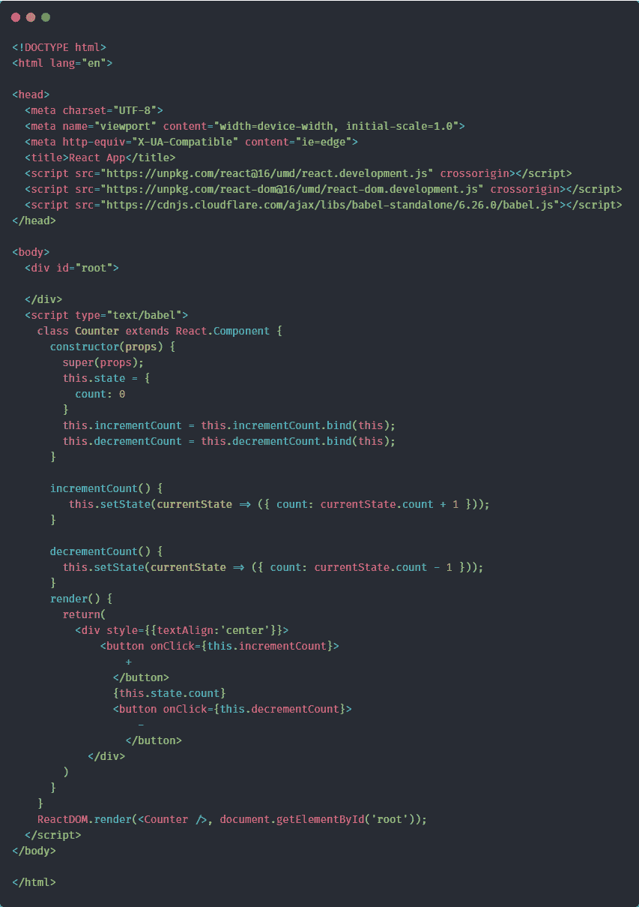
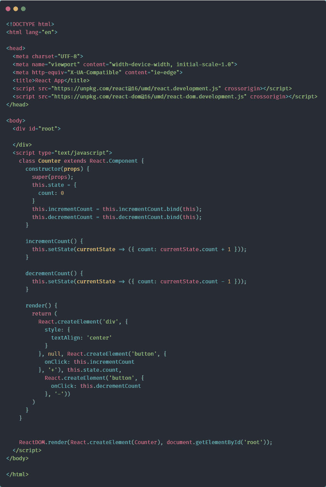

# 我对 React 和 Vue 的看法。

> 原文：<https://dev.to/macmacky/my-thoughts-on-react-and-vue-542n>

首先，我要谈谈 React 的类语法，而不是使用 Hooks API 创建组件的新方法以及 React 和 Vue 在编写应用程序方面的差异。

#### React 专柜 App

[](https://res.cloudinary.com/practicaldev/image/fetch/s--1BI89kEa--/c_limit%2Cf_auto%2Cfl_progressive%2Cq_auto%2Cw_880/https://thepracticaldev.s3.amazonaws.com/i/qvr82579ns0f05pnxanx.png)

### 视图反应用程序

[](https://res.cloudinary.com/practicaldev/image/fetch/s--yvo6ifzA--/c_limit%2Cf_auto%2Cfl_progressive%2Cq_auto%2Cw_880/https://thepracticaldev.s3.amazonaws.com/i/4w37rhe6imx6j1kmst6v.png)

如你所见，我用两个著名的框架制作了一个计数器应用程序(从技术上讲，React 是一个库)。

很明显，React Counter App LOC 比 Vue Counter App 多了很多。React 应用中的 2 script 标签比 Vue 应用多。第一个是 ReactDOM 库，因为我们需要这个库将 React 组件绑定到 DOM，第二个是 Babel 独立库，因为浏览器无法理解“ **JSX** ”我们在组件内的 render 方法中使用的类似 Html 的语法，以及我们在 React.render 方法中传递的第一个参数需要一个 React 元素。所以巴别塔库编译了我们的“ **JSX** ”代码，这样浏览器就能理解了。

我们也可以摆脱巴别塔图书馆。
[T3】](https://res.cloudinary.com/practicaldev/image/fetch/s--W6Z4D4qM--/c_limit%2Cf_auto%2Cfl_progressive%2Cq_auto%2Cw_880/https://thepracticaldev.s3.amazonaws.com/i/zeareapkfrzuwzev5tz5.png)

**createElement** API
的示例描述

```
 /**
* @param type this expects a valid html element like "div" or "p" and can be also JSX Element 
* @param elementAttributes this expects an object that contains the attributes or props of that element
* @param children the child element or children elements of this Element can be any valid html element or JSX Element
* 
* @example
* createElement('div', 
*  { style: { backgroundColor:'black' } }, 1)
* createElement('div',
* { className:"bg-white" }, 
* createElement('h1', null, 'Hello World' ))
* 
* createElement('div',
* { className:"bg-white" }, 
*  createElement(App, {data:[] } ) )
*/  
    React.createElement(element,attributes,...children) 
```

Enter fullscreen mode Exit fullscreen mode

但是在我们组件的 render 方法中这样做的缺点是，看起来我们在元素中嵌套元素，看起来很难看，不可读。我们正在用**命令式**的方式，而不是**声明式**的方式。记住 React 是一个用于构建 UI 的**声明性**库，而不是**命令性**。

现在来说说 Vue。Vue 也是一个使用**声明性**方式
制作 UI 界面或“模板”的系统。我们只是包含了 Vue 脚本，因为我们在制作 Vue 应用时不需要 **JSX** ，但是我们也可以在中大型应用中使用它。脚本中已经包含了 DOM 绑定。HTML、CSS 和 Javascript 的基础知识会对你制作 Vue 应用有很大帮助，这些是你制作 Vue 应用可能需要的唯一技术。我说“可能”是因为正如我前面所说的，这取决于您的应用程序的大小。

下面是使用 Hooks API 的等效方法。

```
<!DOCTYPE html>
<html lang="en">

<head>
  <meta charset="UTF-8">
  <meta name="viewport" content="width=device-width, initial-scale=1.0">
  <meta http-equiv="X-UA-Compatible" content="ie=edge">
  React App
  <script src="https://unpkg.com/react@16/umd/react.development.js" crossorigin></script>
  <script src="https://unpkg.com/react-dom@16/umd/react-dom.development.js" crossorigin></script>
  <script src="https://cdnjs.cloudflare.com/ajax/libs/babel-standalone/6.26.0/babel.min.js"></script>
</head>

<body>
  <div id="root">

  </div>
  <script type="text/babel">
    function Counter() {
      const [count,setCount] = React.useState(0);
      return (
        <div style={{textAlign:'center'}}>
          <button onClick={()=>setCount(count+1)}>
              +
            </button>
            {count}
          <button onClick={()=>setCount(count-1)}>
            -
            </button>
          </div>
      )
    }
    ReactDOM.render(<Counter />, document.getElementById('root'));
  </script>
</body>

</html> 
```

Enter fullscreen mode Exit fullscreen mode

使用 Hooks API 使得 LOC 很像 Vue 应用程序。但是我们仍然有巴别塔独立图书馆。Hooks API 真正改变了我们编写 React 应用的方式。

### 谢谢！！！祝大家有美好的一天。