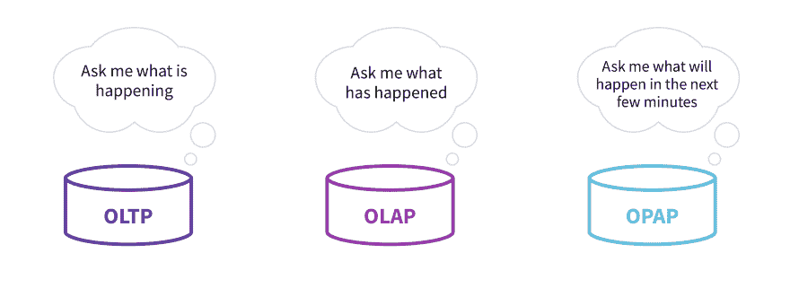
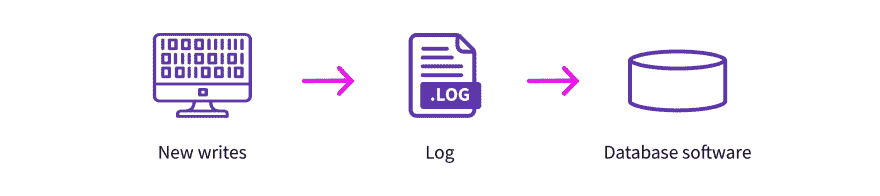
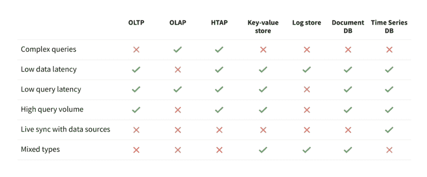

# 运营分析:关于大型数据集上的低延迟查询，每个软件工程师都应该知道什么

> 原文：<https://dev.to/rocksetcloud/operational-analytics-what-every-software-engineer-should-know-about-low-latency-queries-on-large-data-sets-38m3>

*作者[德鲁巴·博尔塔库尔](https://www.linkedin.com/in/dhruba/)T3】*

### **运营分析简介**

运营分析是一个非常具体的术语，指的是专注于改善现有运营的一类分析。与其他分析一样，这种类型的分析涉及使用各种数据挖掘和数据聚合工具来获取更透明的业务规划信息。运营分析与其他类型的分析的主要区别在于它是“动态分析”，这意味着来自企业各个部分的信号会被实时处理，并反馈到企业的即时决策中。一些人将此称为“持续分析”，这是强调从业务的一部分到其他部分可能存在的持续数字反馈循环的另一种方式。

运营分析允许您处理来自不同来源的各种类型的信息，然后决定下一步做什么:采取什么行动，与谁交谈，立即制定什么计划。这种形式的分析在几乎所有垂直行业的数字化趋势中变得流行，因为正是数字化提供了运营决策所需的数据。

让我们讨论一些运营分析的例子。假设您是一名软件游戏开发人员，您希望您的游戏根据游戏玩家的游戏习惯和当前游戏中所有玩家的当前状态自动追加销售您游戏的某个功能。这是一个运营分析查询，因为它允许游戏开发者基于对当前事件的分析做出即时决策。

过去，产品经理常常做大量手工工作，与客户交谈，询问他们如何使用产品，产品中的哪些功能会降低他们的速度，等等。在运营分析时代，产品经理可以通过查询记录产品用户群使用模式的数据来收集所有这些答案；他或她可以立即反馈信息，使产品更好。

同样，在营销分析的情况下，营销经理会组织一些焦点小组，根据他们自己的创造力尝试一些实验，然后实施它们。根据实验结果，他们将决定下一步做什么。一个实验可能需要几周或几个月。我们现在看到“营销工程师”的崛起，这是一个精通使用数据系统的人。这些营销工程师可以同时进行多个实验，以数据的形式收集实验结果，终止无效的实验，培养有效的实验，所有这些都通过使用基于数据的软件系统来实现。他们进行的实验越多，得出结果的周转时间越快，他们营销产品的效果就越好。这是另一种形式的运营分析。

### **运算分析处理的定义**

运营分析系统帮助您从大量实时数据中做出即时决策。您从数据源中收集新数据，它们都流入您的运营数据引擎。您面向用户的交互式应用程序查询相同的数据引擎，以实时从您的数据集中获取见解，然后您可以使用这种智能为您的用户提供更好的用户体验。

啊，你可能会说你以前见过这个“野兽”。事实上，从近处看，你可能会非常非常熟悉它...它包含您的数据管道，该管道从各种来源获取数据，将数据存放到您的数据湖或数据仓库中，运行各种转换以提取洞察力，然后将这些宝贵的信息存放在键值存储中，供您的交互式面向用户的应用程序快速检索。你的分析是绝对正确的:一个拥有上述所有功能的等价引擎就是一个操作分析处理系统！

运营分析处理引擎的定义可以用以下六个命题的形式来表达:

1.  **复杂查询**:支持连接、聚合、排序、相关性等查询。
2.  **低数据延迟**:在不到几秒钟的时间内，任何数据记录的更新都可以在查询结果中看到。
3.  **低查询延迟**:一个简单的搜索查询在几毫秒内返回。
4.  **高查询量**:每秒至少能处理几百个并发查询。
5.  **与数据源的实时同步**:能够与各种外部数据源保持同步，而无需编写外部脚本。这可以通过外部数据库的变更数据捕获来完成，或者通过跟踪流数据源来完成。
6.  **混合类型**:同一列允许不同类型的值。这需要能够接收新数据，而不需要在写入时清理它们。

让我们更详细地讨论上述每个命题，并讨论为什么上述每个特性对于运营分析处理引擎都是必要的。

**命题 1:复杂查询**

任何传统意义上的数据库都允许应用程序以声明的方式表达复杂的数据操作。这使得应用程序开发人员不必明确理解数据访问模式、数据优化等。并使他/她能够专注于应用程序逻辑。该数据库将支持过滤、排序、聚合等。使应用程序能够高效快速地处理数据。数据库将支持跨两个或更多数据集的连接，以便应用程序可以组合来自多个来源的信息，从中提取情报。

例如，SQL、HiveQL、KSQL 等。提供声明性方法来表达数据集上的复杂数据操作。它们有不同的表达能力:SQL 支持完全连接，而 KSQL 不支持。

**命题 2:低数据延迟**

与事务数据库不同，运营分析数据库不需要支持事务。使用这种类型的数据库的应用程序使用它来存储传入的数据流；他们不使用数据库来记录交易。输入数据速率是突发的和不可预测的。该数据库针对高吞吐量写入进行了优化，并支持最终一致性模型，即新写入的数据最多在几秒钟内就可以在查询中看到。

**命题 3:低延迟查询**

运营分析数据库能够快速响应查询。在这方面，它与 Oracle、PostgreSQL 等事务型数据库非常相似。它针对低延迟查询而不是吞吐量进行了优化。简单的查询在几毫秒内完成，而复杂的查询也可以快速扩展完成。这是支持任何交互式应用的基本要求之一。

**命题四:高查询量**

面向用户的应用程序通常会并行执行许多查询，尤其是当多个用户同时使用该应用程序时。例如，一个游戏应用程序可能有许多用户同时玩同一个游戏。欺诈检测应用程序可能会同时处理来自不同用户的多个交易，并且可能需要并行获取关于这些用户中每个用户的信息。运营分析数据库能够支持高查询率，从每秒几十个查询(例如实时仪表盘)到每秒几千个查询(例如在线移动应用程序)。

**命题 5:与数据源的实时同步**

在线分析数据库允许您自动和持续地同步来自多个外部数据源的数据。没有这个特性，您将创建另一个难以维护和照看的数据孤岛。

你有自己的真实系统数据库，可能是 Oracle 或 DynamoDB，你在那里进行交易，你在 Kafka 中有事件日志；但是，你需要一个单一的地方，你想把所有这些数据集，并结合他们产生的见解。运营分析数据库具有内置机制，可从各种数据源接收数据，并自动将它们同步到数据库中。它可以使用变更数据捕获从上游数据源不断更新自身。

**命题 6:混合型**

当分析系统能够在同一列中存储两个或更多不同类型的对象时，它就非常有用。如果没有这个特性，您必须先清理事件流，然后才能将其写入数据库。只有将新数据到达时的清理要求降至最低，分析系统才能提供低数据延迟。因此，运营分析数据库能够在同一列中存储混合类型的对象。

上述六个特征是**运营分析处理(OPAP)** 系统所独有的。

### **OPAP 体系的建筑独特性**

**数据库日志**

数据库就是日志；它持久地存储数据。它是酸性体系中的“D”。就日志而言，让我们分析三种类型的数据处理系统。

OLTP 系统的主要用途是保证更新和读取之间某种形式的强一致性。在这些情况下，日志位于为查询提供服务的数据库服务器之后。比如像 PostgreSQL 这样的 OLTP 系统，有一个数据库服务器；更新到达数据库服务器，然后数据库服务器将其写入日志。类似地， [Amazon Aurora](https://www.allthingsdistributed.com/files/p1041-verbitski.pdf) 的数据库服务器接收新的写入，附加交易信息(如序列号、交易号等。)写入，然后将其保存在日志中。在这两种情况下，日志都隐藏在事务引擎后面，因为日志需要存储关于事务的元数据。

类似地，许多 OLAP 系统也支持一些基本的交易形式。例如，OLAP 雪花数据仓库明确声明它是为批量更新和涓流插入而设计的(参见 3.3.2 节标题为[并发控制](http://info.snowflake.net/rs/252-RFO-2img/Snowflake_SIGMOD.pdf))。它们对整个数据文件使用写入时复制方法，并将全局键值存储作为日志。数据库服务器位于日志前面意味着流写速率只能达到数据库服务器能够处理的速度。

另一方面，OPAP 系统的主要目标是支持高更新率和低查询延迟。OPAP 系统没有事务的概念。因此，OPAP 系统将日志放在数据库服务器的前面，原因是日志只在持久性方面需要。让数据库位于日志的前面是有好处的:面对突发的写风暴，日志可以作为大量写操作的缓冲区。日志可以支持更高的写入速率，因为它针对写入而不是随机读取进行了优化。

**在查询时而不是写时进行类型绑定**

OLAP 数据库为数据库中的每一列关联一个固定类型。这意味着存储在该列中的每个值都符合给定的类型。当新记录写入数据库时，数据库会检查一致性。如果新记录的某个字段不符合指定的列类型，则该记录要么被丢弃，要么发出失败信号。为了避免这些类型的错误，OLAP 数据库的前端有一个数据管道，在将每条新记录插入数据库之前，都会对其进行清理和验证。

例如，假设数据库中有一个名为“邮政编码”的列。我们知道美国的邮政编码是整数，而英国的邮政编码可以是字母和数字。在 OLAP 数据库中，我们必须将这两者都转换为“字符串”类型，然后才能将它们存储在同一列中。但是一旦我们将它们作为字符串存储在数据库中，我们就失去了在查询该列时进行整数比较的能力。例如，类型为`select count(*) from table where zipcode > 1000`的查询将抛出错误，因为我们正在进行整数范围检查，但列类型是字符串。

另一方面，OPAP 数据库中的每一列都没有固定的类型。相反，该类型与存储在列中的每个值相关联。OPAP 数据库中的“邮政编码”字段能够在同一列中存储这两种类型的记录，而不会丢失每个字段的类型信息。

更进一步，对于上面的查询`select count(*) from table where zipcode > 1000`，数据库可以只检查和匹配列中的那些整数值，并返回一个有效的结果集。类似地，查询`select count(*) from table where zipcode=’NW89EU’`可以只匹配那些值为“string”类型的记录，并返回一个有效的结果集。

因此，OPAP 数据库可以支持强模式，但是在查询时而不是在数据插入时实施模式绑定。这就是所谓的[强动态类型](https://rockset.com/blog/dynamic-typing-in-sql/)。

### **与其他数据系统的比较**

现在我们已经了解了 OPAP 数据库的需求，让我们比较和对比一下其他现有的数据解决方案。特别是，让我们将它的功能与 OLTP 数据库、OLAP 数据仓库、HTAP 数据库、键值数据库、分布式日志记录系统、文档数据库和时间序列数据库进行比较。这些是一些今天正在使用的流行系统。

**与 OLTP 数据库比较**

OLTP 系统用于处理事务。事务性系统的典型例子有 Oracle、Spanner、PostgreSQL 等。系统设计用于低延迟更新和插入，这些写入跨故障域，因此写入是持久的。这些系统的主要设计重点是不丢失任何更新，并使其持久耐用。单个查询通常最多处理几千字节的数据。它们可以支持大量的查询，但与 OPAP 系统不同，单个查询不能在几毫秒内处理数兆或数千兆字节的数据。

**对比 OLAP 数据仓库**

OLAP 数据仓库可以处理大型数据集上非常复杂的查询，在这方面类似于 OPAP 系统。OLAP 数据仓库的例子有亚马逊红移和雪花。但这是相似性的终点。OLAP 系统是为整体系统吞吐量而设计的，而 OPAP 是为最低的查询延迟而设计的。OLAP 数据仓库可以有很高的整体写入率，但与 OPAP 系统不同，写入是成批的，并定期插入数据库。OLAP 数据库在数据插入时需要严格的模式，这实质上意味着模式绑定发生在数据写入时。另一方面，OPAP 数据库本身理解半结构化模式(JSON、XML 等)。)并且严格的模式绑定发生在查询时。OLAP 仓库支持少量的并发查询(例如，Amazon Redshift 支持多达 50 个并发查询)，而 OPAP 系统可以扩展以支持大量的并发查询。

**对比 HTAP 数据库**

HTAP 数据库是 OLTP 和 OLAP 系统的混合。这意味着上述两段中提到的差异也适用于 HTAP 系统。典型的 HTAP 系统包括 SAP HANA 和 MemSQL。

**与键值存储比较**

键值(KV)商店以速度著称。KV 商店的典型例子是 Cassandra 和 HBase。它们提供低延迟和高并发性，但这是与 OPAP 的相似之处。KV 存储不支持复杂的查询，如连接、排序、聚合等。此外，它们是数据孤岛，因为它们不支持来自外部源的数据的自动同步，因此违反了命题 5。

**对比测井系统**

日志存储是为高写入量而设计的。它适合编写大量更新。Apache Kafka 和 Apache Samza 是日志系统的例子。更新驻留在日志中，该日志不是为随机读取而优化的。日志记录系统擅长窗口函数，但不支持对整个数据集的任意复杂查询。

**与文档数据库进行比较**

文档数据库本身支持多种数据格式，通常是 JSON。文档数据库的例子有 MongoDB、Couchbase 和 Elasticsearch。查询延迟低，并发性高，但不支持复杂的查询，如连接、排序和聚合。这些数据库不支持从外部源同步新数据的自动方式，因此违反了命题 5。

**与时间序列数据库进行比较**

时序数据库是一种专门的运营分析数据库。查询是低延迟的，它可以支持高并发性的查询。时间序列数据库的例子有 Druid、InfluxDB 和 TimescaleDB。它可以在一个维度上支持复杂的聚合，这个维度就是“时间”。另一方面，OPAP 系统可以支持任何数据维度上的复杂聚合，而不仅仅是“时间”维度。时间序列数据库不是为连接两个或多个数据集而设计的，而 OPAP 系统可以连接两个或多个数据集作为单个查询的一部分。

**参考文献**

1.  techopedia:[https://www . techopedia . com/definition/29495/operational-analytics](https://www.techopedia.com/definition/29495/operational-analytics)
2.  Andre essen Horowitz:[https://a16z . com/2019/05/16/every one-is-a-analyst-opportunities-in-operational-analytics/](https://a16z.com/2019/05/16/everyone-is-an-analyst-opportunities-in-operational-analytics/)
3.  福布斯:[https://www . Forbes . com/sites/Forbes tech Council/2019/06/11/from-good-to-great-how-operational-analytics-can-give-business-a-real-time-edge/](https://www.forbes.com/sites/forbestechcouncil/2019/06/11/from-good-to-great-how-operational-analytics-can-give-businesses-a-real-time-edge/)
4.  Gartner:[https://www . Gartner . com/en/news room/press-releases/2019-02-18-Gartner-identifieds-top-10-data-and-analytics-technolo](https://www.gartner.com/en/newsroom/press-releases/2019-02-18-gartner-identifies-top-10-data-and-analytics-technolo)
5.  tech Republic:[https://www . tech Republic . com/article/how-data-scientists-can-help-operational-analytics-success/](https://www.techrepublic.com/article/how-data-scientists-can-help-operational-analytics-succeed/)
6.  quora:[https://www.quora.com/What-is-Operations-Analytics](https://www.quora.com/What-is-Operations-Analytics)
7.  摇滚乐队:[https://www.rockset.com/](https://www.rockset.com/)