# 使用 Dask 和 kubernetes 学习 Python 可扩展机器…

> 原文:# t0]https://dev . to/deep 75/learning-machine-evolvedic-en-python-with-dask-et-kublets-1k63

### 学习用 Dask 和 kubernetes 的 Python 可扩展机器……

[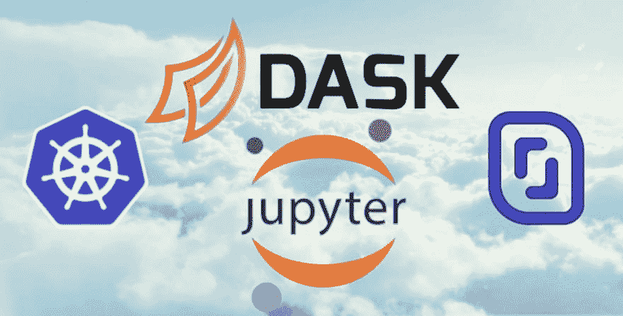](https://res.cloudinary.com/practicaldev/image/fetch/s--ZVLVy312--/c_limit%2Cf_auto%2Cfl_progressive%2Cq_auto%2Cw_880/https://cdn-images-1.medium.com/max/1024/1%2AKBecEMQfFuZrti8yoWww5w.jpeg)

Dask 是 Python 并行计算的灵活库。Dask 提供了一个任务调度界面，允许使用 PyData 堆栈进行 Python 分布式计算。Dask 以快速数字算法所需的低开销、低延迟和最低序列化运行，并且在具有数千个内核的群集上运行时具有弹性。Dask 可以一次性安装和使用笔记本电脑。Dask 专为交互式计算而设计，可提供快速反馈和诊断:

[Dask - Dask 2.1.0 文档](https://docs.dask.org/en/latest/)

[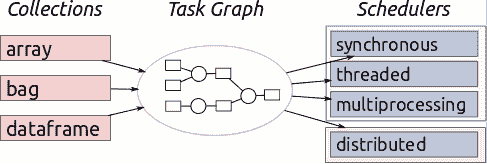](https://res.cloudinary.com/practicaldev/image/fetch/s--NqxxWgSU--/c_limit%2Cf_auto%2Cfl_progressive%2Cq_auto%2Cw_880/https://cdn-images-1.medium.com/max/487/0%2Ao-Tia-fCzYMiVuve.png)

使用 Helm，您可以轻松地在一个群集中启动 Dask 调度器、工人和 Jupyter 笔记本电脑服务器。

[立方结构 dask 2 . 1 . 0 文件](https://docs.dask.org/en/latest/setup/kubernetes.html)

Dask 会使用原生的 Dask API，将 dask 工作程式部署到 k cluster。这样可以在 Python 进程的整个生命周期内动态启动短期工作者部署。

[立方结构─立方结构 0.9.0 文件](https://kubernetes.dask.org/en/latest/)

> 目前，Dask 设计为从具有启动其他 pods 权限的库服务器群集中的 pod 运行。但是，只要可以打开与远程群集中所有节点的网络连接，Dask 也可以与远程 kubeconfig 文件配置的 kubeconfig 群集配合使用:

[向 Kubernetes 集群添加 Dask 和 Jupyter](https://ramhiser.com/post/2018-05-28-adding-dask-and-jupyter-to-kubernetes-cluster/)

对于此实验，我将从 Scaleway 的 AMD EPYC 实例出发:

[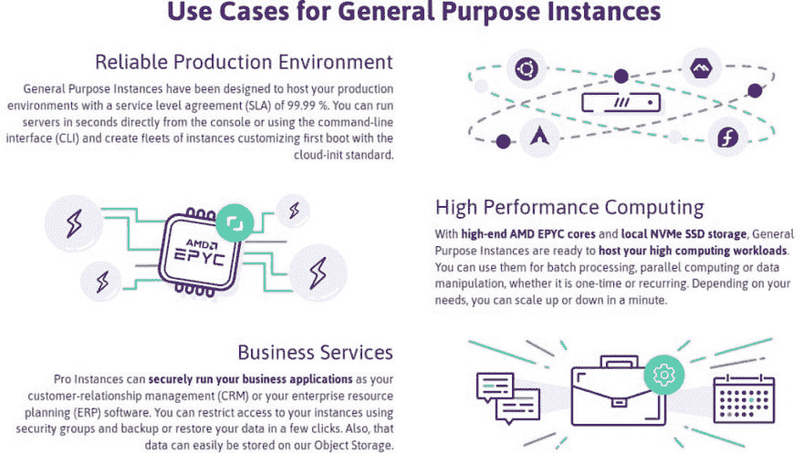](https://res.cloudinary.com/practicaldev/image/fetch/s--Piu9TU-W--/c_limit%2Cf_auto%2Cfl_progressive%2Cq_auto%2Cw_880/https://cdn-images-1.medium.com/max/1024/0%2A7hujJVsSBp2pQaPr.jpeg)

[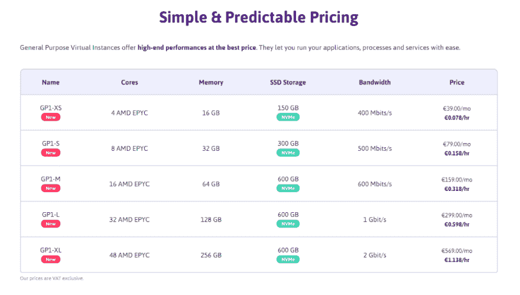](https://res.cloudinary.com/practicaldev/image/fetch/s--jjPvCgXp--/c_limit%2Cf_auto%2Cfl_progressive%2Cq_auto%2Cw_880/https://cdn-images-1.medium.com/max/1024/0%2AqyrKU4eRST7DVefX.png)

4 个节点重新布线，以便通过重新布线快速构建库服务器群集:

[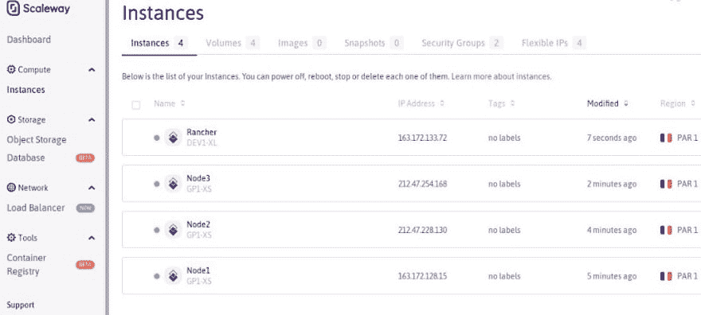](https://res.cloudinary.com/practicaldev/image/fetch/s--1_rVia7x--/c_limit%2Cf_auto%2Cfl_progressive%2Cq_auto%2Cw_880/https://cdn-images-1.medium.com/max/1024/1%2AvjKYTf1kaDK6XziOCkY4IQ.jpeg)

启动时附带此脚本:

```
#!/bin/bash
curl -fsSL https://get.docker.com -o get-docker.sh
sh get-docker.sh
usermod -aG docker ubuntu
curl -s https://install.zerotier.com | bash
zerotier-cli join <NETWORK ID> 
```

蓝丘服务器部署:

[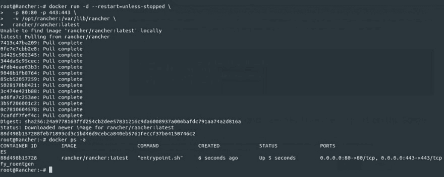](https://res.cloudinary.com/practicaldev/image/fetch/s--Y-WsmyLR--/c_limit%2Cf_auto%2Cfl_progressive%2Cq_auto%2Cw_880/https://cdn-images-1.medium.com/max/1024/1%2ARZJcnDjcr-7KRzZGEHxm5Q.jpeg)

启用后，可以在 HA 模式下定义库群集:

[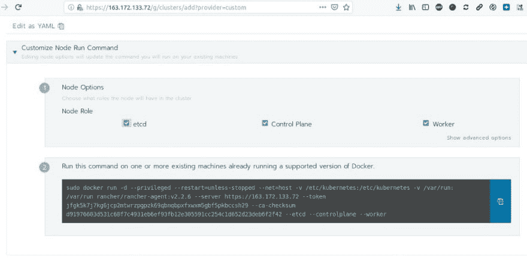](https://res.cloudinary.com/practicaldev/image/fetch/s--snqM3n3g--/c_limit%2Cf_auto%2Cfl_progressive%2Cq_auto%2Cw_880/https://cdn-images-1.medium.com/max/1024/1%2AI7HM4aGUoMbtQ_BSP0yJ9Q.jpeg)

群集节点部署:

[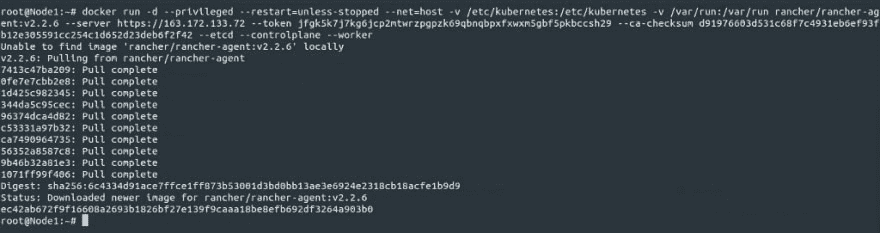](https://res.cloudinary.com/practicaldev/image/fetch/s--H2jIWMgJ--/c_limit%2Cf_auto%2Cfl_progressive%2Cq_auto%2Cw_880/https://cdn-images-1.medium.com/max/1024/1%2AEzjVAnL7Ls-GdbH7dAxOrA.jpeg)

[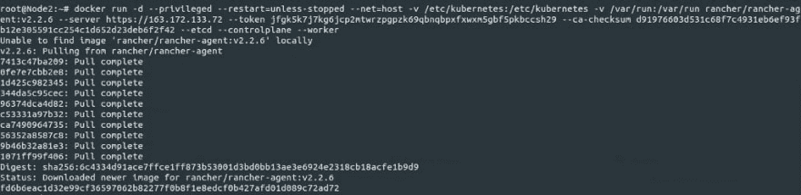](https://res.cloudinary.com/practicaldev/image/fetch/s--SSLl__MG--/c_limit%2Cf_auto%2Cfl_progressive%2Cq_auto%2Cw_880/https://cdn-images-1.medium.com/max/1024/1%2AYubG8K6vY3MM6pSg_76KGQ.jpeg)

[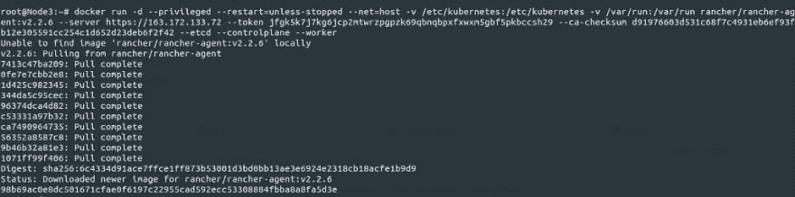](https://res.cloudinary.com/practicaldev/image/fetch/s--39zc9ges--/c_limit%2Cf_auto%2Cfl_progressive%2Cq_auto%2Cw_880/https://cdn-images-1.medium.com/max/1024/1%2AAc_CfHEsxdixNK890ifgOA.jpeg)

库服务器群集已准备就绪:

[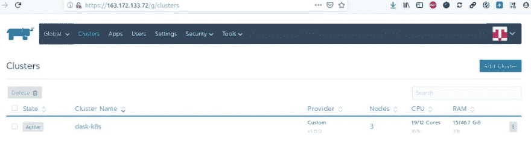](https://res.cloudinary.com/practicaldev/image/fetch/s--o43JAWxj--/c_limit%2Cf_auto%2Cfl_progressive%2Cq_auto%2Cw_880/https://cdn-images-1.medium.com/max/1024/1%2AixQQDBVBx4lPsqFwvIhQpA.jpeg)

[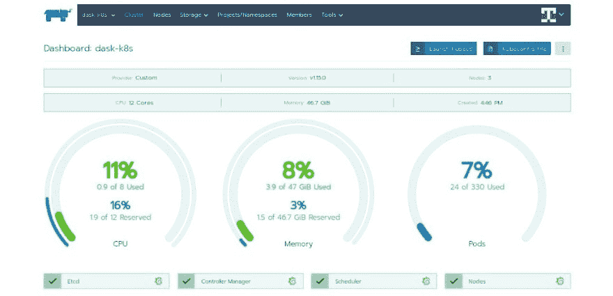](https://res.cloudinary.com/practicaldev/image/fetch/s--v6EoxT5O--/c_limit%2Cf_auto%2Cfl_progressive%2Cq_auto%2Cw_880/https://cdn-images-1.medium.com/max/1024/1%2A3QkRtHiEdnMx5OQMOqDoMw.jpeg)

[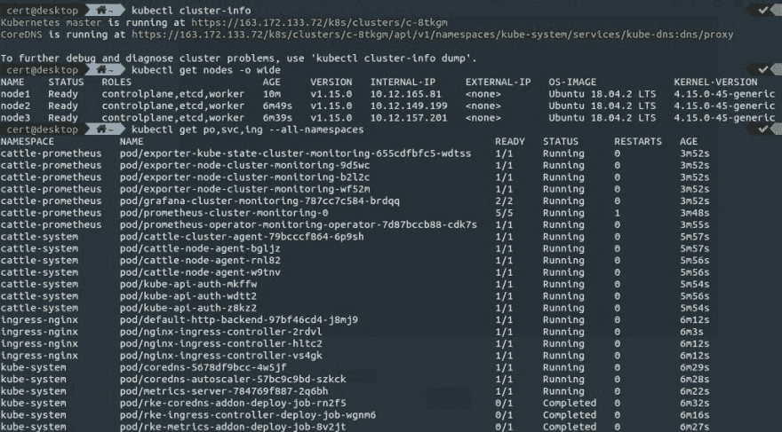](https://res.cloudinary.com/practicaldev/image/fetch/s--y60uJqLI--/c_limit%2Cf_auto%2Cfl_progressive%2Cq_auto%2Cw_880/https://cdn-images-1.medium.com/max/1024/1%2A7D4R-Tk8A61DBvGIUxKjsg.jpeg)

要利用此集群中的负载平衡服务，如以前一样，我部署金属:

[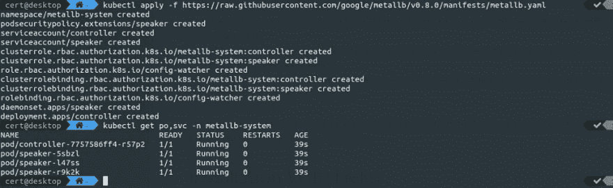](https://res.cloudinary.com/practicaldev/image/fetch/s--KyFPI1X_--/c_limit%2Cf_auto%2Cfl_progressive%2Cq_auto%2Cw_880/https://cdn-images-1.medium.com/max/1024/1%2Az2qNn5xhmsoGNjbRNxHlbw.jpeg)

使用此配置:

[](https://res.cloudinary.com/practicaldev/image/fetch/s--V7sXVXrZ--/c_limit%2Cf_auto%2Cfl_progressive%2Cq_auto%2Cw_880/https://cdn-images-1.medium.com/max/1024/1%2A_DV6DJxV1jJ-uOQgfkOdew.jpeg)

这是 ZeroTier 提供的寻址计划的结果，该计划已链接到群集中的现有节点:

[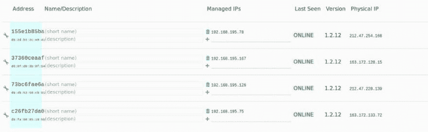](https://res.cloudinary.com/practicaldev/image/fetch/s--2rp55TnA--/c_limit%2Cf_auto%2Cfl_progressive%2Cq_auto%2Cw_880/https://cdn-images-1.medium.com/max/1024/1%2Aqwqb4qUqPz_8bRfw7M88Nw.jpeg)

要在此群集中部署 Dask，请在部署前安装 Helm:

[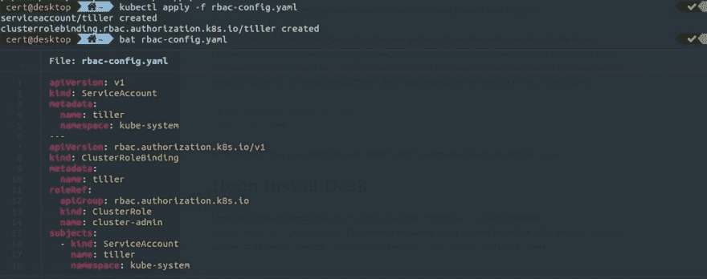](https://res.cloudinary.com/practicaldev/image/fetch/s--D7A5xPgS--/c_limit%2Cf_auto%2Cfl_progressive%2Cq_auto%2Cw_880/https://cdn-images-1.medium.com/max/1024/1%2AHo9Izx2YgfIVRgrBRf5KUQ.jpeg)

[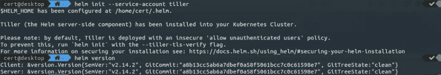](https://res.cloudinary.com/practicaldev/image/fetch/s--2dsGIMIH--/c_limit%2Cf_auto%2Cfl_progressive%2Cq_auto%2Cw_880/https://cdn-images-1.medium.com/max/1024/1%2AnLdjra7R729Iuf1epPXbFA.jpeg)

在 Github 上的仓库里找到的：

[舵/舵](https://github.com/helm/helm/releases)

[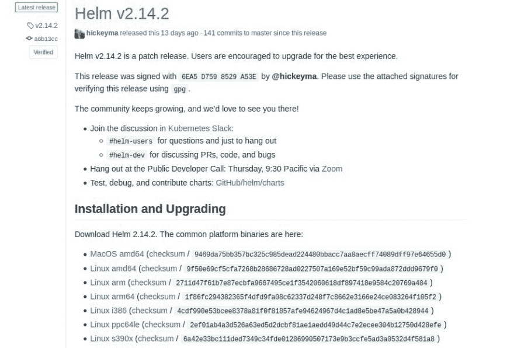](https://res.cloudinary.com/practicaldev/image/fetch/s--8EpdaJpS--/c_limit%2Cf_auto%2Cfl_progressive%2Cq_auto%2Cw_880/https://cdn-images-1.medium.com/max/917/1%2AVsPwOtNGW609J9x3IzfPXw.jpeg)

我可以使用其调度程序、工作人员和 Jupyter Lab 笔记本服务器将 Dask 安装到此库群集中:

[](https://res.cloudinary.com/practicaldev/image/fetch/s--ByB0SbJ5--/c_limit%2Cf_auto%2Cfl_progressive%2Cq_auto%2Cw_880/https://cdn-images-1.medium.com/max/546/1%2A2vZApgJ9qDSGAuaP9mxo8Q.jpeg)

[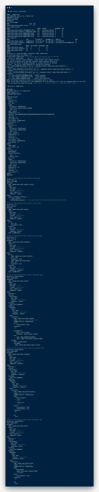](https://res.cloudinary.com/practicaldev/image/fetch/s--PxVx2p57--/c_limit%2Cf_auto%2Cfl_progressive%2Cq_auto%2Cw_880/https://cdn-images-1.medium.com/max/1024/1%2ACn5PBnWkOLmcwAeapkDZ8g.png)

然后可以看到 Dask 部署的元素:

[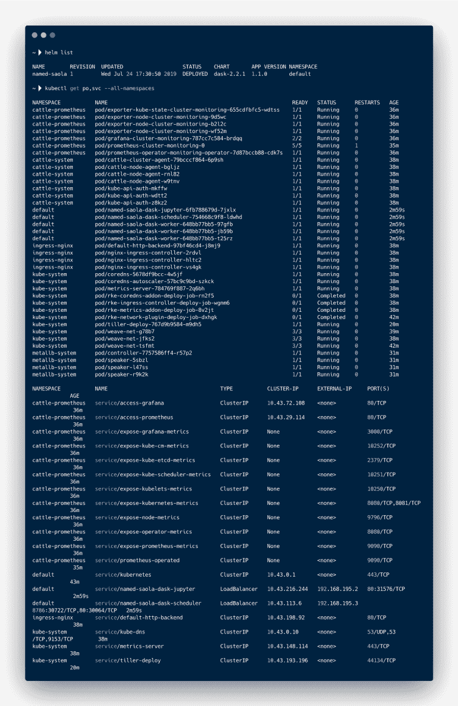](https://res.cloudinary.com/practicaldev/image/fetch/s--8QBRw3VA--/c_limit%2Cf_auto%2Cfl_progressive%2Cq_auto%2Cw_880/https://cdn-images-1.medium.com/max/1024/1%2ABHhwm1RK9j8jYLZGH4pFjw.png)

在此结构中:

[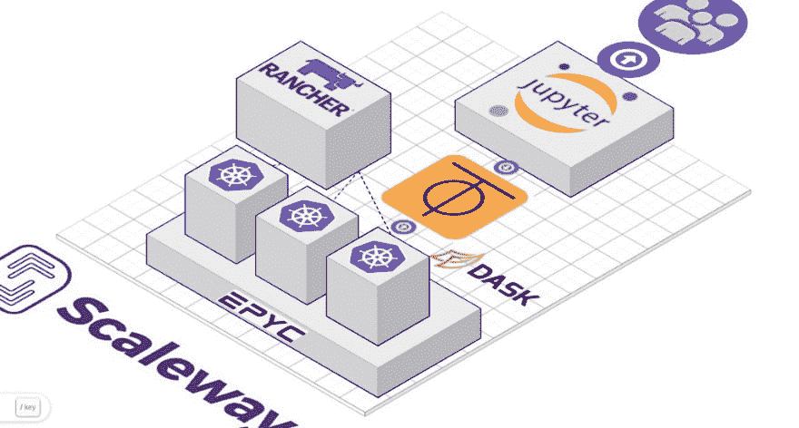](https://res.cloudinary.com/practicaldev/image/fetch/s--OaUYRvcc--/c_limit%2Cf_auto%2Cfl_progressive%2Cq_auto%2Cw_880/https://cdn-images-1.medium.com/max/1024/1%2A5RoH2a3QW1380koEPNLW8Q.jpeg)

通过群集中 metallb 提供的 IP 地址，我可以访问 Jupyter Lab 服务器:

[](https://res.cloudinary.com/practicaldev/image/fetch/s--peeGPNzt--/c_limit%2Cf_auto%2Cfl_progressive%2Cq_auto%2Cw_880/https://cdn-images-1.medium.com/max/1024/1%2APVwm1O6mYYSi4Tdet5O5qQ.jpeg)

[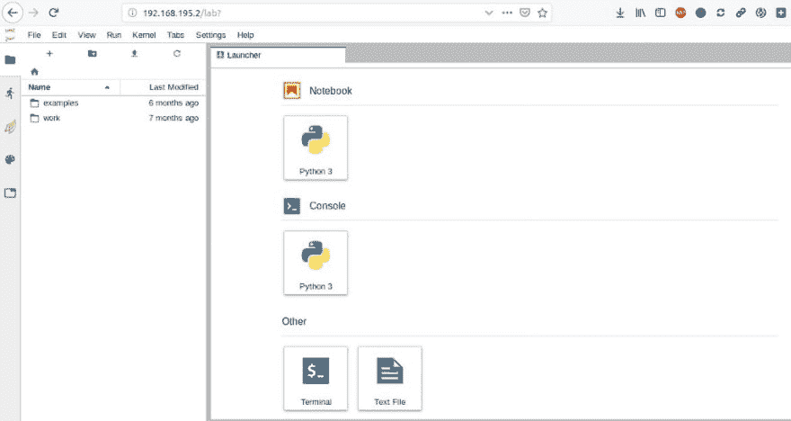](https://res.cloudinary.com/practicaldev/image/fetch/s--ITYTaGv8--/c_limit%2Cf_auto%2Cfl_progressive%2Cq_auto%2Cw_880/https://cdn-images-1.medium.com/max/1024/1%2AxsxleBtY85LXvVFSaaR_uQ.jpeg)

也可以在调度程序 web 界面中执行以下操作:

[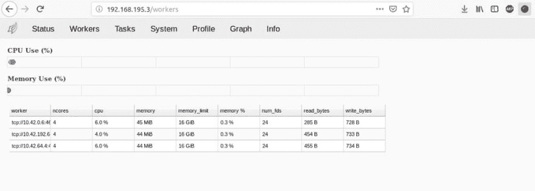](https://res.cloudinary.com/practicaldev/image/fetch/s--M2_9V-8J--/c_limit%2Cf_auto%2Cfl_progressive%2Cq_auto%2Cw_880/https://cdn-images-1.medium.com/max/1024/1%2Ajp095-ln51Wd6tkAMFU0Jg.jpeg)

调度程序 web 界面中的图形通过交互式可视化库 Bokeh 提供:

[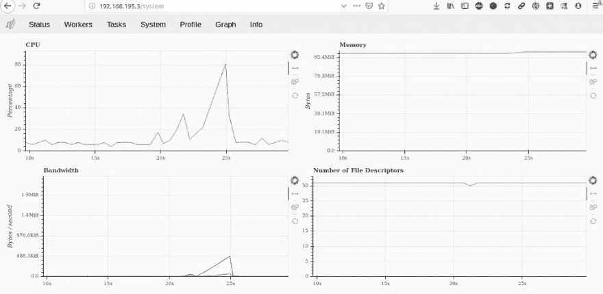](https://res.cloudinary.com/practicaldev/image/fetch/s--wo4AeSrX--/c_limit%2Cf_auto%2Cfl_progressive%2Cq_auto%2Cw_880/https://cdn-images-1.medium.com/max/1024/1%2AGzGHUTTCVTHvJ2ho3XsFBg.jpeg)

[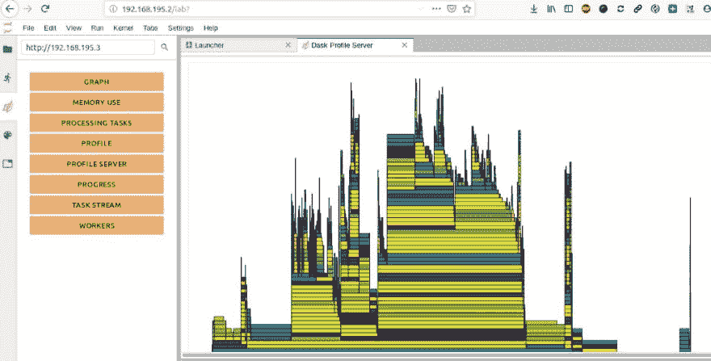](https://res.cloudinary.com/practicaldev/image/fetch/s--Q3UEW_CZ--/c_limit%2Cf_auto%2Cfl_progressive%2Cq_auto%2Cw_880/https://cdn-images-1.medium.com/max/1024/1%2A8n6tOcxOTTsg4-3gEkT2lA.jpeg)

Jupyter Lab 也提供了以下信息:

[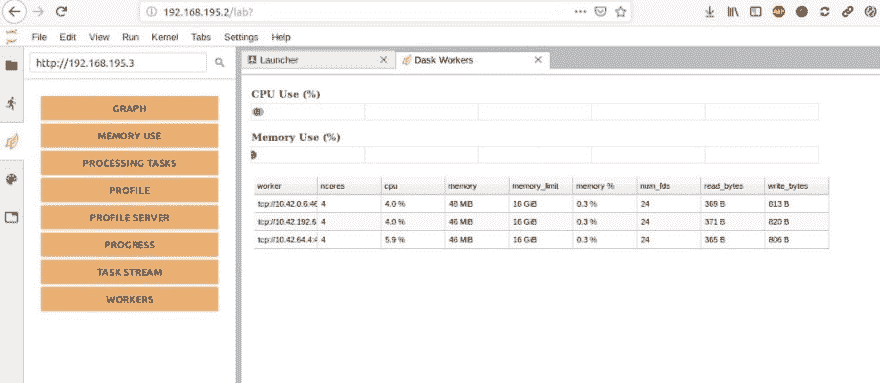](https://res.cloudinary.com/practicaldev/image/fetch/s--v5kDOwOq--/c_limit%2Cf_auto%2Cfl_progressive%2Cq_auto%2Cw_880/https://cdn-images-1.medium.com/max/1024/1%2ATmGvdAcsTF8AH0rMAHTppQ.jpeg)

[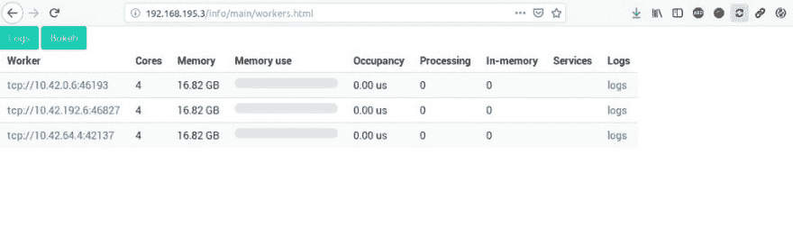](https://res.cloudinary.com/practicaldev/image/fetch/s--6eg-KRyX--/c_limit%2Cf_auto%2Cfl_progressive%2Cq_auto%2Cw_880/https://cdn-images-1.medium.com/max/1024/1%2AUACgkxj4_GENfdzqjvoy1g.jpeg)

使用此笔记本电脑快速测试 Dask，创建图表并计算平均值:

[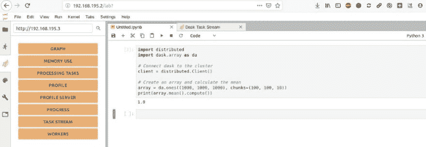](https://res.cloudinary.com/practicaldev/image/fetch/s--QxTx9l3i--/c_limit%2Cf_auto%2Cfl_progressive%2Cq_auto%2Cw_880/https://cdn-images-1.medium.com/max/1024/1%2Azteh0gkZ7DEgKIacD3v6kw.jpeg)

通过查看由此产生的任务:

[](https://res.cloudinary.com/practicaldev/image/fetch/s--mzzjYwad--/c_limit%2Cf_auto%2Cfl_progressive%2Cq_auto%2Cw_880/https://cdn-images-1.medium.com/max/1024/1%2AUdbt6OpyZaIGSydoaZyA6Q.jpeg)

[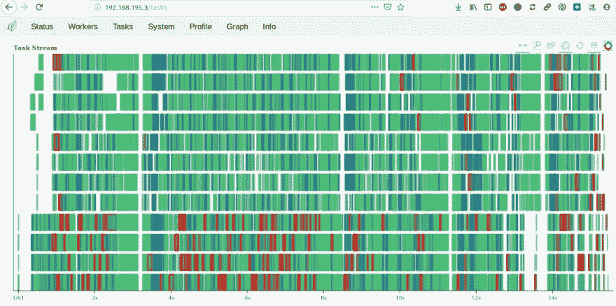](https://res.cloudinary.com/practicaldev/image/fetch/s--UUjhpcu8--/c_limit%2Cf_auto%2Cfl_progressive%2Cq_auto%2Cw_880/https://cdn-images-1.medium.com/max/1024/1%2AEBv_x3hb8zj40u7tnNy96w.jpeg)

[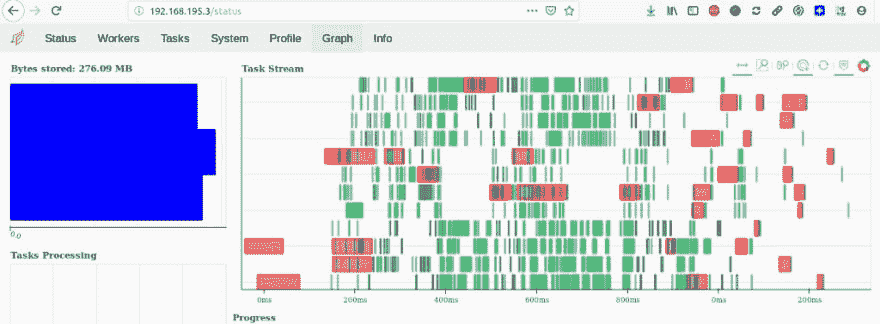](https://res.cloudinary.com/practicaldev/image/fetch/s--FywUsyf5--/c_limit%2Cf_auto%2Cfl_progressive%2Cq_auto%2Cw_880/https://cdn-images-1.medium.com/max/1024/1%2Aob_4hcDIBudQcty-G32ZdQ.jpeg)

通过配置文件，我可以始终使用 Helm 更改库群集中 Dask 工作人员的数量:

<figure>[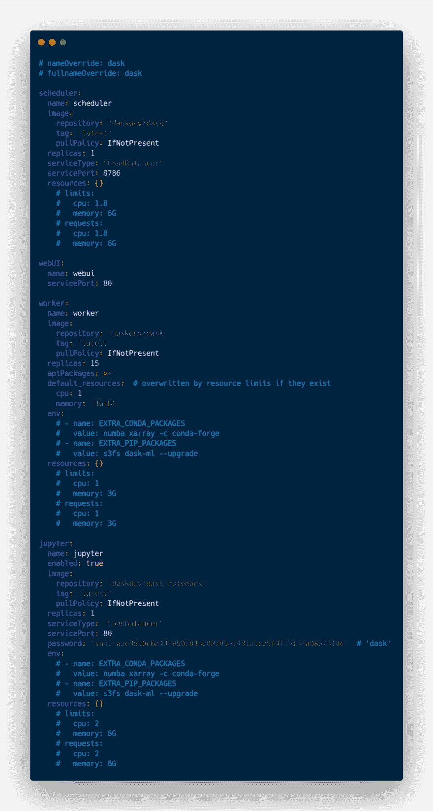](https://res.cloudinary.com/practicaldev/image/fetch/s--Qwdl0ZRg--/c_limit%2Cf_auto%2Cfl_progressive%2Cq_auto%2Cw_880/https://cdn-images-1.medium.com/max/1024/1%2A8SJdf7FunohO21rnFAbjiQ.png)

<figcaption>config . YAML</figcaption>

T6】</figure>

我在这里用 15 个工人更新我的 k-11 集群:

[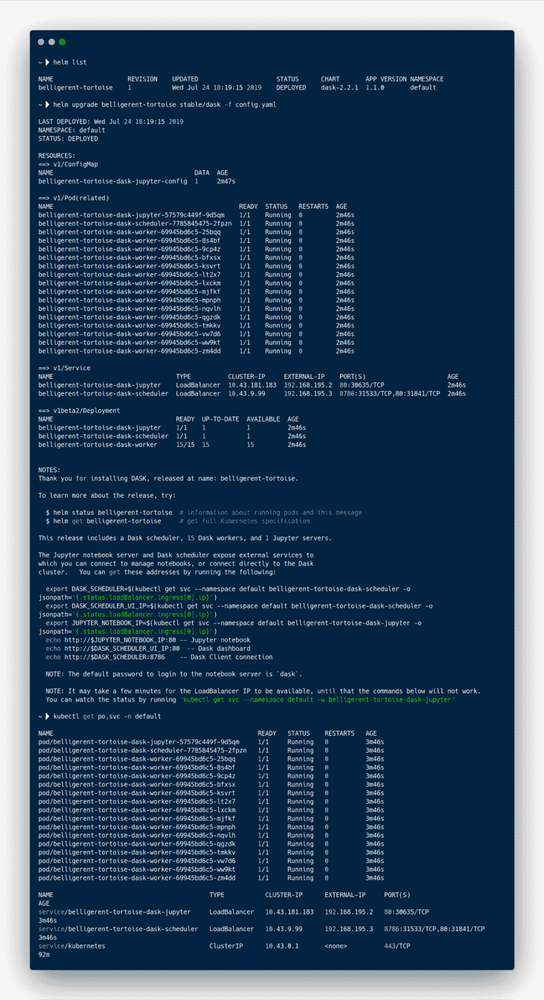](https://res.cloudinary.com/practicaldev/image/fetch/s--ed92meKb--/c_limit%2Cf_auto%2Cfl_progressive%2Cq_auto%2Cw_880/https://cdn-images-1.medium.com/max/1024/1%2A7MpSAx6Ld20h1tzjDq4kiQ.png)

[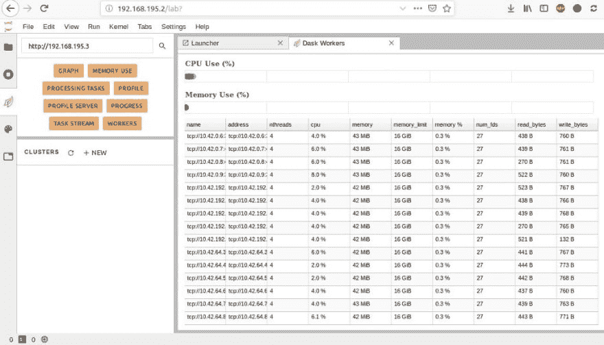](https://res.cloudinary.com/practicaldev/image/fetch/s--6gRrbbHV--/c_limit%2Cf_auto%2Cfl_progressive%2Cq_auto%2Cw_880/https://cdn-images-1.medium.com/max/1024/1%2AnaKhfMMljMuzsnv_jyU_zQ.jpeg)

> 为了测试 Dask 提供的并行计算能力，我将在葡萄牙银行的营销策略中使用 TPOT，它是一种 Python 自动化机器学习工具，通过基因编程优化机器学习管道:

[首页- TPOT](https://epistasislab.github.io/tpot/)

[https://medium . com/media/6c 65491 E3 e 820 a 42 BD 51 a 0711d 81 b 05 e/href](https://medium.com/media/6c65491e3e820a42bd51a0711d81b05e/href)

该笔记本电脑上的数据与葡萄牙一家银行的直接营销活动有关。营销活动是以电话为基础的。在许多情况下，需要与同一客户进行多次联系，以确定是否将订购(定期银行存款)产品(“是”或“否”):

[认知板/tpot](https://github.com/EpistasisLab/tpot/tree/master/tutorials/Portuguese%20Bank%20Marketing)

我先安装 Scikit-learn，这是一个免费的 Python 自动学习库，旨在与其他免费 Python 库(包括 NumPy 和 SciPy)兼容。以及 Dask-ML，它使用 Dask 和常用的机器学习库(如 Scikit-Learn)提供 Python 可扩展的机器学习:

[Dask-ML - dask-ml 1.0.1 文档](https://ml.dask.org/)

[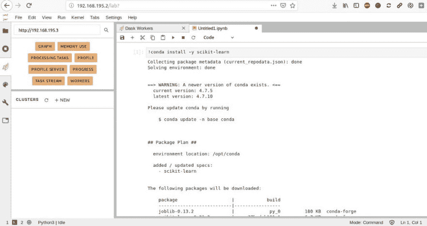](https://res.cloudinary.com/practicaldev/image/fetch/s--_OosmyPU--/c_limit%2Cf_auto%2Cfl_progressive%2Cq_auto%2Cw_880/https://cdn-images-1.medium.com/max/1024/1%2AeO8sMnEJjsitvMpsl1S9nA.jpeg)

[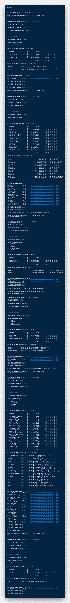](https://res.cloudinary.com/practicaldev/image/fetch/s--arpe-5aF--/c_limit%2Cf_auto%2Cfl_progressive%2Cq_auto%2Cw_880/https://cdn-images-1.medium.com/max/1024/1%2A-pBTdwWgOqpjfCAnbsGT0g.png)

我可以运行我的笔记本电脑:

[Jupyter 笔记型电脑](https://hub.gke.mybinder.org/user/deep75-c46d056c-f9777745e6f9b5c-btjwzajc/notebooks/portuguese-bank-tpot.ipynb#)

[https://medium . com/media/2c fbba 4798 f 4409 a 0 a2 BF 262 fc 835 FAA/href](https://medium.com/media/2cfbba4798f4409a0a2bf262fc835faa/href)[https://medium . com/media/b5cb 221 c 8657 f 83 Fe 2 BD 87832397491d/href](https://medium.com/media/b5cb221c8657f83fe2bd87832397491d/href)

最后一个使用 parallelpostfit 和 Scikit-learn 的示例，用于通过此笔记本电脑并行和分发评级或预测步骤:

[Jupyter 笔记型电脑](https://hub.gke.mybinder.org/user/deep75-acb5803a-3b8608291763acd-d30z3nz0/notebooks/parallel-scikit-learn.ipynb)

[https://medium . com/media/790 a 120 de 5 df 256 f 34 a 0 da 40 fab 4a 2 b 8/href](https://medium.com/media/790a120de5df256f34a0da40fab4a2b8/href)

[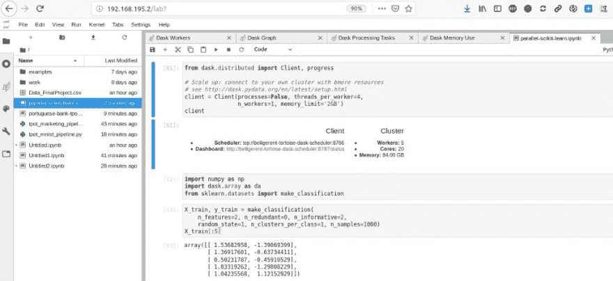](https://res.cloudinary.com/practicaldev/image/fetch/s--pwbfhwId--/c_limit%2Cf_auto%2Cfl_progressive%2Cq_auto%2Cw_880/https://cdn-images-1.medium.com/max/1024/1%2AEyLApMgT8bLU51QpaPjfkw.jpeg)

[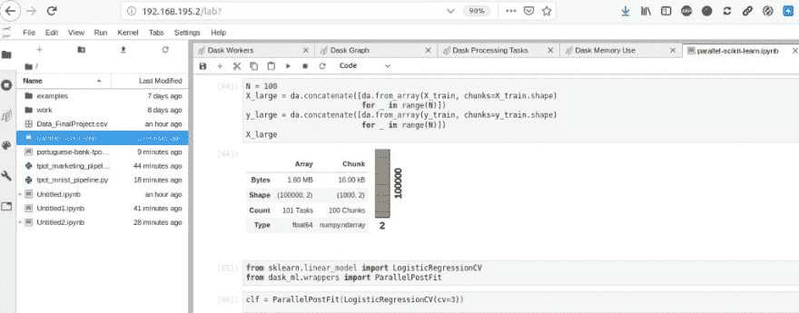](https://res.cloudinary.com/practicaldev/image/fetch/s--wTUso7Uv--/c_limit%2Cf_auto%2Cfl_progressive%2Cq_auto%2Cw_880/https://cdn-images-1.medium.com/max/1024/1%2AlnTlPSTsX2nyz9qJTkvbrg.jpeg)

[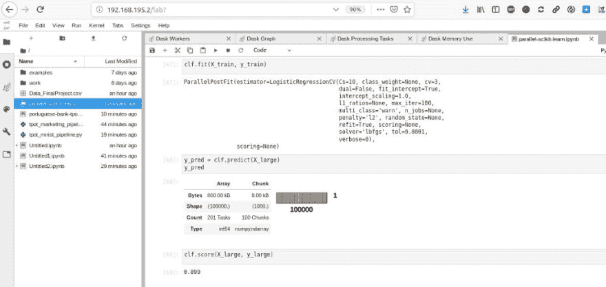](https://res.cloudinary.com/practicaldev/image/fetch/s--Dq7Wp2ir--/c_limit%2Cf_auto%2Cfl_progressive%2Cq_auto%2Cw_880/https://cdn-images-1.medium.com/max/1024/1%2Att0iwS6PWadhEGkWXSCV8Q.jpeg)

[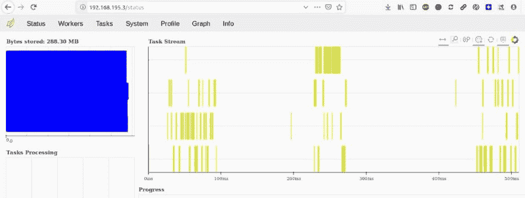](https://res.cloudinary.com/practicaldev/image/fetch/s--RMJWD5vV--/c_limit%2Cf_auto%2Cfl_progressive%2Cq_auto%2Cw_880/https://cdn-images-1.medium.com/max/1024/1%2ADEg6CVE1_C6g6CQR7KNW6A.jpeg)

[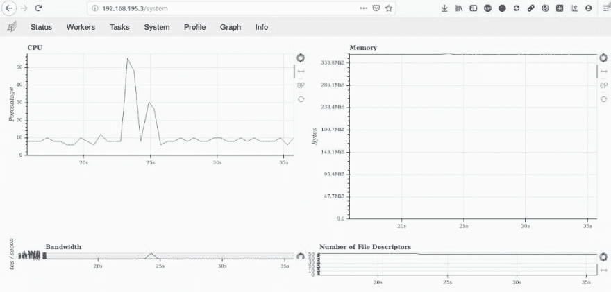](https://res.cloudinary.com/practicaldev/image/fetch/s--x6d8Bi6N--/c_limit%2Cf_auto%2Cfl_progressive%2Cq_auto%2Cw_880/https://cdn-images-1.medium.com/max/1024/1%2As4cvoUP4gNFjHvfGXFr9Gw.jpeg)

[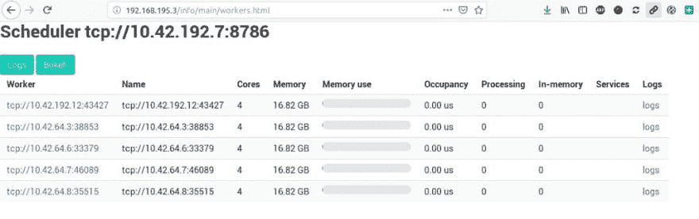](https://res.cloudinary.com/practicaldev/image/fetch/s--K7wshf3w--/c_limit%2Cf_auto%2Cfl_progressive%2Cq_auto%2Cw_880/https://cdn-images-1.medium.com/max/1024/1%2Ai3xekz6XhYSQe6KIkwXfpQ.jpeg)

可以直接从 Jupyter Lab 笔记本电脑服务器扩展 Dask 工作人员的数量:

[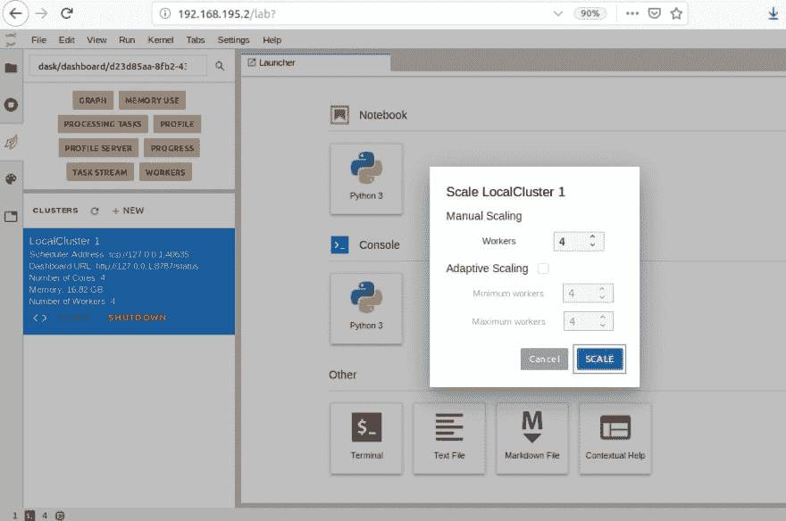](https://res.cloudinary.com/practicaldev/image/fetch/s--m0_JL0lI--/c_limit%2Cf_auto%2Cfl_progressive%2Cq_auto%2Cw_880/https://cdn-images-1.medium.com/max/1004/1%2AsEz96zHul9FeiFt369NMGA.jpeg)

[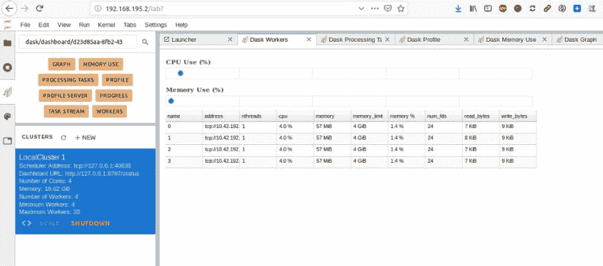](https://res.cloudinary.com/practicaldev/image/fetch/s--vhv_CtQI--/c_limit%2Cf_auto%2Cfl_progressive%2Cq_auto%2Cw_880/https://cdn-images-1.medium.com/max/1024/1%2ARGu3WtBsBj4REOGqiinM3g.jpeg)

通过 Grafana 和 Prometheus，客户可以使用 Rancher 监控群集(从而监控 Dash 工人):

[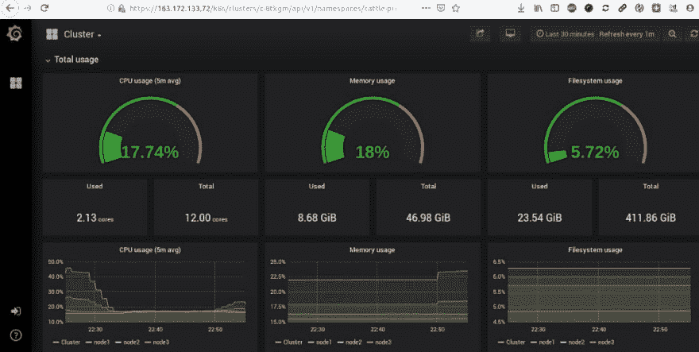](https://res.cloudinary.com/practicaldev/image/fetch/s--pSSLjd86--/c_limit%2Cf_auto%2Cfl_progressive%2Cq_auto%2Cw_880/https://cdn-images-1.medium.com/max/1024/1%2AsQ1upwOwoobWaCgfmFIZeQ.jpeg)

[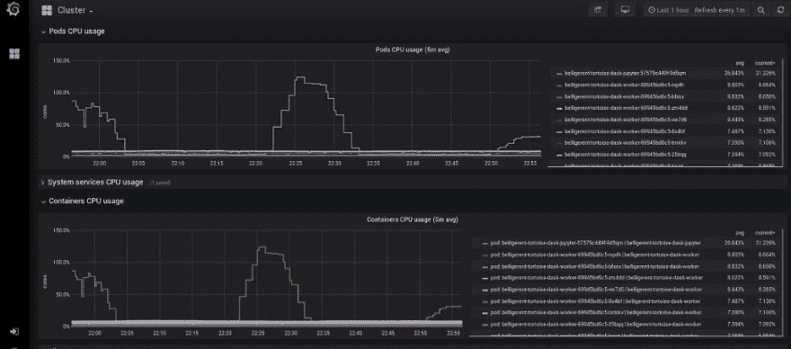](https://res.cloudinary.com/practicaldev/image/fetch/s--PkL8YZBY--/c_limit%2Cf_auto%2Cfl_progressive%2Cq_auto%2Cw_880/https://cdn-images-1.medium.com/max/1024/1%2Ah120M8K0cqpmXr_HjVoZ1A.jpeg)

[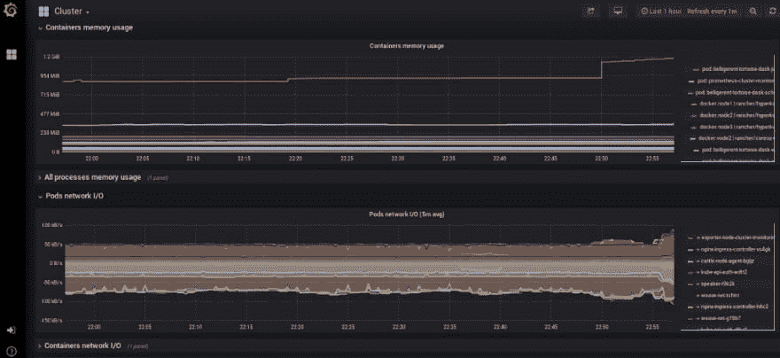](https://res.cloudinary.com/practicaldev/image/fetch/s--b9HlJ3ft--/c_limit%2Cf_auto%2Cfl_progressive%2Cq_auto%2Cw_880/https://cdn-images-1.medium.com/max/1024/1%2A1s0yBY0wQGh9Sdxb2mc-qQ.jpeg)

[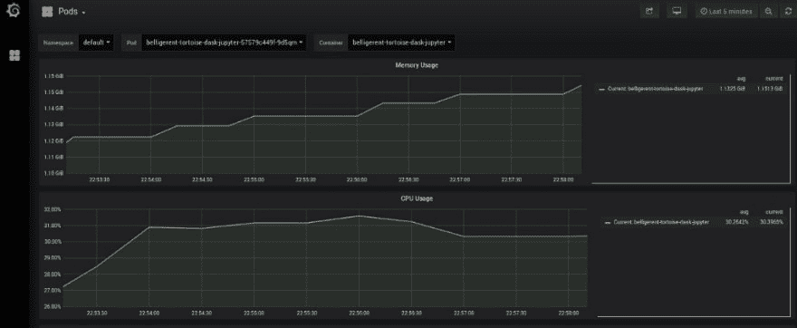](https://res.cloudinary.com/practicaldev/image/fetch/s--Xjb-w67Q--/c_limit%2Cf_auto%2Cfl_progressive%2Cq_auto%2Cw_880/https://cdn-images-1.medium.com/max/1024/1%2AsiCsJDVscPgTVIKpGzkZWg.jpeg)

[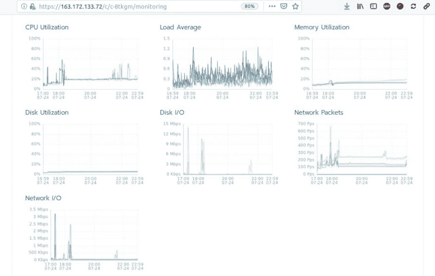](https://res.cloudinary.com/practicaldev/image/fetch/s--B4rYl7OQ--/c_limit%2Cf_auto%2Cfl_progressive%2Cq_auto%2Cw_880/https://cdn-images-1.medium.com/max/1024/1%2AUGPBy-ptds9arGfTuXRS1A.jpeg)

O n 同样可以通过 dock 轻松地使用 Dask 来构建其工人群集-在本地实例上构建(每个 dock 映像都包括 Dask(包括分布式调度程序)、Numpy 和 pandas 以及 mini wave 安装，所有这些都基于 Debian 映像) :

*   dask/dask 坞站
*   [Docker 图像- Dask 2.1.0 文档](https://docs.dask.org/en/latest/setup/docker.html)

下一个！……

[](https://res.cloudinary.com/practicaldev/image/fetch/s--QNJTnHD8--/c_limit%2Cf_auto%2Cfl_progressive%2Cq_auto%2Cw_880/https://cdn-images-1.medium.com/max/378/1%2ATscAd70ffOqdWQgR4_83_g.jpeg)