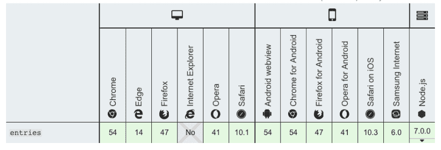

# ES 6:使用 Object.entries()迭代对象中的键

> 原文：<https://dev.to/cchunduri/es-6-using-object-entries-to-iterate-the-keys-in-the-object-53pd>

您可以使用 ES 6 迭代对象中的键，如下所示。

```
let employe = {
 name: 'Chaitanya',
 eno: '1'
};

for (let [key, value] of Object.entries(employe)) {
  console.log(`${key}: ${value}`);
} 
```

或者还有另一种方法使用 forEach 方法

```
Object.entries(employe).forEach(([key, value]) => {
  console.log(`${key}: ${value}`); 
}); 
```

Object.enttries()在 ECMAScript2017 中实现了标准化。下面是从 MDN 收集的浏览器支持图表

[](https://res.cloudinary.com/practicaldev/image/fetch/s--kRizDZ8v--/c_limit%2Cf_auto%2Cfl_progressive%2Cq_auto%2Cw_880/https://thepracticaldev.s3.amazonaws.com/i/men2md5m46u0ye0pphzl.png)