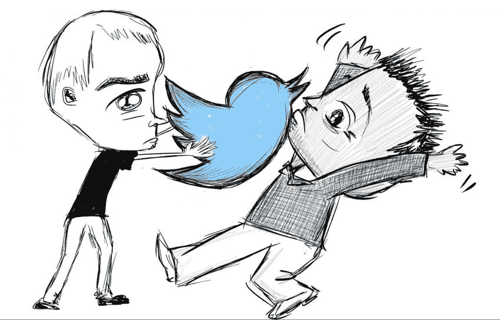
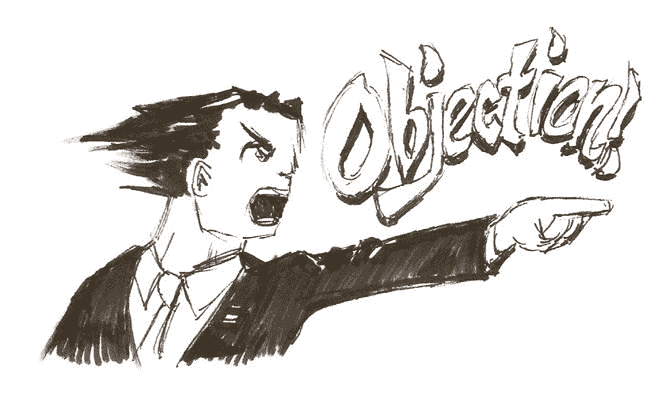

# 好的公司不会要求你分享。它们让你想要

> 原文：<https://dev.to/daedtech/good-companies-don-t-ask-you-to-share-they-make-you-want-to-2f78>

> “所以，请继续与你的社交网络分享这些吧。”

我想你的公司总是对你说类似的话。事实上，如此频繁，以至于你可能对它有点麻木了。

*   嘿，我们在招人！
*   我们公司刚刚被提名美国~~高中生~~公司名人录！
*   我们即将发布新产品！
*   史蒂夫正在一个社交活动上讲话！

> “所以，请继续与你的社交网络分享这些吧。”

### 这是一个无伤大雅的请求...如果这让你不舒服也没关系

我还记得第一次听到这个的时候。之前，我职业生涯的前半部分在制造产品的公司工作，软件只是等式的一部分。由于开发者的相对匿名性和社交网络的相对新奇性，我从未遇到过任何类似的请求。它根本就不会出现。

但是这一年，我在一家销售应用开发的商店工作(并且[称之为“咨询”](http://daedtech.com/a-taxonomy-of-software-consultants/))。由于人是他们的产品(或者至少是人的劳动)，个体贡献者软件开发人员扮演了更突出的角色。于是请求来了。

> “所以，请继续与你的社交网络分享这些吧。”

我不记得我们应该分享什么，或者发什么微博，或者 LinkedIn 上的动词是什么。该公司可能一直在寻求招聘、营销、销售或其他方面的帮助。没关系。

对于我们在这里的目的，对我来说重要的是，这摩擦我的错误方式。

当时我真的不知道为什么，过了几年我才开始明白为什么。在那里工作我并不感到尴尬。它是...一个给我钱来换取劳动的地方。这是大多数人都会做的事情。这个要求并不苛刻，也没有以任何方式损害我的道德和伦理。我甚至想到了免费做一些有价值的事情是一种请求，但这并没有困扰我。

尽管如此。我不喜欢这个要求，没有做。

多年以后，这种要求可能会更加普遍。在这篇文章的其余部分，我将详述为什么这可能会让你不舒服，为什么这没关系，以及应该发生什么。

### 公司免费向你索要一些有价值的东西，所以他们如何索要很重要

为了不留下一个不封闭的循环，让我解决一下我提到的关于免费赠品的问题。当时我隐约明白这一点，但多年后的今天，在经营企业并拥有一家营销机构后，我明白了。

眼球是美元(或者至少是美分)。在我们的内容业务中，[点击订阅](https://www.hitsubscribe.com/)，我们名义上出售博客文章和内容。但是我们真正卖的是*以软件开发者关注的形式来影响*。这意味着人们阅读一篇博客文章、转发一个链接或分享一张图片等事情具有实际的货币价值。

> “所以，请继续与你的社交网络分享这些吧。”

现在看看这个请求，看看它是什么。“请利用你的个人关系，帮我们节省营销费用。”

现在，公司要求你这么做没有错。但是他们如何提问很重要。很多。

如果他们像我说的那样，请求帮助，那么他们对你是诚实的。如果他们表现得好像什么都不是，或者更糟糕的是，你有义务或者你应该想做，那就是轻度的不诚实。如果他们只是在开头添加一个警告，比如，“嘿，没有义务，但是如果你喜欢，我们希望你分享，”那么整个问题就会消失。

现在，除非你对着 10 万人或其他人发微博，否则对金钱的担忧主要是表面的。你不应该因为公司没有付给你 4 美元/条推特之类的东西而烦恼。

公司对你们的关系做出假设，这应该让你感到不安。

### 不对称的利益伪装成“我们都在一起”

让我们简单地转换一下思路来帮助你理解这一点。考虑一个(公认的过于简单的)假设情况。你的 B2B 公司正在寻找线索和销售。

> “所以，请继续与你的社交网络分享这些吧。”

你尽职尽责地做到了。你网络中的某人看到你的推文，点击其中的行动号召，将他们带到你公司的登陆页面。他们读了这一页，发现自己很感兴趣，于是给你的公司打电话。最终，这导致了销售。我们来看看谁从中受益，大概是按顺序吧。

*   从销售中获得佣金的销售人员。
*   销售主管和首席执行官，他们更接近实现季度和年度数字的奖金领域。
*   公司股东的股票变得更值钱了。
*   其他人，包括你，因为...好吧，好吧，这很难追踪，但请耐心听我说。公司开始做得更好，这意味着有更多的钱可以周转。希望有人决定这笔钱应该部分捐给你的组织。然后，如果是这样的话，部门员工预算中会有更多的钱，这意味着，假设你的绩效评估至少达到了预期，那么你可能会在一两年内获得稍大的生活费用调整。

该公司的营销努力并不是简单的“水涨船高”对于阅读这篇文章的 99%的人来说，即使在最好的情况下，你的船也不会上升。因此，请求使用你的个人网络进行营销实际上是请求使用你的个人网络为他人谋利。

### 好公司是那些你理性地想要分享其信息的公司

当然，事情并不总是这样。例如，如果你*是*一家公司的股东，那么你就有更多的利益。但这种情况太常见了。最糟糕的是，*不需要*这样。

在我曾经写过的一篇很受欢迎的文章中，我谈到了[乞丐 CEO](https://daedtech.com/the-beggar-ceo-and-sucker-culture/)是打着“文化”的幌子向员工索要无偿加班工资的人但这同样适用于那些打着文化幌子要求自由营销的首席执行官们。

在这两种情况下，这都是一种气味。

具体来说，这是不恰当的激励的味道。你应该*希望*与你的网络分享东西。

> “所以，请继续与你的社交网络分享这些吧。”

如果他们有这样的政策，这是一条公司不需要撰写的信息。

*   如果你帮我们招到人，我们会给你介绍奖金。
*   任何带来新线索的人都会得到佣金。
*   你的年薪与利润数字挂钩。

你大概明白了。如果公司希望你参与他们的招聘、销售和营销，并且他们为此提供了合理的激励，你就要自己去发微博了。你可能会对营销的官方推文副本感兴趣，只是因为它承诺比你写的任何推文都更有效。

### 组织也有学习的机会

财务激励很重要，但它们只是等式的一部分。事实是，很多人可能不会因为其他原因在社交媒体上发布招聘公告。也许他们很难认为这条推文有任何机会最终将招聘奖金收入囊中。

或者，可能是他们对公司或某种程度上的信息感到尴尬。也许他们觉得他们的品牌比公司的品牌有明显更高的可信度。也许这完全是另一回事。

不管是什么情况，如果他们愿意倾听，那对公司来说都是非常有价值的反馈。

可悲的是，公司完全没有意识到这一点。在企业文化中有一种普遍的感觉，为一家公司工作与对该公司的信念和自豪是一致的。这就是为什么[公司的默认职位是理想主义者的](https://daedtech.com/defining-the-corporate-hierarchy/)。因此，当然每个人都渴望在自己的个人账户上发布公司信息。而且，如果他们不是*，他们就有问题*。

错了，公司。如果别人不想爆你的消息，那就是 **你** 有问题。

可能是名声。这可能是错位的激励。或者完全是别的什么东西。但这是*的东西*。

### 不想帮忙营销也没关系

因此，如果公司睁大眼睛看问题，就能学到一些东西。但是你呢，个人读者？你应该带走什么？

> “所以，请继续与你的社交网络分享这些吧。”

简单说这个。当你的公司对你提出这样的要求时，请考虑一下你自己的感受。如果你乐意这样做，原因不仅仅是“我是这个家庭的一员”，那么这是一个非常好的迹象。如果你能清楚地表达这是如何符合你的最大利益的，那么你就在一个好的组织里。

但是如果你不能清楚地说明为什么这样做对你有好处，超越一种义务感，那就不好了。如果这个要求让你觉得恶心或肮脏，那就不好了。如果你对这一请求的反应不是“当然，为什么*不会*我做那件事”，那就是一种味道。

你不欠公司免费营销，不管他们告诉你什么。但更重要的是，有些公司你会希望得到帮助。如果你现在的公司不属于这一类，那么可能是时候评估你的职业和选择了。