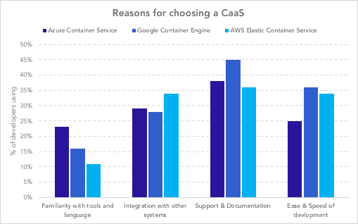
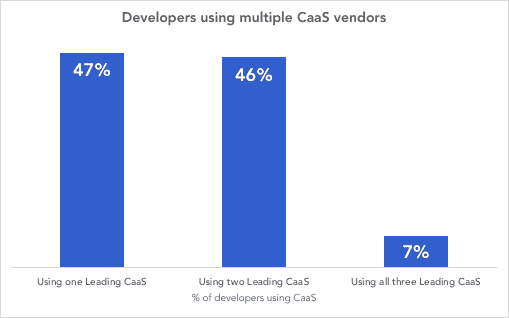

# 选择正确的容器即服务(CaaS)或不选择

> 原文：<https://dev.to/developernation/choosing-the-right-containers-as-a-service-caas-or-not-2l04>

[](https://res.cloudinary.com/practicaldev/image/fetch/s--3pSP7VLl--/c_limit%2Cf_auto%2Cfl_progressive%2Cq_auto%2Cw_880/https://thepracticaldev.s3.amazonaws.com/i/jqpoa1lkxuvv0vpl2hq9.jpg)

云原生开发和容器的出现重新定义了软件的开发方式。但是，并不是所有的组织都有资源或专业知识来建立支持容器化应用程序所需的基础设施。幸运的是，云供应商提供容器即服务来帮助开发人员利用云原生开发的优势。

三家领先的云提供商都有 CaaS 产品，但选择正确的产品可能是一个挑战。虽然每个人都有不同的要求，但了解其他人正在使用什么解决方案以及为什么使用，总是有益的，有助于做出明智的决策。

根据/Data 最近的开发人员经济调查，我们发现有几个因素促使开发人员选择一个 CAA 而不是另一个:

```
- familiarity with tools and languages
- integration with other systems
- support and documentation 
- ease and speed of development. 
```

<svg width="20px" height="20px" viewBox="0 0 24 24" class="highlight-action crayons-icon highlight-action--fullscreen-on"><title>Enter fullscreen mode</title></svg> <svg width="20px" height="20px" viewBox="0 0 24 24" class="highlight-action crayons-icon highlight-action--fullscreen-off"><title>Exit fullscreen mode</title></svg>

虽然开发人员在采用平台时还有其他需要考虑的原因，但认为这四个因素很重要的开发人员的比例在三个领导者中有明显的不同。研究中跟踪的其他 16 个因素包括:

```
- pricing
- community
- learning curve
- suitability and feature set
- performance 
- scalability 
```

<svg width="20px" height="20px" viewBox="0 0 24 24" class="highlight-action crayons-icon highlight-action--fullscreen-on"><title>Enter fullscreen mode</title></svg> <svg width="20px" height="20px" viewBox="0 0 24 24" class="highlight-action crayons-icon highlight-action--fullscreen-off"><title>Exit fullscreen mode</title></svg>

[](https://res.cloudinary.com/practicaldev/image/fetch/s--i6gKqvqX--/c_limit%2Cf_auto%2Cfl_progressive%2Cq_auto%2Cw_880/https://thepracticaldev.s3.amazonaws.com/i/5oiw5ezao0v562zbl38n.png)

然而，并不是所有的 CaaS 平台都是因为同样的原因而被选中的。选择 AWS 弹性容器服务的开发人员更有可能选择它，因为它可以与其他系统集成。这是 34%的开发者选择 AWS ECS 的原因，相比之下，Azure 和谷歌的这一比例分别为 29%和 28%。亚马逊不仅拥有大量的工具和服务，还拥有强大的合作伙伴网络。选择是如此之多，他们有自己的服务市场，甚至发布了一个云地图服务来帮助开发者发现和管理这一切。

开发人员倾向于支持 Google Container Engine (GCE ),因为它易于使用并且有良好的文档记录。45%的 GCE 开发人员选择它的部分原因是因为支持和文档，36%是因为开发的方便和速度。我们倾向于发现开发者对 Google 提供给他们的开发者社区的支持和文档一直很满意。这种满足感是谷歌容器引擎用户选择该平台的重要原因。

对于 Azure 容器服务，开发人员喜欢这样的事实，即他们可以使用他们熟悉的工具和语言。Azure 开发者选择 Azure 容器服务的可能性分别比亚马逊和谷歌高 7 和 12 个百分点。我们的研究表明，微软开发人员相对来说是品牌忠诚的，所以 Azure 让开发人员可以很容易地使用微软工具进行容器开发和管理。Azure 使开发人员能够使用 Docker 容器和 Visual Studio 进行开发，这些工具可以通过简单的命令将代码部署到 Azure 容器服务。他们也使得在 Windows 服务器上部署 Docker 容器成为可能。最后，与 Active Directory 的集成使忠实的 Microsoft 开发人员能够使用现有的身份验证策略和技术。

归根结底，大多数开发人员都在寻找一个易于使用并符合其当前战略和基础设施的平台，无论是集成、支持还是使用他们熟悉的工具的能力。

## 真的是非此即彼的选择吗？

虽然每个解决方案都有独特的优势，但我们的分析还发现，许多开发人员使用了不止一个领先的 CAA，在某些情况下甚至使用了三个。使用 CaaS 的开发人员中有 7%使用所有三个领先平台，而 46%使用两个平台。

[](https://res.cloudinary.com/practicaldev/image/fetch/s--69loW8I1--/c_limit%2Cf_auto%2Cfl_progressive%2Cq_auto%2Cw_880/https://thepracticaldev.s3.amazonaws.com/i/x8u2r4r9rz6pcyfbfqxf.png)

我们的数据验证了您根据自己的经验可能已经怀疑的东西:超过一半的后端开发人员正在追求多云战略，选择不要只依赖单一提供商。

推动这一趋势的是多云解决方案的诸多优势。如果团队针对多云环境进行开发，IT 组织可以避免供应商锁定。这种方法迫使开发人员在不依赖供应商特定服务的情况下进行构建，从而降低了转换成本。多云方法还使组织能够优化其基础架构。开发人员和运营专家可以根据各种工作负载和应用程序的要求，利用每种云的优势。更强的弹性也是需要考虑的一个关键优势。这在拒绝服务攻击中尤其重要，在拒绝服务攻击中，计算资源可能会被虚假请求淹没。随着备份云的准备就绪，工作负载可以转移到备份云。

随着领先的供应商都在 Kubernetes 上进行标准化，选择一个 CaaS 或另一个 CaaS 在未来将变得更加无关紧要。亚马逊和 Azure 正在推广特定于 Kubernetes 的 CaaS 产品，以更多地关注 Kubernetes 作为底层编排引擎。Azure 实际上是将其所有用户迁移到 Kubernetes 服务。有了标准编排引擎 Kubernetes，跨云提供商迁移应用和容器变得更加容易。

我们也看到亚马逊和 Azure 正在努力让使用容器和 Kubernetes 进行开发变得更加方便。两家公司都在提供无集群或无服务器的 Kubernetes 服务，比如 AWS 的 Fargate 和 Azure Container Instance。这些解决方案使开发人员只需部署容器，而不必担心服务器或集群。这种方法对开发人员来说更容易，但是额外的抽象级别也降低了灵活性并增加了切换成本。

亚马逊开源的鞭炮，支持无服务器平台 Lambda 和 Fargate 的微型虚拟机，将是另一个值得关注的有趣发展。这可能被证明是亚马逊对 Kubernetes 的回应，但针对的是无服务器市场。虽然还有一段路要走，但这可能会导致一个无服务器的生态系统，就像容器环境一样灵活。

## 你怎么看？

你对你正在使用的容器解决方案有强烈的感觉吗？

或者你可能对某些其他容器感到不舒服。

请让我们了解它，并通过[参加开发者经济调查来倾听您的声音。](https://www.developereconomics.net/?utm_medium=textlink&utm_source=partners&utm_campaign=choosing_the_right_containers_as_a_service_caas&utm_content=devto)