# 用 Firebase 构建 API

> 原文：<https://dev.to/andrewevans0102/building-an-api-with-firebase-3h7e>

[](https://res.cloudinary.com/practicaldev/image/fetch/s--UM_-lQFR--/c_limit%2Cf_auto%2Cfl_progressive%2Cq_auto%2Cw_880/https://atevans85.files.wordpress.com/2019/07/child-1864718_1280.jpg%3Fw%3D700)

在这篇文章中，我将使用谷歌的 Firebase 构建一个 API。我将用 [Firebase 云功能](https://firebase.google.com/docs/functions)和 [ExpressJS](https://expressjs.com/) 构建后端。

在开始之前，我建议您进行以下设置:

1.  Windows、Linux 或 Mac (OSX)电脑上的终端设置
2.  已安装节点 10.10
3.  NVM 安装了[和这里的指令](https://github.com/nvm-sh/nvm)
4.  一个谷歌账户
5.  [邮递员](https://www.getpostman.com/)安装完毕
6.  [Firebase CLI](https://firebase.google.com/docs/cli) 安装运行终端命令`npm install -g firebase-tools`

我将在 GitHub repo 中引用可用的[代码。GitHub repo 还包含一个 Postman 集合——我建议导入该集合并使用它来测试您的项目。请注意，URL 路径中的`app id`特定于我部署的项目。您需要更改`app id`来匹配您将在 Firebase 控制台中创建的项目。如果你还不明白这一点，没关系——我会在初始项目设置完成后进一步讨论这个问题。](https://github.com/andrewevans0102/how-to-build-a-firebase-api)

## 基础知识

首先，我想回顾一下什么是 API 以及这些技术如何工作的一些基本概念。这完全是介绍性的，所以如果您已经熟悉了，可以随意跳过这一部分。

API 代表**应用程序编程接口**，指的是计算机系统用来相互通信的方法。如果你谷歌一下，谷歌对 API 的定义是:

> *允许创建访问操作系统、应用程序或其他服务的特征或数据的应用程序的一组功能和过程。*

基本上，您构建一个 API，这样您的系统就可以与您正在构建的任何东西进行通信。API 可以包括一个网站的基本 REST 端点，甚至可以包括定义您构建的软件库的方法。这就引出了下一件重要的事情， **RESTful 服务**。

RESTful 服务引用[表述性状态转移](https://en.wikipedia.org/wiki/Representational_state_transfer)，并利用 HTTP 协议传递数据(通过 API)。HTTP 协议是我们每天在网站和互联网应用中使用的协议。RESTful 服务使用不同的 HTTP 动词(或方法)在不同的系统之间传递数据。您将使用的典型 HTTP 动词包括:

*   **GET** =检索数据
*   **POST** =创建或更新数据
*   **PUT** =更新数据
*   **删除** =删除数据

我之前也提到过“端点”,当我提到我需要访问的网站或服务时，我指的就是这个。端点只是一种描述我的系统将通过 HTTP 请求访问的地址的奇特方式。关于 HTTP 请求的更多细节，请参考维基百科页面。

## 火基

[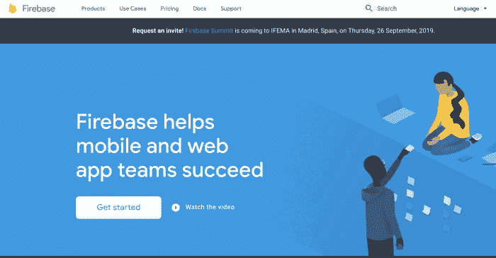](https://res.cloudinary.com/practicaldev/image/fetch/s--oyAl_pnh--/c_limit%2Cf_auto%2Cfl_progressive%2Cq_auto%2Cw_880/https://atevans85.files.wordpress.com/2019/07/screen-shot-2019-07-22-at-3.59.49-pm.png%3Fw%3D700)

我将使用谷歌的 Firebase 平台来构建这篇文章。Firebase 是一个非常强大的平台，开发人员可以使用它快速构建应用程序。Firebase 提供的常见服务包括:

*   [主持](https://firebase.google.com/docs/hosting)
*   [实时数据库](https://firebase.google.com/docs/database)
*   [NoSQL 数据库](https://firebase.google.com/docs/firestore)
*   [功能(类似于 AWSλs)](https://firebase.google.com/docs/functions)
*   [文件存储](https://firebase.google.com/docs/storage)
*   多得多！

为了使用 Firebase，你只需要一个谷歌账户。这就是为什么我要求你在介绍部分设置一个谷歌帐户。

在这篇文章的剩余部分，我将为一个用 Firebase 构建的 API 设置后端。如果你想更深入地了解 Firebase，[请在这里查阅我的帖子](https://dev.to/andrewevans0102/firebase-25m9-temp-slug-7845367)。

## 初始设置

首先，点击这里的链接，进入[Firebase 控制台。您应该会看到如下所示的内容:](https://console.firebase.google.com/u/0/)

[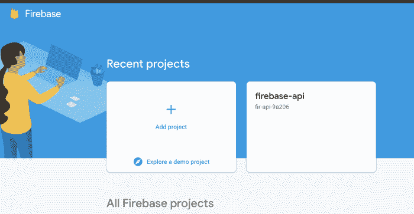](https://res.cloudinary.com/practicaldev/image/fetch/s--DE8SKqyC--/c_limit%2Cf_auto%2Cfl_progressive%2Cq_auto%2Cw_880/https://atevans85.files.wordpress.com/2019/07/screen-shot-2019-07-22-at-7.29.16-am.png%3Fw%3D700)

单击“添加项目”按钮，并为您的项目命名。我建议接受分析步骤，因为它有助于你和谷歌。您可以稍后在控制台中参考分析信息(在您的项目被创建之后)。

[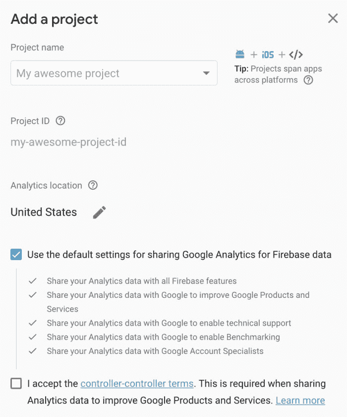](https://res.cloudinary.com/practicaldev/image/fetch/s--AVVSJNRL--/c_limit%2Cf_auto%2Cfl_progressive%2Cq_auto%2Cw_880/https://atevans85.files.wordpress.com/2019/07/screen-shot-2019-07-22-at-7.30.17-am.png%3Fw%3D700)

创建项目后，在控制台中打开它，然后单击左侧导航栏中的“database”以查看以下内容:

[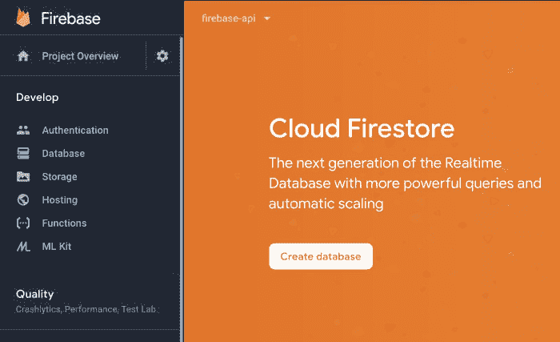](https://res.cloudinary.com/practicaldev/image/fetch/s--LgQ7vuRu--/c_limit%2Cf_auto%2Cfl_progressive%2Cq_auto%2Cw_880/https://atevans85.files.wordpress.com/2019/07/screen-shot-2019-07-22-at-7.32.37-am.png%3Fw%3D700)

点击“云 Firestore”下的“创建数据库”来创建您的初始数据库。选择“测试模式”以启用所有读取和写入。您可以构建规则来指定数据库的安全性，以便以后进一步锁定数据库。关于锁定数据库实例的更多信息，请参考这里的 [firebase 文档。你还会被要求设置一个位置；无论默认是什么都可以，但是你也可以选择一个离你更近的数据中心。查看](https://firebase.google.com/docs/firestore/security/get-started)[本页了解更多关于数据中心位置的信息](https://firebase.google.com/docs/projects/locations)。

[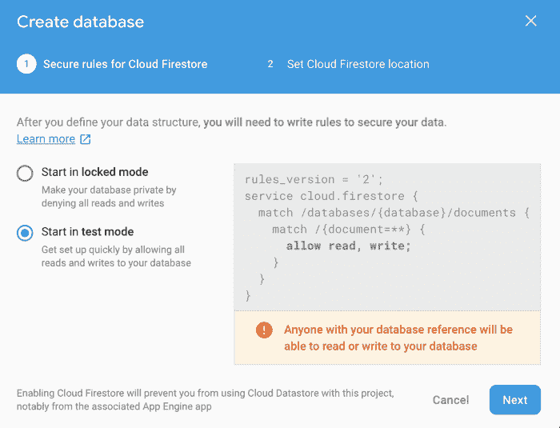](https://res.cloudinary.com/practicaldev/image/fetch/s--PRWEAsfA--/c_limit%2Cf_auto%2Cfl_progressive%2Cq_auto%2Cw_880/https://atevans85.files.wordpress.com/2019/07/screen-shot-2019-07-22-at-7.32.47-am.png%3Fw%3D700)

现在我们已经在控制台中设置了基本的项目，让我们切换到您的计算机来设置代码。

## 编写代码

在这一步中，我们假设您的计算机上已经安装了 Firebase CLI。如果你还没有这样做的话，我建议你按照这里的[指示来设置](https://firebase.google.com/docs/cli)。

接下来，进入你的终端，用`mkdir my-project`为你的项目创建一个文件夹

接下来，`cd`进入该文件夹并运行`firebase init`，您应该会看到如下内容:

[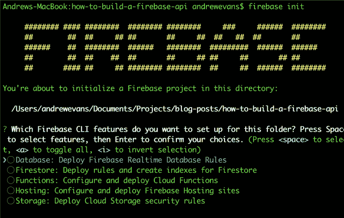](https://res.cloudinary.com/practicaldev/image/fetch/s--jrVDzZa3--/c_limit%2Cf_auto%2Cfl_progressive%2Cq_auto%2Cw_880/https://atevans85.files.wordpress.com/2019/07/screen-shot-2019-07-22-at-7.45.06-am.png%3Fw%3D700)

在选项菜单中选择“功能”。然后在下一个终端输出显示的列表中选择您之前创建的 Firebase 应用程序。

下一组选项相当简单。

*   选择 **JavaScript**
*   为林挺选择**是**
*   选择**是**安装依赖项
*   你可以走了！

接下来，`cd`进入创建的`functions`文件夹。当你运行`init`命令时，它会为你生成一个函数文件夹。`functions`文件夹应该包含以下文件:

*   索引. js
*   节点模块文件夹
*   包锁. json
*   package.json

在你选择的终端编辑器中(强烈推荐 [VSCode](https://code.visualstudio.com/) )先看一下`index.js`。

## 无服务器 API 和您的第一个端点

Firebase Functions 使您能够使用 ExpressJS 库来托管一个**无服务器 API** 。**无服务器**只是一个没有物理服务器运行的系统的术语。这有点用词不当，因为从技术上讲，它确实运行在服务器上，但是，您让提供商处理托管方面。传统的 API 要求您在云中或本地设置一个服务器来托管您的应用程序。这意味着开发人员必须负责操作系统补丁和警报等。在无服务器的世界里，你不用担心任何事情，除了你的代码。这是 Firebase 最酷的部分之一！

因此，为了在您的项目中使用 ExpressJS，删除`index.js`文件并在那里粘贴以下代码行:

```
const functions = require('firebase-functions');
const admin = require('firebase-admin');
const express = require('express');
const cors = require('cors');
const app = express();
app.use(cors({ origin: true }));

app.get('/hello-world', (req, res) => {
  return res.status(200).send('Hello World!');
});

exports.app = functions.https.onRequest(app); 
```

Enter fullscreen mode Exit fullscreen mode

使用`require`的第一行是引入依赖项。我们还没有`express`或`cors`，所以让我们用下面两个命令在终端中安装它们:

```
npm i express
npm i cors 
```

Enter fullscreen mode Exit fullscreen mode

具有`require`值的初始行导入我们将要使用的库。以下是更详细的库:

*   **firebase-functions** 是一个 [npm 模块](https://www.npmjs.com/package/firebase-functions)，可以让你创建函数
*   **firebase-admin** 是[firebase admin SDK](https://firebase.google.com/docs/admin/setup)，它使您的功能能够控制您所有的后端 Firebase 服务
*   **express** 是让您创建服务器实例的 [ExpressJS](https://expressjs.com/) 库
*   **cors** 是一个 [npm 模块](https://www.npmjs.com/package/cors)，它允许你的功能在与你的客户端分离的地方运行。`app.use`只是为您的 express 服务器实例启用 CORS。

带有`app.get`的代码部分创建了一个“hello world”端点。我们在这里使用的是[快速路由](https://expressjs.com/en/guide/routing.html)。有很多方法可以做到这一点。为了方便起见，我明确地定义了路线。在企业环境中，您可能会使用快速路由器，并且代码可能看起来不那么冗长。要更详细地了解快递路线，我[推荐查看这里的教程](https://scotch.io/tutorials/learn-to-use-the-new-router-in-expressjs-4)。

出于我们的目的，`app.get`只是发出一个 **HTTP GET** 调用，并捕获`req`中的请求和`res`中的响应。当端点被调用时，它将返回一个“Hello World！”HTTP 状态代码为`200`的字符串。HTTP 中的状态代码用于确定响应。有很多，但是对于本教程来说`200`是**成功**和`500`将返回**错误**。

带有`exports.app = functions.https.onRequest(app);`的代码段公开了您的 express 应用程序，以便可以访问它。如果没有`exports`部分，您的应用程序将无法正确启动。

安装好包和初始代码后，我们可以继续用`npm run serve`运行我们的项目。这将在本地为您的函数提供服务，并且应该产生如下输出:

[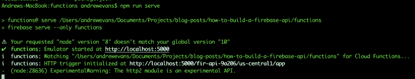](https://res.cloudinary.com/practicaldev/image/fetch/s--0fasWoJ3--/c_limit%2Cf_auto%2Cfl_progressive%2Cq_auto%2Cw_880/https://atevans85.files.wordpress.com/2019/07/screen-shot-2019-07-22-at-7.57.32-am.png%3Fw%3D700)

如果你注意到了，我确实收到了一个关于我的节点版本的警告。暂时忽略这一点，当我们真正开始访问数据库时，我会回到这一点。

还要注意，终端输出本地运行的 API 的本地主机地址。您将直接从 Postman 调用它，因为这是您的 API 的“地址”。当在本地主机上运行时，你的应用程序的 URL 将如下所示:

```
[<------domain---->] / [<-app id---> / [<-zone-->] / app / [<-endpoint->]
http://localhost:5000 / fir-api-9a206 / us-central1 / app / create 
```

Enter fullscreen mode Exit fullscreen mode

当我们进行部署时，URL 中唯一的不同是`http://localhost:500`将被替换为 zone + app id + "cloudfunctions.net "，如下所示:

```
[<------zone + app id + cloudfunctions.net-------->] / app / [<--endpoint-->]
https://us-central1-fir-api-9a206.cloudfunctions.net / app / hello-world 
```

Enter fullscreen mode Exit fullscreen mode

您需要用您的应用程序 id 值更新我在介绍中提到的 Postman 集合。要查看您的应用 id，请转到 Firebase 控制台并单击“项目设置”，如下图所示:

[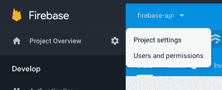](https://res.cloudinary.com/practicaldev/image/fetch/s--2B_o-e4g--/c_limit%2Cf_auto%2Cfl_progressive%2Cq_auto%2Cw_880/https://atevans85.files.wordpress.com/2019/07/screen-shot-2019-07-24-at-7.10.02-am.png%3Fw%3D700)

在那里，项目 id(和一些其他设置)将被列出。我在这张截图上圈出来了:

[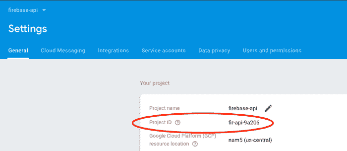](https://res.cloudinary.com/practicaldev/image/fetch/s--JYCkTUm6--/c_limit%2Cf_auto%2Cfl_progressive%2Cq_auto%2Cw_880/https://atevans85.files.wordpress.com/2019/07/screen-shot-2019-07-24-at-7.10.46-am.png%3Fw%3D700)

打开 postman 集合，在“localhost”文件夹下编辑“hello-world localhost”请求。

[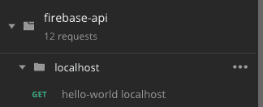](https://res.cloudinary.com/practicaldev/image/fetch/s--ebrkaYdr--/c_limit%2Cf_auto%2Cfl_progressive%2Cq_auto%2Cw_880/https://atevans85.files.wordpress.com/2019/07/screen-shot-2019-07-24-at-7.12.41-am.png%3Fw%3D700)

> *如果你仍然对邮递员有疑问，请在这里查阅[说明。](https://learning.getpostman.com/docs/postman/collections/creating_collections/)*

正如我提到的，更改 id 值以匹配您的项目。当您运行`npm run serve`时，终端中列出的地址应该也有这个信息。完成后，运行来自 postman 的请求，您应该会看到以下内容:

[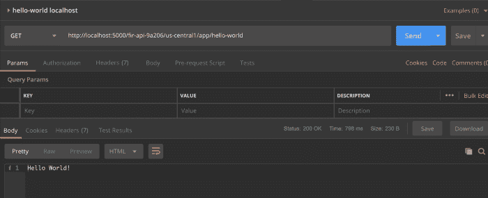](https://res.cloudinary.com/practicaldev/image/fetch/s--xL_5Mymc--/c_limit%2Cf_auto%2Cfl_progressive%2Cq_auto%2Cw_880/https://atevans85.files.wordpress.com/2019/07/screen-shot-2019-07-22-at-8.07.51-am.png%3Fw%3D700)

现在我们已经有了初始端点设置，让我们继续添加数据库调用。

## 数据库调用

对于我们正在构建的 API，它只是对一系列项目的操作。我们将为这个项目列表设置创建、读取、更新和删除(或 **CRUD** )函数。

在 Firebase 中，您有两种数据库使用选择。你可以用传统的数据库，也可以用**云 firestore** 。对于本教程，我们将使用**云 firestore** ，因为它更容易使用，功能也更丰富。**云火商店**是一个 [NoSQL 数据库](https://en.wikipedia.org/wiki/NoSQL)，这仅仅意味着你的数据作为**文档**存储在**集合**中。这与 SQL 数据库中数据存储在**表**的**行**中的方式非常相似。由于数据访问和存储的性质，NoSQL 数据库通常性能更好，也更容易扩展。

在设置部分，我们向项目添加了一个**云 firestore** 实例。我们现在要访问这个。为了在本地使用 [admin SDK](https://firebase.google.com/docs/admin/setup) 与**云 firestore** 进行交互，你需要通过服务帐户访问它。服务帐户有自己使用的密钥，您可以通过下载密钥文件来运行这些权限。为此，请执行以下操作:

转到 Firebase 控制台，打开您的应用程序。然后点击小齿轮箱和“用户和权限”,如下所示:

[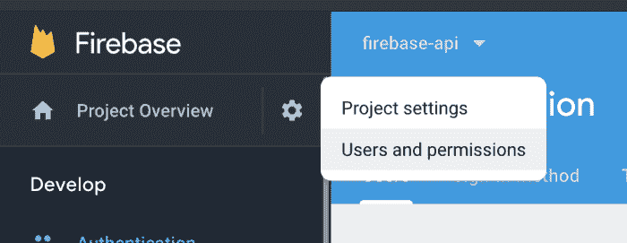](https://res.cloudinary.com/practicaldev/image/fetch/s--XKfbS1E3--/c_limit%2Cf_auto%2Cfl_progressive%2Cq_auto%2Cw_880/https://atevans85.files.wordpress.com/2019/07/screen-shot-2019-07-22-at-8.12.40-am.png%3Fw%3D700)

然后单击“服务帐户”选项卡，您应该会看到如下内容:

[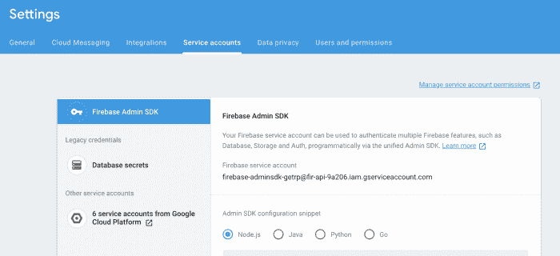](https://res.cloudinary.com/practicaldev/image/fetch/s--kWj_SbZP--/c_limit%2Cf_auto%2Cfl_progressive%2Cq_auto%2Cw_880/https://atevans85.files.wordpress.com/2019/07/screen-shot-2019-07-22-at-8.15.02-am.png%3Fw%3D700)

如果你注意到了，在屏幕的底部，他们为你提供了一些在你的项目中运行的代码。您唯一需要的是要引用的权限文件。继续并点击“生成新的私钥”以便能够在您的项目中安装它。然后将它存储在我们刚刚使用的`functions`文件夹中的`index.js`文件旁边。你可以随意命名，我将我的命名为`permissions.json`，然后在你的`index.js`文件顶部添加以下内容:

```
var serviceAccount = require("./permissions.json");
admin.initializeApp({
  credential: admin.credential.cert(serviceAccount),
  databaseURL: "https://fir-api-9a206..firebaseio.com"
});
const db = admin.firestore(); 
```

Enter fullscreen mode Exit fullscreen mode

这几行代码的作用是(1)加载你的权限文件，然后(2)用它初始化你的应用程序。我还创建了一个变量`db`来表示我们的 **firestore** 实例。这是不必要的，但会使代码更干净。

加载完这些值后，让我们为应用程序添加一个`create`端点。在`hello-world`端点下方添加以下内容:

```
// create
app.post('/api/create', (req, res) => {
    (async () => {
        try {
          await db.collection('items').doc('/' + req.body.id + '/')
              .create({item: req.body.item});
          return res.status(200).send();
        } catch (error) {
          console.log(error);
          return res.status(500).send(error);
        }
      })();
  }); 
```

Enter fullscreen mode Exit fullscreen mode

这段代码创建了一个端点“/api/create-item”，您可以对其进行 **POST** 调用。当进行 POST 调用时，它将“item”从主体添加到数据库中一个名为“items”的集合中，该集合的 id 是您传入的值，这里称为“id”。NoSQL 数据库中的收藏只是文件的收集者。对于特定的文档，您可以轻松地做到这一点。在使用 firestore 时，我倾向于喜欢收藏，因为它们易于理解。您也可以将**集合**想象成类似于 SQL 数据库中的**表**。

> 如果你也注意到了，我在这里用“/api”作为端点的前缀。这不是必需的，但通常是您创建的任何 API 的惯例。
> 
> 我在这里的请求中也指定了“id”值。Firebase 将为您完成这项工作，但我认为如果我们在请求中明确定义这一点，会更容易理解。

添加了这段代码后，让我们继续在终端中停止服务器(如果您还没有这样做的话)，并使用新的`npm run serve`重新启动它。

在 postman 集合中，调出“create localhost”POST 请求。像以前一样修改`app id`值，并尝试请求。

运行它时，您应该会看到以下错误:

[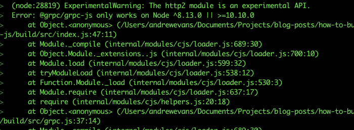](https://res.cloudinary.com/practicaldev/image/fetch/s--ZYjQjV8---/c_limit%2Cf_auto%2Cfl_progressive%2Cq_auto%2Cw_880/https://atevans85.files.wordpress.com/2019/07/screen-shot-2019-07-22-at-8.32.35-am.png%3Fw%3D700)

Firebase admin SDK 要求节点版本为 8.13.0 或 10.10。这就是为什么我要求[在第一节](https://github.com/nvm-sh/nvm)安装 nvm。这很容易解决。 **nvm** 使您能够在本地终端快速切换节点版本。在您的终端中，运行`nvm use 10.10`，您应该会看到以下内容:

[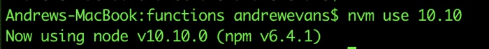](https://res.cloudinary.com/practicaldev/image/fetch/s--xT7rNWfN--/c_limit%2Cf_auto%2Cfl_progressive%2Cq_auto%2Cw_880/https://atevans85.files.wordpress.com/2019/07/screen-shot-2019-07-22-at-8.34.24-am.png%3Fw%3D700)

现在，继续使用`npm run serve`再次启动您的服务器，并点击 postman 上的端点。您应该会看到一个`200`成功。在终端中，您还可以看到 API 被本地命中。

> *如果你遇到一个关于`onRequestWithOpts`或类似的错误，做一个`npm i firebase-tools`。CLI 最近出现了一个错误，7.1.0 版修复了这个错误。当我写这篇文章时，我发现我的 Firebase CLI 版本需要更新以解决这个问题。退房[本期更多](https://github.com/firebase/firebase-tools/issues/1480)。*

[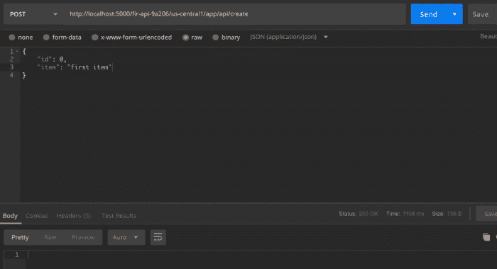](https://res.cloudinary.com/practicaldev/image/fetch/s--DPc54cv4--/c_limit%2Cf_auto%2Cfl_progressive%2Cq_auto%2Cw_880/https://atevans85.files.wordpress.com/2019/07/screen-shot-2019-07-24-at-7.45.32-am.png%3Fw%3D700)

一个额外的酷功能是，你可以直接在 **cloud firestore** 中看到你的数据。如果您跳转到 firebase 控制台，单击左侧导航栏上的“数据库”链接，您应该会看到类似下图的内容:

[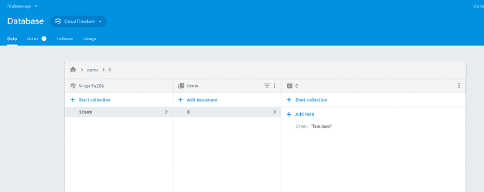](https://res.cloudinary.com/practicaldev/image/fetch/s--OJgYDAWR--/c_limit%2Cf_auto%2Cfl_progressive%2Cq_auto%2Cw_880/https://atevans85.files.wordpress.com/2019/07/screen-shot-2019-07-24-at-7.47.40-am.png%3Fw%3D700)

## 构建出 db 端点

现在我们已经有了“创建”端点设置，让我们继续添加其余的操作。我们将添加以下内容:

*   `/read-item/:item_id` =读取特定项目(按 ID)
*   `/read-items` =读取所有项目(总收藏)
*   `/update-item/:item_id` =更新项目
*   `delete-item/:item_id` =删除一个项目

在很大程度上，所有的终点都是相似的。例外是当我传递带有`item_id`值的查询参数时。这一切都遵循你可以在 [ExpressJS 文档](https://expressjs.com/en/guide/routing.html)中看到的基本路由。此外，对于与 Firebase Admin SDK 的实际交互，我建议在这里查看 [Firestore API 参考](https://googleapis.dev/nodejs/firestore/latest/index.html)。

> *看看这些端点应该是什么样子(完成后)[点击这里查看 GitHub repo 上的 index.js 文件。](https://github.com/andrewevans0102/how-to-build-a-firebase-api/blob/master/functions/index.js)T3】*

下面是其余端点的代码:

```
// read item
app.get('/api/read/:item_id', (req, res) => {
    (async () => {
        try {
            const document = db.collection('items').doc(req.params.item_id);
            let item = await document.get();
            let response = item.data();
            return res.status(200).send(response);
        } catch (error) {
            console.log(error);
            return res.status(500).send(error);
        }
        })();
    });

// read all
app.get('/api/read', (req, res) => {
    (async () => {
        try {
            let query = db.collection('items');
            let response = [];
            await query.get().then(querySnapshot => {
            let docs = querySnapshot.docs;
            for (let doc of docs) {
                const selectedItem = {
                    id: doc.id,
                    item: doc.data().item
                };
                response.push(selectedItem);
            }
            });
            return res.status(200).send(response);
        } catch (error) {
            console.log(error);
            return res.status(500).send(error);
        }
        })();
    });

// update
app.put('/api/update/:item_id', (req, res) => {
(async () => {
    try {
        const document = db.collection('items').doc(req.params.item_id);
        await document.update({
            item: req.body.item
        });
        return res.status(200).send();
    } catch (error) {
        console.log(error);
        return res.status(500).send(error);
    }
    })();
});

// delete
app.delete('/api/delete/:item_id', (req, res) => {
(async () => {
    try {
        const document = db.collection('items').doc(req.params.item_id);
        await document.delete();
        return res.status(200).send();
    } catch (error) {
        console.log(error);
        return res.status(500).send(error);
    }
    })();
}); 
```

Enter fullscreen mode Exit fullscreen mode

## 正在部署

所以现在我们有了一个全功能的 CRUD API。我们准备好部署了！如果您正在开发一个企业应用程序(或者您将要维护的应用程序)，通常会构建一个连续集成持续部署(CICD)管道。这基本上是一组将应用程序交付到生产环境中的自动化步骤。

> 有许多关于 CICD 最佳实践的文档。我推荐你看看我在[发表的关于用 Firebase 和 CircleCI](https://blog.angularindepth.com/deploying-an-angular-site-to-firebase-with-circleci-ed881cb6a2fa) 部署应用的博文。

对于我们的 API，我们只对实际的部署步骤感兴趣。Firebase CLI 只需一个`firebase deploy`就能为您解决这个问题。

当您运行`firebase init`命令最初构建项目时，Firebase CLI 已经将部署步骤设置为 NPM 脚本。我们现在可以从`functions`文件夹中用`npm run deploy`部署创建的项目。

> npm 脚本非常强大。大多数现代 JavaScript 应用程序都以这样或那样的方式使用它们。我建议查看 [npm 文档以了解更多](https://docs.npmjs.com/misc/scripts)。

当您从`functions`文件夹运行`npm run deploy`时，您应该会看到如下输出:

[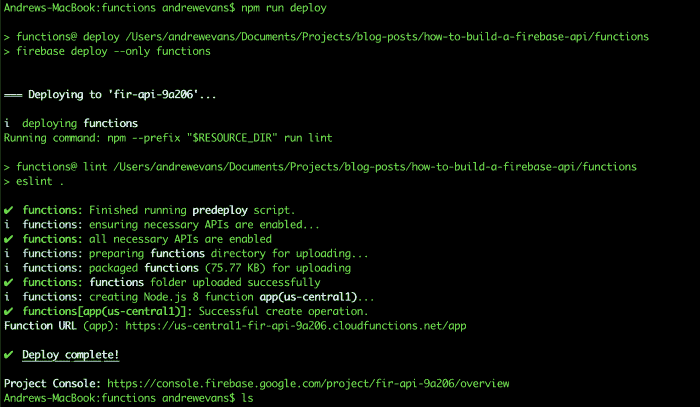](https://res.cloudinary.com/practicaldev/image/fetch/s---pWnJhWb--/c_limit%2Cf_auto%2Cfl_progressive%2Cq_auto%2Cw_880/https://atevans85.files.wordpress.com/2019/07/screen-shot-2019-07-22-at-3.38.33-pm.png%3Fw%3D700)

终端输出`Function URL`的行提供了您部署的函数的端点。回到 postman collection，检查`deployed`文件夹中的一组请求，以访问您部署的 API。

## 连接一个前端

现在我们已经构建了 API，我想展示一下如果您在客户端应用程序中使用它会是什么样子。

当讨论 API 时，通常会有一个**生产者**和一个**消费者**。**生产者**是 API 本身(或者至少是提供端点的东西)。**消费者**是使用这些端点的任何东西。通常情况下，应用程序开发人员会使用 JavaScript 框架构建一个客户端应用程序，比如:Angular、react、emberJS、vue 和其他应用程序。

客户端应用程序在浏览器中运行，支持动态解释 JavaScript 代码。这特别有用，因为很多时候开发人员只需要某个地方来静态托管他们的 JavaScript“捆绑包”这利用了 JavaScript 语言以及当今浏览器的许多进步。

如果你还记得第一部分，我们正在使用我在[GitHub repo 这里](https://github.com/andrewevans0102/how-to-build-a-firebase-api)发布的代码。这个 GitHub 项目既有我们的后端 API 代码，也有我构建的用于与 API 交互的前端 Angular 应用程序。基本应用程序实际上只包含一个主页，被认为是单页应用程序(SPA)。应用程序只对列表项进行基本的 CRUD 操作。

[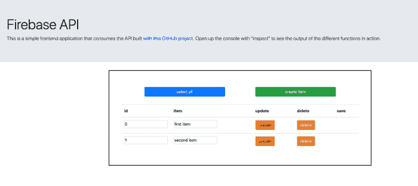](https://res.cloudinary.com/practicaldev/image/fetch/s--OJXsUPv2--/c_limit%2Cf_auto%2Cfl_progressive%2Cq_auto%2Cw_880/https://atevans85.files.wordpress.com/2019/07/screen-shot-2019-07-24-at-3.44.01-pm.png%3Fw%3D700)

当您运行应用程序时，您还可以在浏览器的控制台中看到它的运行。如果你打开控制台(如果你使用 Chrome，右击“inspect ”),你应该会看到以下内容:

[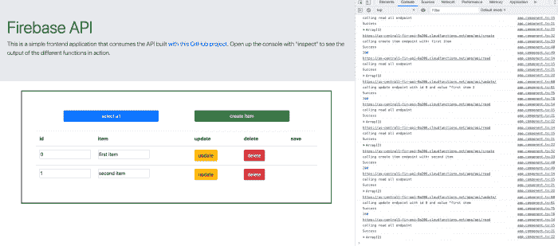](https://res.cloudinary.com/practicaldev/image/fetch/s--diPL15H8--/c_limit%2Cf_auto%2Cfl_progressive%2Cq_auto%2Cw_880/https://atevans85.files.wordpress.com/2019/07/screen-shot-2019-07-24-at-3.50.40-pm.png%3Fw%3D700)

要使用我构建的客户端，首先`cd`进入我的 [GitHub 项目](https://github.com/andrewevans0102/how-to-build-a-firebase-api)的`frontend`文件夹。要让应用程序在您部署的 API 的端点上运行，您只需打开**/frontend/src/environments/environment . ts**文件。

[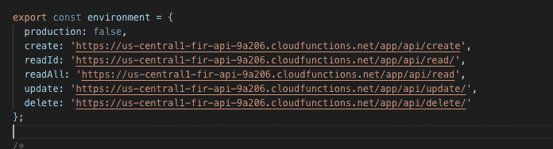](https://res.cloudinary.com/practicaldev/image/fetch/s--_Hr6zvVp--/c_limit%2Cf_auto%2Cfl_progressive%2Cq_auto%2Cw_880/https://atevans85.files.wordpress.com/2019/07/screen-shot-2019-07-23-at-9.23.59-pm.png%3Fw%3D700)

在这个文件中，您将看到一组端点。要使用我构建的客户端，首先要进入我的 GitHub 项目的文件夹。要使应用程序在您部署的 API 的端点上运行，您只需要更改这些值来分别匹配来自您的项目的 URL。

如果您还记得，一旦您部署了 API，Firebase CLI 就会向终端输出一个域。托管端点命名非常直观，如下所示:

```
[<------zone + app id + cloudfunctions.net-------->] / app / [<--endpoint-->]
https://us-central1-fir-api-9a206.cloudfunctions.net / app / hello-world 
```

Enter fullscreen mode Exit fullscreen mode

继续用项目中的值替换这个`environments`文件中的端点值。记住总是分别用相关的端点路径结束每个端点，如`/api/create`或`/api/read`。

一旦替换了值，将`cd`放入`frontend`目录，并运行标准的`npm install`来安装依赖项。依赖项安装完成后，使用 Angular CLI 命令通过`ng serve`启动应用程序。

> *如果您在使用 CLI 时遇到错误，请点击此处查看[Angular CLI 文档。](https://cli.angular.io/)T3】*

运行`ng serve`之后，您应该会在终端中看到如下内容:

[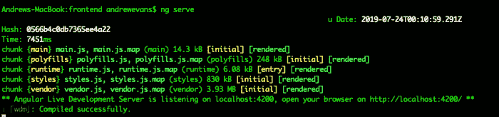](https://res.cloudinary.com/practicaldev/image/fetch/s--m_iap3AM--/c_limit%2Cf_auto%2Cfl_progressive%2Cq_auto%2Cw_880/https://atevans85.files.wordpress.com/2019/07/screen-shot-2019-07-23-at-8.11.17-pm.png%3Fw%3D700)

这条消息仅仅意味着 CLI 已经构建了应用程序(用 [webpack](https://webpack.js.org/) )，并且它当前正在端口 4200 上运行。如果你打开浏览器，进入`localhost:4200`，你应该会看到应用程序正在运行。

如果您查看项目的 app 组件，您会看到这些动作只是从我们创建的 API 对各个端点进行 JavaScript `fetch`调用:

```
async selectAll() {
    try {
      console.log(environment.readAll);
      console.log('calling read all endpoint');

      this.exampleItems = [];
      const output = await fetch(environment.readAll);
      const outputJSON = await output.json();
      this.exampleItems = outputJSON;
      console.log('Success');
      console.log(outputJSON);
    } catch (error) {
      console.log(error);
    }
  }

  // really this is create but the flow is that
  // click the "create item" button which appends a blank value to the array, then click save to actually create it permanently
  async saveItem(item: any) {
    try {
      console.log(environment.create);
      console.log('calling create item endpoint with: ' + item.item);

      const requestBody = {
        id: item.id,
        item: item.item
      };

      const createResponse =
        await fetch(environment.create, {
          method: 'POST',
          body: JSON.stringify(requestBody),
          headers:{
            'Content-Type': 'application/json'
          }
        });
      console.log('Success');
      console.log(createResponse.status);

      // call select all to update the table
      this.selectAll();
    } catch (error) {
      console.log(error);
    }
  }

  async updateItem(item: any) {
    try {
      console.log(environment.update);
      console.log('calling update endpoint with id ' + item.id + ' and value "' + item.item);

      const requestBody = {
        item: item.item
      };

      const updateResponse =
        await fetch(environment.update + item.id, {
          method: 'PUT',
          body: JSON.stringify(requestBody),
          headers:{
            'Content-Type': 'application/json'
          }
        });
      console.log('Success');
      console.log(updateResponse.status);

      // call select all to update the table
      this.selectAll();
    } catch (error) {
      console.log(error);
    }
  }

  async deleteItem(item: any) {
    try {
      console.log(environment.delete);
      console.log('calling delete endpoint with id ' + item.id);

      const deleteResponse =
        await fetch(environment.delete + item.id, {
          method: 'DELETE',
          headers:{
            'Content-Type': 'application/json'
          }
        });

      console.log('Success');
      console.log(deleteResponse.status);

      // call select all to update the table
      this.selectAll();
    } catch (error) {
      console.log(error);
    }
  } 
```

Enter fullscreen mode Exit fullscreen mode

因为这篇文章的主要观点是关于创建 API，所以我不会深入这个 Angular 应用程序如何工作的细节。我强烈建议你查看一下[角度文档](https://angular.io/)以及可用的教程。如果你做一些谷歌搜索，你会发现很多很棒的关于角度基础的“入门”帖子。我也强烈推荐博客[深入角度](https://blog.angularindepth.com/)进行更深入的学习。

## 关闭思绪

[](https://res.cloudinary.com/practicaldev/image/fetch/s--FlzqL2Pr--/c_limit%2Cf_auto%2Cfl_progressive%2Cq_auto%2Cw_880/https://atevans85.files.wordpress.com/2019/07/duplo-1981724_1920.jpg%3Fw%3D700)

恭喜你！您刚刚使用 Firebase 部署了一个 API。使用这个 API，您还可以做很多其他的事情，但是这里向您展示了一些基本的东西。我展示的客户端应用程序让您从使用 API 的方式开始。我强烈建议查看 ExpressJS 站点教程，了解路由呼叫和使用中间件的更深入的方法。我还强烈推荐查看我在 Firebase 上的其他博客文章:

*   [燃烧基地](https://dev.to/andrewevans0102/firebase-25m9-temp-slug-7845367)
*   [为什么 Firebase 云功能很棒](https://blog.angularindepth.com/why-firebase-cloud-functions-are-awesome-f4faeab630f7)
*   [angular fire 库如何让 Firebase 感觉像魔术一样](https://blog.angularindepth.com/how-the-angular-fire-library-makes-firebase-feel-like-magic-1fda375966bb)
*   [为什么用 JAMstack 建造如此棒](https://blog.angularindepth.com/why-building-with-a-jamstack-is-awesome-49618fd21198)

我希望我在这里的帖子已经帮助你开始用 Firebase 构建 API。欢迎留言，感谢阅读！