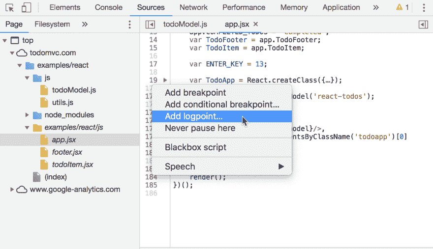
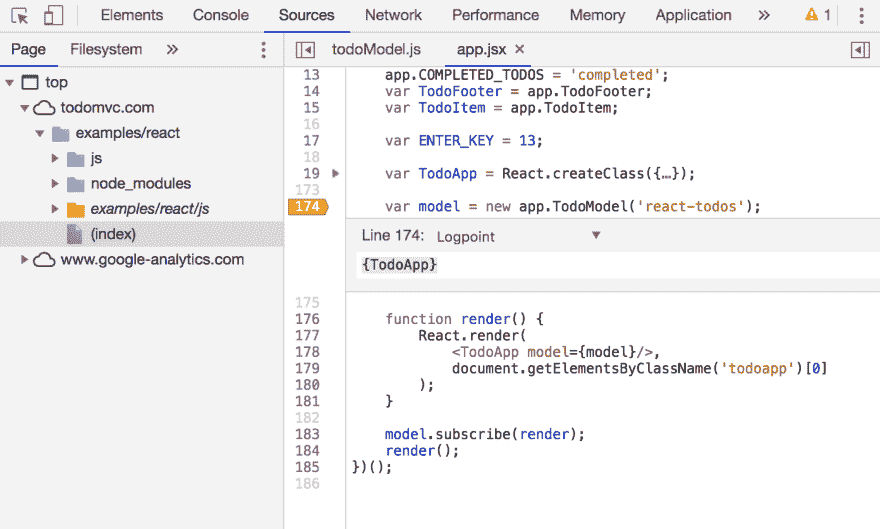
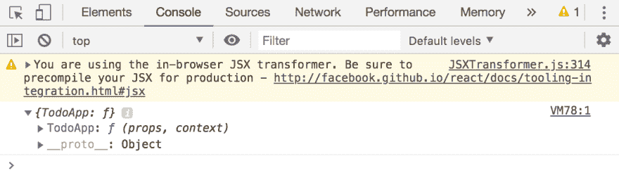

# 沟渠控制台日志

> 原文：<https://dev.to/rockarts/ditch-console-log-13kg>

人们喜欢使用 console.log 来快速调试值，但从 Chrome 73 开始，有一种更快的方法。您可以查看文件的源代码，然后不用设置断点，而是在同一个位置右键单击并选择 Add Logpoint。当点击 logpoint 时，输出将显示在控制台窗口中。您还可以将日志点添加到生产代码中。

如果您使用 Firefox，您还可以通过右键单击并选择 add log 来添加日志点