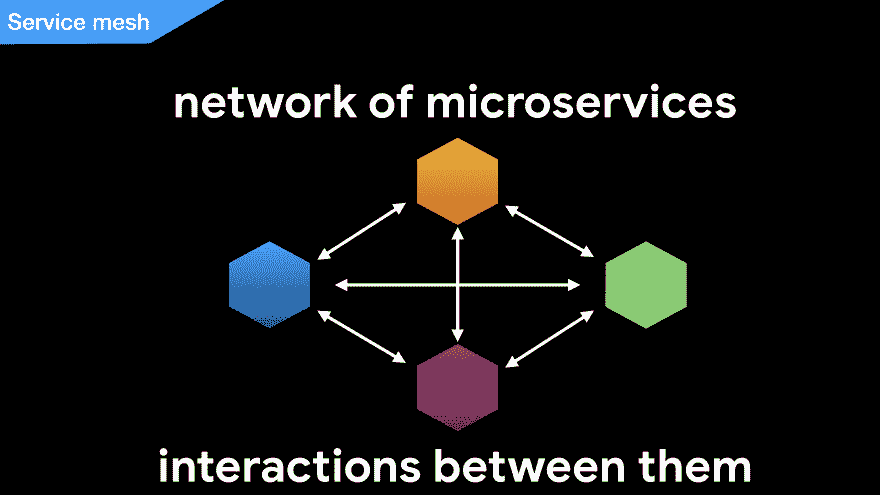
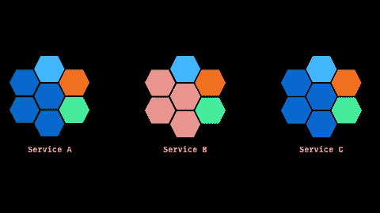
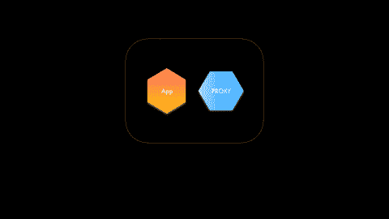
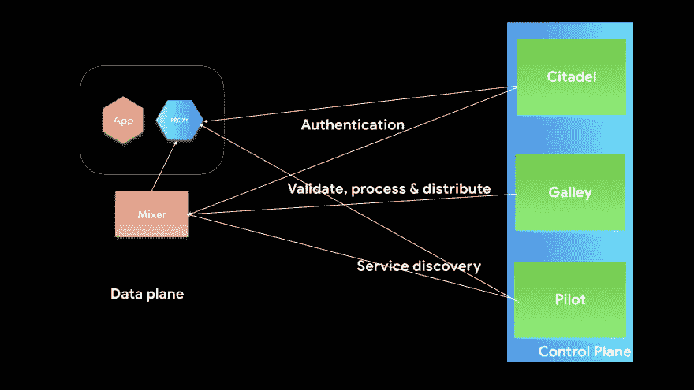

# 为每个人的⛵️💡🎉

> 原文：<https://dev.to/sendilkumarn/istio-for-everyone-5hgb>

> 这需要(非常)一点 Kubernetes 知识。

假设您有一个电子商务应用程序。该应用程序由以下组件组成:

1.  产品服务——该服务负责处理所有与产品相关的信息，如名称、价格和库存。
2.  发票服务——该服务负责处理所有与发票相关的信息，如创建账单、跟踪账单是否已支付等。
3.  通知服务-该服务负责处理所有与通知相关的信息，如发送电子邮件。

> 注意，还可以有其他服务，但为了简洁起见，我们就此打住。

在单一的世界中，所有这些服务将存在于同一个应用程序(执行环境)中。因此，每当发票服务需要调用通知服务时，它所要做的就是做一个简单的方法调用(大多数情况下)。
也就是说，发票服务不需要检查通知是否启动并运行，找到它所在的位置，然后通过网络发出连接请求并等待回复。

[](https://res.cloudinary.com/practicaldev/image/fetch/s--5iezoryg--/c_limit%2Cf_auto%2Cfl_progressive%2Cq_66%2Cw_880/https://thepracticaldev.s3.amazonaws.com/i/alsj967bv28h6kqurv97.gif)

在微服务领域，当发票服务需要调用通知服务时。

发票服务首先需要验证通知服务是否可用。(我们暂且称之为`imaginary`服务。)

如果通知服务可用，那么发票服务必须找到连接到通知服务的方法(例如它的 DNS 名称)。

然后，发票服务将向通知服务发出请求。

[](https://res.cloudinary.com/practicaldev/image/fetch/s--zjvraVyo--/c_limit%2Cf_auto%2Cfl_progressive%2Cq_66%2Cw_880/https://thepracticaldev.s3.amazonaws.com/i/z12vf8vp1ewu37xssqif.gif)

> TL；在微服务领域，服务之间通过网络进行通信。

`imaginary`服务被称为`Service registers`。

服务在启动或关闭时会通知服务注册器它们的位置和状态。

任何想要连接到另一个服务(如`notification`)的服务(如`invoice`)都将首先查询服务注册器，以获得关于如何连接以及在哪里连接的信息，然后再进行连接。

但是当服务突然终止时会发生什么。服务无法向服务寄存器发送正确的`shut down`信号。这意味着服务注册显示特定服务已启动，但它并未启动。

为了避免这些情况，我们需要`health checkers`。

健康检查器将不时地去 ping 服务或者服务通知健康检查器它们的状态。

这些脉冲被称为`heart beat`💗。

每当服务停止发送心跳(通常在阈值水平之后以补偿网络损失)，服务就被标记为关闭。

任何将来向服务注册中心请求服务的请求都将获得一个健康服务的地址。

为了让微服务正常工作，健康检查器和服务注册表需要是高度可用的组件。

> TL；在微服务领域中，我们需要服务注册和健康检查器来使我们的应用程序正常工作。

在这篇文章中，我们将看到什么是 Istio，以及它如何帮助解决这个问题。

在深入研究 Istio 之前，我们需要了解`service mesh`。

# 什么是服务网格？

istio 网站对服务网格的描述如下:

> 术语“服务网格”用于描述组成此类应用程序的微服务网络以及它们之间的交互。

在微服务世界中，将会有许多以不同容量运行的服务的化身。它们是分布式的。这些服务应该是互连的。服务网格描述了这些相互连接的服务及其交互。

[](https://res.cloudinary.com/practicaldev/image/fetch/s--xdlh0WHc--/c_limit%2Cf_auto%2Cfl_progressive%2Cq_auto%2Cw_880/https://thepracticaldev.s3.amazonaws.com/i/5thnuu55i9f974cvklit.jpeg)

# 那么，Istio 是做什么的？

简而言之，Istio 做了以下工作:

[](https://res.cloudinary.com/practicaldev/image/fetch/s--OegQZb4F--/c_limit%2Cf_auto%2Cfl_progressive%2Cq_66%2Cw_880/https://thepracticaldev.s3.amazonaws.com/i/ooj2o8g81waizec0n4ky.gif)

微服务中的每个服务都有一些公共服务，包括日志记录、监控和联网(用于负载平衡等)。Istio 将它们作为公共服务从您的应用程序中提取出来。以便您的应用程序不需要担心它们。

Istio 在服务网格中执行以下服务:

*   连接
    *   连接服务网格内部的服务
    *   帮助管理交通
        *   自动负载平衡
*   控制
    *   控制进入服务的请求
        *   路由规则
        *   重试次数
        *   故障转移
        *   故障注入和其他
*   安全的
    *   保护服务对服务的通信
    *   授权并验证请求
*   观察
    *   自动收集指标、日志和跟踪

最重要的是，它做了所有这些(和其他的)。

哇哦！！！但是 Istio 是如何在不做任何代码改动的情况下实现的呢？

Istio 通过`Sidecar pattern`实现。

# 那么什么是边车格局呢？

> 目前，Istio 运行在 Kubernetes 之上。

如果你想知道 Kubernetes 是什么，看看这个帖子。

在 Kubernetes 上下文中，一个 Pod 包含一个或多个容器。Istio 将一个容器与应用程序的容器一起附加到 pod 内部。这个与应用程序的容器并行运行的容器被称为`sidecar`。

这种附加边车容器的模式(就像给你的摩托车附加边车一样)被称为`sidecar pattern`。

点击查看更多关于边车模式[的信息。](https://docs.microsoft.com/en-us/azure/architecture/patterns/sidecar)

好吧，那么这个边车是如何帮助 Istio 实现它的承诺的呢？

*读下去...*

# Istio 是如何工作的？

用 Istio 术语来说，这个边车集装箱叫做`proxy`集装箱。代理容器与应用程序容器同生同死。代理容器现在将决定可以进出应用程序容器的请求。

> 等等，这是否意味着你的应用程序的性能会降低？延迟是否增加？- `The short answer is yes.`

添加此代理容器会增加延迟并降低性能。

但是代理容器将使用[特使](https://envoyproxy.github.io/envoy/)代理。

> Envoy 是一个 L7 代理和通信总线，设计用于大型现代面向服务的架构。-特使网站

特使是写在 C++和它是轻量级和减轻⚡️fast.

这意味着添加到每个服务调用的开销非常小。

> 想了解更多关于特使代理的信息-点击这里查看。

[](https://res.cloudinary.com/practicaldev/image/fetch/s--UXDMbtiQ--/c_limit%2Cf_auto%2Cfl_progressive%2Cq_66%2Cw_880/https://thepracticaldev.s3.amazonaws.com/i/nitj6wye15qtjkivwza6.gif)

这些代理负责应用程序中发生的所有通信。

好了，现在有了 sidecar 代理，我们可以控制请求，但是我们如何向代理提供规则或配置呢？我们如何从边车代理收集所有的遥测数据？如果这些是你的问题，那么我们就在正确的轨道上。

边车代理的遥测数据由混合器收集。

混合器还负责跨服务网格应用策略和访问控制。

> 混合器+特使代理= >数据平面

[](https://res.cloudinary.com/practicaldev/image/fetch/s--UCF9VU9u--/c_limit%2Cf_auto%2Cfl_progressive%2Cq_66%2Cw_880/https://thepracticaldev.s3.amazonaws.com/i/44c7f0qwwvelu4tfdd3q.gif)

混合器和代理一起被称为 Istio 的`data plane`。

> TL；DR 特使代理负责将请求和响应代理到容器中。另一方面，混合器负责在服务网格中实施访问控制和使用策略，并从特使代理(和其他服务)收集遥测数据。

* * *

与 Kubernetes 类似，Istio 也有`control plane`。控制平面是 Istio 的`brain` 🧠。

这是我们定义策略/配置/规则的地方。这些规则是动态应用的，没有任何停机时间。

Istio 的控制平面由以下部分组成:

*   飞行员👩‍✈️
*   城堡🏛
*   走廊

[](https://res.cloudinary.com/practicaldev/image/fetch/s--ffLrOj1L--/c_limit%2Cf_auto%2Cfl_progressive%2Cq_auto%2Cw_880/https://thepracticaldev.s3.amazonaws.com/i/q2ebrtfi39mux0019ptf.jpeg)

## 领航

顾名思义，pilot 是帮助特使代理导航请求的 pilot。

他们向特使代理提供以下内容:

*   服务发现
*   交通管理
*   跳回

我们通过`yaml`文件向 Istio 提供路由规则。一旦应用了该规则。pilot 将获得这个规则，然后在运行时将它提供给 envoy 代理。这为我们提供了动态应用配置更改的灵活性。

通过 pilot，我们可以使用路由规则提供服务发现选项。我们可以说，如果 URI 是`/review`就转到在端口`9080`上运行的`reviews`应用程序，如下所示:

```
apiVersion: networking.istio.io/v1alpha3
kind: VirtualService
metadata:
  name: reviews
 http:
  - match:
    - uri:
        exact: /review
    route:
    - destination:
        host: reviews
        port:
          number: 9080 
```

<svg width="20px" height="20px" viewBox="0 0 24 24" class="highlight-action crayons-icon highlight-action--fullscreen-on"><title>Enter fullscreen mode</title></svg> <svg width="20px" height="20px" viewBox="0 0 24 24" class="highlight-action crayons-icon highlight-action--fullscreen-off"><title>Exit fullscreen mode</title></svg>

点击查看更多关于 VirtualService [的信息。](https://istio.io/docs/reference/config/networking/v1alpha3/virtual-service/)

我们可以使用 pilot 管理服务的流量。例如，我们可以将 90%的请求发送给应用程序的`v1`，而将剩余的`10%`发送给令人敬畏的`v2`，如下:

```
apiVersion: networking.istio.io/v1alpha3
kind: VirtualService
metadata:
  name: reviews
spec:
  hosts:
    - reviews
  http:
  - route:
    - destination:
        host: reviews
        subset: v1
      weight: 90
    - destination:
        host: reviews
        subset: v2
      weight: 10 
```

<svg width="20px" height="20px" viewBox="0 0 24 24" class="highlight-action crayons-icon highlight-action--fullscreen-on"><title>Enter fullscreen mode</title></svg> <svg width="20px" height="20px" viewBox="0 0 24 24" class="highlight-action crayons-icon highlight-action--fullscreen-off"><title>Exit fullscreen mode</title></svg>

我们还可以指定目的地的规则。

*   使用什么类型的负载平衡器
*   最大连接数
*   超时和其他规则如下。

```
apiVersion: networking.istio.io/v1alpha3
kind: DestinationRule
metadata:
  name: destall
  namespace: testns
spec:
  # DNS name, prefix wildcard, short name relative to context
  # IP or CIDR only for services in gateways
  host: destall.default.svc.cluster.local
  trafficPolicy:
    loadBalancer:
      simple: ROUND_ROBIN
    connectionPool:
      tcp:
        maxConnections: 99
        connectTimeout: 6s 
```

<svg width="20px" height="20px" viewBox="0 0 24 24" class="highlight-action crayons-icon highlight-action--fullscreen-on"><title>Enter fullscreen mode</title></svg> <svg width="20px" height="20px" viewBox="0 0 24 24" class="highlight-action crayons-icon highlight-action--fullscreen-off"><title>Exit fullscreen mode</title></svg>

查看更多关于 [DestinationRule](https://istio.io/docs/reference/config/networking/v1alpha3/destination-rule/) 的信息。

各种负载平衡器选项[此处](https://istio.io/docs/reference/config/networking/v1alpha3/destination-rule/#LoadBalancerSettings-SimpleLB)

*注意:可能有数百种不同的配置。在一篇博文中解释它是非常不可能的。*

> ## TL； DR Pilot provides configuration data for special envoy agents.

## 厨房

我们提供给 Istio 的所有配置都必须经过适当的验证。应该接收和处理经过验证的规则或配置。最后，处理后的数据应发送到试点和混频器。

厨房负责验证、接收、处理和发送配置给飞行员和混音器。

Istio 运行在 Kubernetes 之上。Galley 还负责从 Kubernetes 获取用户信息，并将其提供给 Istio 组件。

> TL；DR Galley 是验证和分发代理，用于验证和分发配置数据给 Pilot 和 Mixer。

* * *

## 堡垒

Citadel 负责加密服务对服务的通信和最终用户认证。使用 Citadel，我们可以对特使代理实施安全策略。

> TL；Citadel 博士是代理的策略提供者。

然后，代理使用来自 Citadel 和 Pilot 的信息来控制、连接(限制和路由流量)和保护服务。

* * *

希望这能让你对`Istio`有一个简要的了解。点击 [istio.io](https://istio.io) 了解更多关于 istio 的信息。

现在，您希望在 Kubernetes 上部署一个示例应用程序，并使用 Istio 来查看这篇文章。

如果你喜欢这篇文章，请留下赞或评论。❤️

如果您觉得文章中有错误/遗漏之处，请随时评论:)

你可以在推特上关注我。