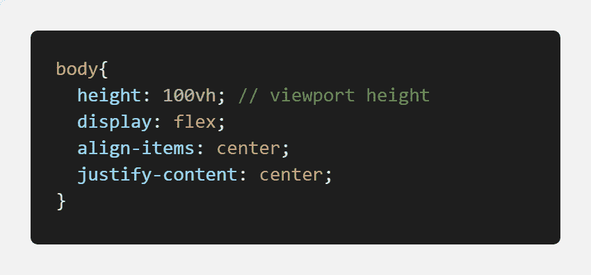

# CSS -垂直和水平居中

> 原文：<https://dev.to/drozerah/css-center-both-vertically-and-horizontally-41n0>

假设你有一个 HTML `<body></body>`标签，你想让它的子标签`<div></div>`在现代 CSS 中垂直和水平居中:如何实现呢？

`index.html`

```
<!DOCTYPE html>
<html lang="en">
<head>
    <meta charset="UTF-8">
    <meta name="viewport" content="width=device-width, initial-scale=1.0">
    <meta http-equiv="X-UA-Compatible" content="ie=edge">
    <title>Document</title>
    <link rel="stylesheet" href="/css/style.css">
</head>
<body>
    <div>
        <h1 class="title">Hello DEV!</h1>
    </div>
</body>
</html> 
```

Flexbox 说:
`style.css`
[](https://res.cloudinary.com/practicaldev/image/fetch/s--iklHz95K--/c_limit%2Cf_auto%2Cfl_progressive%2Cq_auto%2Cw_880/https://thepracticaldev.s3.amazonaws.com/i/4118y5sa0iznx8n8t5ns.png)

CSS 网格表示:
`style.css`
[](https://res.cloudinary.com/practicaldev/image/fetch/s--o2FtrdEy--/c_limit%2Cf_auto%2Cfl_progressive%2Cq_auto%2Cw_880/https://thepracticaldev.s3.amazonaws.com/i/2iy5vsrhw3fte1gr8a4t.png)

给你！

下次见！

德罗泽拉