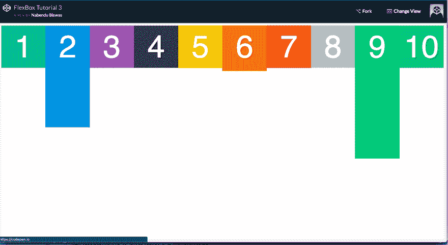
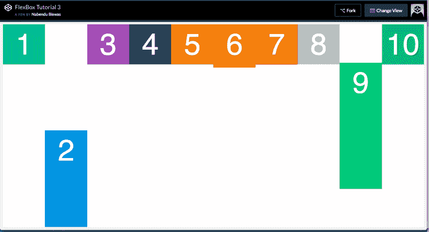
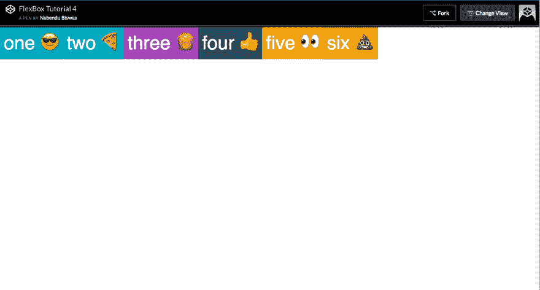
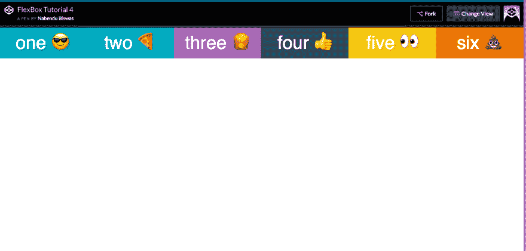
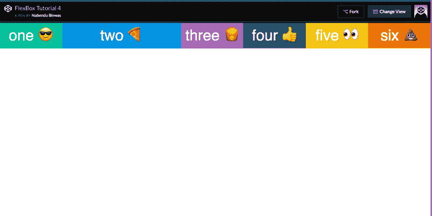
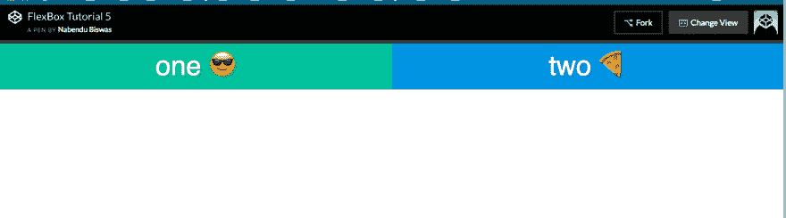
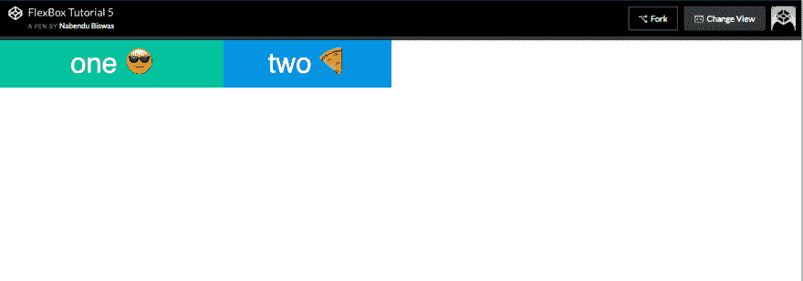
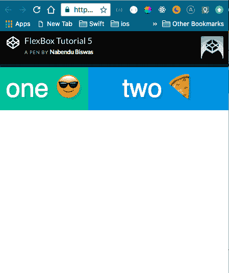

# Flexbox 基础知识— 4

> 原文：<https://dev.to/nabendu82/basics-of-flexbox-4-3nek>

我们将从这里开始查看弹性项目属性。

我们将在我们的项目中使用这个[代码笔](https://codepen.io/nabendu82/full/zjgywm/)。

让我们从对齐单个项目的属性开始，即 align-self。

我们将使用这个基本设置。

```
<div class=”container”>
 <div class=”box box1">1</div>
 <div class=”box box2">2</div>
 <div class=”box box3">3</div>
 <div class=”box box4">4</div>
 <div class=”box box5">5</div>
 <div class=”box box6">6</div>
 <div class=”box box7">7</div>
 <div class=”box box8">8</div>
 <div class=”box box9">9</div>
 <div class=”box box10">10</div>
 </div>
.container {
 display:flex;
 border:10px solid mistyrose;
 height:100vh;
 align-items: flex-start;
}
.box {
 width:33.333%;
}
.box2{
 padding-bottom: 200px; 
}
.box6{
 padding-bottom: 20px; 
}
.box9{
 padding-bottom: 300px; 
} 
```

它将显示如下-

[ ](https://res.cloudinary.com/practicaldev/image/fetch/s--eykzX1la--/c_limit%2Cf_auto%2Cfl_progressive%2Cq_auto%2Cw_880/https://cdn-images-1.medium.com/max/2862/1%2AvS_5EWYFu-W70uUfG2onEw.png) *默认设置*

现在，自对齐允许覆盖单个 flex 项目沿横轴的对齐。我们将在下面的例子中看到所有主要的三个值。

```
.box2{
 padding-bottom: 200px; 
 align-self: flex-end;
}
.box6{
 padding-bottom: 20px; 
 align-self: flex-start;
}
.box9{
 padding-bottom: 300px; 
 align-self: center;
} 
```

[](https://res.cloudinary.com/practicaldev/image/fetch/s--lDdTFpuG--/c_limit%2Cf_auto%2Cfl_progressive%2Cq_auto%2Cw_880/https://cdn-images-1.medium.com/max/2880/1%2A306MCa_LbaraKjYaNLGInA.png)

 *现在我们将看到 flex items 属性 **flex** 。这实际上是 flex-grow、flex-shrink 和 flex-basis 组合的简写，我们将在后面看到。

同样的密码是[这里是](https://codepen.io/nabendu82/full/RyXEQr/)

基本设置是-

```
<div class=”container”>
 <div class=”box box1">one 😎</div>
 <div class=”box box2">two 🍕</div>
 <div class=”box box3">three 🍟</div>
 <div class=”box box4">four 👍</div>
 <div class=”box box5">five 👀</div>
 <div class=”box box6">six 💩</div>
 </div>
.box {
 color:white;
 font-size: 50px;
 text-align: center;
 text-shadow:4px 4px 0 rgba(0,0,0,0.1);
 padding:10px;
}
/* Colours for each box */
.box1 { background:#1abc9c;}
.box2 { background:#3498db;}
.box3 { background:#9b59b6;}
.box4 { background:#34495e;}
.box5 { background:#f1c40f;}
.box6 { background:#e67e22;}
.box7 { background:#e74c3c;}
.box8 { background:#bdc3c7;}
.box9 { background:#2ecc71;}
.box10 { background:#16a085;}
.container {
 display:flex;
} 
```

输出是-

[ ](https://res.cloudinary.com/practicaldev/image/fetch/s--lz3dfqdt--/c_limit%2Cf_auto%2Cfl_progressive%2Cq_auto%2Cw_880/https://cdn-images-1.medium.com/max/2870/1%2A9IUDkF-iiUX6ap9909COpg.png) *默认设置*

现在我们可以清楚地看到，上面有一些自由空间。flex 属性决定了这个空闲空间将如何分配。就像如果我们把 **flex:1** 分配给所有的项目，自由空间将在所有的 flex 项目中平均分配。

```
.container {
 display:flex;
}
.box{
 flex:1;
} 
```

[](https://res.cloudinary.com/practicaldev/image/fetch/s--K2RRpfy4--/c_limit%2Cf_auto%2Cfl_progressive%2Cq_auto%2Cw_880/https://cdn-images-1.medium.com/max/2874/1%2AEQd6f5EG30B_F5dnPGXtFg.png)T3】flex:1

如果我们在上面的场景中给单个项目赋予 **flex:2** ，它将占用两倍于其他项目的可用空间。

```
.container {
 display:flex;
}
.box{
 flex:1;
}
.box2{
 flex:2;
} 
```

[](https://res.cloudinary.com/practicaldev/image/fetch/s--mXyUZKG8--/c_limit%2Cf_auto%2Cfl_progressive%2Cq_auto%2Cw_880/https://cdn-images-1.medium.com/max/2874/1%2ANG7cMtwofrnB2H3XHBjecA.png)T3】flex:2 到 item2

接下来，我们将了解 flex-grow、flex-shrink 和 flex-basis 各自的属性。

为此，我们将使用此代码笔作为[基础](https://codepen.io/nabendu82/full/zjgybX/)。

```
<div class=”container”>
 <div class=”box box1">one 😎</div>
 <div class=”box box2">two 🍕</div>
 </div>
.box {
 color:white;
 font-size: 50px;
 text-align: center;
 text-shadow:4px 4px 0 rgba(0,0,0,0.1);
 padding:10px;
}
/* Colours for each box */
.box1 { background:#1abc9c;}
.box2 { background:#3498db;}
/* We start writing out flexbox here. The above is just page setup */
.container {
 display:flex;
}
.box1{
 flex:1;
}
.box2{
 flex:1 1 0;
} 
```

这将导致-

[ ](https://res.cloudinary.com/practicaldev/image/fetch/s--KT9t_edv--/c_limit%2Cf_auto%2Cfl_progressive%2Cq_auto%2Cw_880/https://cdn-images-1.medium.com/max/2876/1%2AyN_Y2k0Or5N2W9qNgtU4Mg.png) *基础知识*

flex: 1 是`flex-grow flex-shrink flex-basis`
的简写，因此，如上所述，我们可以编写 **flex: 1 1 0**

它表示伸缩:1，伸缩:1，伸缩:0。我们现在将了解更多关于他们的情况。

#### flex-basis 表示分配剩余空间之前元素的默认大小。如果我们单独给它，它只会取我们给它的像素。如下图。

```
.box1{
 flex-basis: 400px;
}
.box2{
 flex-basis: 300px;
} 
```

[ ](https://res.cloudinary.com/practicaldev/image/fetch/s--mVK1iYgD--/c_limit%2Cf_auto%2Cfl_progressive%2Cq_auto%2Cw_880/https://cdn-images-1.medium.com/max/2872/1%2AGxv5MDNe1HV72v0uSgHXXg.png) *弹性基础*

#### flex-grow 表示如何在项目之间分配自由空间。和上面的情况一样，我们有很多自由空间。

```
.box1{
 flex-basis: 300px;
 flex-grow: 2; 
}
.box2{
 flex-basis: 300px;
 flex-grow: 1;
} 
```

因此，这意味着 box1 将占用两倍的可用空间，而 box2 将占用 box1 的单个可用空间。

[ ](https://res.cloudinary.com/practicaldev/image/fetch/s--M0UKdE04--/c_limit%2Cf_auto%2Cfl_progressive%2Cq_auto%2Cw_880/https://cdn-images-1.medium.com/max/2876/1%2AK5M18MqSmCg6ROBjhuQFPg.png) *伸缩生长*

#### 伸缩是指当空间减少时，物品按比例收缩的能力。将在我们进入移动布局时发挥作用

```
.box1{
 flex-basis: 300px;
 flex-grow: 2; 
 flex-shrink: 5;
}
.box2{
 flex-basis: 300px;
 flex-grow: 1;
 flex-shrink: 1;
} 
```

上面的意思是，当空间不足时，将 box1 缩小到 box2 的 5 倍

[ ](https://res.cloudinary.com/practicaldev/image/fetch/s--6-npBEkQ--/c_limit%2Cf_auto%2Cfl_progressive%2Cq_auto%2Cw_880/https://cdn-images-1.medium.com/max/2000/1%2AMjOyloIiQ5bCAfnd1ToHHw.png) *伸缩*

flexbox 系列到此结束。希望你喜欢。*