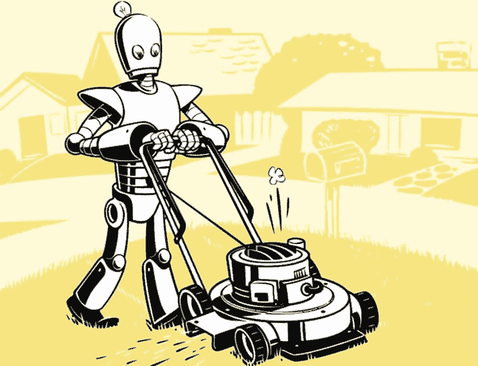
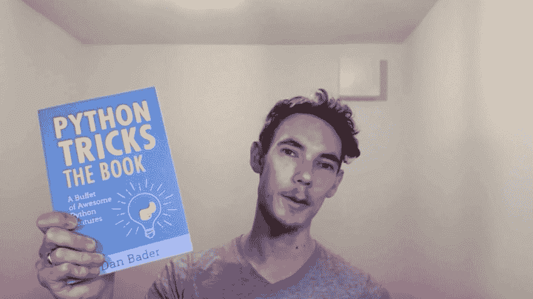
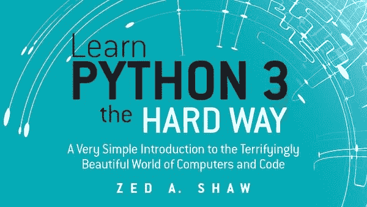
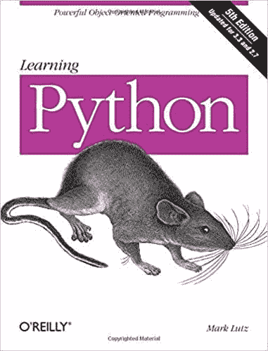
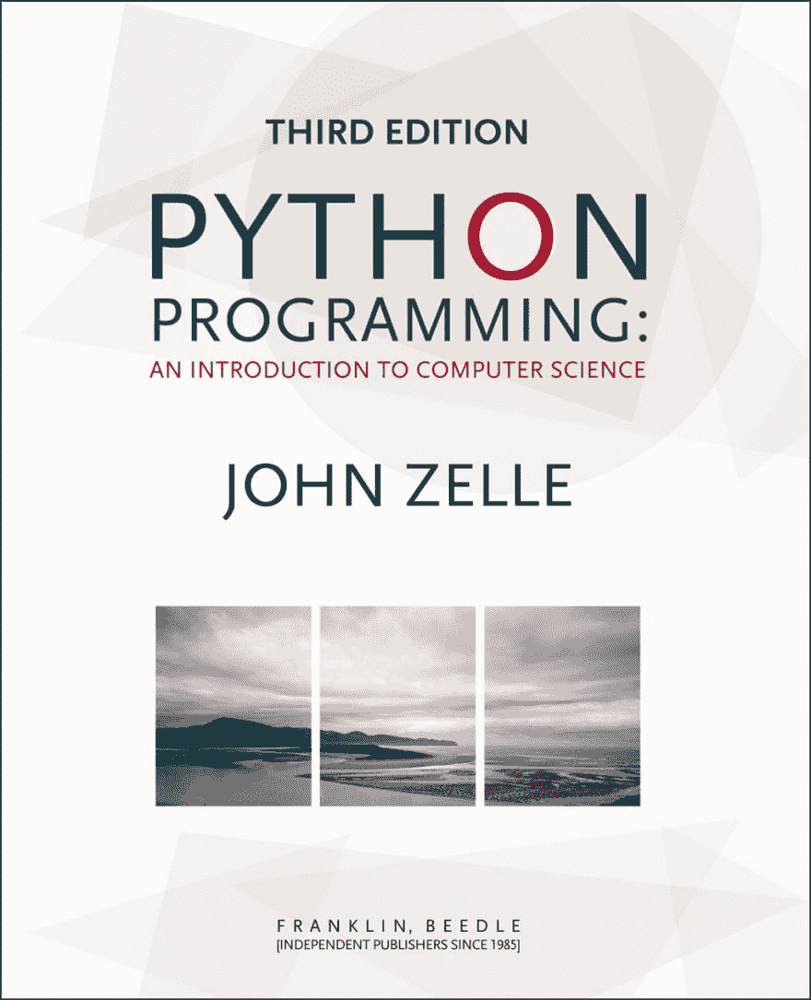

# 五大 Python 书籍

> 原文：<https://dev.to/anuragrana/top-5-python-books-2j2i>

这篇文章最初发表于 pythoncircle.com**。**

 **对于学生和 python 编程新手来说，问类似“哪本书最适合 python？”，以下是排名前五的 python 书籍列表。

### [**用 Python 自动化枯燥的东西:完全初学者实用编程。**](https://amzn.to/2AgVKp0)

4.7 星满分 5 分。

79%的程序员将其评为 5 星。

**热门评论:

-** 适合初学者的优秀书籍及更多

*   为 python 自动化提供良好的基础
*   比起艰难地学习 Python，我更喜欢这种方法
*   充满实际例子&值得学习…

点击查看所有[评论。](https://amzn.to/2SocJwu)

### [**Python 招数:牛逼 Python 特色自助餐**](https://amzn.to/2SmR8Vh)

4.8 星满分 5 分。

90%的程序员给它打 5 星。

**顶级评论:

-** 这本书的质量绝对不是一个“诡计”——以精美包装的格式提供了高质量的 Python 技巧和额外内容

*   对于中级 Python 用户来说，这是丰富其语言知识的绝佳资源
*   快速阅读以填补您 python 知识中的任何空白
*   初学者和中间用户:优秀 Python 编程实践的优秀 Python 演示。

点击查看所有[评论。](https://amzn.to/2VayXnn)

### [艰难地学习 Python:一个非常简单的关于计算机和代码世界的介绍](https://amzn.to/2BTaUkj)

这本书将鼓励你编码，看看会发生什么。你需要在网上搜索东西。没有勺子喂养。

5 颗星中的 3.8 颗。

51%的程序员将其评为 5 星。

**热门评论:**

*   期望自己通过谷歌搜索大部分资料来理解它们
*   我对这本书又爱又恨
*   体面的书，需要补充互联网搜索

点击查看所有[评论。](https://amzn.to/2LzRdSX)

### [**马克·卢茨**学习 Python](https://amzn.to/2LFI8rS)

<figure>

<figcaption></figcaption>

</figure>

5 颗星中的 4 颗星。

50%的程序员给它打了 5 星。

**热门评论:**

*   非常密集。为自己的迟钝道歉太多了。非常详细，但效率不高。
*   Python 圣经——不适合初学者
*   我发现这本书对这种语言有非常清晰的解释。它的概念结构很好，可能是因为作者在教授这个主题方面有丰富的经验。

点击查看所有[评论。](https://amzn.to/2LFI8rS)

### [**Python 编程:计算机科学导论**](https://amzn.to/2Vcg2Zp)

<figure>

<figcaption></figcaption>

</figure>

4.4 星满分 5 分。

69%的程序员将其评为 5 星。

**热门评论:**

*   新兴程序员的绝佳资源
*   优秀的大学入门教材
*   我喜欢这本书，因为它教你基础知识，在这一章的结尾测试你的知识，然后给你一些相当难的问题。

点击查看所有[评论。](https://amzn.to/2Vcg2Zp)

**本帖包含附属链接；如果您从本文提供的不同链接购买产品或服务，我可能会收到报酬。****